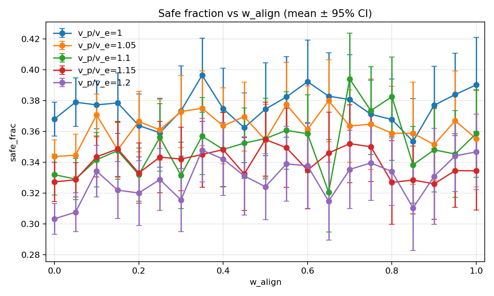
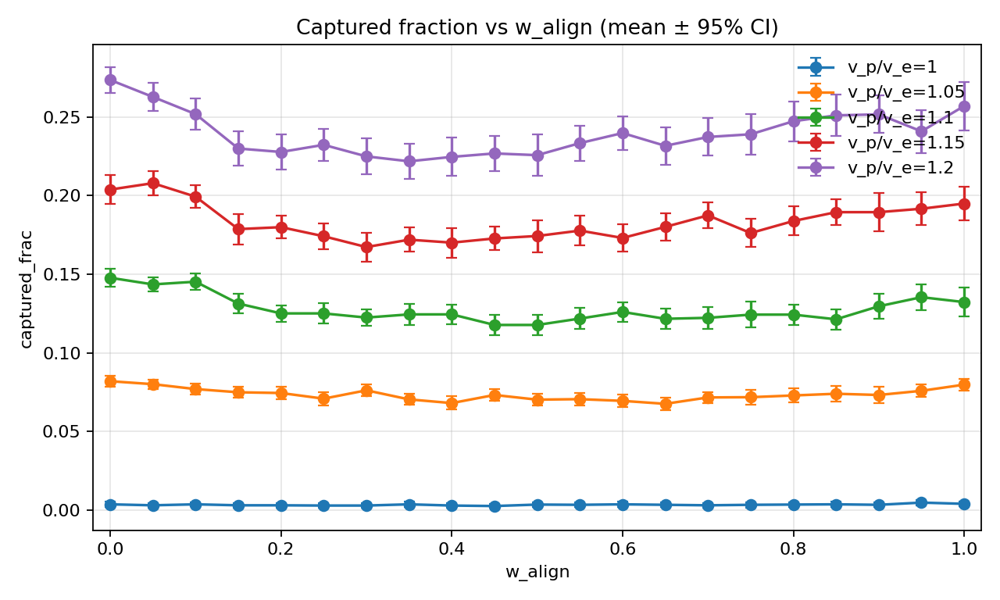
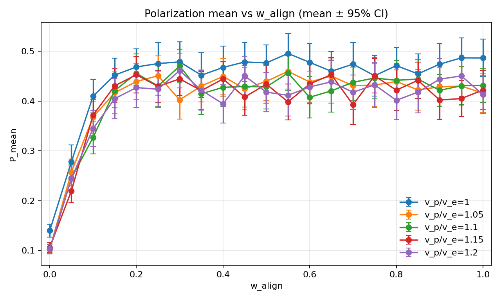
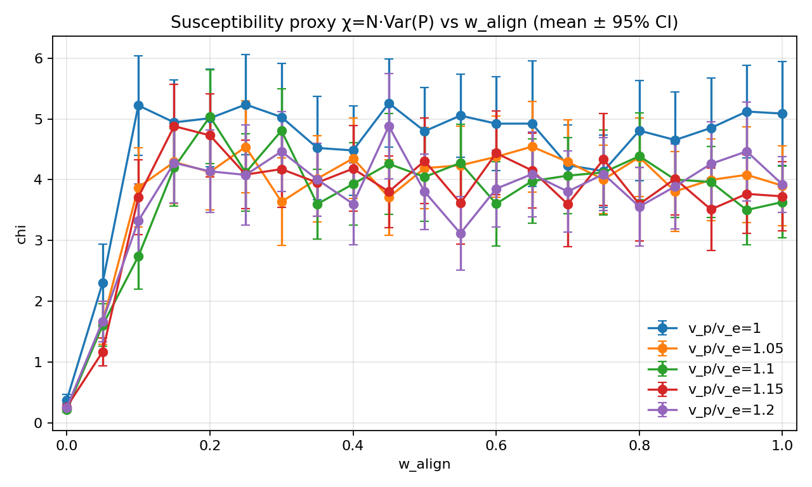
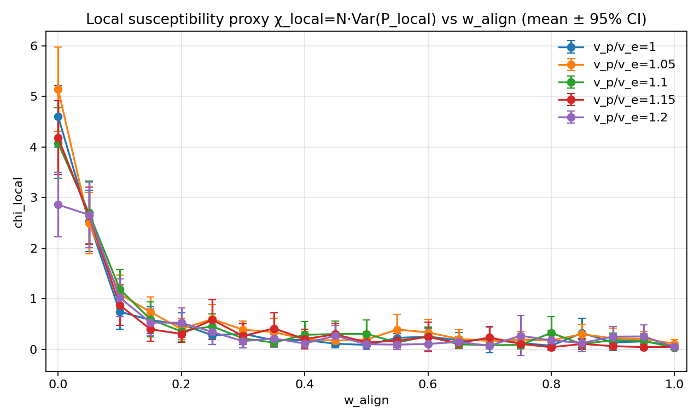
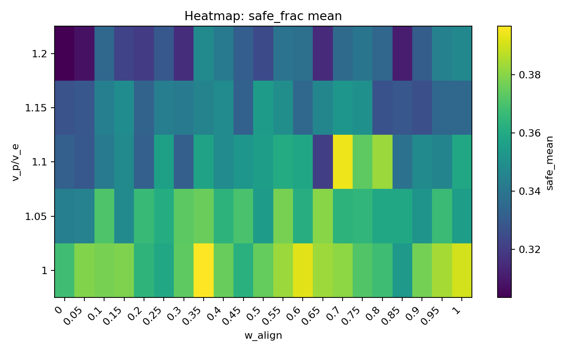
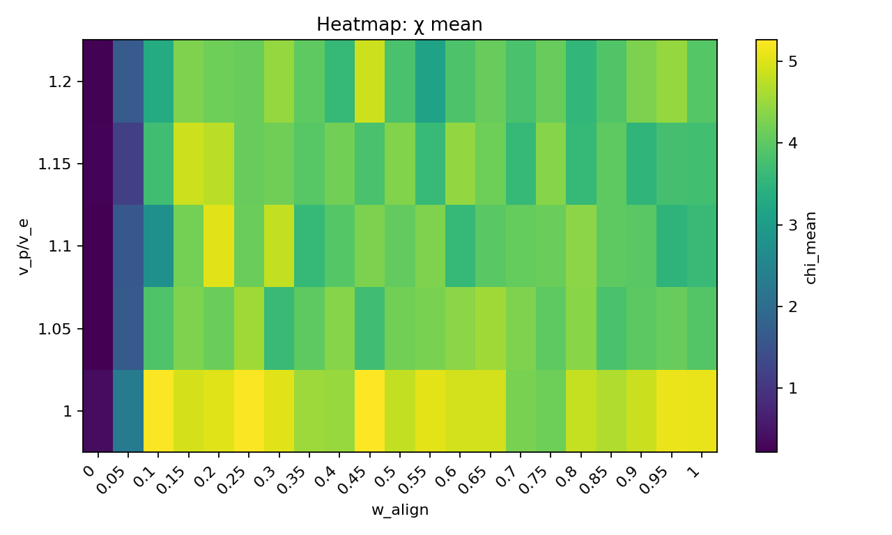
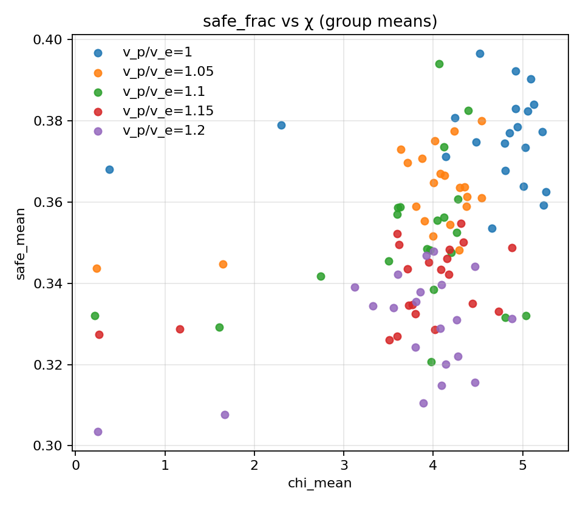
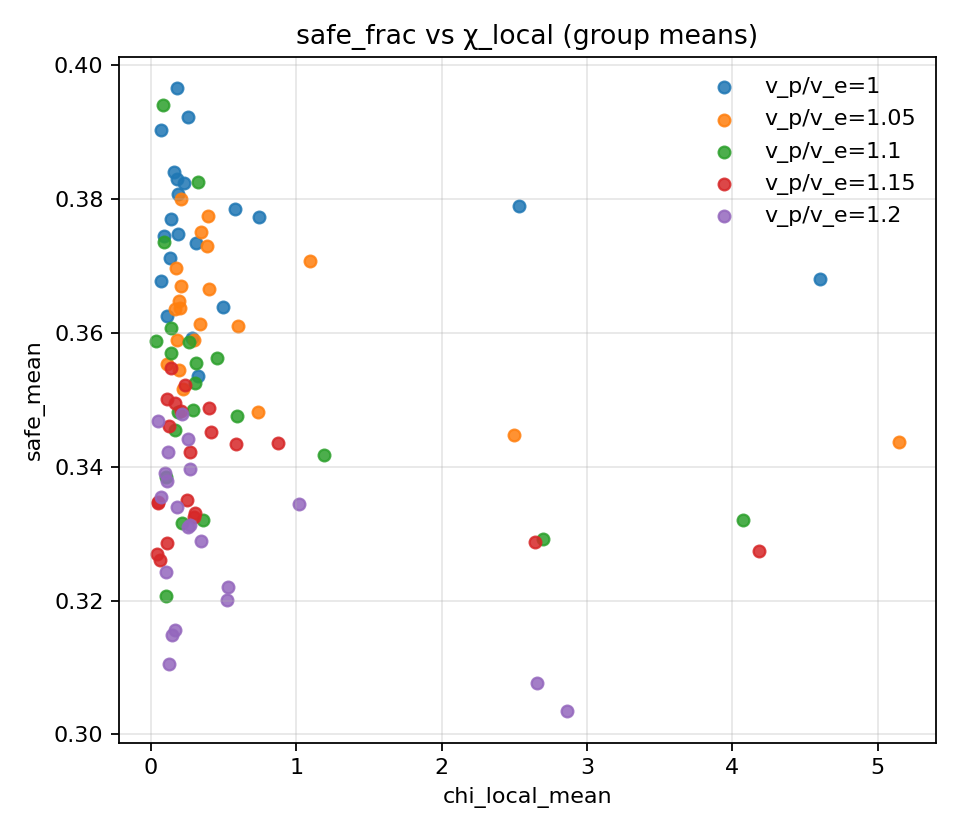
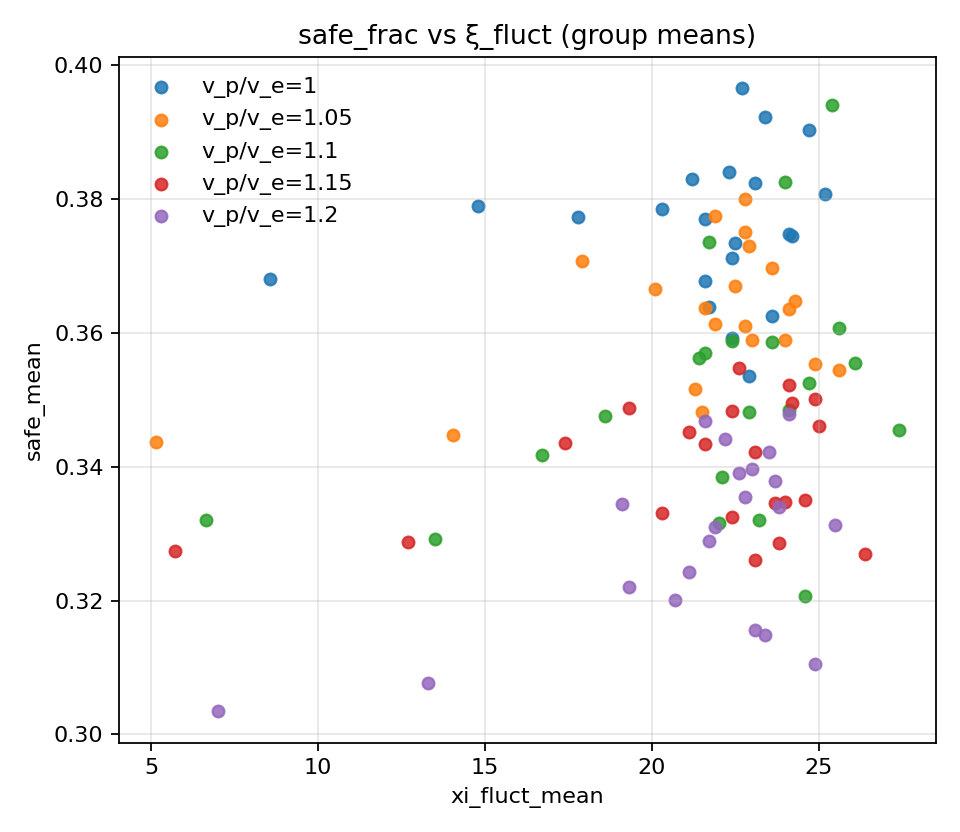

# Fixed Np=2 scan (seeds=50, steps=600): v_p/v_e × w_align

## Experiment setup

- Pursuer count is fixed by the base config.

- Aggregation: mean ± 95% CI across seeds for each (v_p/v_e, w_align).

## Artifacts

- Sweep directory: `runs/sweep_20260205_180558_grid`

- Base config: `runs/sweep_20260205_180558_grid/base_config.json`

- Group summary (aggregated): `doc/results_20260205_fixedNp_scan_50seeds_v2/group_summary.csv`

- Figures: `doc/results_20260205_fixedNp_scan_50seeds_v2/figs`

## Aggregated summary

| v_p/v_e | best w (safe) | safe | best w (χ) | χ | best w (ξ) | ξ |

|---:|---:|---:|---:|---:|---:|---:|

| 1 | 0.35 | 0.3966 | 0.45 | 5.2595 | 0.7 | 25.2000 |

| 1.05 | 0.65 | 0.3800 | 0.65 | 4.5439 | 0.5 | 25.6000 |

| 1.1 | 0.7 | 0.3941 | 0.2 | 5.0376 | 0.95 | 27.4000 |

| 1.15 | 0.5 | 0.3548 | 0.15 | 4.8804 | 0.8 | 26.4000 |

| 1.2 | 0.35 | 0.3480 | 0.45 | 4.8817 | 0.45 | 25.5000 |

## Criticality–performance relationships (group means)

| v_p/v_e | corr(safe, χ) | |w_safe-w_χ| | corr(safe, χ_local) | |w_safe-w_χ_local| | corr(safe, ξ) | |w_safe-w_ξ| |

|---:|---:|---:|---:|---:|---:|---:|

| 1 | 0.079 | 0.100 | -0.133 | 0.350 | 0.141 | 0.350 |

| 1.05 | 0.544 | 0.000 | -0.533 | 0.650 | 0.458 | 0.150 |

| 1.1 | 0.300 | 0.500 | -0.389 | 0.700 | 0.392 | 0.250 |

| 1.15 | 0.469 | 0.350 | -0.348 | 0.500 | 0.285 | 0.300 |

| 1.2 | 0.469 | 0.100 | -0.597 | 0.350 | 0.555 | 0.100 |

## Plots

