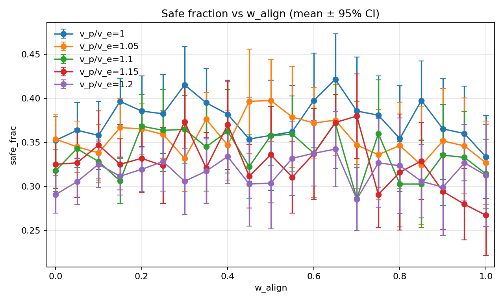
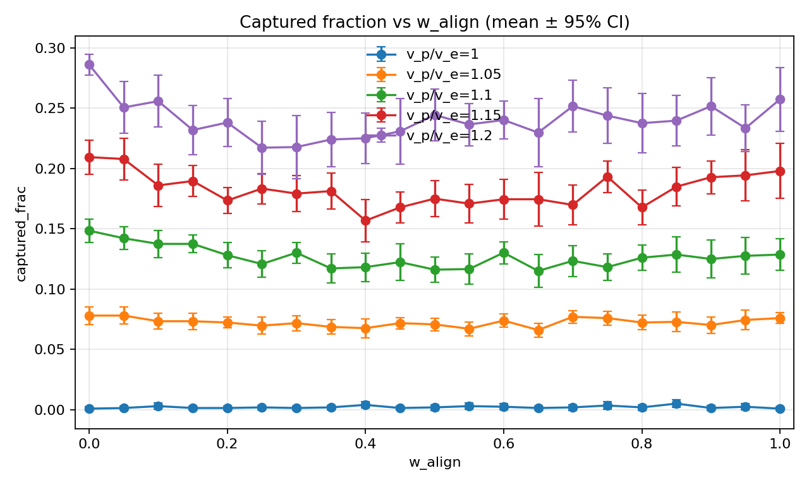
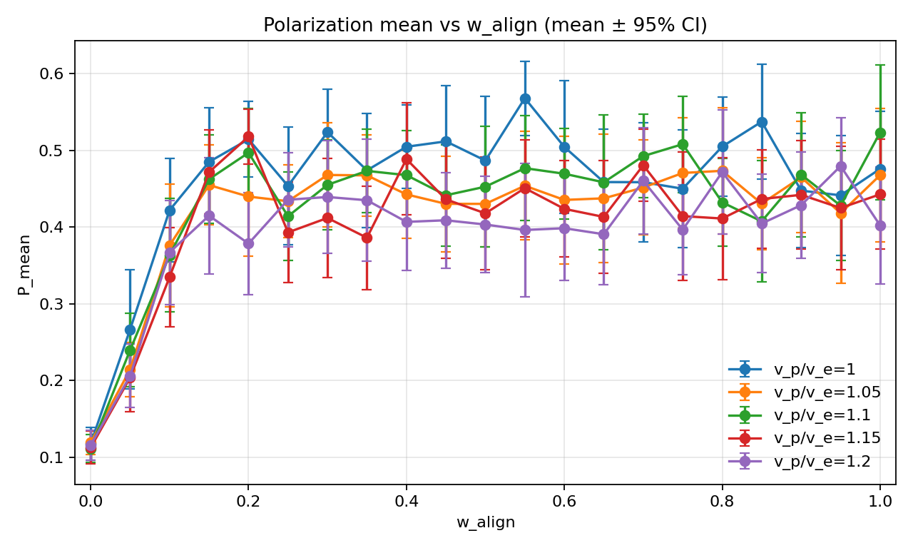
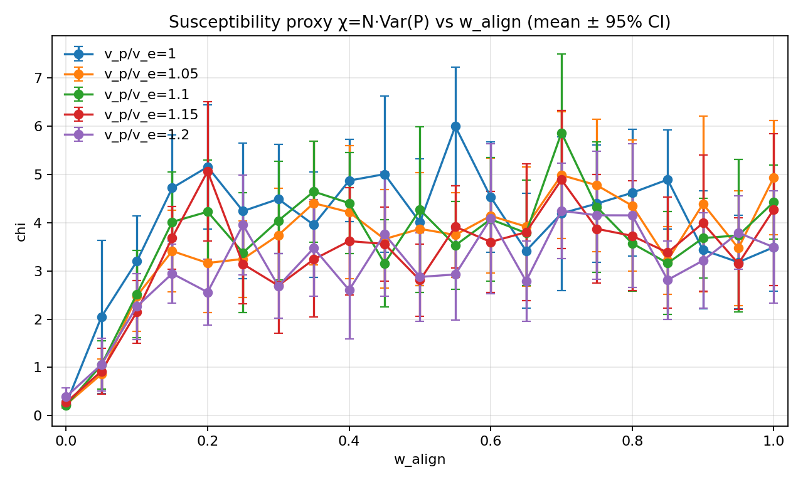
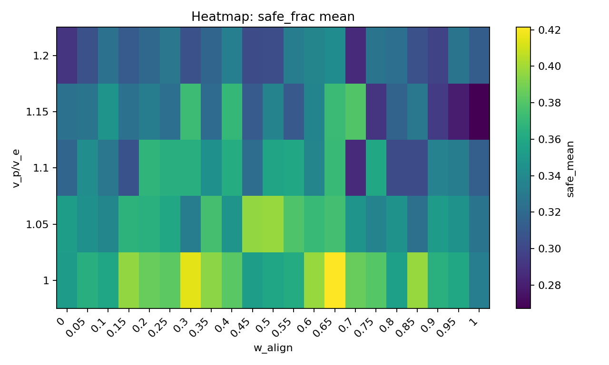
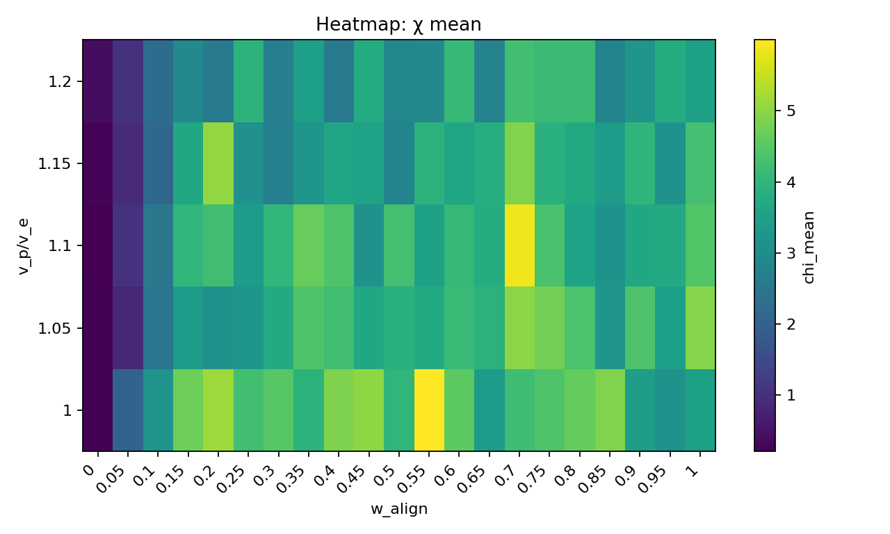
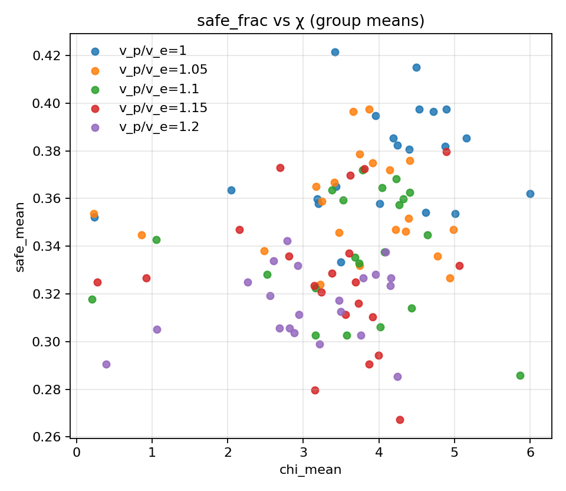

# Fixed pursuer-count scan (Np=2): expanded grid (steps=600, seeds=15)

## Experiment setup

- Pursuer count is fixed by the base config.

- Aggregation: mean ± 95% CI across seeds for each (v_p/v_e, w_align).

## Artifacts

- Sweep directory: `runs/sweep_20260205_154643_grid`

- Base config: `runs/sweep_20260205_154643_grid/base_config.json`

- Group summary (aggregated): `doc/results_20260205_fixedNp_scan_expanded/group_summary.csv`

- Figures: `doc/results_20260205_fixedNp_scan_expanded/figs`

## Aggregated summary

| v_p/v_e | best w_align (safe_frac) | safe_frac mean | best w_align (χ) | χ mean |

|---:|---:|---:|---:|---:|

| 1 | 0.65 | 0.4214 | 0.55 | 5.9983 |

| 1.05 | 0.5 | 0.3974 | 0.7 | 4.9865 |

| 1.1 | 0.65 | 0.3719 | 0.7 | 5.8642 |

| 1.15 | 0.7 | 0.3797 | 0.2 | 5.0652 |

| 1.2 | 0.65 | 0.3422 | 0.7 | 4.2466 |

## χ–performance relationship (group means)

| v_p/v_e | corr(safe_mean, χ_mean) | |w_safe - w_χ| |

|---:|---:|---:|

| 1 | 0.296 | 0.100 |

| 1.05 | 0.035 | 0.200 |

| 1.1 | 0.041 | 0.050 |

| 1.15 | -0.044 | 0.500 |

| 1.2 | 0.272 | 0.050 |

## Plots

