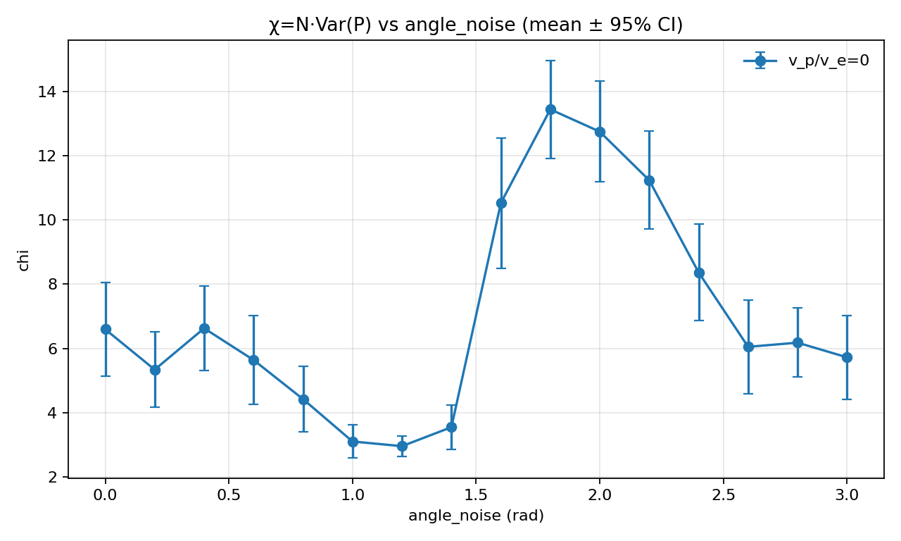
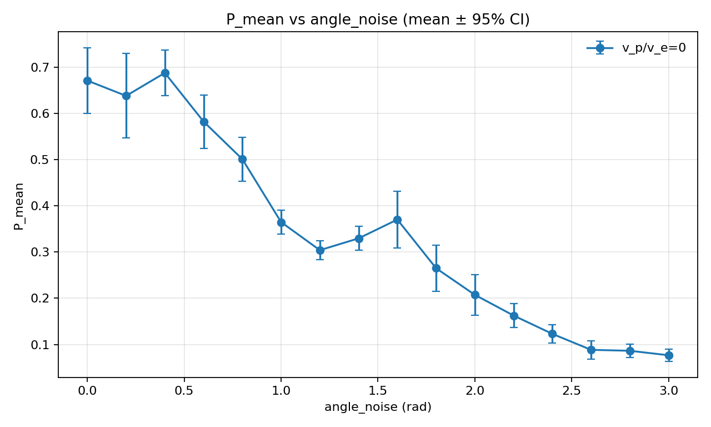
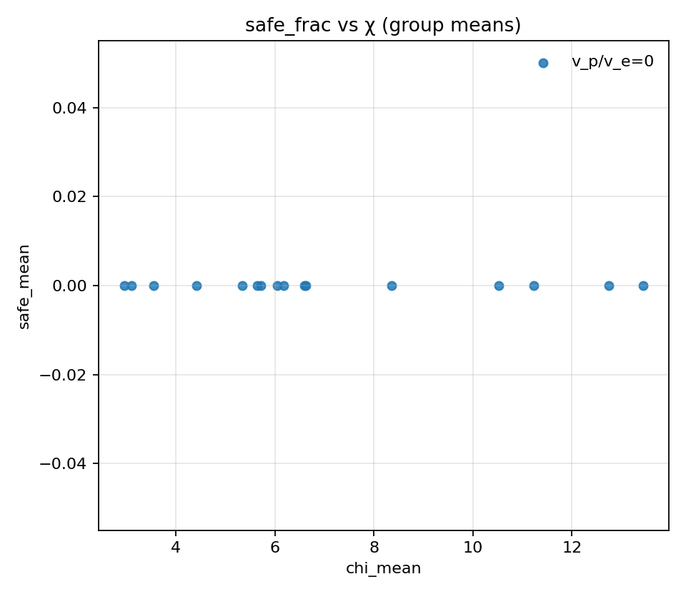

# Phase identification (wider): χ vs angle_noise (no pursuers, no safe zones)

## Artifacts

- Sweep directory: `runs/sweep_20260205_171832_phase_noise`

- Base config: `runs/sweep_20260205_171832_phase_noise/base_config.json`

- Figures: `doc/results_20260205_phase_noise_wider/figs`

## Plots

