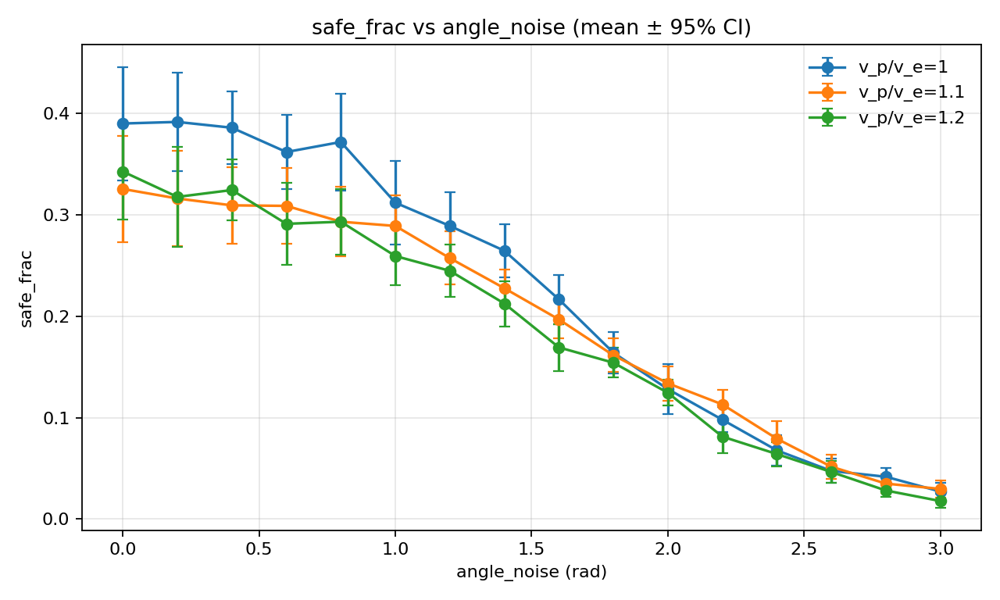
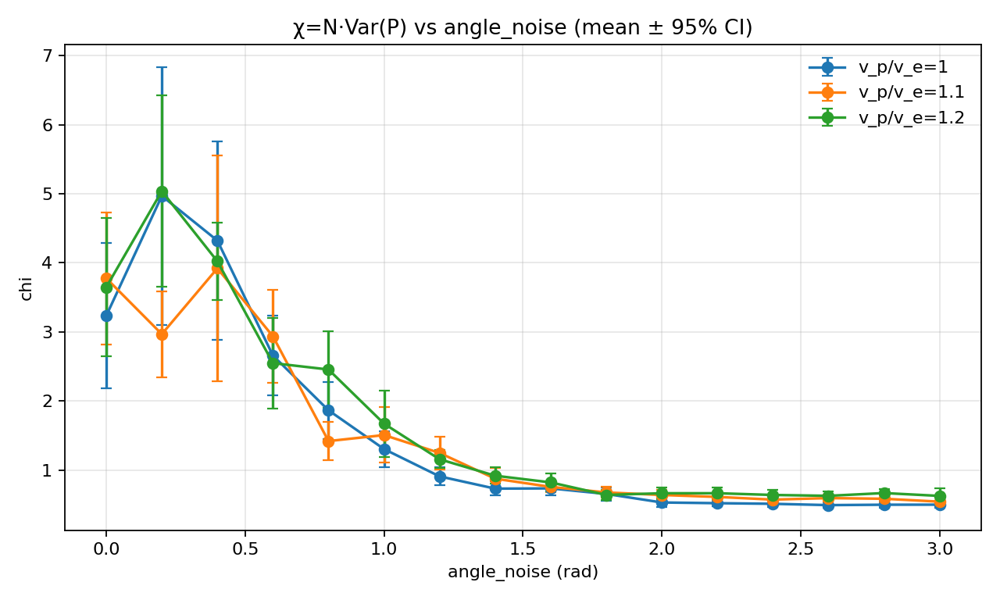
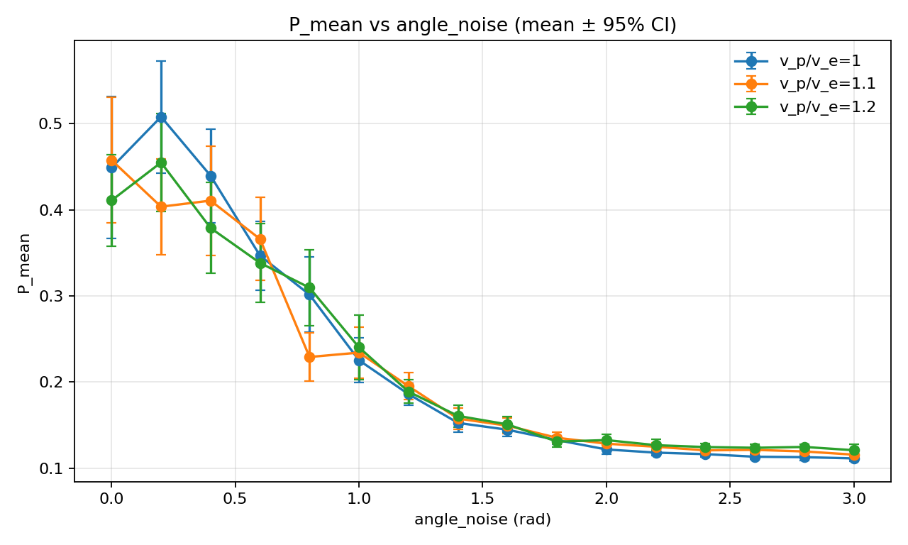
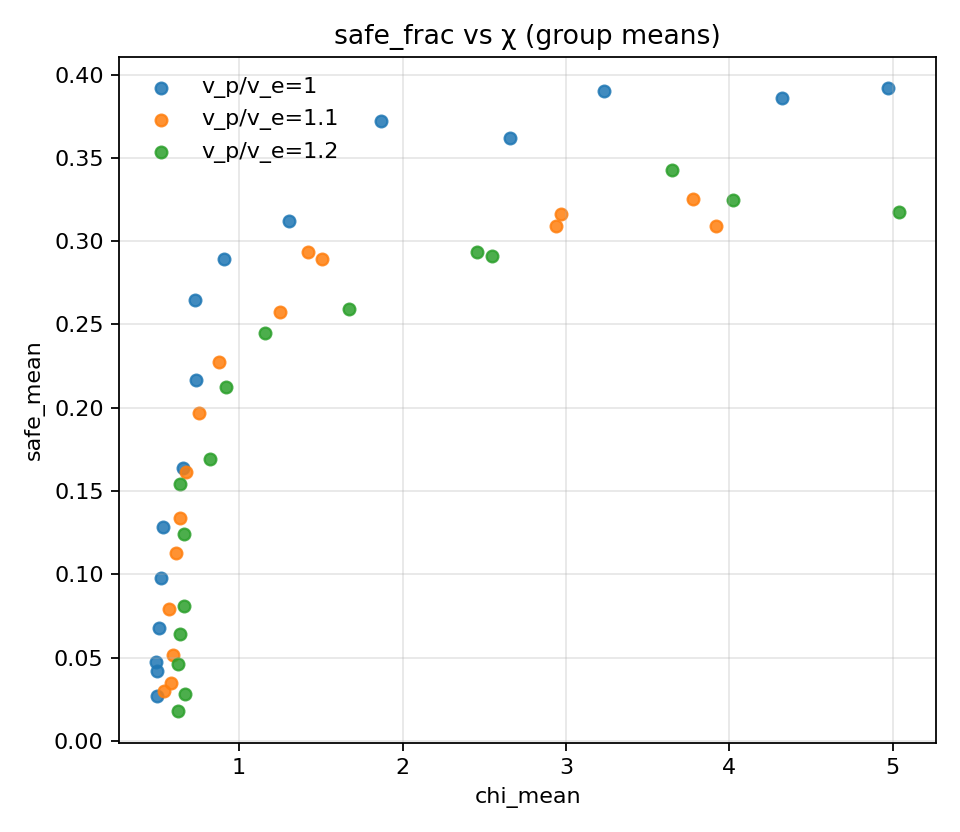

# Task noise sweep (Np=2, w_align=1.0): v_p/v_e × angle_noise

## Artifacts

- Sweep directory: `runs/sweep_20260205_172202_noise`

- Base config: `runs/sweep_20260205_172202_noise/base_config.json`

- Figures: `doc/results_20260205_task_noise_walign1/figs`

## Plots

