# Fixed pursuer-count scan (speed_ratio=1.1,1.2; seeds=100; steps=600)

## Experiment setup

- Pursuer count is fixed by the base config.

- Aggregation: mean ± 95% CI across seeds for each (v_p/v_e, w_align).

## Artifacts

- Sweep directory: `runs/sweep_20260206_132212_grid`

- Base config: `runs/sweep_20260206_132212_grid/base_config.json`

- Group summary (aggregated): `doc/results_20260206_fixedNp_sr11_sr12_100seeds/group_summary.csv`

- Figures: `doc/results_20260206_fixedNp_sr11_sr12_100seeds/figs`

## Aggregated summary

| v_p/v_e | best w (safe) | safe | best w (χ) | χ | best w (χ_local) | χ_local | best w (τ) | τ | best w (ξ) | ξ |

|---:|---:|---:|---:|---:|---:|---:|---:|---:|---:|---:|

| 1.1 | 0.7 | 0.3725 | 0.2 | 4.8432 | 0 | 4.4615 | 0.45 | 199.0000 | 0.95 | 26.6500 |

| 1.2 | 0.4 | 0.3416 | 0.45 | 4.5407 | 0 | 2.9908 | 0.5 | 198.3523 | 0.85 | 25.9000 |

## Criticality–performance relationships (group means)

| v_p/v_e | corr(safe, χ) | |w_safe-w_χ| | corr(safe, χ_local) | |w_safe-w_χ_local| | corr(safe, τ) | |w_safe-w_τ| | corr(safe, ξ) | |w_safe-w_ξ| |

|---:|---:|---:|---:|---:|---:|---:|---:|---:|

| 1.1 | 0.366 | 0.500 | -0.433 | 0.700 | 0.345 | 0.250 | 0.407 | 0.250 |

| 1.2 | 0.432 | 0.050 | -0.484 | 0.400 | 0.451 | 0.100 | 0.464 | 0.450 |

## Plots

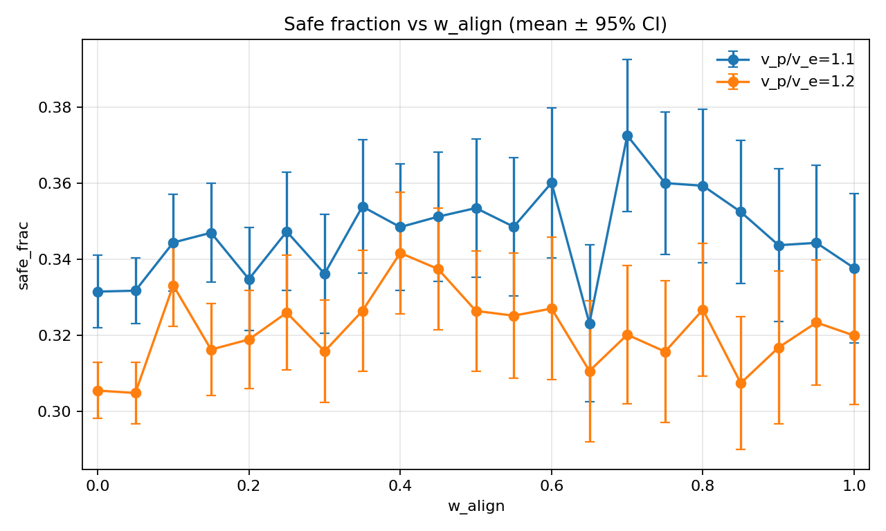

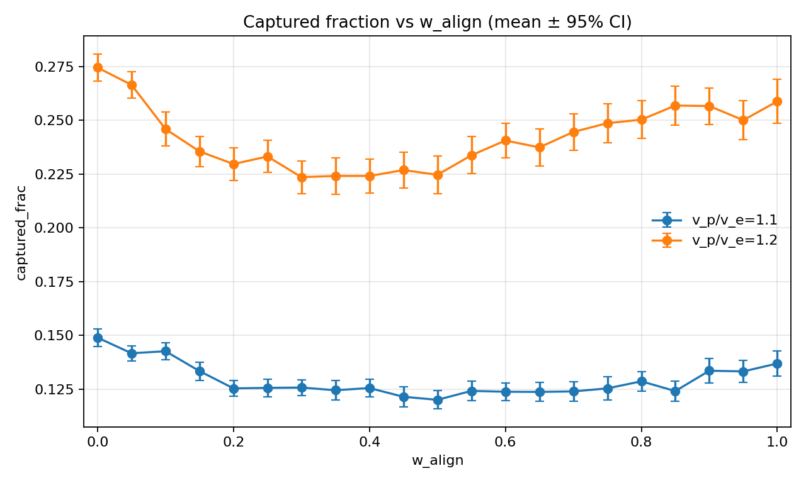

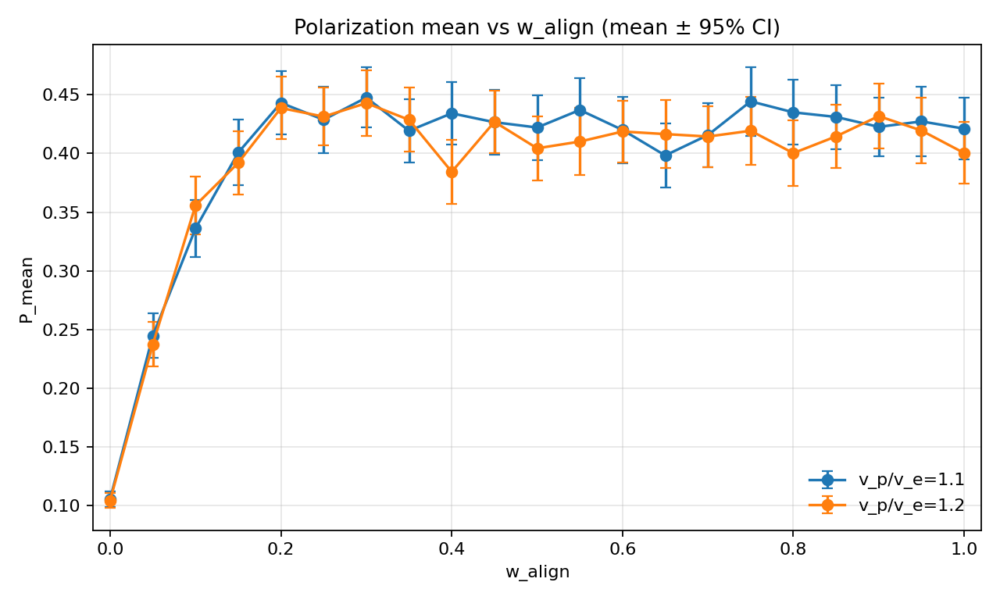

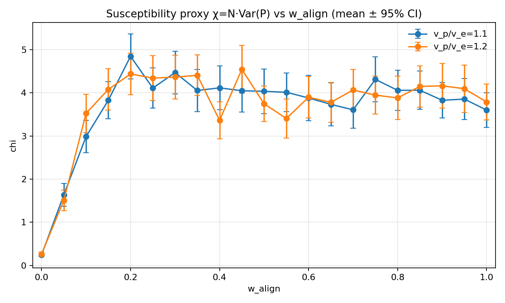

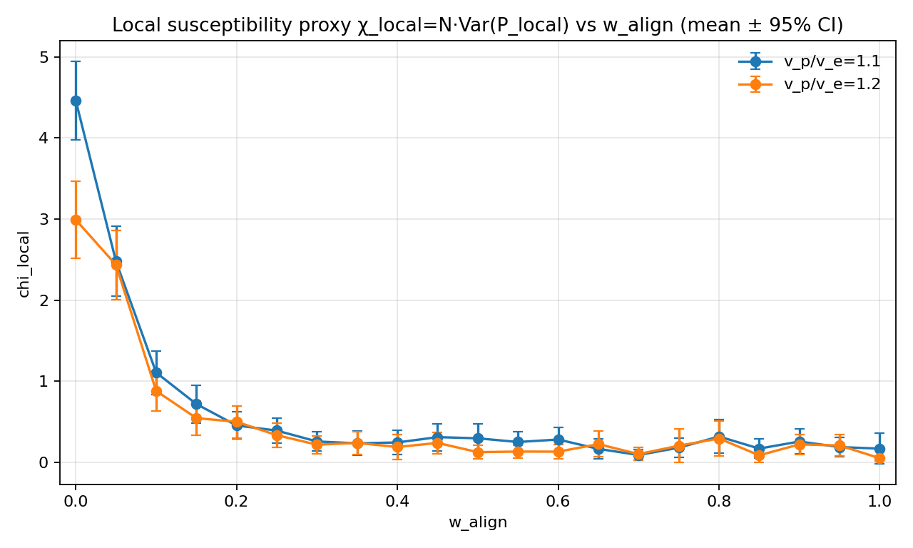

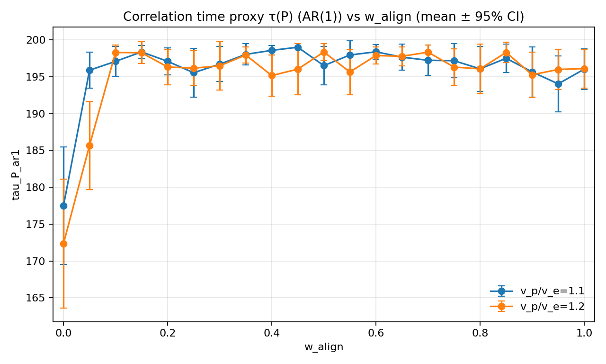

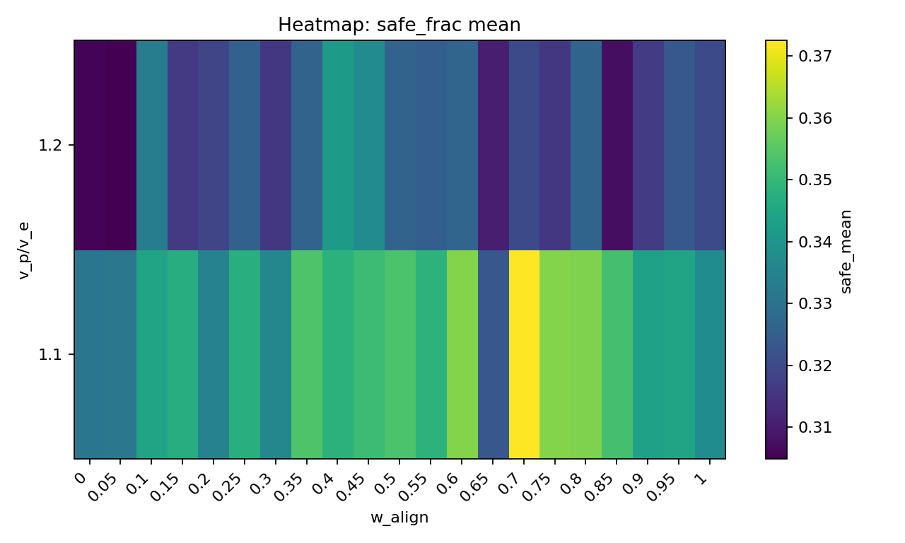

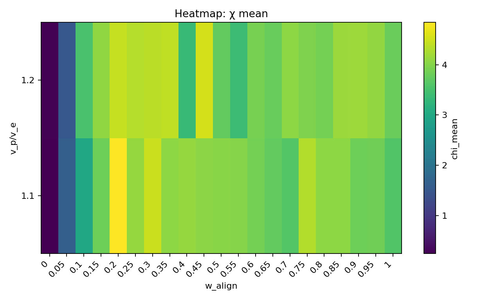

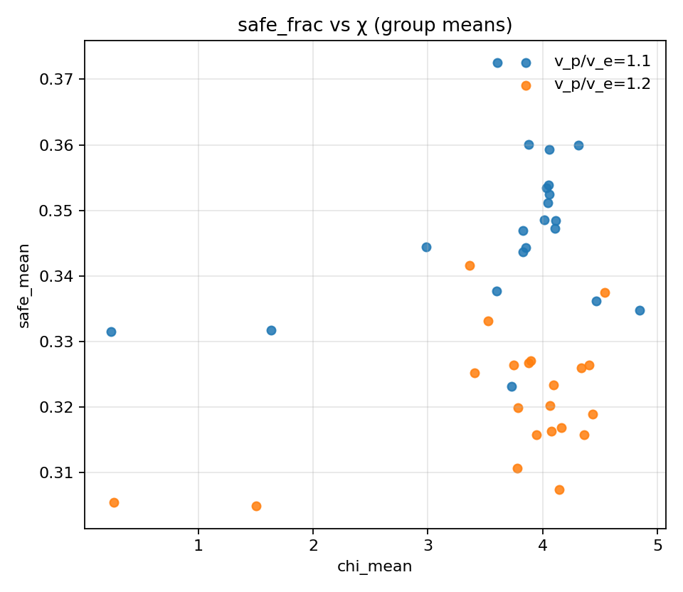

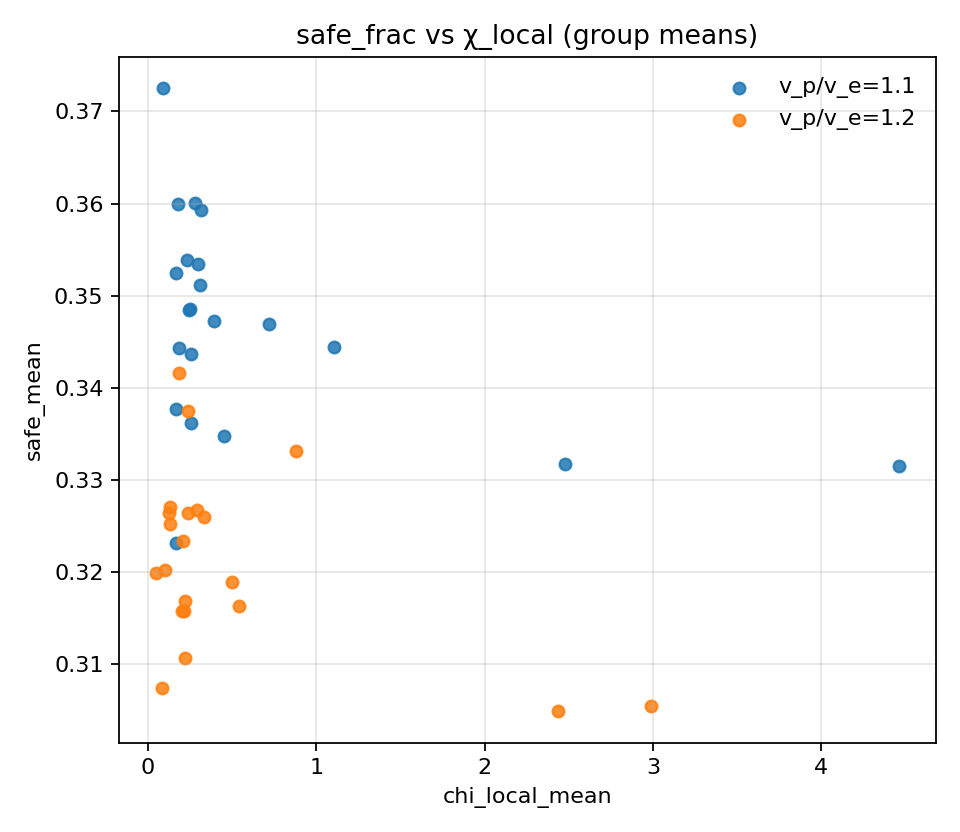

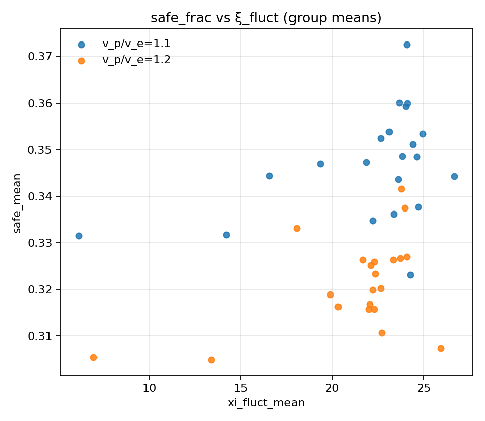

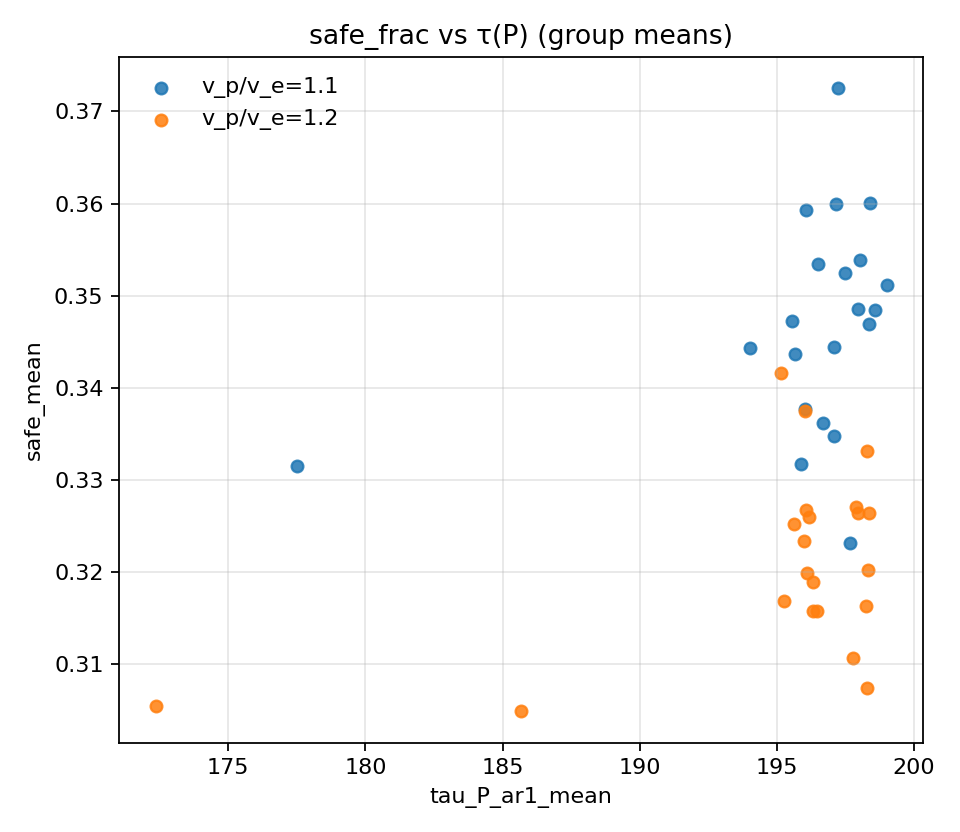

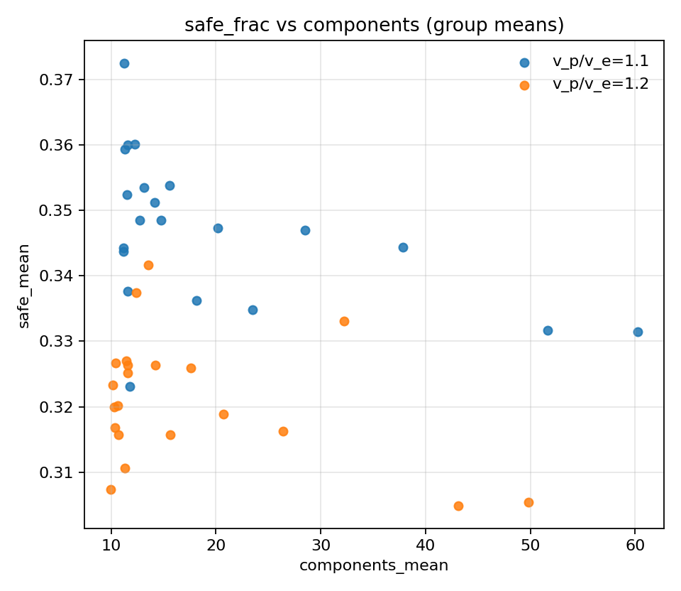
