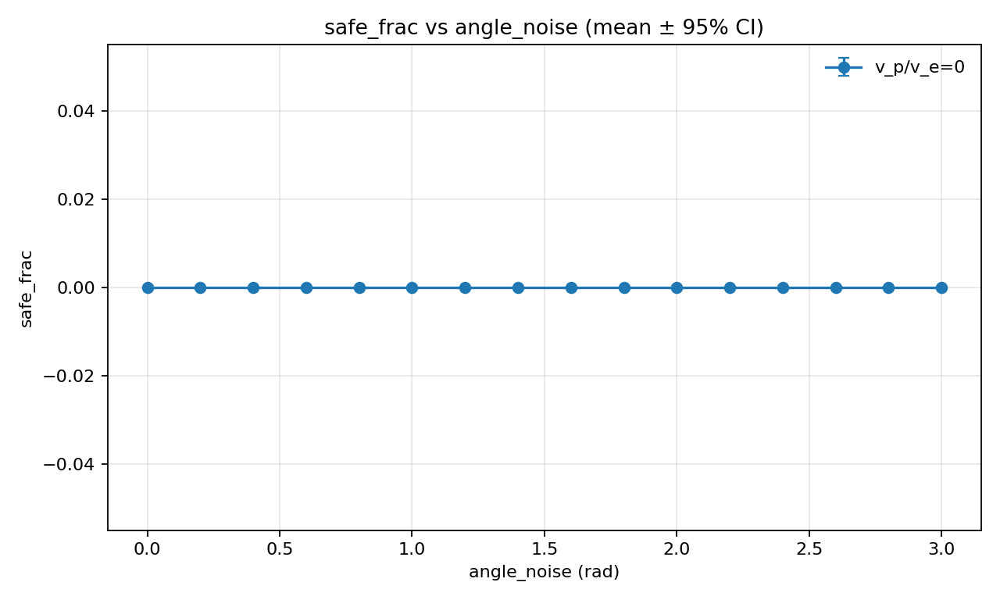
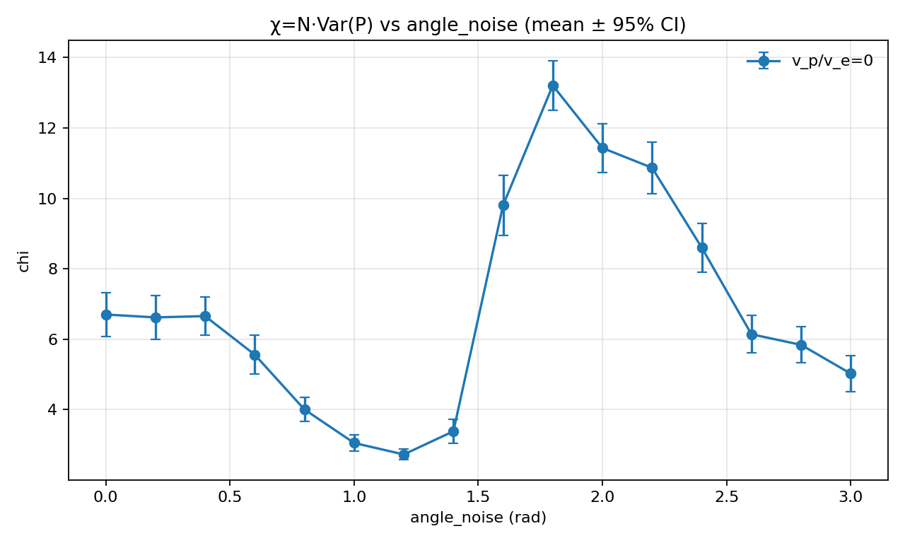
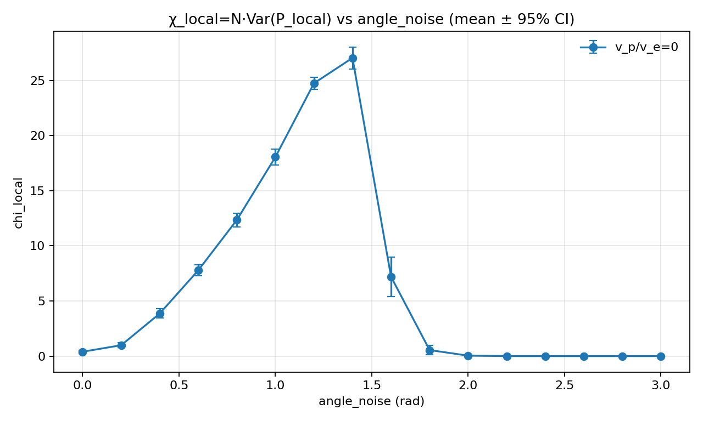
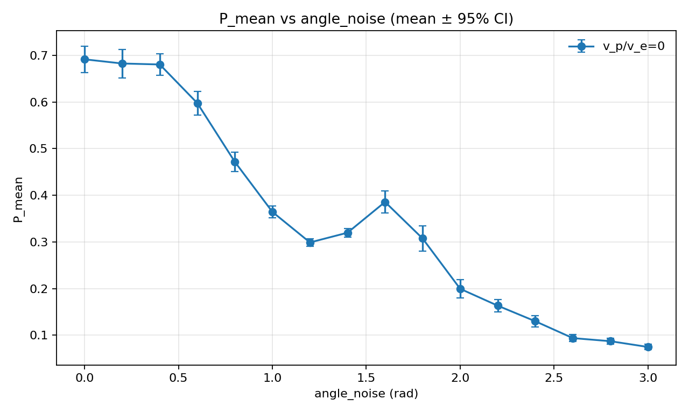
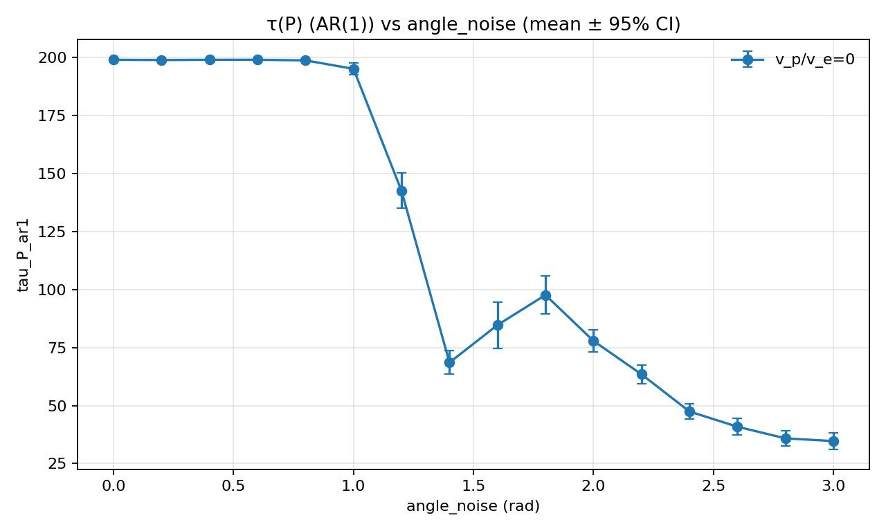
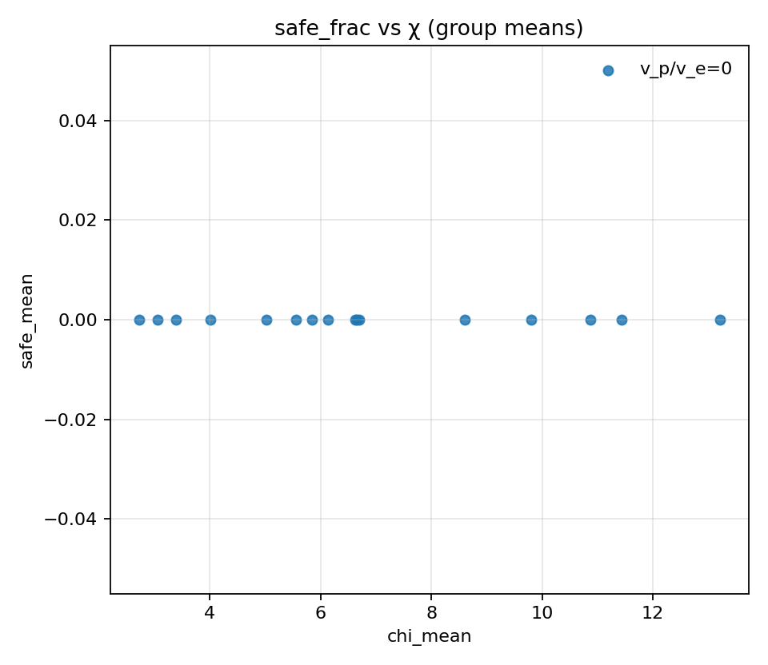
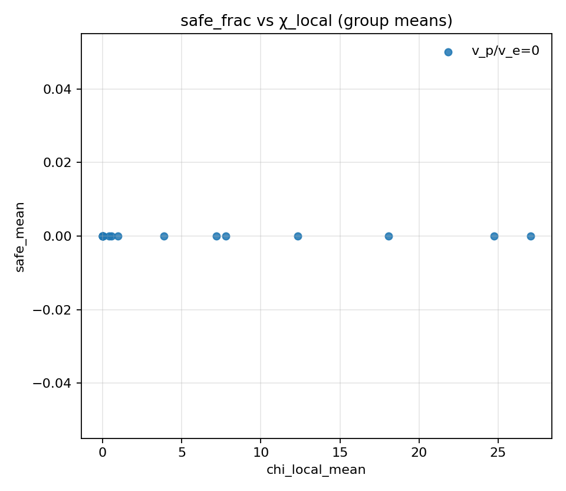
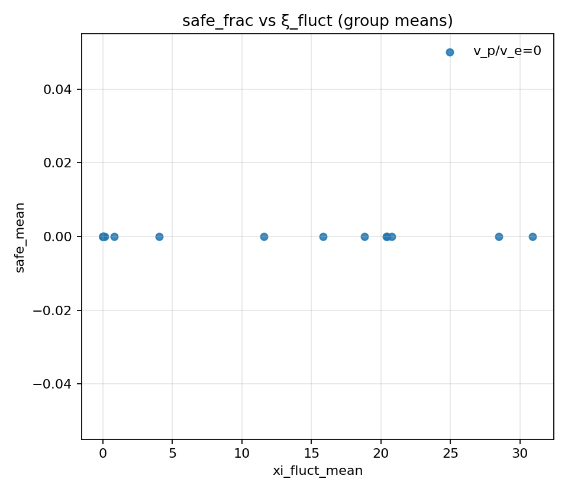
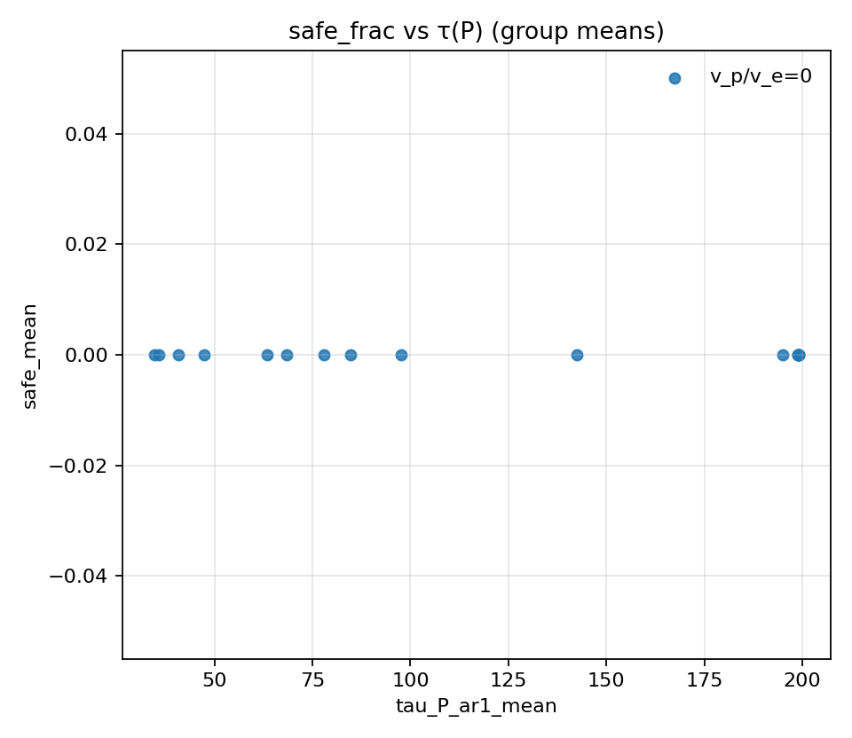
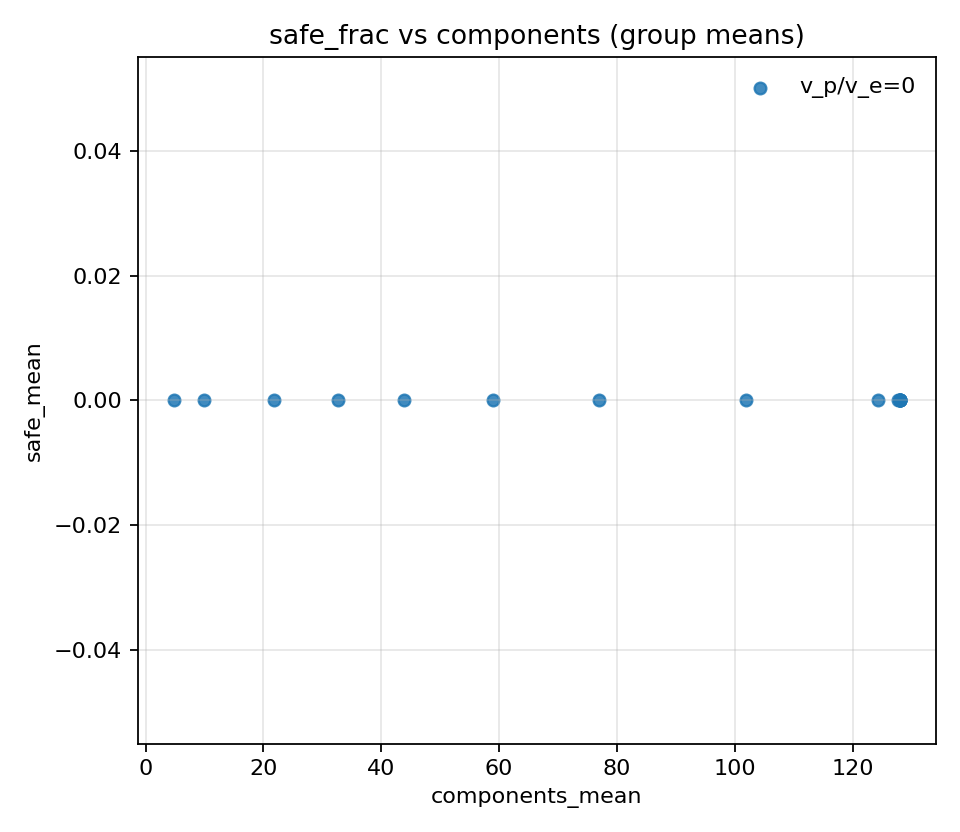

# Phase identification: noise control (seeds=100; steps=1200)

## Artifacts

- Sweep directory: `runs/sweep_20260206_133544_phase_noise`

- Base config: `runs/sweep_20260206_133544_phase_noise/base_config.json`

- Figures: `doc/results_20260206_phase_noise_100seeds_steps1200/figs`

## Plots

