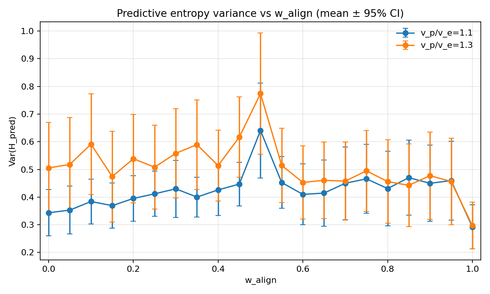
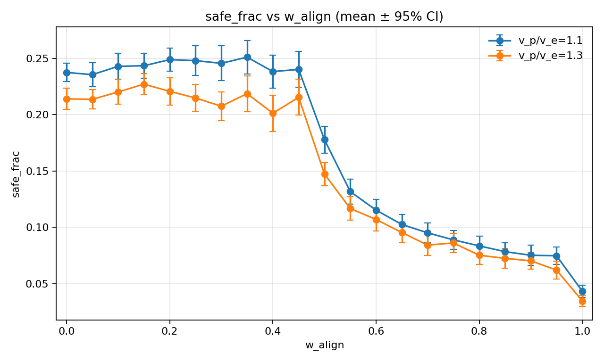
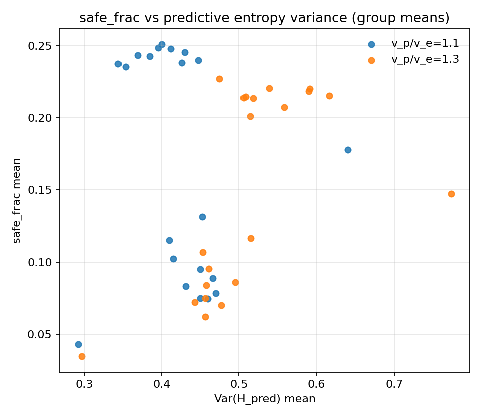
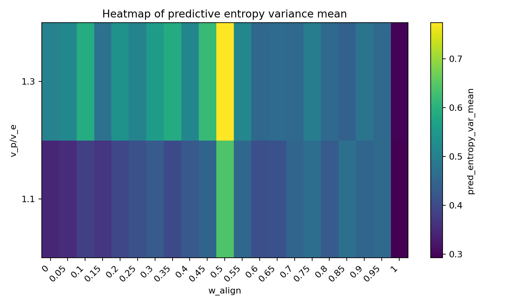
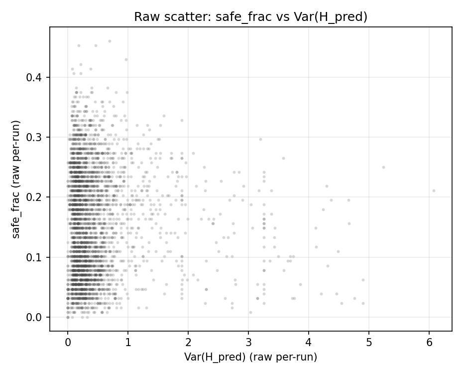
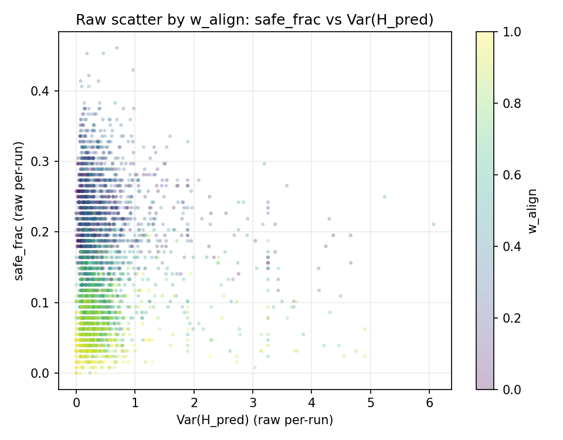
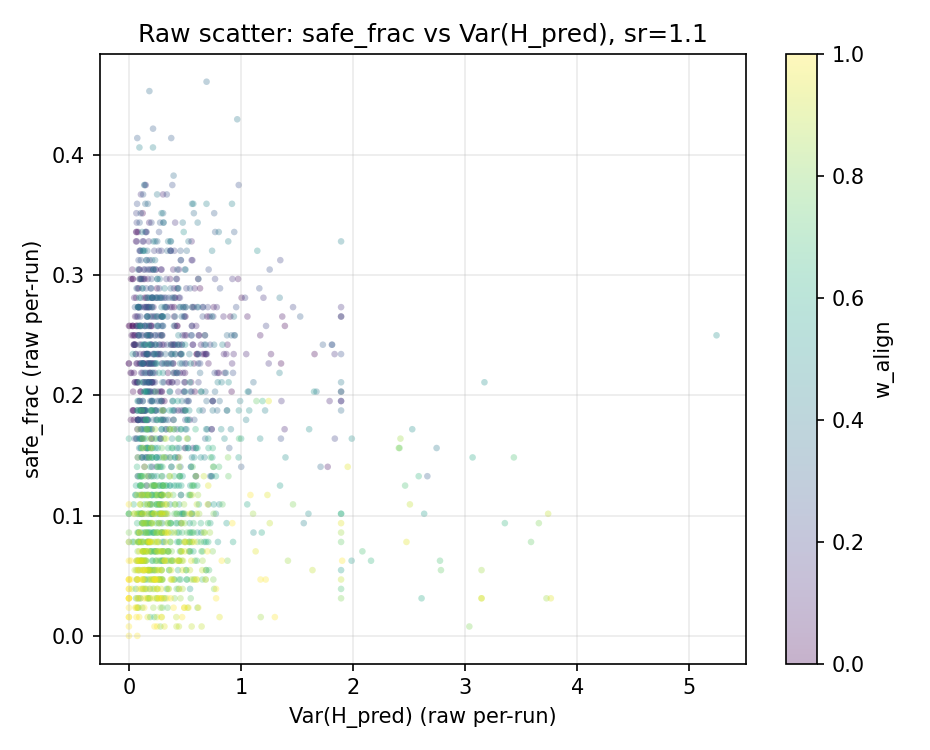
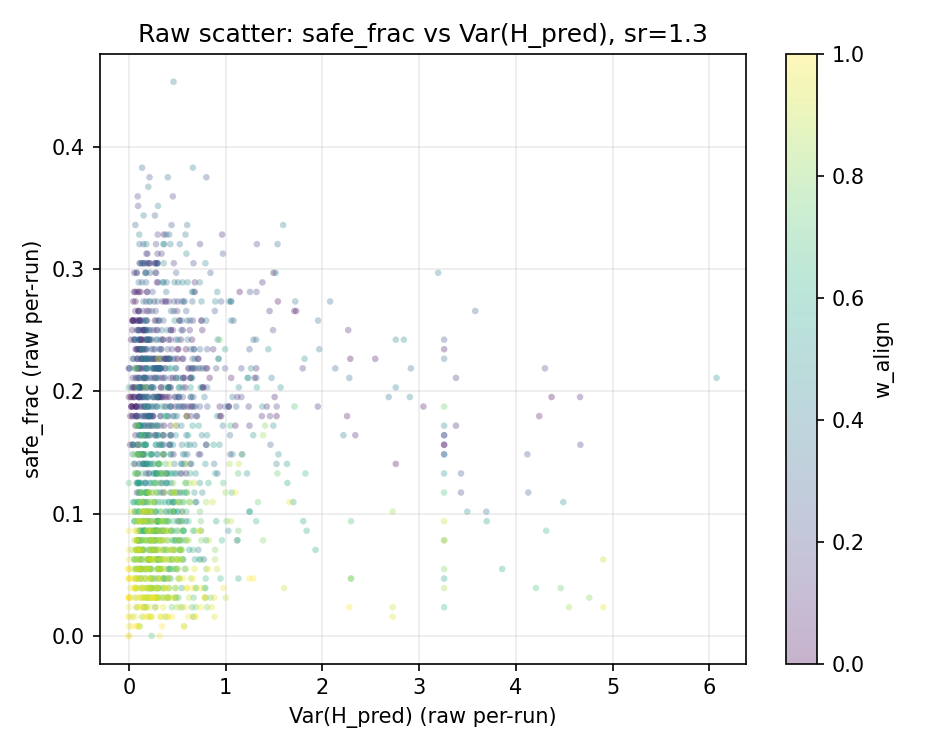

# Predictive entropy (share mode, sr=1.1/1.3, seeds=80)

## Setup

- Sweep directory: `runs/sweep_20260206_214125_grid`

- Bins: `72`

- EMA span: `10`

- N-gram order: `2`

- Valid runs used: `3320`

## Per-speed correlations (group means)

| v_p/v_e | corr(safe, Var(H_pred)) |

|---:|---:|

| 1.1 | -0.164 |

| 1.3 | 0.559 |

- pooled corr(safe, Var(H_pred)) across all grouped points: `0.132`

## Plots

## Raw (non-mean) plots

