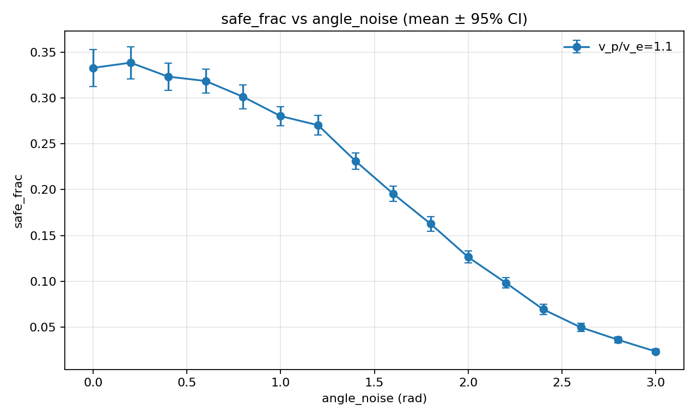
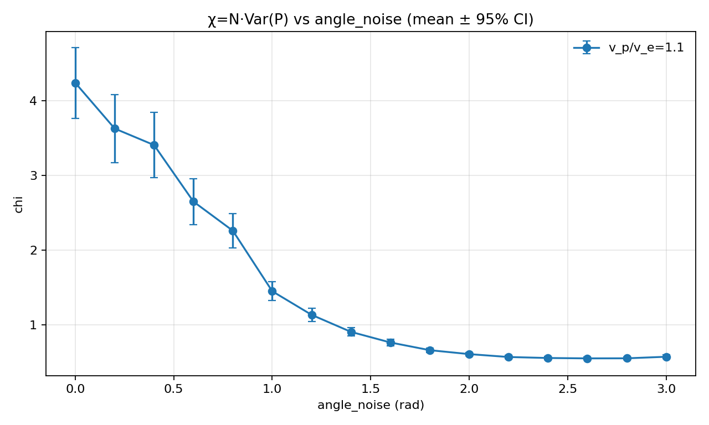
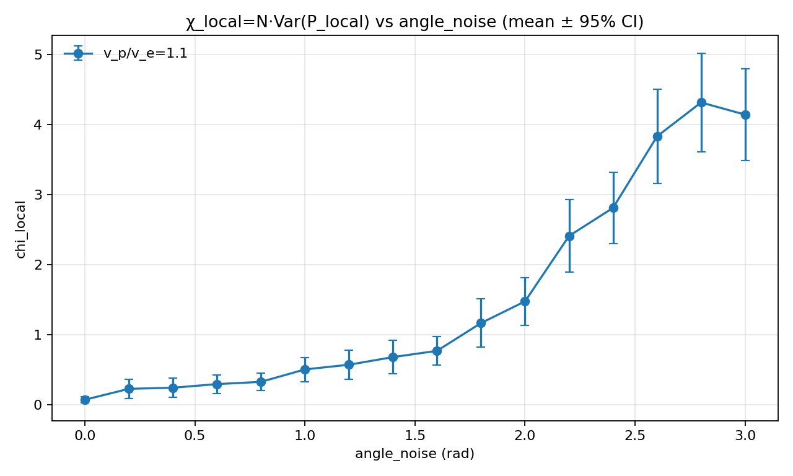
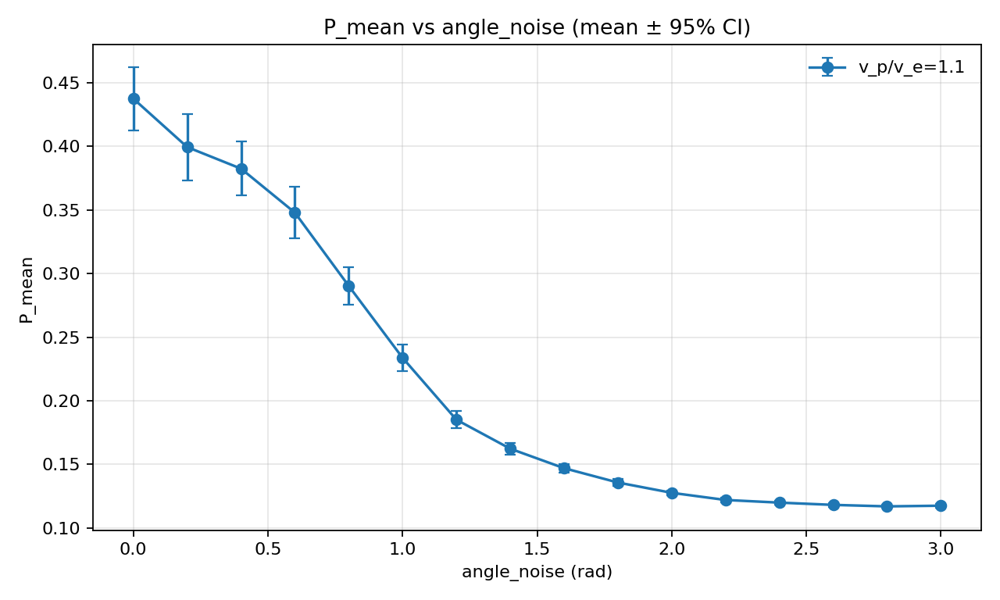
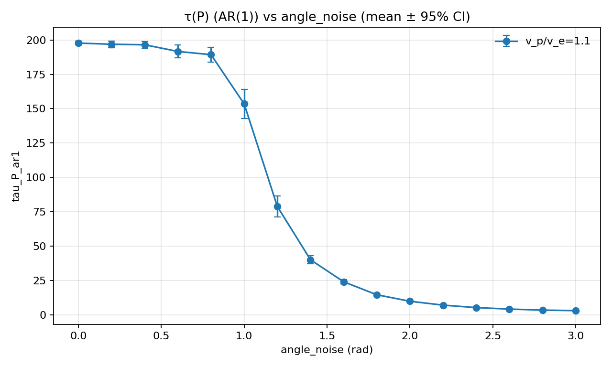
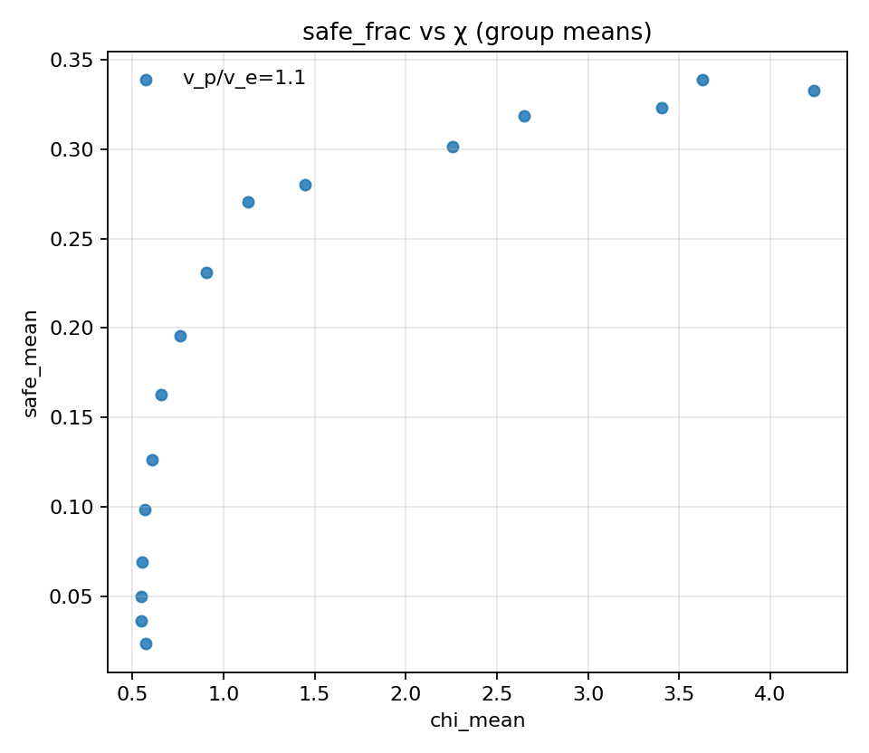
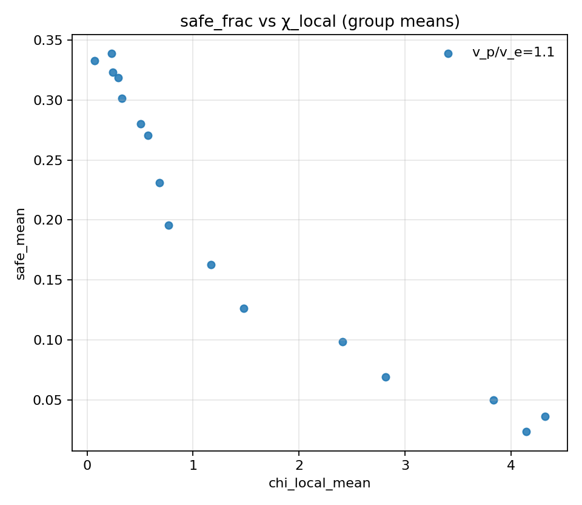
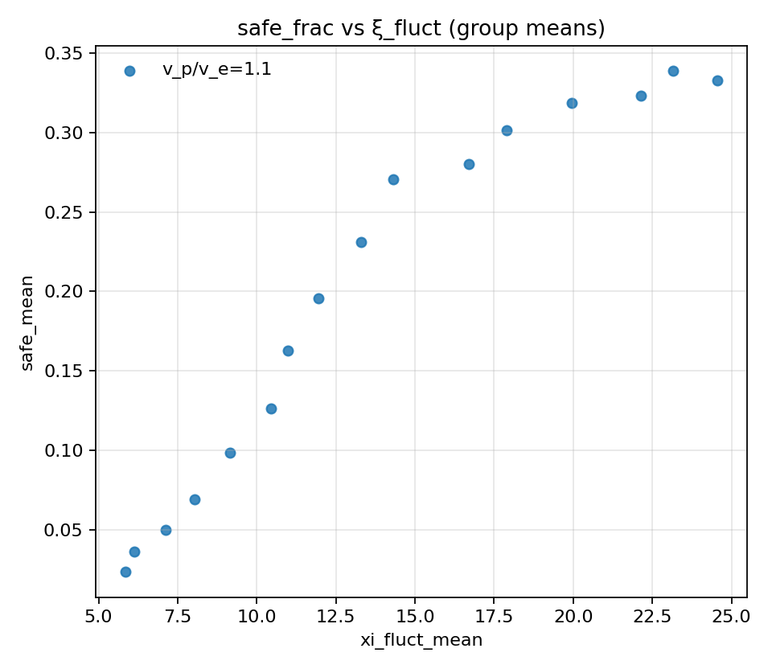
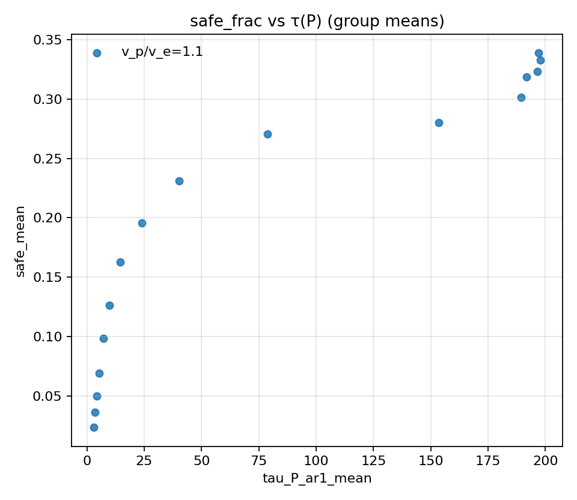
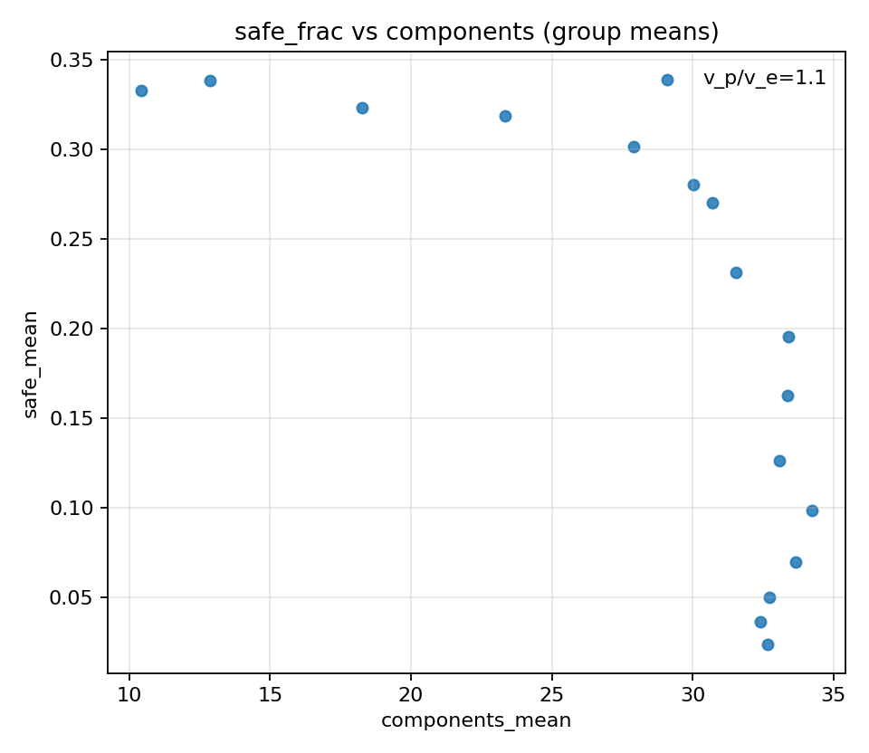

# Task noise sweep (w_align=1.0, speed_ratio=1.1; seeds=100; steps=600)

## Artifacts

- Sweep directory: `runs/sweep_20260206_135744_noise`

- Base config: `runs/sweep_20260206_135744_noise/base_config.json`

- Group summary: `doc/results_20260206_task_noise_w10_sr11_100seeds/group_summary.csv`

- Figures: `doc/results_20260206_task_noise_w10_sr11_100seeds/figs`

## Quantitative Discussion

- Over noise grid (`0.0..3.0`, step `0.2`), `safe_mean` and `chi_mean` are positively coupled:
  - Pearson `r(safe, chi)=0.824`
  - Spearman `rho(safe, chi)=0.965`
- Best task performance appears at low noise:
  - `safe_mean` peak at `angle_noise=0.2` with `safe_mean=0.3387`
  - `chi_mean` peak at `angle_noise=0.0` with `chi_mean=4.2378`
- In this setting, low-noise region jointly gives higher `safe_mean` and higher `chi_mean`; this supports a positive association between stronger global fluctuation proxy (`chi`) and survival performance within this specific task sweep.
- This association should be interpreted as an in-task empirical coupling, not as proof that the phase-identification critical point (`angle_noise≈1.8`) is optimal for the task.

## Plots

