# Task-internal criticality analysis (pressure contrast: sr=0.9,1.3,1.4)

## Experiment setup

- Pursuer count is fixed by the base config.

- Aggregation: mean ± 95% CI across seeds for each (v_p/v_e, w_align).

## Artifacts

- Sweep directory: `runs/sweep_20260206_160622_grid`

- Base config: `runs/sweep_20260206_160622_grid/base_config.json`

- Group summary (aggregated): `doc/results_20260206_walign_pressure_091314_120seeds/group_summary.csv`

- Figures: `doc/results_20260206_walign_pressure_091314_120seeds/figs`

## Aggregated summary

| v_p/v_e | best w (safe) | safe | best w (χ) | χ | best w (χ_local) | χ_local | best w (τ) | τ | best w (ξ) | ξ |

|---:|---:|---:|---:|---:|---:|---:|---:|---:|---:|---:|

| 0.9 | 0.55 | 0.4092 | 0.6 | 4.6896 | 0 | 5.1790 | 0.45 | 198.6718 | 0.75 | 24.9583 |

| 1.3 | 0.65 | 0.3064 | 0.2 | 4.7466 | 0 | 3.3642 | 0.65 | 197.7813 | 0.8 | 25.2083 |

| 1.4 | 0.25 | 0.2774 | 0.75 | 5.0113 | 0 | 2.4861 | 0.4 | 197.8361 | 0.65 | 26.2500 |

## Criticality–performance relationships (group means)

| v_p/v_e | corr(safe, χ) | |w_safe-w_χ| | corr(safe, χ_local) | |w_safe-w_χ_local| | corr(safe, τ) | |w_safe-w_τ| | corr(safe, ξ) | |w_safe-w_ξ| |

|---:|---:|---:|---:|---:|---:|---:|---:|---:|

| 0.9 | 0.272 | 0.050 | -0.310 | 0.550 | 0.272 | 0.100 | 0.236 | 0.200 |

| 1.3 | 0.378 | 0.450 | -0.418 | 0.650 | 0.408 | 0.000 | 0.320 | 0.150 |

| 1.4 | -0.070 | 0.500 | 0.132 | 0.250 | 0.031 | 0.150 | -0.436 | 0.400 |

## Plots

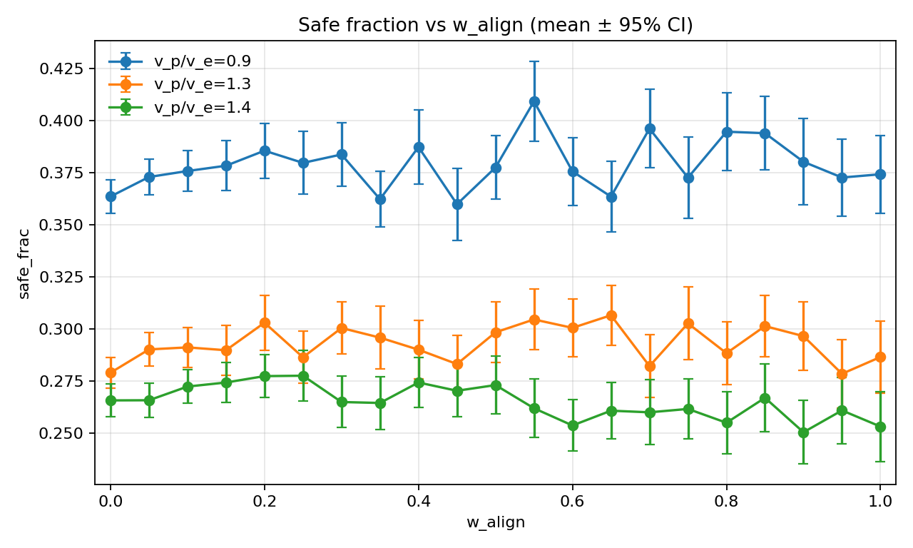

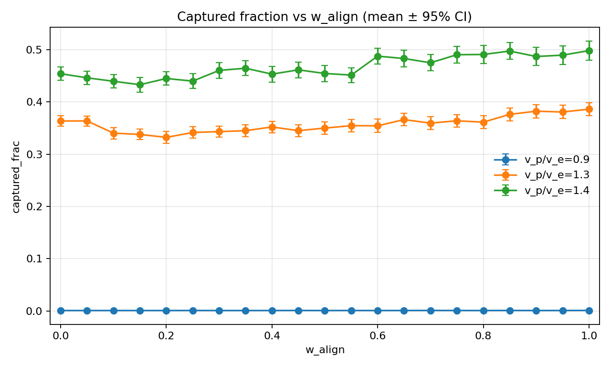

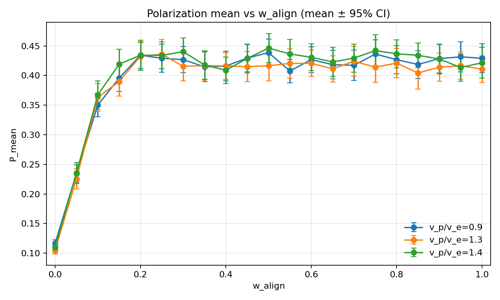

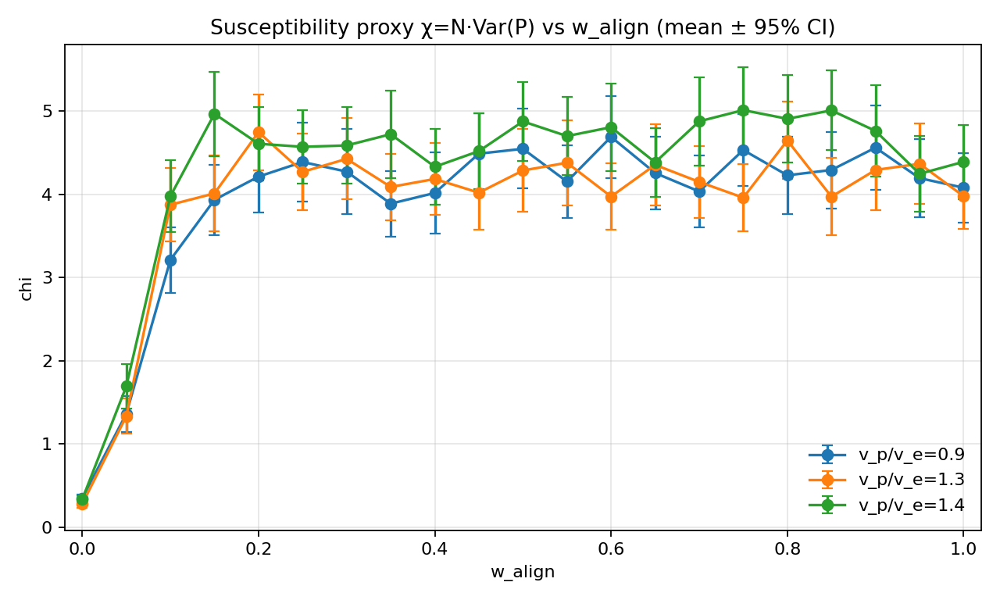

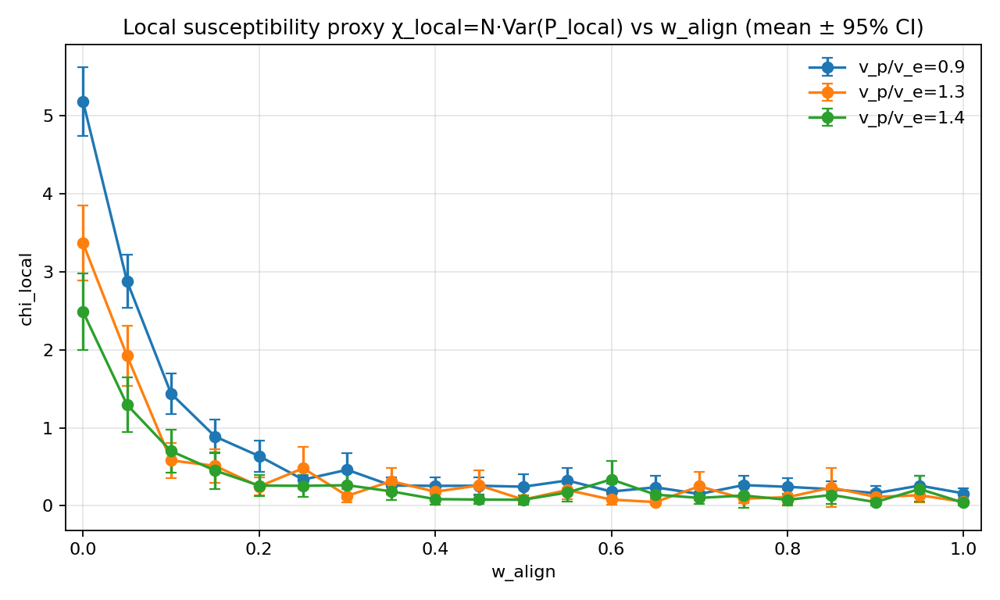

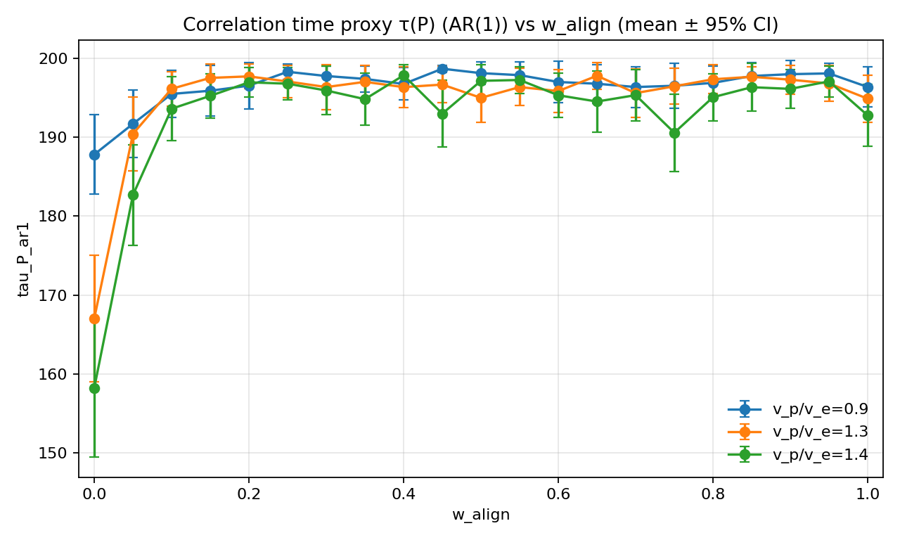

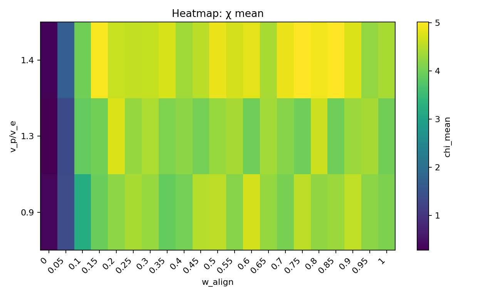

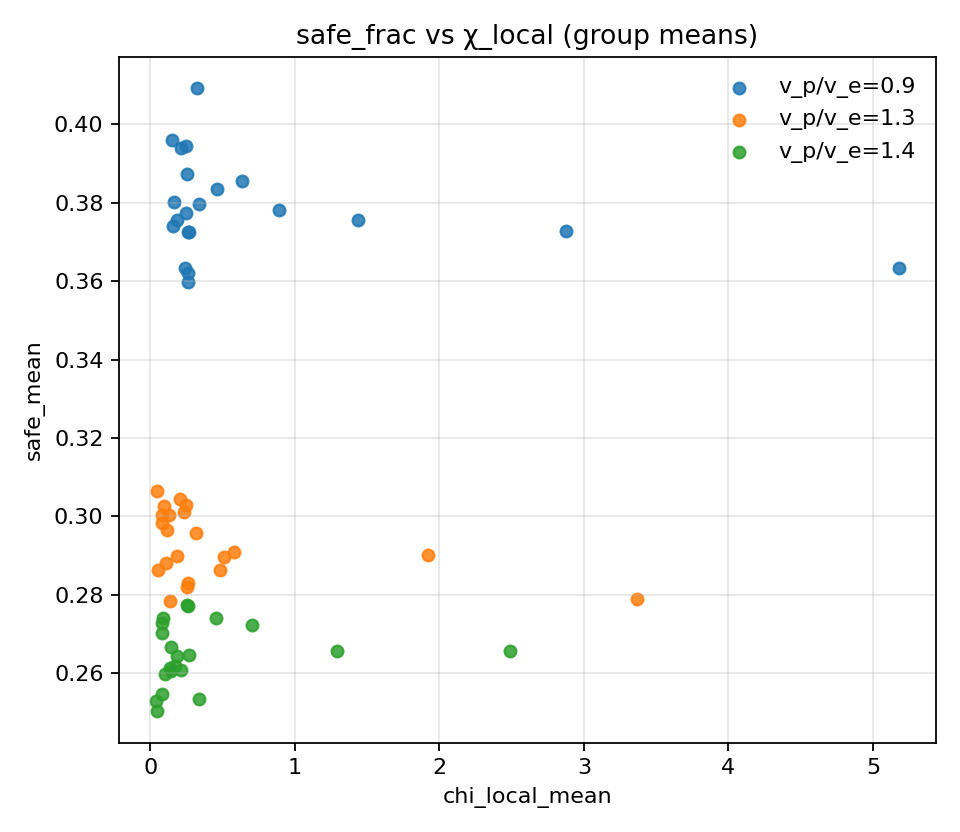

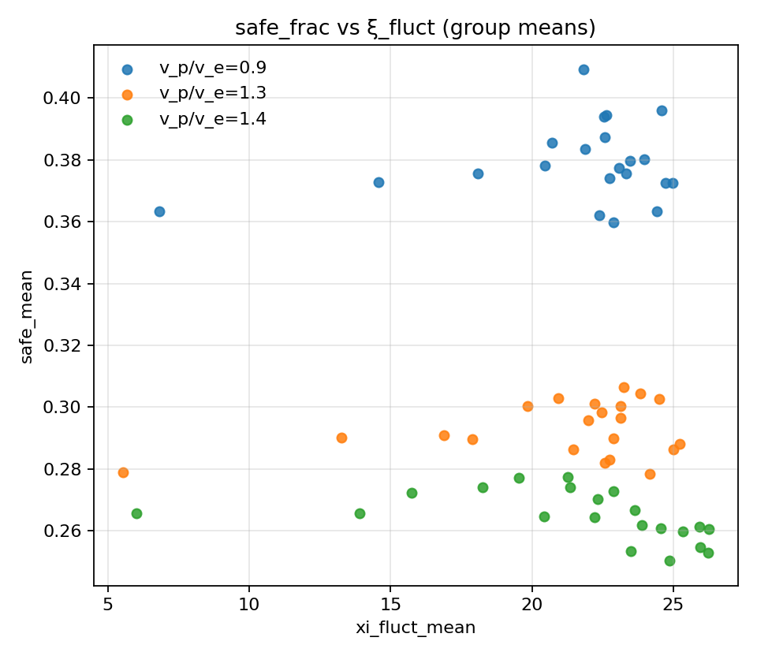

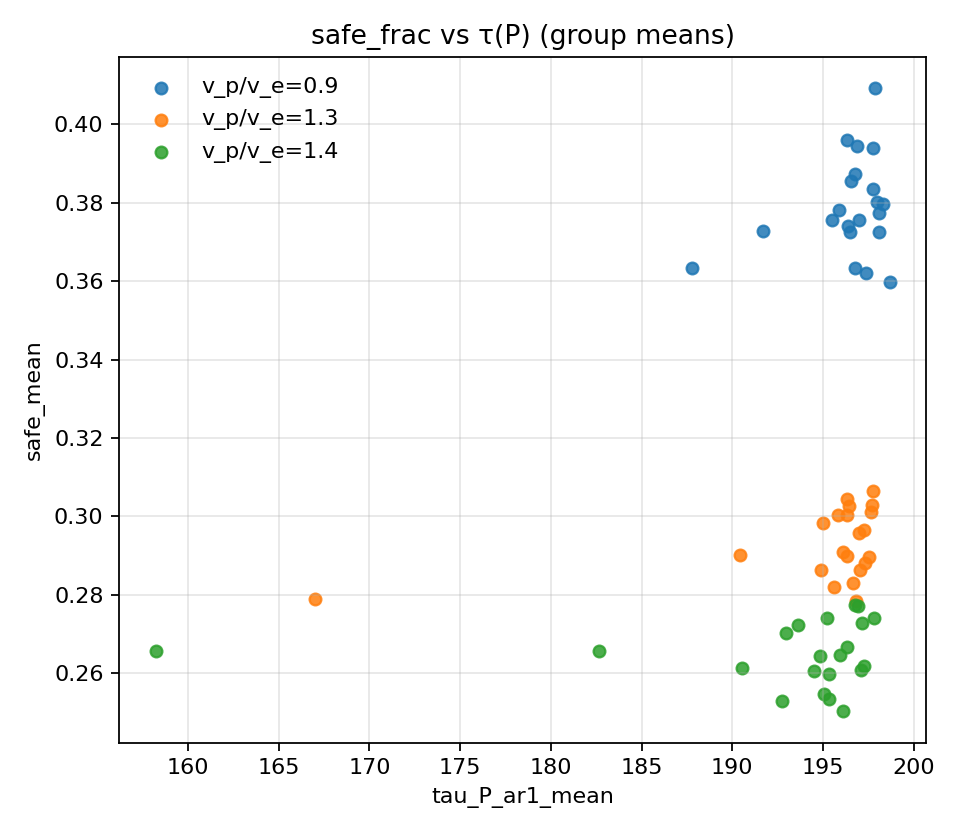

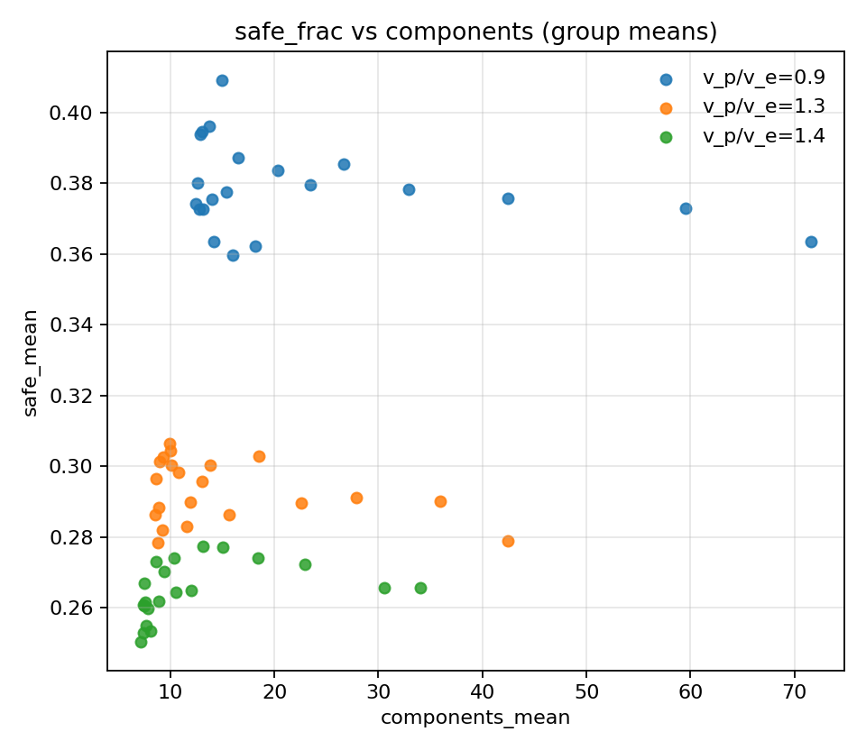
