# Task-internal criticality analysis (pressure contrast with sr=1.4 expanded)

## Experiment setup

- Pursuer count is fixed by the base config.

- Aggregation: mean ± 95% CI across seeds for each (v_p/v_e, w_align).

## Artifacts

- Sweep directory: `runs/sweep_20260206_merged_pressure_sr14_240_grid`

- Base config: `runs/sweep_20260206_merged_pressure_sr14_240_grid/base_config.json`

- Group summary (aggregated): `doc/results_20260206_walign_pressure_091314_sr14_240seeds/group_summary.csv`

- Figures: `doc/results_20260206_walign_pressure_091314_sr14_240seeds/figs`

## Aggregated summary

| v_p/v_e | best w (safe) | safe | best w (χ) | χ | best w (χ_local) | χ_local | best w (τ) | τ | best w (ξ) | ξ |

|---:|---:|---:|---:|---:|---:|---:|---:|---:|---:|---:|

| 0.9 | 0.55 | 0.4092 | 0.6 | 4.6896 | 0 | 5.1790 | 0.45 | 198.6718 | 0.75 | 24.9583 |

| 1.3 | 0.65 | 0.3064 | 0.2 | 4.7466 | 0 | 3.3642 | 0.65 | 197.7813 | 0.8 | 25.2083 |

| 1.4 | 0.25 | 0.2791 | 0.85 | 4.9353 | 0 | 2.3398 | 0.5 | 197.1345 | 0.9 | 26.9792 |

## Criticality–performance relationships (group means)

| v_p/v_e | corr(safe, χ) | |w_safe-w_χ| | corr(safe, χ_local) | |w_safe-w_χ_local| | corr(safe, τ) | |w_safe-w_τ| | corr(safe, ξ) | |w_safe-w_ξ| |

|---:|---:|---:|---:|---:|---:|---:|---:|---:|

| 0.9 | 0.272 | 0.050 | -0.310 | 0.550 | 0.272 | 0.100 | 0.236 | 0.200 |

| 1.3 | 0.378 | 0.450 | -0.418 | 0.650 | 0.408 | 0.000 | 0.320 | 0.150 |

| 1.4 | 0.024 | 0.600 | 0.019 | 0.250 | 0.126 | 0.250 | -0.322 | 0.650 |

## Plots

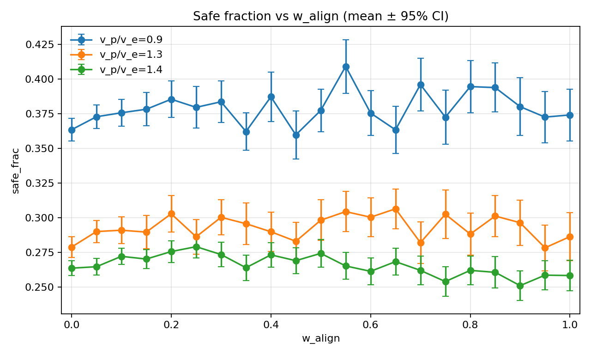

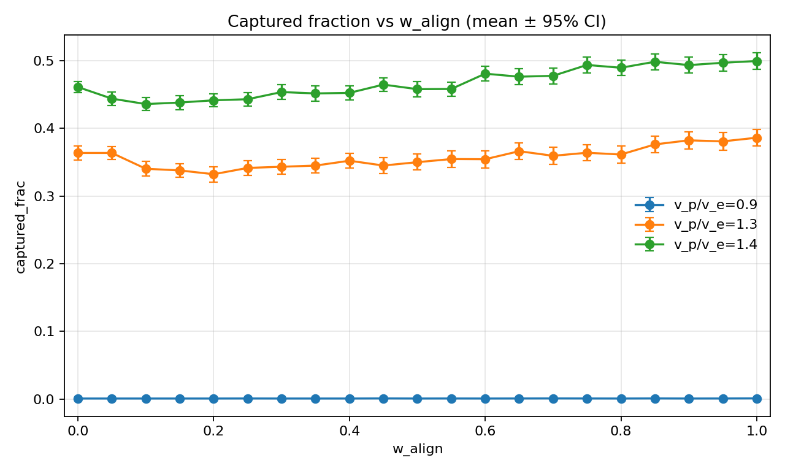

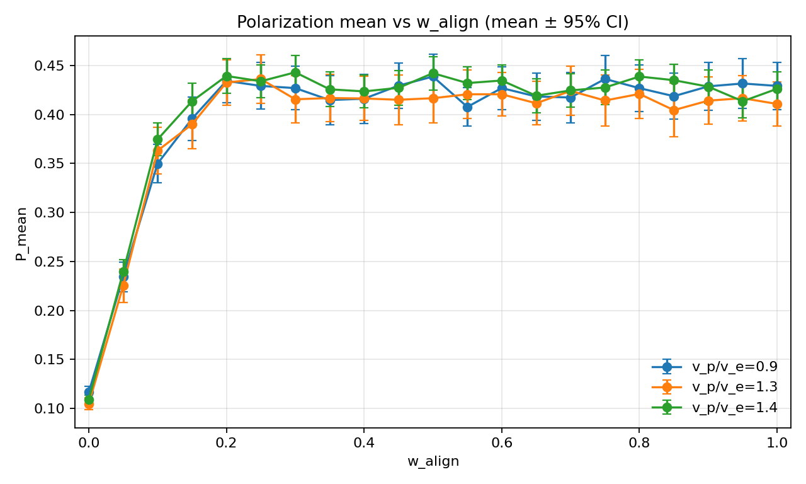

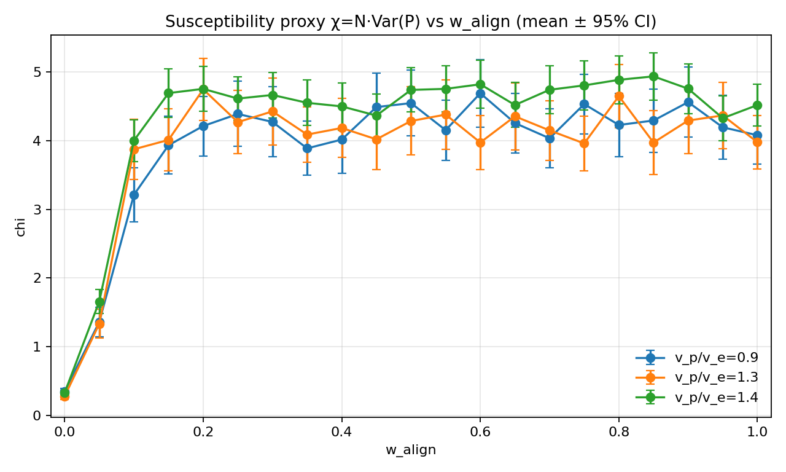

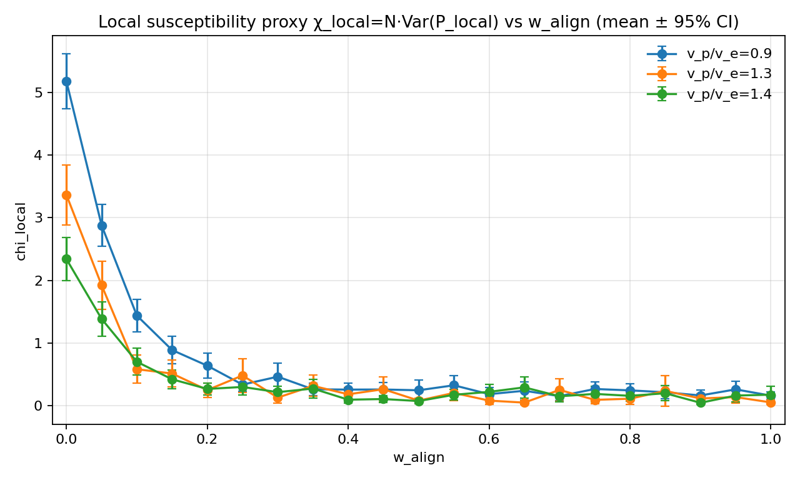

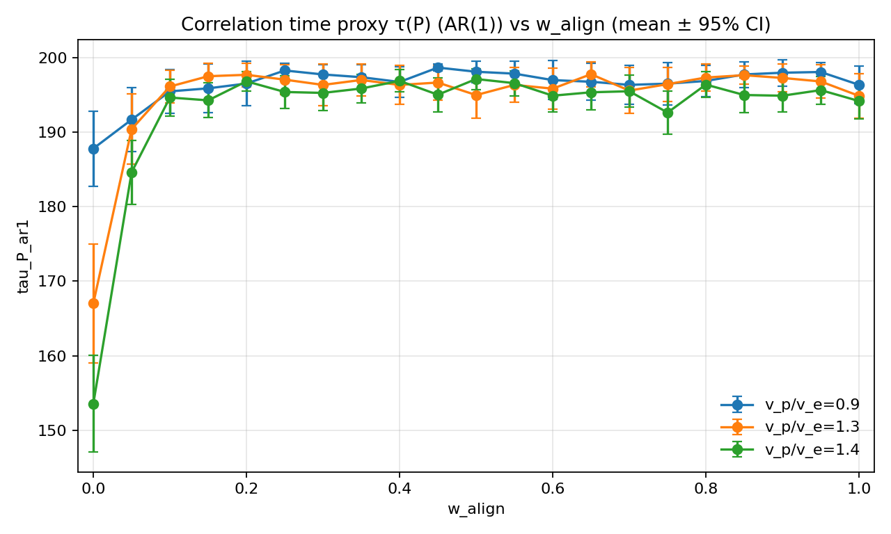

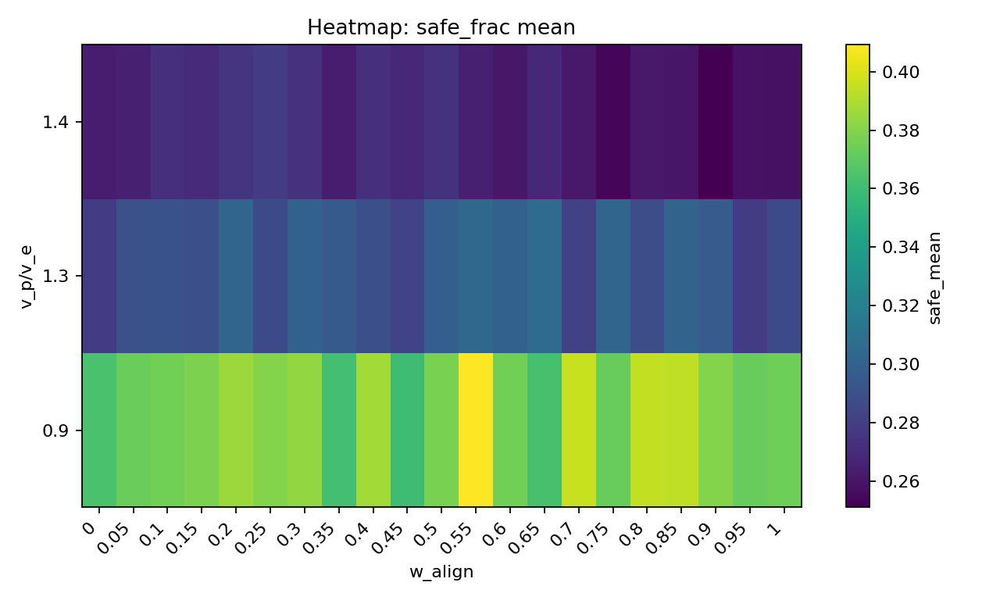

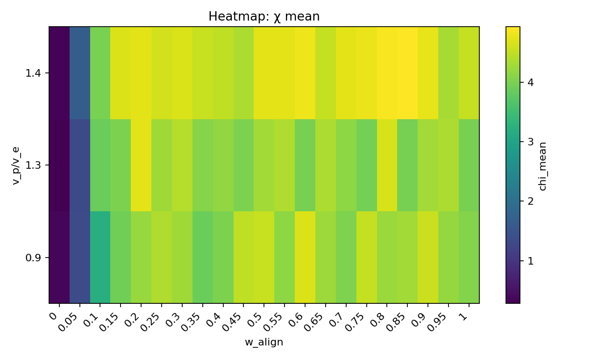

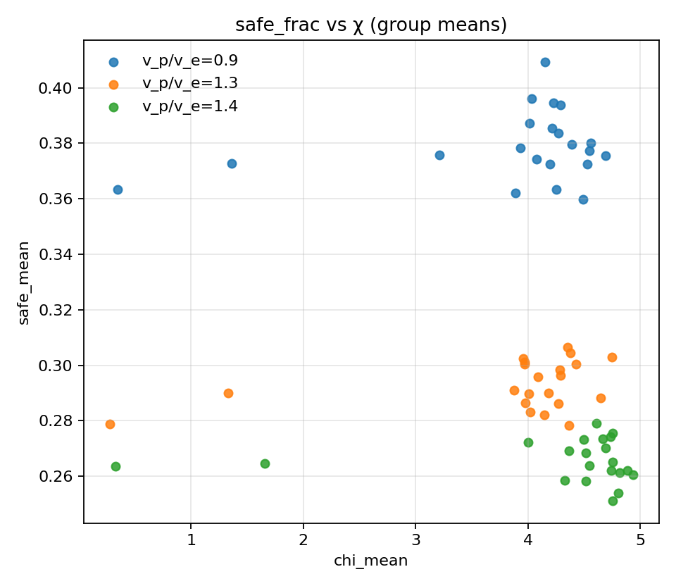

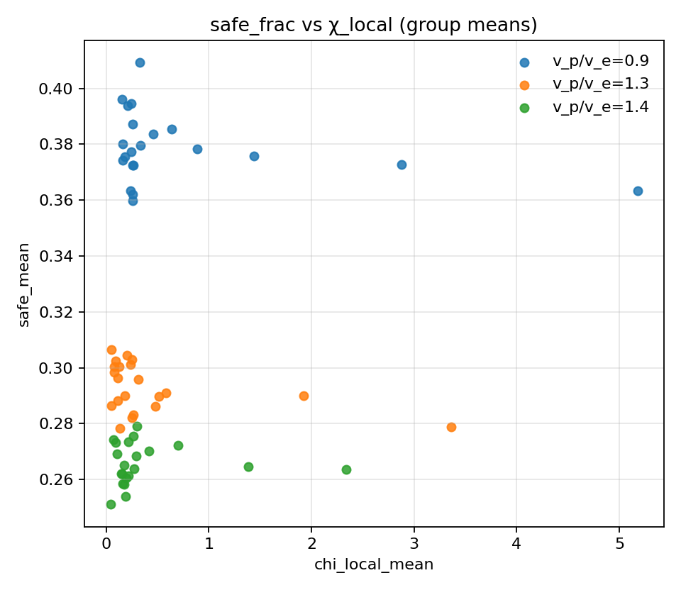

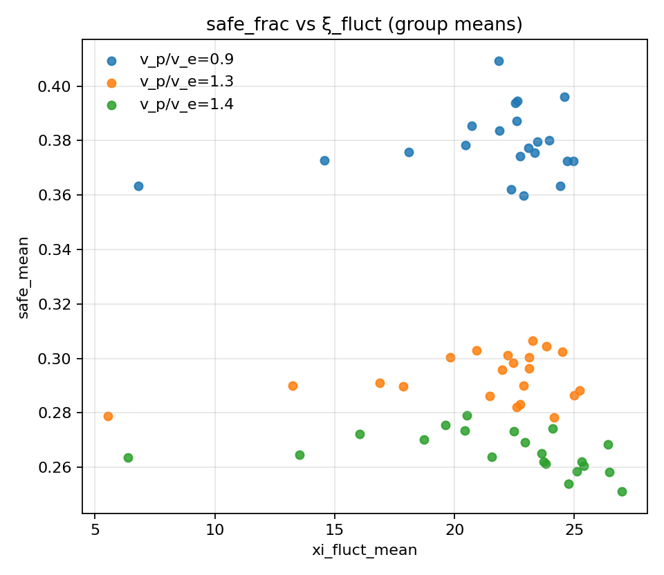

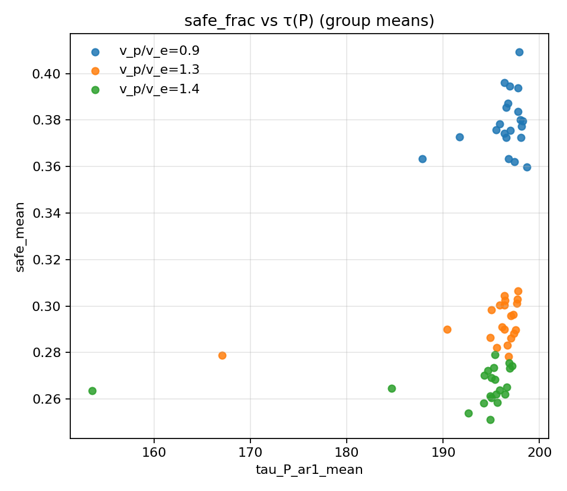

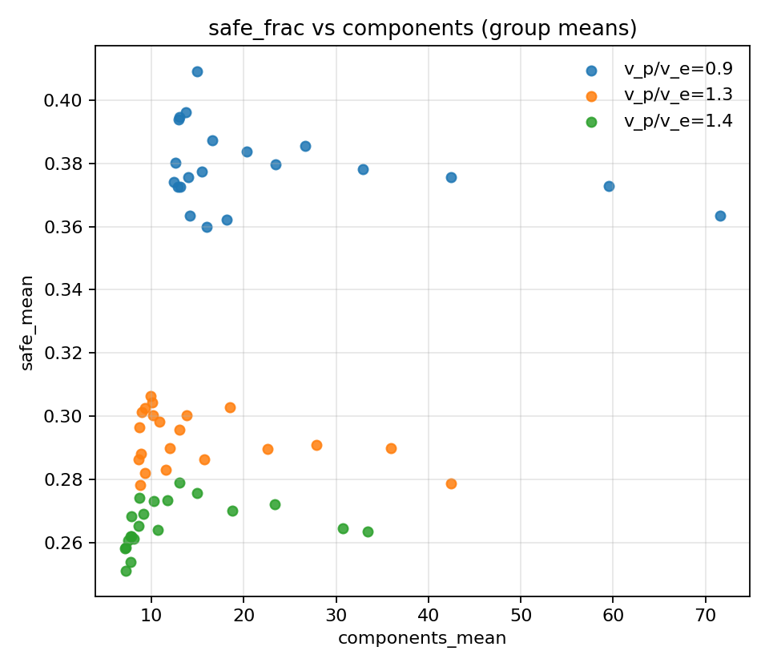

## Volatility diagnostics for Fig.4 (E09)

- Stratified scatter (colored by `speed_ratio`): `figs/scatter_safe_vs_chi_by_sr.png`
- Per-speed curve view (ordered by `w_align`): `figs/safe_vs_chi_by_sr_curves.png`
- Quantitative diagnosis and bootstrap assessment:
  - `doc/实验结果-E09-chi波动与样本量分析.md`
  - `e09_volatility_stats.json`

## Raw (non-mean) scatter diagnostics

- Raw scatter of all runs (no grouping): `figs/scatter_safefrac_vs_chi_raw_all.png`
- Raw density (hexbin) of all runs: `figs/hexbin_safefrac_vs_chi_raw_all.png`
- Raw scatter by pressure layer (still no grouping): `figs/scatter_safefrac_vs_chi_raw_by_sr.png`
- Raw scatter for each pressure layer separately:
  - `figs/scatter_safefrac_vs_chi_raw_sr09.png`
  - `figs/scatter_safefrac_vs_chi_raw_sr13.png`
  - `figs/scatter_safefrac_vs_chi_raw_sr14.png`
