# Share-mode w_align scan (noise=0, seeds=80)

## Experiment setup

- Pursuer count is fixed by the base config.

- Aggregation: mean ± 95% CI across seeds for each (v_p/v_e, w_align).

## Artifacts

- Sweep directory: `runs/sweep_20260206_210225_grid`

- Base config: `runs/sweep_20260206_210225_grid/base_config.json`

- Group summary (aggregated): `doc/results_20260206_walign_share_noise0_sr09111314_80seeds/group_summary.csv`

- Figures: `doc/results_20260206_walign_share_noise0_sr09111314_80seeds/figs`

## Aggregated summary

| v_p/v_e | best w (safe) | safe | best w (χ) | χ | best w (χ_local) | χ_local | best w (τ) | τ | best w (ξ) | ξ |

|---:|---:|---:|---:|---:|---:|---:|---:|---:|---:|---:|

| 0.9 | 0.35 | 0.3804 | 0.85 | 5.3972 | 0 | 5.1923 | 0.25 | 199.0000 | 1 | 27.0625 |

| 1.1 | 0.25 | 0.3503 | 1 | 4.9441 | 1 | 9.0989 | 0.55 | 199.0000 | 1 | 27.4375 |

| 1.3 | 0.15 | 0.2986 | 1 | 7.5658 | 1 | 9.6213 | 0.8 | 198.9498 | 0.85 | 35.2500 |

| 1.4 | 0.2 | 0.2745 | 1 | 9.4618 | 1 | 7.9151 | 1 | 198.8808 | 0.8 | 36.8125 |

## Criticality–performance relationships (group means)

| v_p/v_e | corr(safe, χ) | |w_safe-w_χ| | corr(safe, χ_local) | |w_safe-w_χ_local| | corr(safe, τ) | |w_safe-w_τ| | corr(safe, ξ) | |w_safe-w_ξ| |

|---:|---:|---:|---:|---:|---:|---:|---:|---:|

| 0.9 | -0.620 | 0.500 | 0.350 | 0.350 | -0.130 | 0.100 | -0.685 | 0.650 |

| 1.1 | -0.595 | 0.750 | -0.011 | 0.750 | -0.267 | 0.300 | -0.658 | 0.750 |

| 1.3 | -0.763 | 0.850 | -0.131 | 0.850 | -0.247 | 0.650 | -0.859 | 0.700 |

| 1.4 | -0.793 | 0.800 | -0.113 | 0.800 | -0.307 | 0.800 | -0.783 | 0.600 |

## Quantitative Discussion

- Under `align_control_mode=share` and `angle_noise=0`, increasing `w_align` does **not** improve survival in this task family.
- Across all tested pressure levels, `safe_mean` peaks at low-to-mid alignment share:
  - `sr=0.9`: best `w_align=0.35`, `safe_mean=0.3804`
  - `sr=1.1`: best `w_align=0.25`, `safe_mean=0.3503`
  - `sr=1.3`: best `w_align=0.15`, `safe_mean=0.2986`
  - `sr=1.4`: best `w_align=0.20`, `safe_mean=0.2745`
- Extreme full-alignment (`w_align=1.0`) is consistently poor:
  - `safe_mean` falls to `0.0682`, `0.0597`, `0.0425`, `0.0400` for `sr=0.9,1.1,1.3,1.4`.
- Group-mean `corr(safe, chi)` is negative for every `sr` (`-0.620` to `-0.793`), and pooled across all points is also strongly negative (`~ -0.681`).
- Interpretation:
  - In this single-parameter route, stronger alignment share increases order/fluctuation proxies but reduces task-level survival, suggesting over-alignment harms exploration and zone-competition adaptation.

## Plots

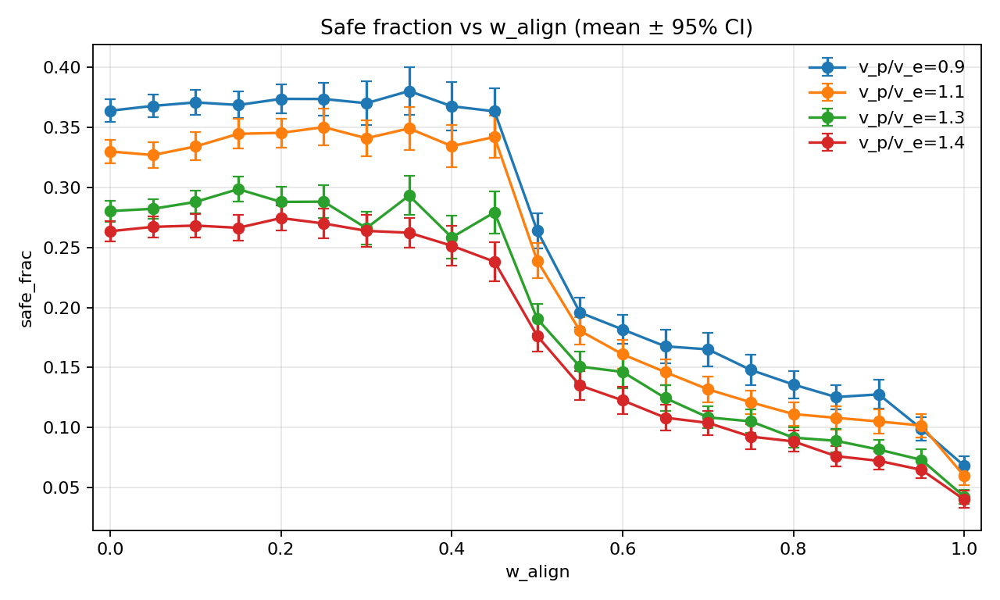

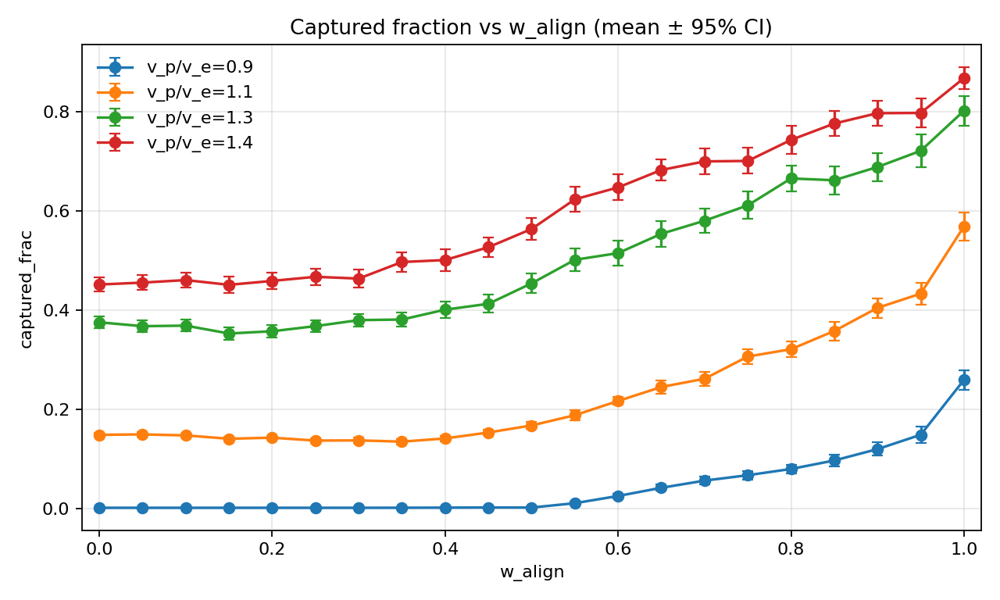

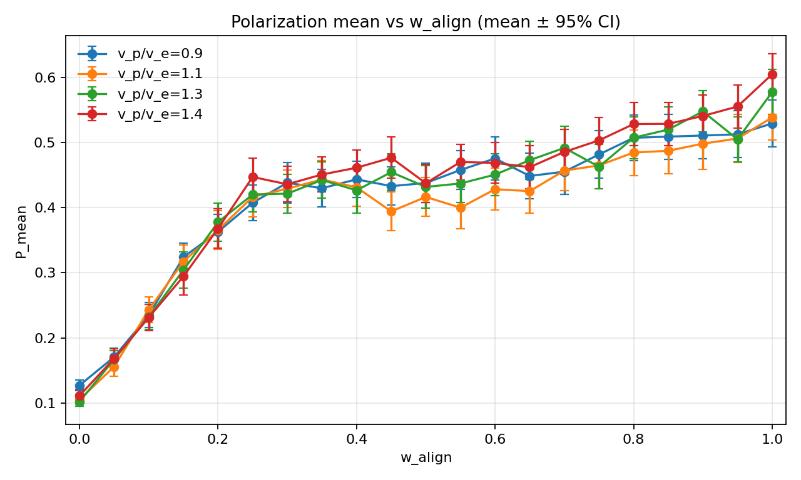

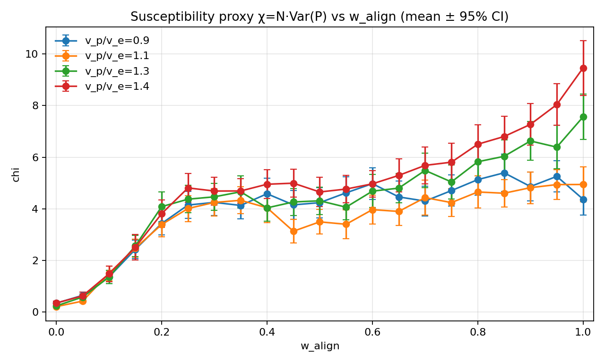

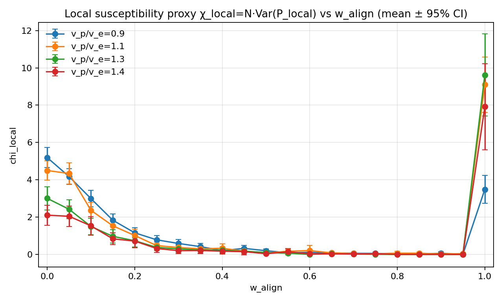

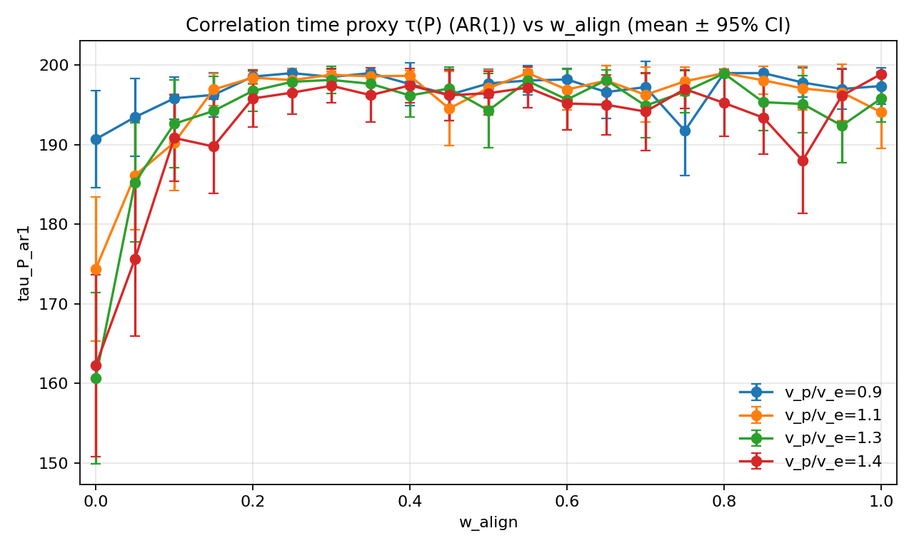

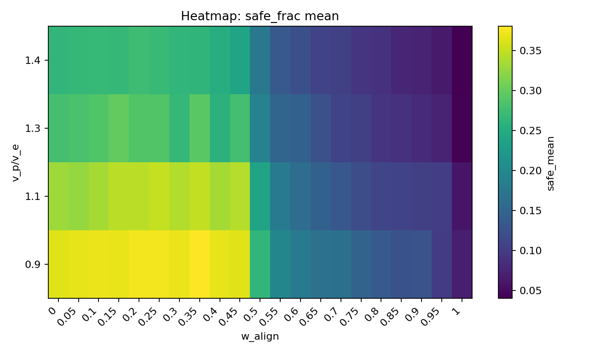

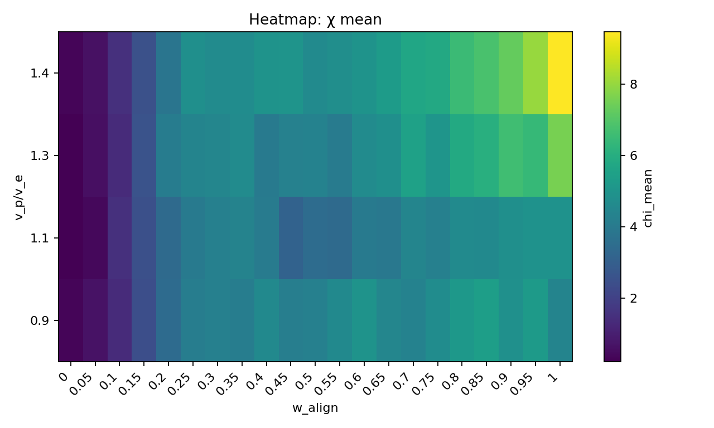

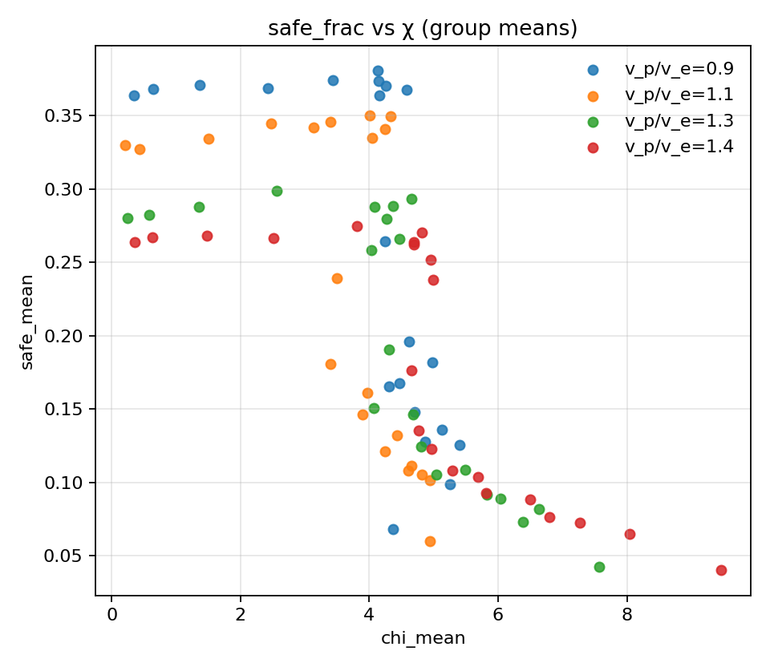

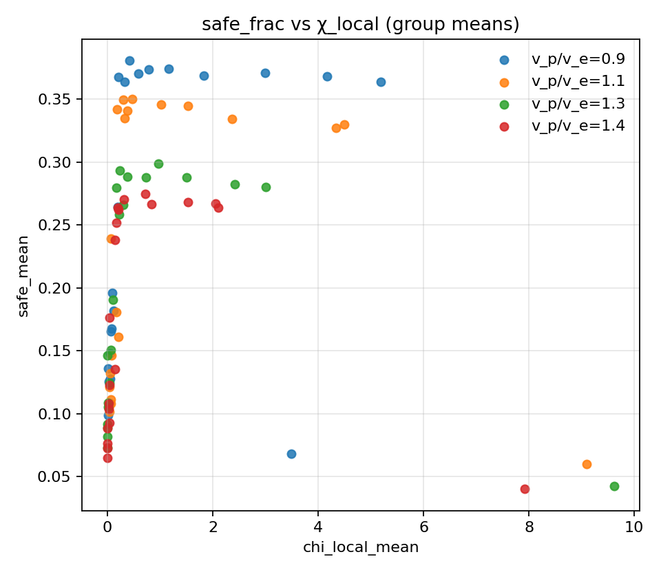

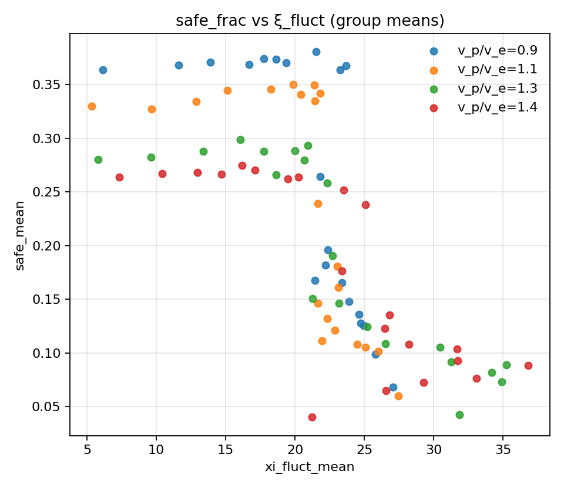

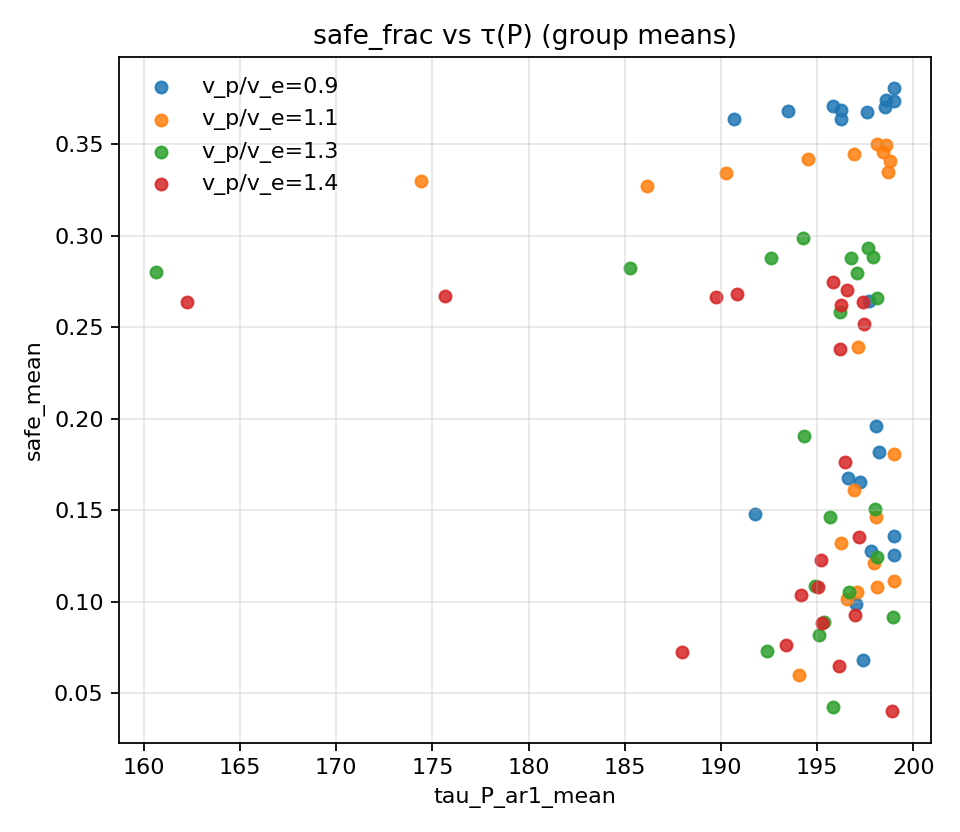

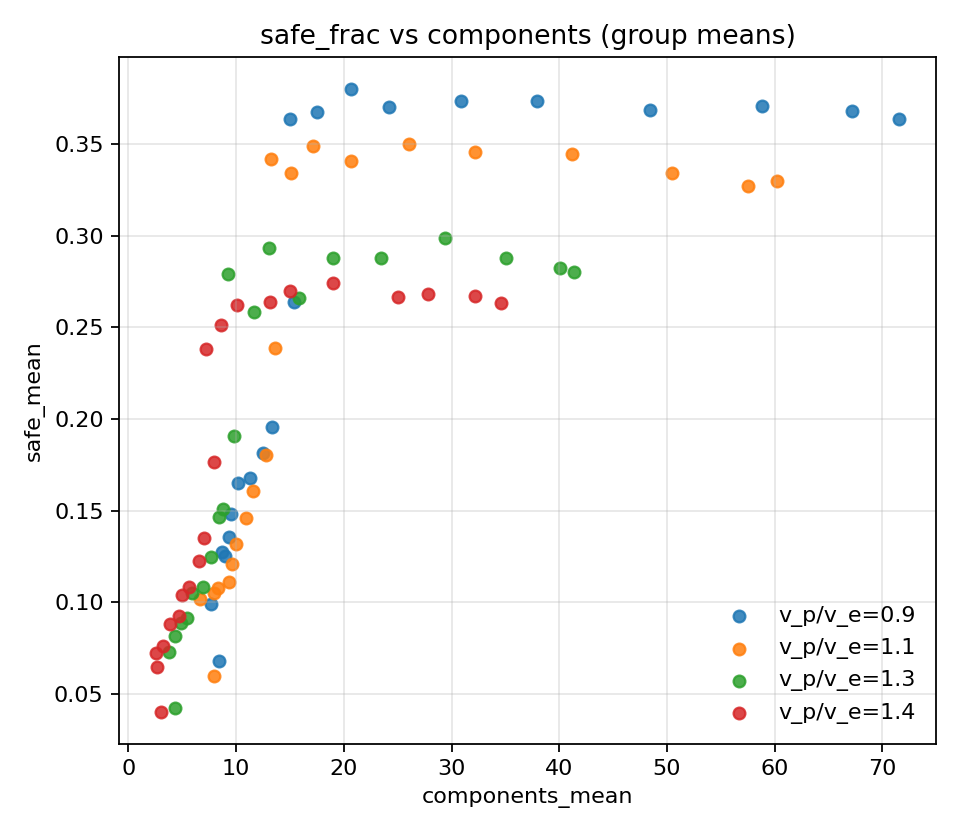
