# Task-internal criticality analysis (w_align sweep, seeds=200)

## Experiment setup

- Pursuer count is fixed by the base config.

- Aggregation: mean ± 95% CI across seeds for each (v_p/v_e, w_align).

## Artifacts

- Sweep directory: `runs/sweep_20260206_merged_200seeds_grid`

- Base config: `runs/sweep_20260206_merged_200seeds_grid/base_config.json`

- Group summary (aggregated): `doc/results_20260206_walign_task_internal_200seeds/group_summary.csv`

- Figures: `doc/results_20260206_walign_task_internal_200seeds/figs`

## Aggregated summary

| v_p/v_e | best w (safe) | safe | best w (χ) | χ | best w (χ_local) | χ_local | best w (τ) | τ | best w (ξ) | ξ |

|---:|---:|---:|---:|---:|---:|---:|---:|---:|---:|---:|

| 1 | 0.35 | 0.3893 | 0.2 | 5.6868 | 0 | 5.3490 | 0.25 | 198.4864 | 0.5 | 24.7500 |

| 1.05 | 0.55 | 0.3705 | 0.2 | 4.6249 | 0 | 4.7263 | 0.65 | 198.3872 | 0.8 | 24.8500 |

| 1.1 | 0.7 | 0.3629 | 0.2 | 4.8342 | 0 | 4.3101 | 0.65 | 198.3575 | 0.95 | 24.9250 |

| 1.15 | 0.45 | 0.3442 | 0.15 | 4.3913 | 0 | 3.9964 | 0.45 | 198.6311 | 0.9 | 24.4250 |

| 1.2 | 0.4 | 0.3341 | 0.3 | 4.4685 | 0 | 3.2011 | 0.65 | 198.2169 | 0.85 | 24.8250 |

## Criticality–performance relationships (group means)

| v_p/v_e | corr(safe, χ) | |w_safe-w_χ| | corr(safe, χ_local) | |w_safe-w_χ_local| | corr(safe, τ) | |w_safe-w_τ| | corr(safe, ξ) | |w_safe-w_ξ| |

|---:|---:|---:|---:|---:|---:|---:|---:|---:|

| 1 | 0.376 | 0.150 | -0.417 | 0.350 | 0.383 | 0.100 | 0.374 | 0.150 |

| 1.05 | 0.441 | 0.350 | -0.407 | 0.550 | 0.369 | 0.100 | 0.371 | 0.250 |

| 1.1 | 0.467 | 0.500 | -0.532 | 0.700 | 0.447 | 0.050 | 0.525 | 0.250 |

| 1.15 | 0.621 | 0.300 | -0.520 | 0.450 | 0.585 | 0.000 | 0.414 | 0.450 |

| 1.2 | 0.492 | 0.100 | -0.540 | 0.400 | 0.379 | 0.250 | 0.523 | 0.450 |

## Plots

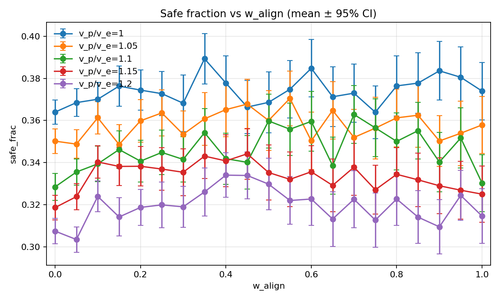

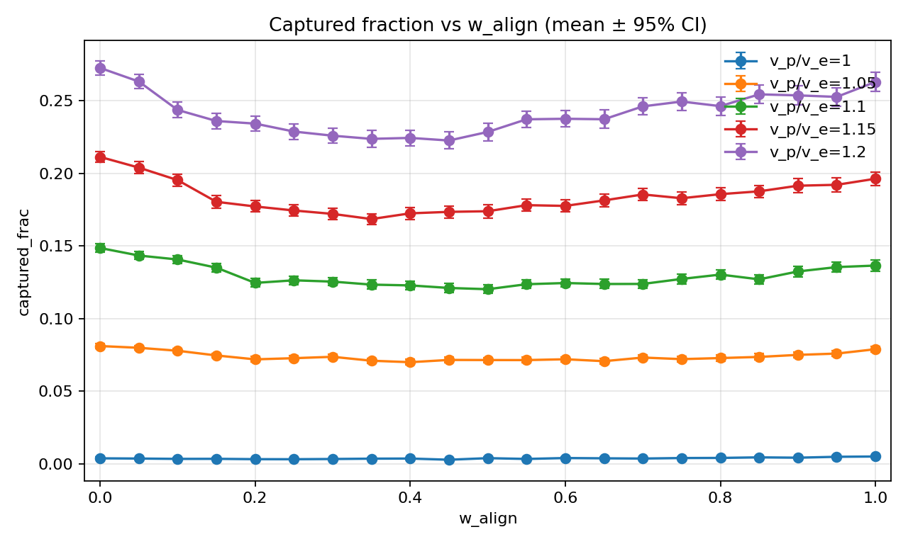

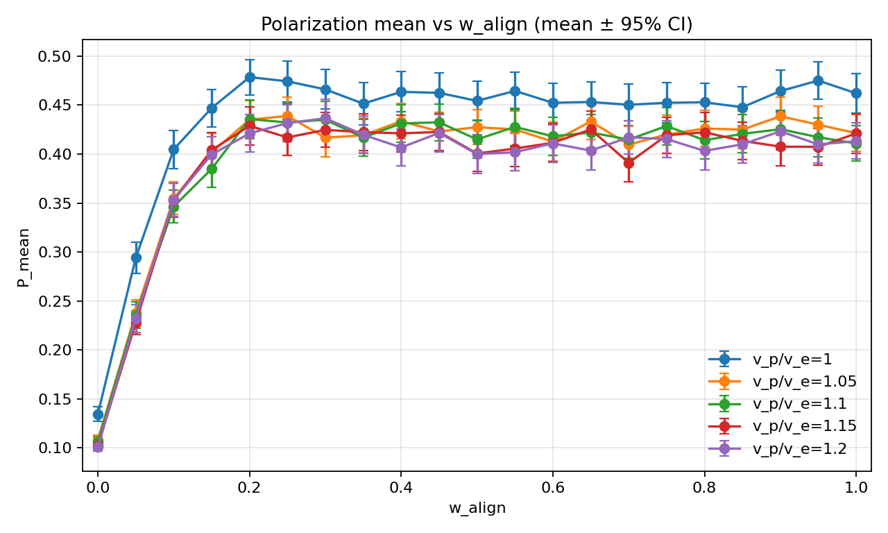

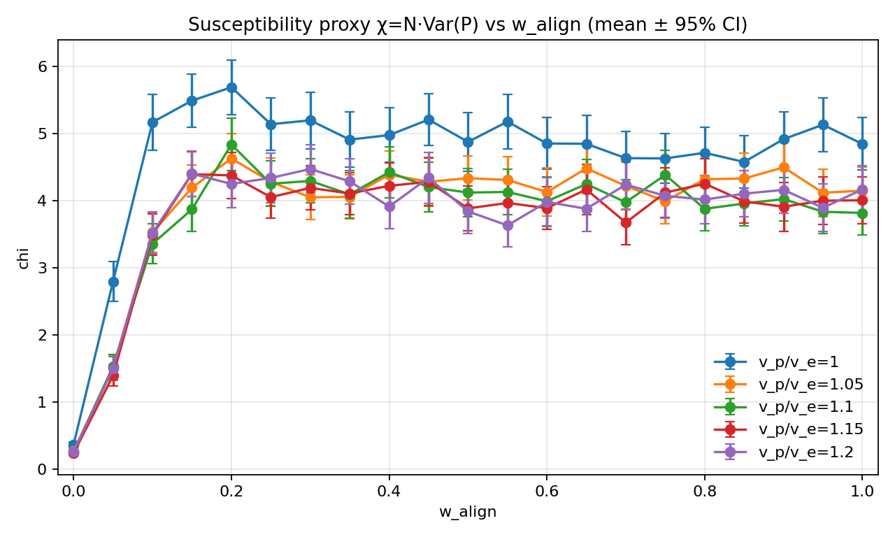

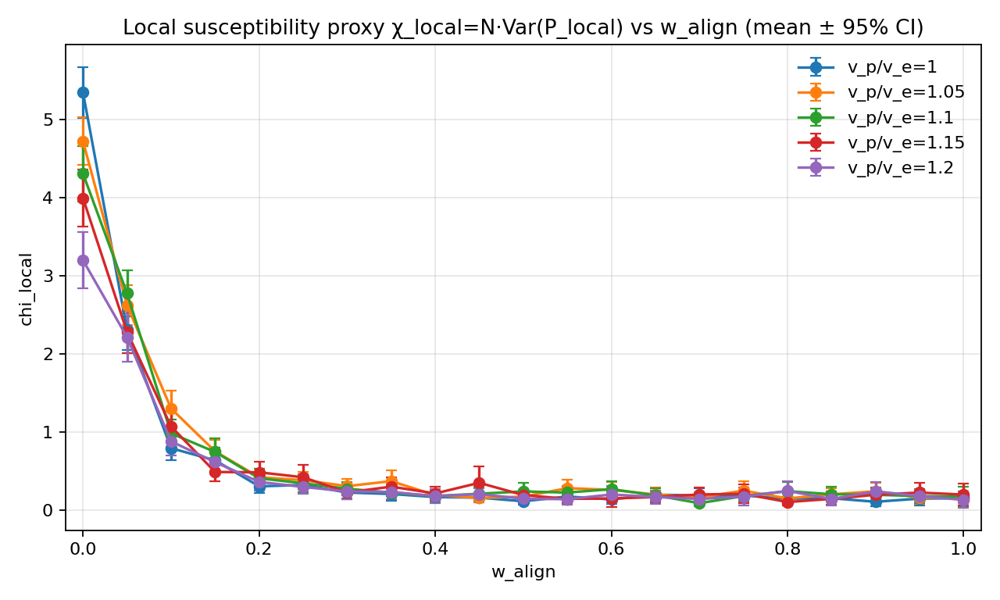

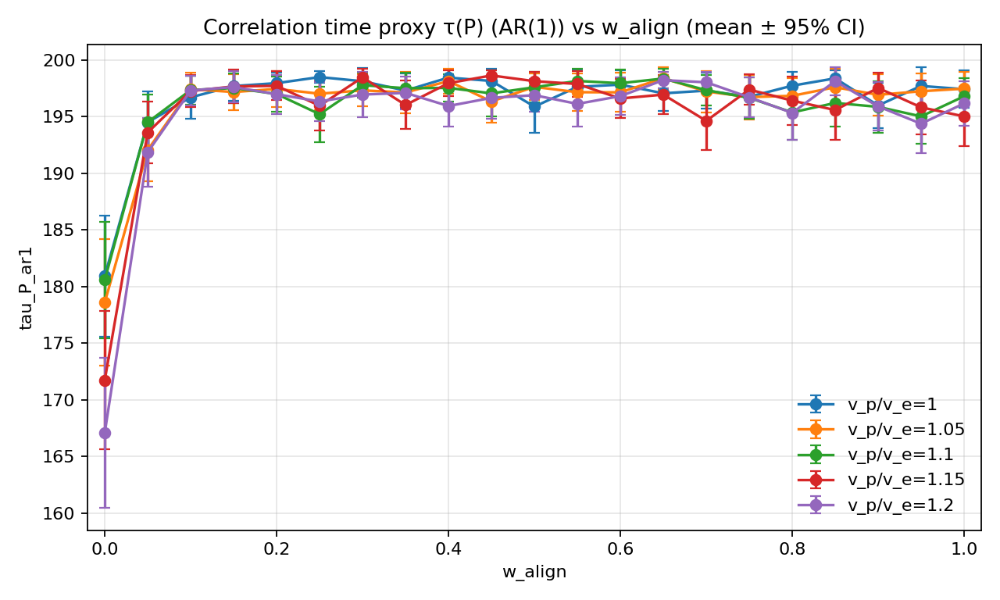

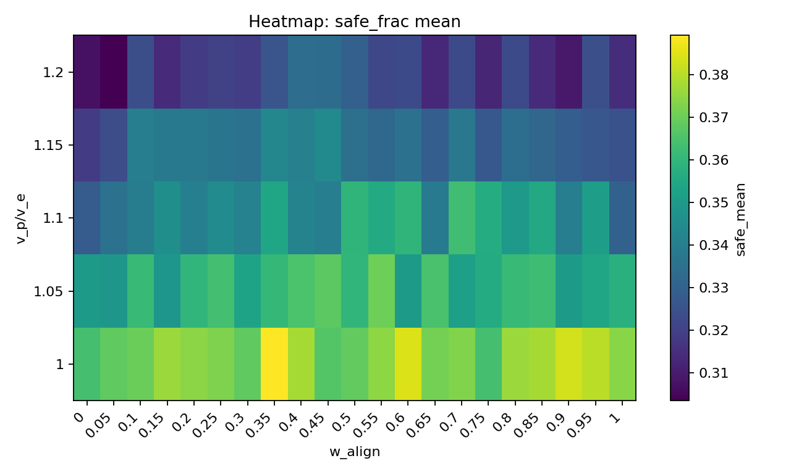

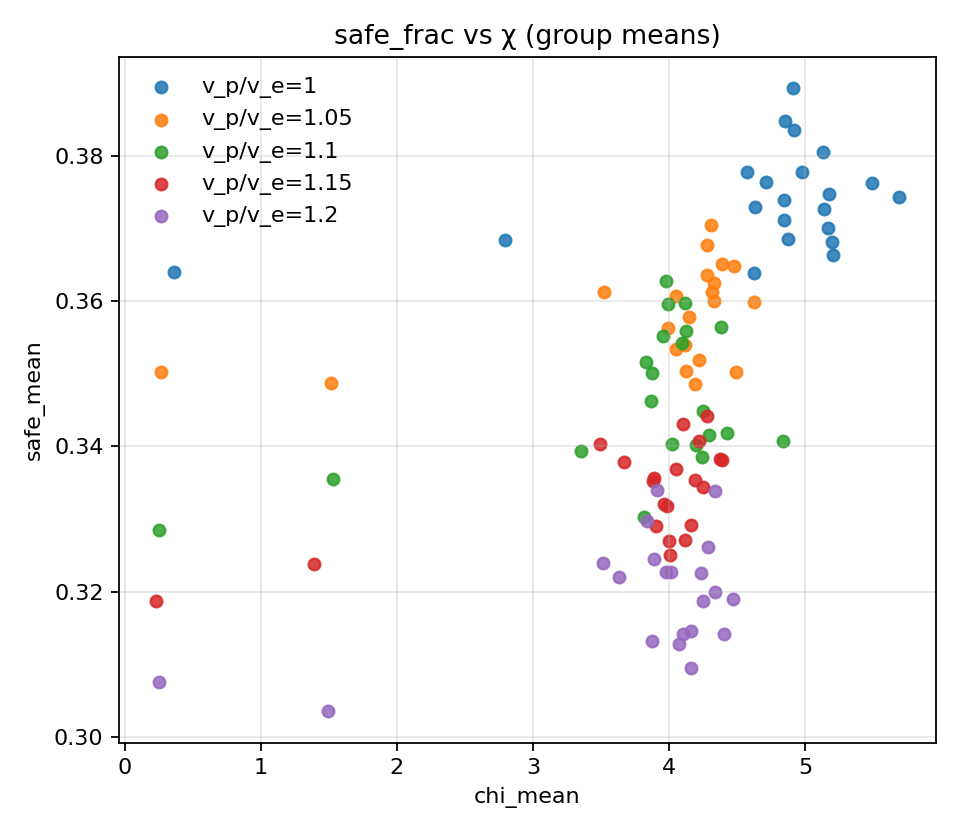

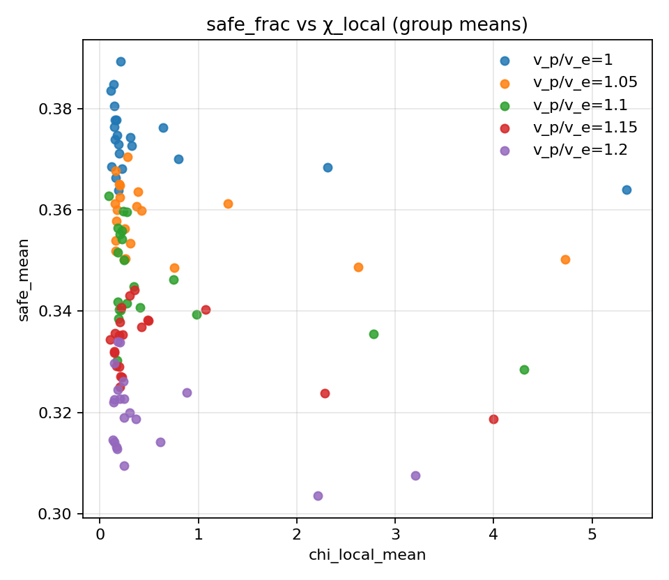

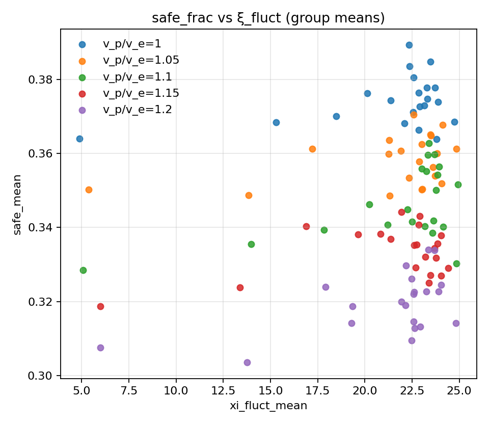

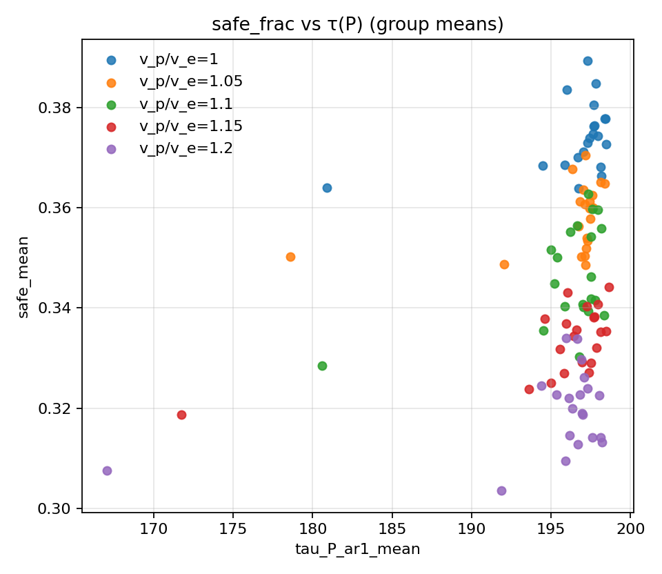

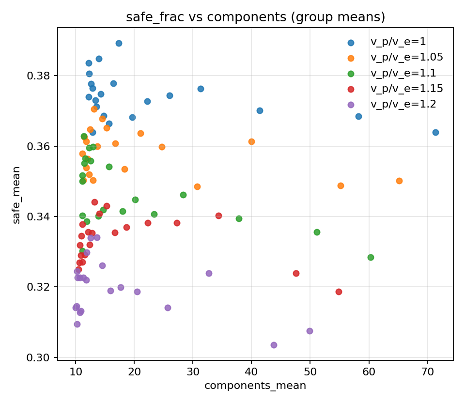
