# Task-internal criticality analysis (w_align sweep, seeds=80)

## Experiment setup

- Pursuer count is fixed by the base config.

- Aggregation: mean ± 95% CI across seeds for each (v_p/v_e, w_align).

## Artifacts

- Sweep directory: `runs/sweep_20260206_151534_grid`

- Base config: `runs/sweep_20260206_151534_grid/base_config.json`

- Group summary (aggregated): `doc/results_20260206_walign_task_internal_80seeds/group_summary.csv`

- Figures: `doc/results_20260206_walign_task_internal_80seeds/figs`

## Aggregated summary

| v_p/v_e | best w (safe) | safe | best w (χ) | χ | best w (χ_local) | χ_local | best w (τ) | τ | best w (ξ) | ξ |

|---:|---:|---:|---:|---:|---:|---:|---:|---:|---:|---:|

| 1 | 0.95 | 0.3900 | 0.2 | 5.5094 | 0 | 5.4100 | 0.45 | 199.0000 | 0.7 | 25.0625 |

| 1.05 | 0.65 | 0.3722 | 0.25 | 4.6038 | 0 | 4.7983 | 0.65 | 199.0000 | 0.5 | 25.1250 |

| 1.1 | 0.7 | 0.3802 | 0.2 | 4.7788 | 0 | 4.3648 | 0.35 | 198.6482 | 0.95 | 25.9375 |

| 1.15 | 0.7 | 0.3531 | 0.2 | 4.4586 | 0 | 4.1729 | 0.9 | 198.8400 | 0.95 | 24.9375 |

| 1.2 | 0.4 | 0.3382 | 0.45 | 4.4506 | 0 | 3.2337 | 0.65 | 198.3036 | 0.85 | 25.3125 |

## Criticality–performance relationships (group means)

| v_p/v_e | corr(safe, χ) | |w_safe-w_χ| | corr(safe, χ_local) | |w_safe-w_χ_local| | corr(safe, τ) | |w_safe-w_τ| | corr(safe, ξ) | |w_safe-w_ξ| |

|---:|---:|---:|---:|---:|---:|---:|---:|---:|

| 1 | 0.346 | 0.750 | -0.347 | 0.950 | 0.311 | 0.500 | 0.282 | 0.250 |

| 1.05 | 0.398 | 0.400 | -0.446 | 0.650 | 0.378 | 0.000 | 0.373 | 0.150 |

| 1.1 | 0.308 | 0.500 | -0.436 | 0.700 | 0.259 | 0.350 | 0.406 | 0.250 |

| 1.15 | 0.464 | 0.500 | -0.395 | 0.700 | 0.378 | 0.200 | 0.407 | 0.250 |

| 1.2 | 0.489 | 0.050 | -0.541 | 0.400 | 0.410 | 0.250 | 0.491 | 0.450 |

## Plots

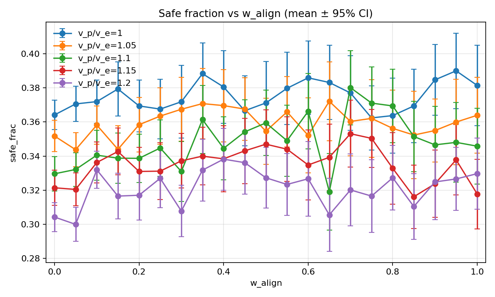

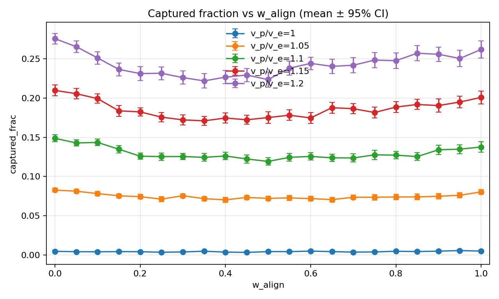

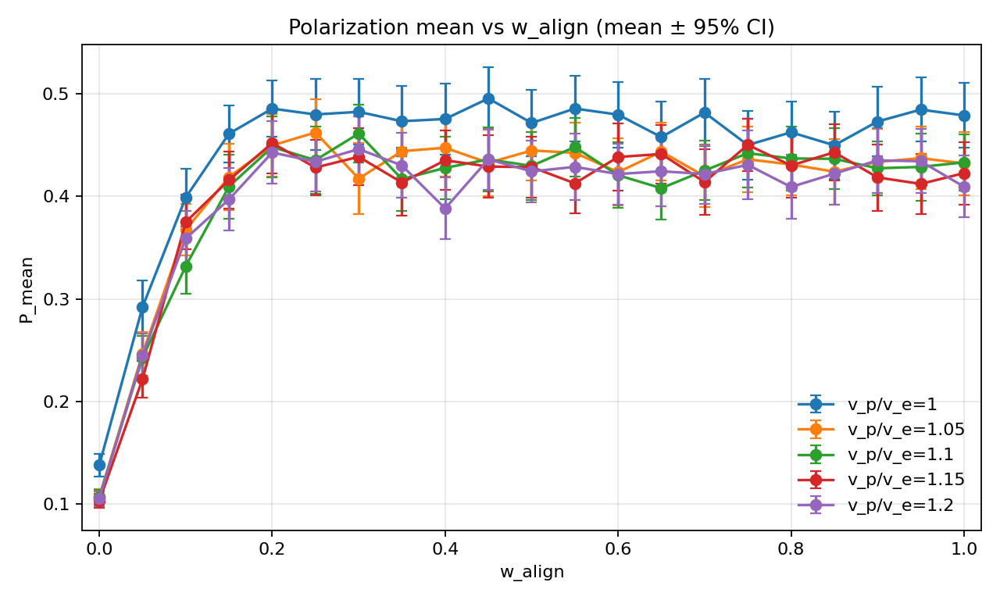

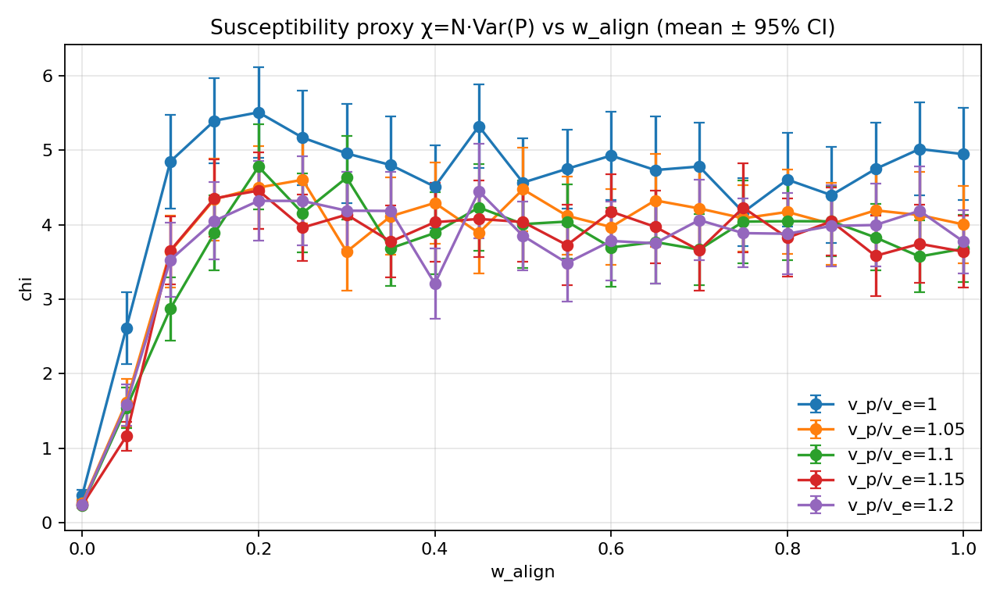

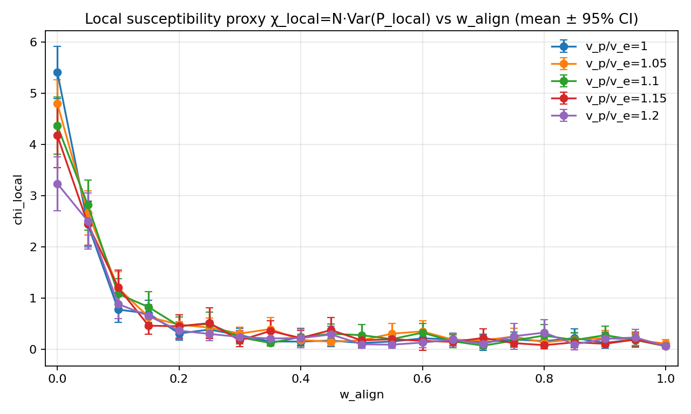

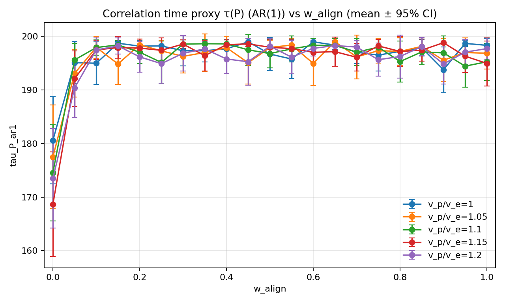

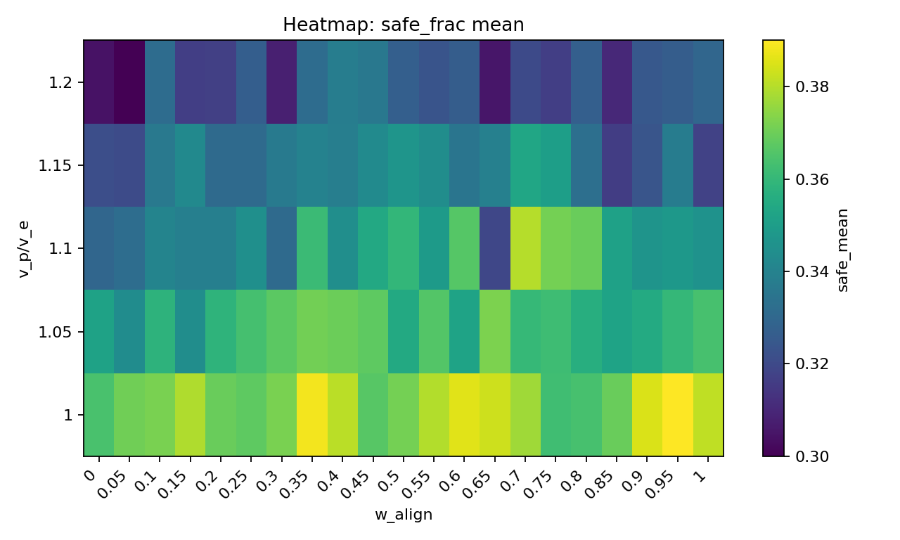

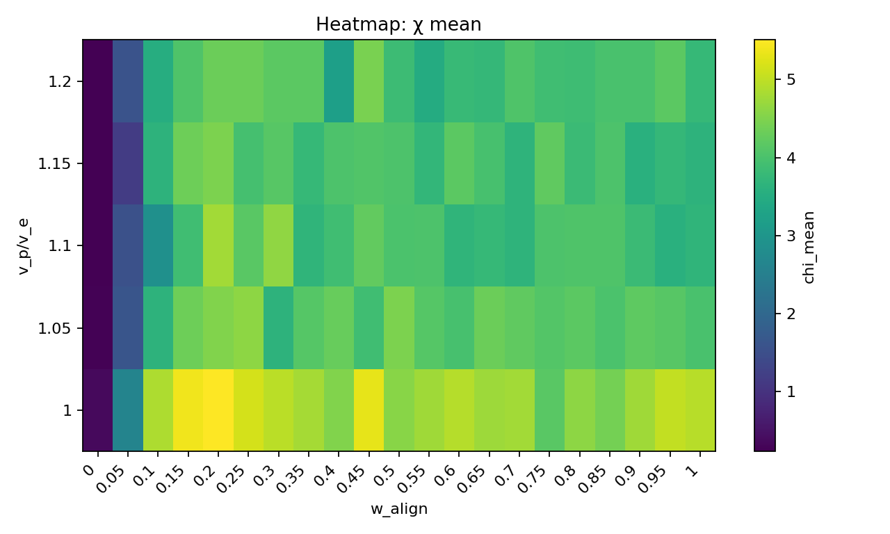

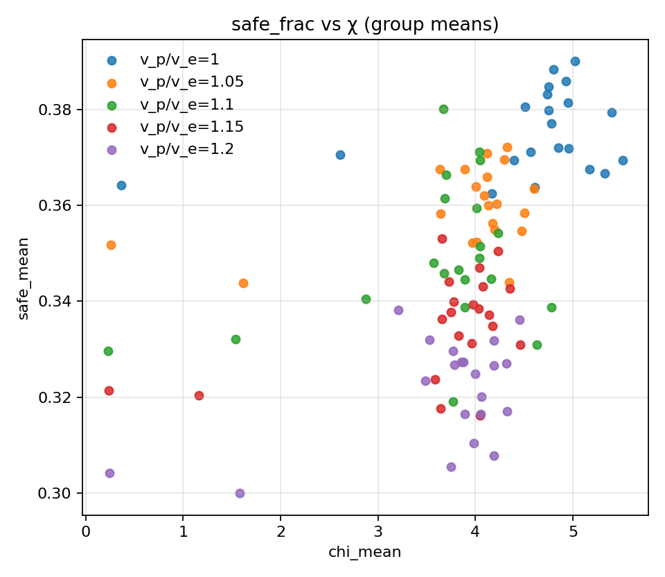

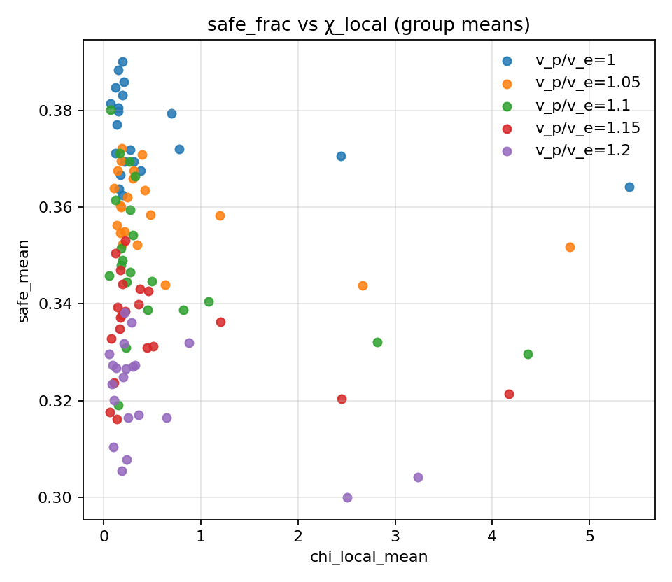

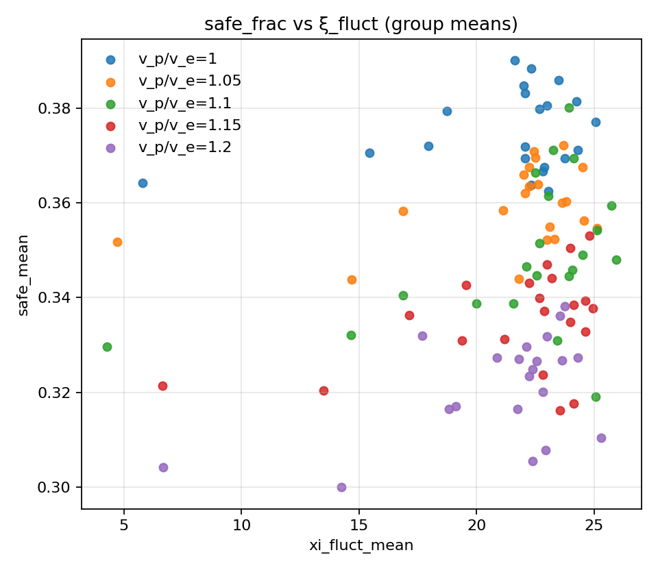

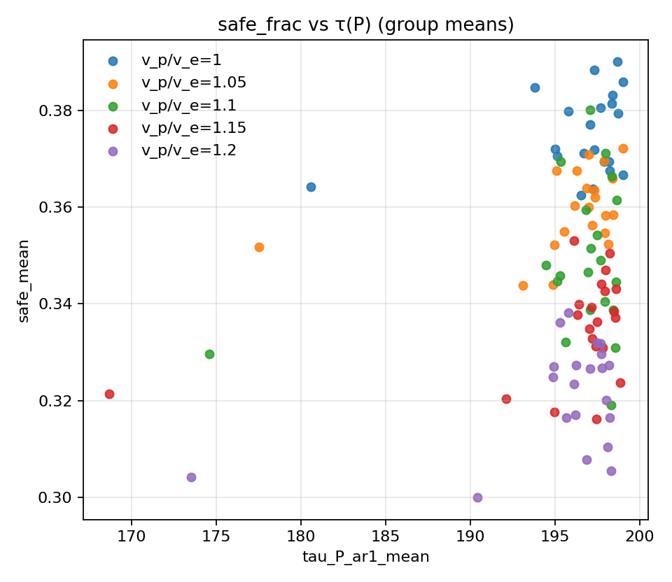

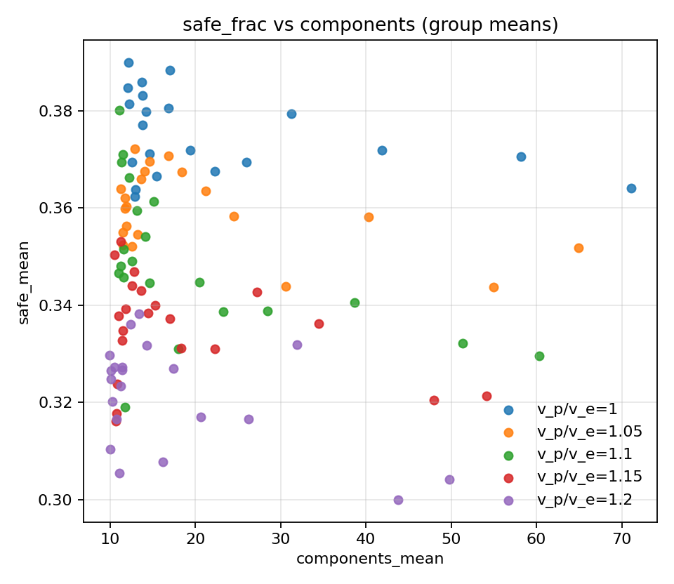
