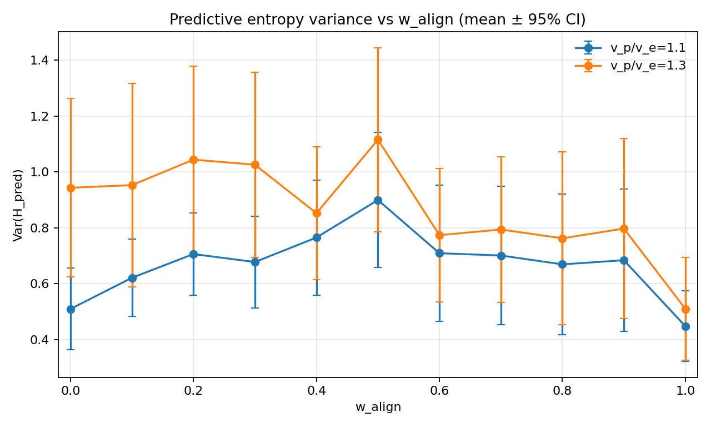
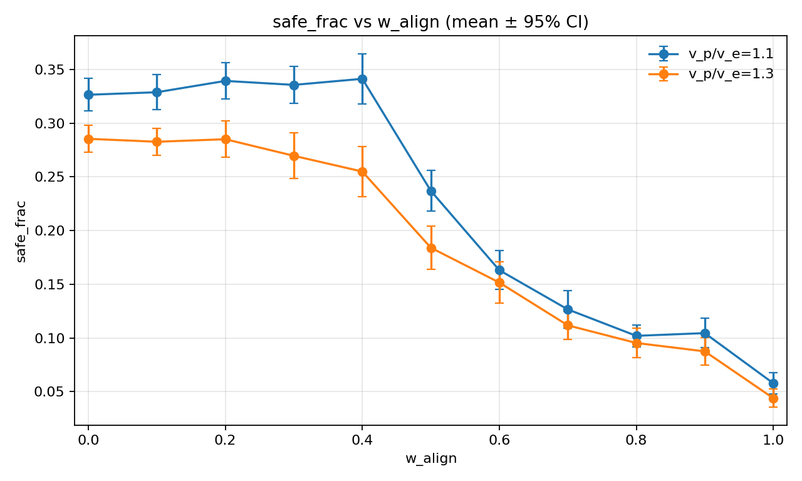
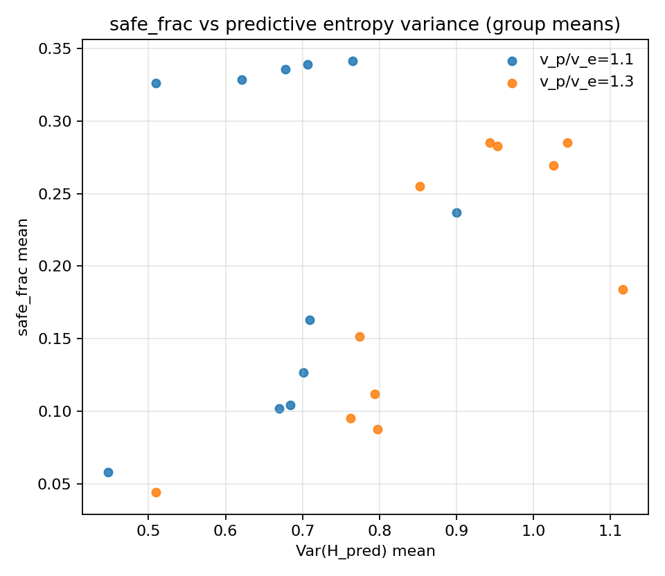
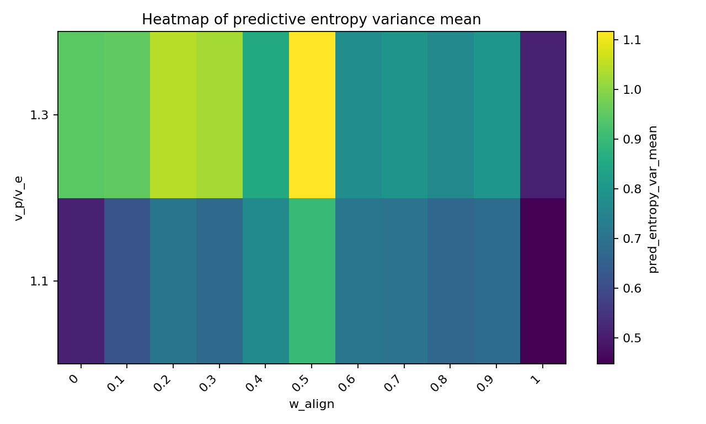

# Predictive entropy under p0_nearest (sr=1.1,1.3; 40 seeds)

## Setup

- Sweep directory: `runs/sweep_20260207_172412_grid`

- Bins: `72`

- EMA span: `10`

- N-gram order: `2`

- Valid runs used: `880`

## Per-speed correlations (group means)

| v_p/v_e | corr(safe, Var(H_pred)) |

|---:|---:|

| 1.1 | 0.201 |

| 1.3 | 0.769 |

- pooled corr(safe, Var(H_pred)) across all grouped points: `0.283`

## Plots

