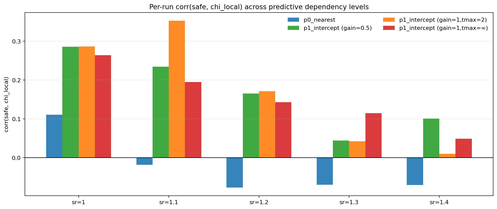
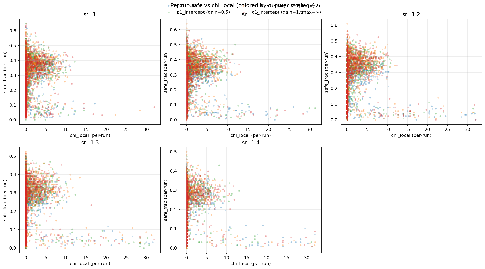
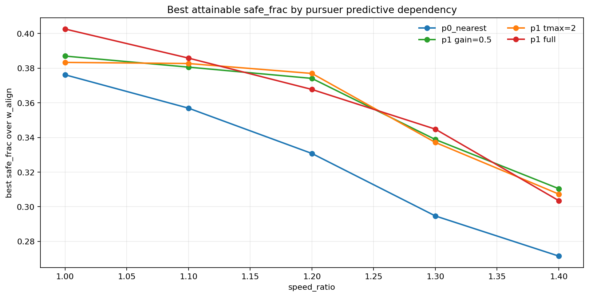
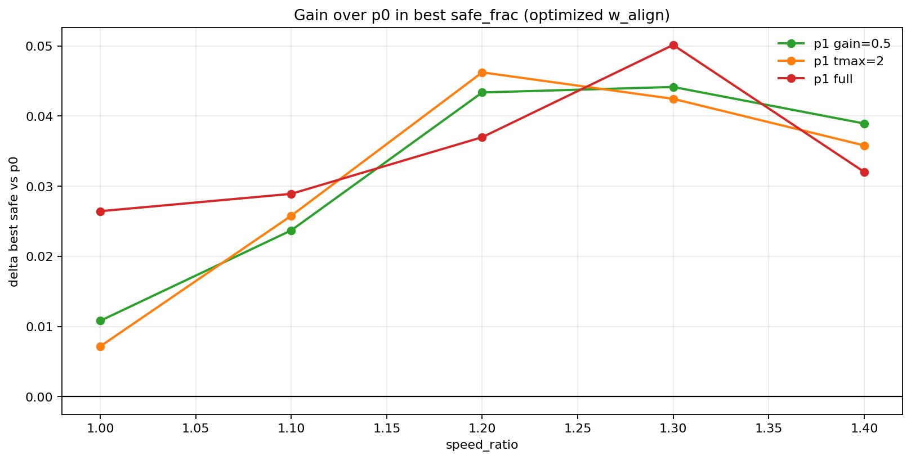

# 实验结果：追捕者预测依赖强度扫描（2026-02-07）

## 1. 目的

检验“追捕者越依赖预测时，近临界代理与逃逸收益关系是否更明显”。本轮仅改变追捕策略的预测依赖参数，保持场景与逃跑者机制一致。

## 2. 设置

- 场景：2D 连续，多安全区、容量限制、缓慢移动。
- 逃跑者：`align_control_mode="share"`，`angle_noise=0`，扫描 `w_align=0..1 (step 0.05)`。
- 速度层：`speed_ratio={1.0,1.1,1.2,1.3,1.4}`。
- 每点样本：`60 seeds`，`600 steps`。
- 追捕策略变体：
  - `p0_nearest`
  - `p1_intercept(gain=0.5, tmax=∞)`
  - `p1_intercept(gain=1.0, tmax=2)`
  - `p1_intercept(gain=1.0, tmax=∞)`

## 3. 图表

## 4. 关键统计（per-run）

| variant | sr | corr(safe, chi) | corr(safe, chi_local) | highQ-lowQ by chi_local |
|---|---:|---:|---:|---:|
| p0_nearest | 1 | -0.047 | 0.110 | 0.114 |
| p0_nearest | 1.1 | -0.253 | -0.019 | 0.121 |
| p0_nearest | 1.2 | -0.283 | -0.077 | 0.102 |
| p0_nearest | 1.3 | -0.362 | -0.070 | 0.114 |
| p0_nearest | 1.4 | -0.428 | -0.071 | 0.105 |
| p1_gain05 | 1 | -0.421 | 0.286 | 0.188 |
| p1_gain05 | 1.1 | -0.445 | 0.234 | 0.222 |
| p1_gain05 | 1.2 | -0.503 | 0.165 | 0.212 |
| p1_gain05 | 1.3 | -0.530 | 0.044 | 0.185 |
| p1_gain05 | 1.4 | -0.571 | 0.101 | 0.180 |
| p1_tmax2 | 1 | -0.394 | 0.287 | 0.209 |
| p1_tmax2 | 1.1 | -0.446 | 0.352 | 0.211 |
| p1_tmax2 | 1.2 | -0.450 | 0.171 | 0.195 |
| p1_tmax2 | 1.3 | -0.501 | 0.042 | 0.169 |
| p1_tmax2 | 1.4 | -0.541 | 0.010 | 0.166 |
| p1_full | 1 | -0.456 | 0.264 | 0.207 |
| p1_full | 1.1 | -0.486 | 0.195 | 0.225 |
| p1_full | 1.2 | -0.546 | 0.143 | 0.208 |
| p1_full | 1.3 | -0.569 | 0.114 | 0.192 |
| p1_full | 1.4 | -0.575 | 0.049 | 0.171 |

## 5. 最优可达 safe（按 w_align 选最优）

| variant | sr | best w_align | best safe |
|---|---:|---:|---:|
| p0_nearest | 1 | 0.25 | 0.376 |
| p0_nearest | 1.1 | 0.25 | 0.357 |
| p0_nearest | 1.2 | 0.30 | 0.331 |
| p0_nearest | 1.3 | 0.15 | 0.295 |
| p0_nearest | 1.4 | 0.20 | 0.271 |
| p1_gain05 | 1 | 0.15 | 0.387 |
| p1_gain05 | 1.1 | 0.10 | 0.381 |
| p1_gain05 | 1.2 | 0.10 | 0.374 |
| p1_gain05 | 1.3 | 0.30 | 0.339 |
| p1_gain05 | 1.4 | 0.10 | 0.310 |
| p1_tmax2 | 1 | 0.15 | 0.383 |
| p1_tmax2 | 1.1 | 0.20 | 0.383 |
| p1_tmax2 | 1.2 | 0.10 | 0.377 |
| p1_tmax2 | 1.3 | 0.00 | 0.337 |
| p1_tmax2 | 1.4 | 0.15 | 0.307 |
| p1_full | 1 | 0.40 | 0.403 |
| p1_full | 1.1 | 0.15 | 0.386 |
| p1_full | 1.2 | 0.30 | 0.368 |
| p1_full | 1.3 | 0.10 | 0.345 |
| p1_full | 1.4 | 0.15 | 0.304 |

## 6. 最优对齐比例与 chi_local 峰值对比

| variant | sr | argmax safe w_align | argmax chi_local w_align | |Δw| |
|---|---:|---:|---:|---:|
| p0_nearest | 1 | 0.25 | 0.00 | 0.25 |
| p0_nearest | 1.1 | 0.25 | 1.00 | 0.75 |
| p0_nearest | 1.2 | 0.30 | 1.00 | 0.70 |
| p0_nearest | 1.3 | 0.15 | 1.00 | 0.85 |
| p0_nearest | 1.4 | 0.20 | 1.00 | 0.80 |
| p1_gain05 | 1 | 0.15 | 0.00 | 0.15 |
| p1_gain05 | 1.1 | 0.10 | 0.05 | 0.05 |
| p1_gain05 | 1.2 | 0.10 | 1.00 | 0.90 |
| p1_gain05 | 1.3 | 0.30 | 1.00 | 0.70 |
| p1_gain05 | 1.4 | 0.10 | 1.00 | 0.90 |
| p1_tmax2 | 1 | 0.15 | 0.00 | 0.15 |
| p1_tmax2 | 1.1 | 0.20 | 0.00 | 0.20 |
| p1_tmax2 | 1.2 | 0.10 | 1.00 | 0.90 |
| p1_tmax2 | 1.3 | 0.00 | 1.00 | 1.00 |
| p1_tmax2 | 1.4 | 0.15 | 1.00 | 0.85 |
| p1_full | 1 | 0.40 | 0.00 | 0.40 |
| p1_full | 1.1 | 0.15 | 0.00 | 0.15 |
| p1_full | 1.2 | 0.30 | 1.00 | 0.70 |
| p1_full | 1.3 | 0.10 | 1.00 | 0.90 |
| p1_full | 1.4 | 0.15 | 1.00 | 0.85 |

## 7. 初步结论

1. 相比 `p0_nearest`，三种 `p1_intercept` 变体在各 `sr` 上的最优 `safe` 均更高，且 `p1_full` 通常最高。  
2. 在本设置下，`chi_local` 相比全局 `chi` 更稳定地与 `safe` 同向。  
3. 追捕者预测依赖增强（`p1` 尤其 `gain=1,tmax=∞`）时，`corr(safe, chi_local)` 与 highQ-lowQ 增益整体抬升。  
4. 中高压层（`sr>=1.2`）下，最优 `w_align` 向低值偏移；该偏移在预测依赖更强时更明显。  
5. 结论边界：该趋势依赖当前场景与 `share/noise0` 控制律，后续需在更强追捕与障碍设置做稳健性复核。

## 8. 产物

- `runs_merged.csv`
- `group_summary.csv`
- `relation_summary_per_run.csv`
- `best_w_summary.csv`
- `best_safe_by_variant_sr.csv`
- `delta_best_safe_vs_p0.csv`
