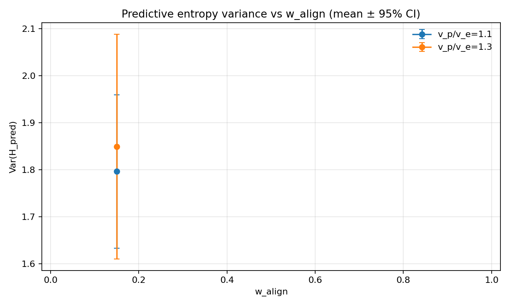
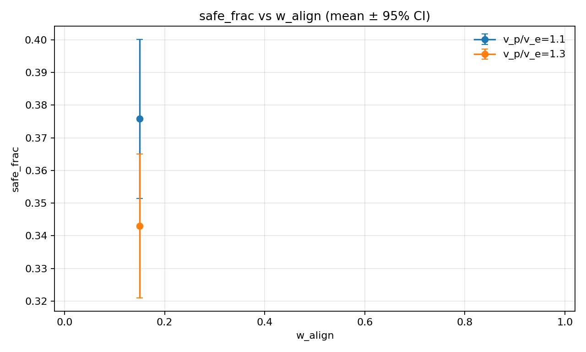
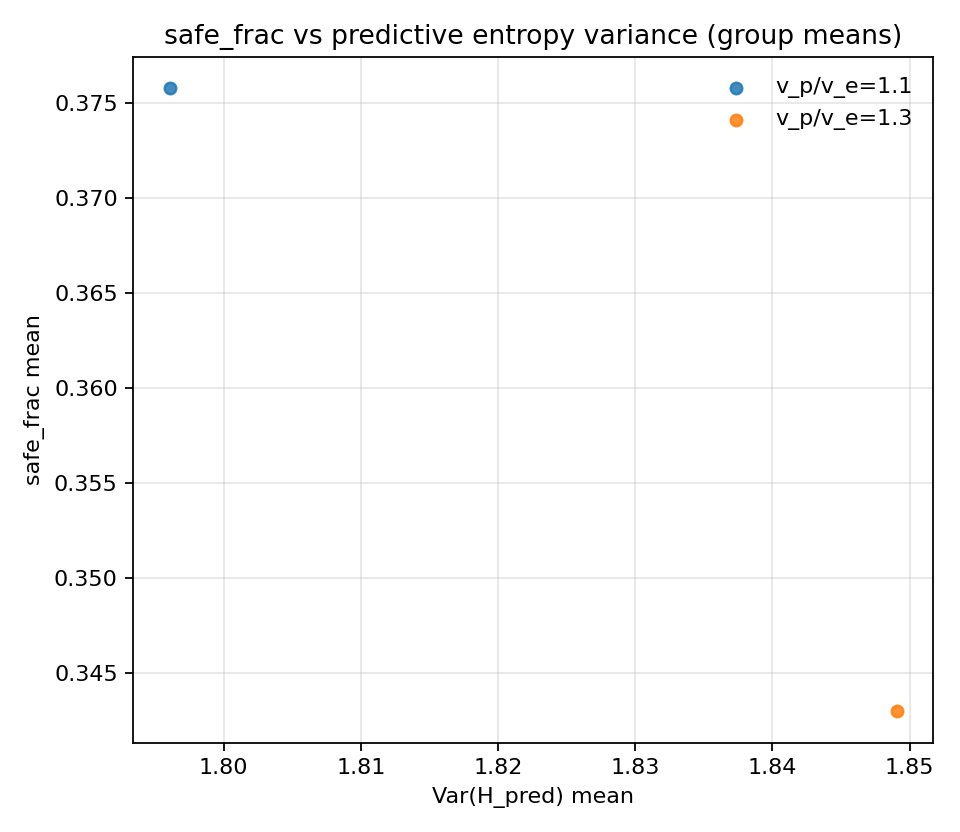
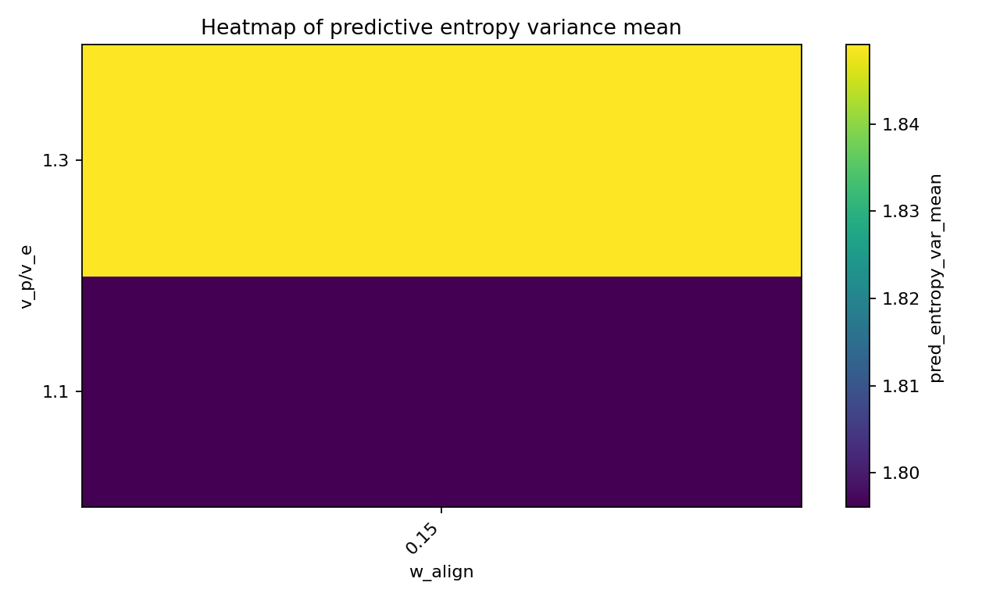

# SOC deep best_gain predictive entropy

## Setup

- Sweep directory: `runs/soc_scan_20260207_deep/sweep_20260207_203034_grid`

- Bins: `72`

- EMA span: `10`

- N-gram order: `2`

- Valid runs used: `40`

## Per-speed correlations (group means)

| v_p/v_e | corr(safe, Var(H_pred)) |

|---:|---:|

| 1.1 | nan |

| 1.3 | nan |

- pooled corr(safe, Var(H_pred)) across all grouped points: `-1.000`

## Plots

