# SOC smoke mvp (sr=1.1, steps=400, seeds=20)

## Experiment setup

- Pursuer count is fixed by the base config.

- Aggregation: mean ± 95% CI across seeds for each (v_p/v_e, w_align).

## Artifacts

- Sweep directory: `runs/sweep_20260207_103347_grid`

- Base config: `runs/sweep_20260207_103347_grid/base_config.json`

- Group summary (aggregated): `doc/results_20260207_soc_smoke_mvp/group_summary.csv`

- Figures: `doc/results_20260207_soc_smoke_mvp/figs`

## Aggregated summary

| v_p/v_e | best w (safe) | safe | best w (χ) | χ | best w (χ_local) | χ_local | best w (τ) | τ | best w (ξ) | ξ |

|---:|---:|---:|---:|---:|---:|---:|---:|---:|---:|---:|

| 1.1 | 0.4 | 0.2395 | 0.6 | 2.8529 | 0.4 | 1.1234 | 0.8 | 195.4819 | 0.6 | 21.2500 |

## Criticality–performance relationships (group means)

| v_p/v_e | corr(safe, χ) | |w_safe-w_χ| | corr(safe, χ_local) | |w_safe-w_χ_local| | corr(safe, τ) | |w_safe-w_τ| | corr(safe, ξ) | |w_safe-w_ξ| |

|---:|---:|---:|---:|---:|---:|---:|---:|---:|

| 1.1 | -0.208 | 0.200 | 0.767 | 0.000 | -0.702 | 0.400 | -0.371 | 0.200 |

## Plots

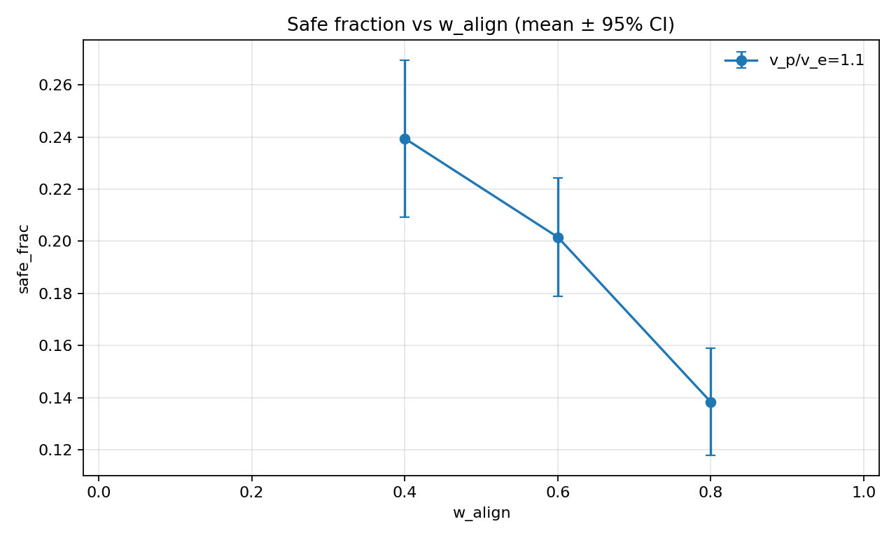

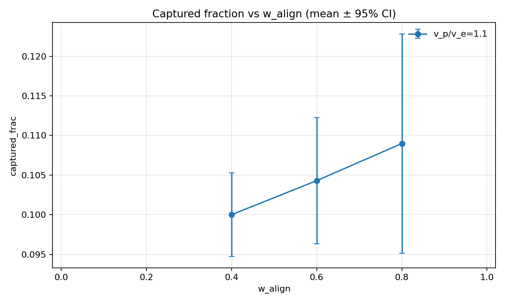

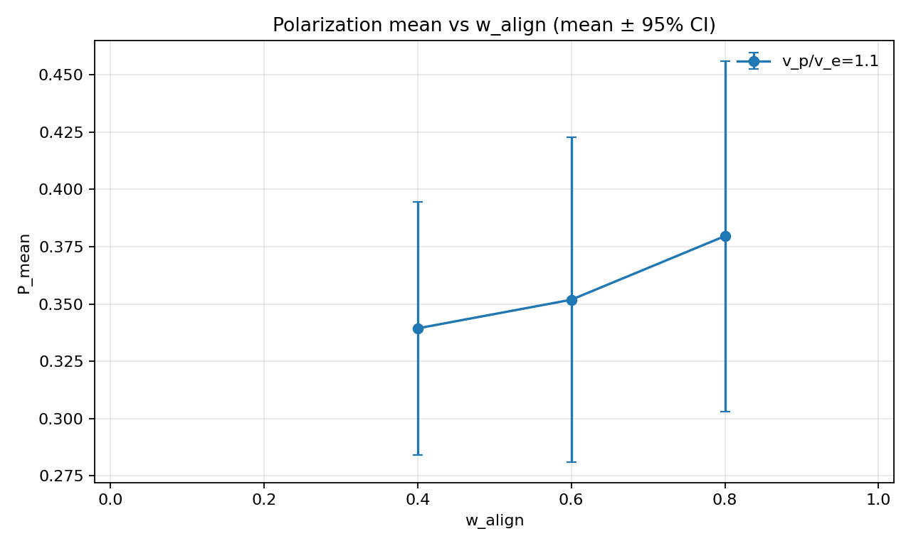

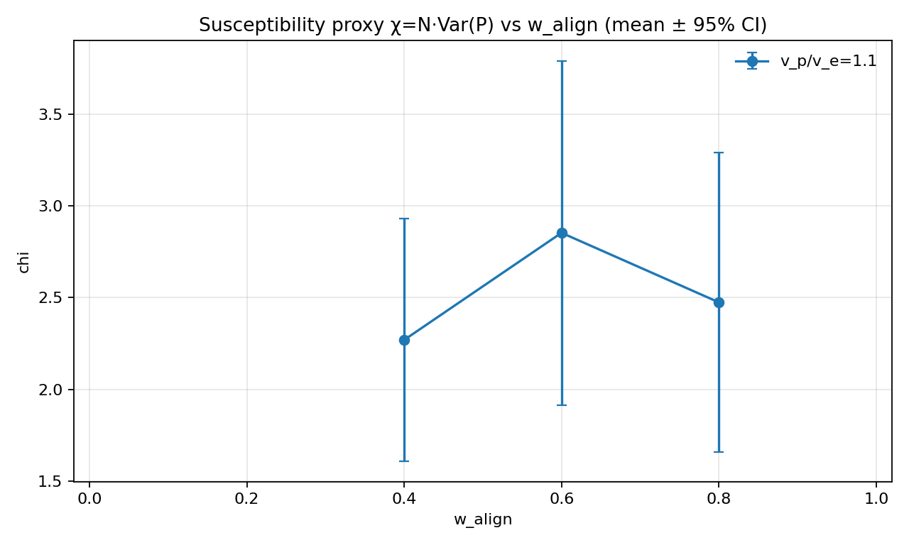

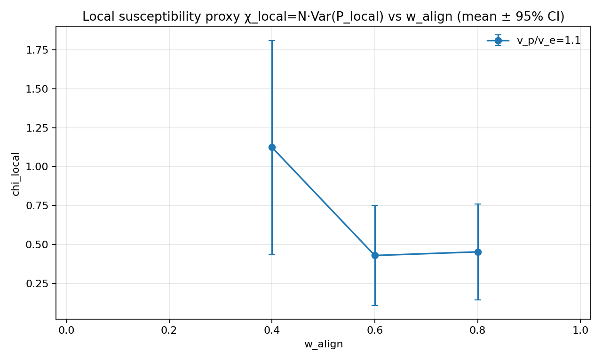

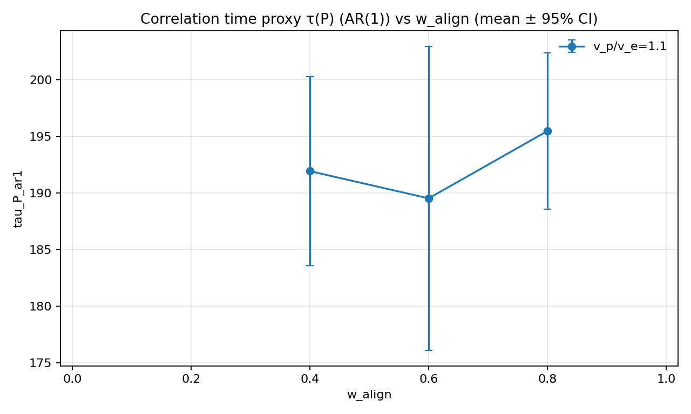

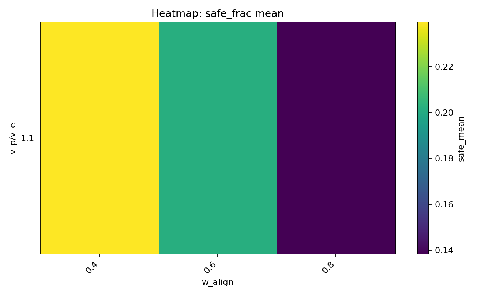

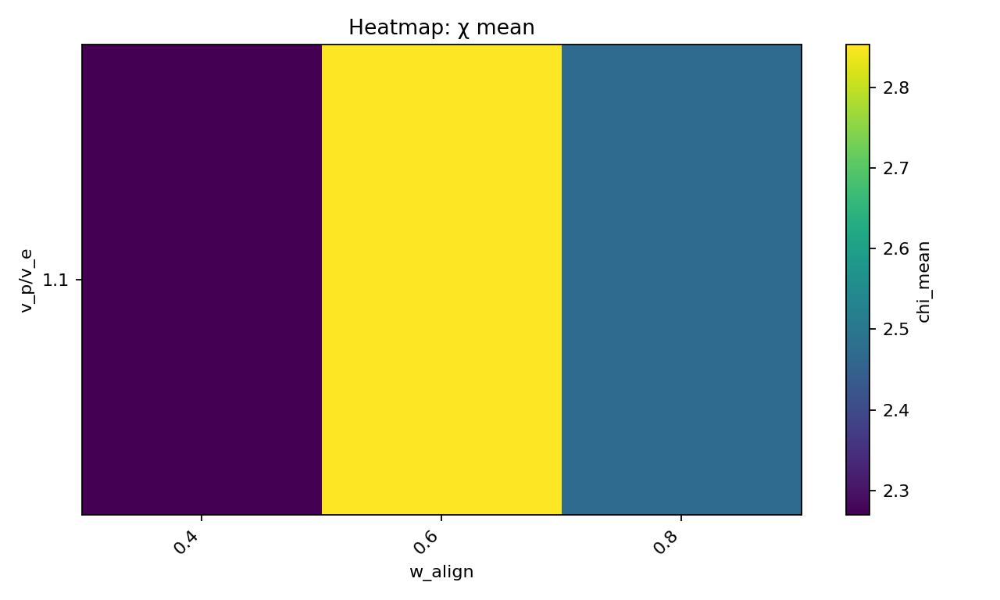

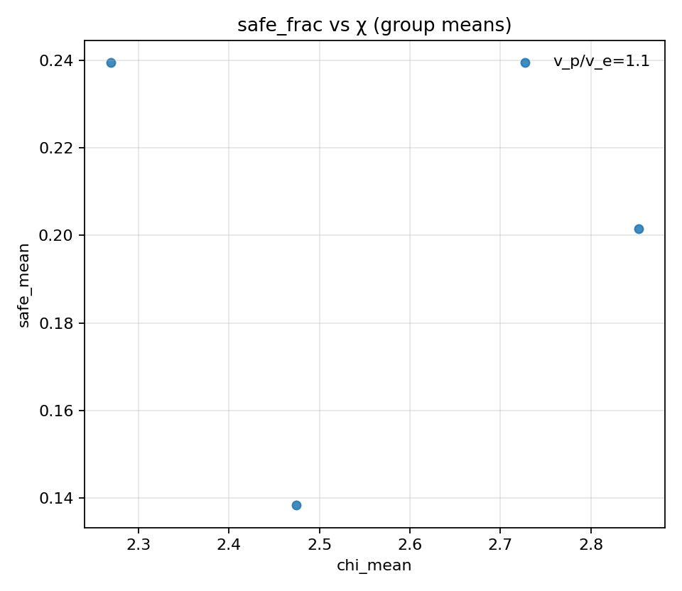

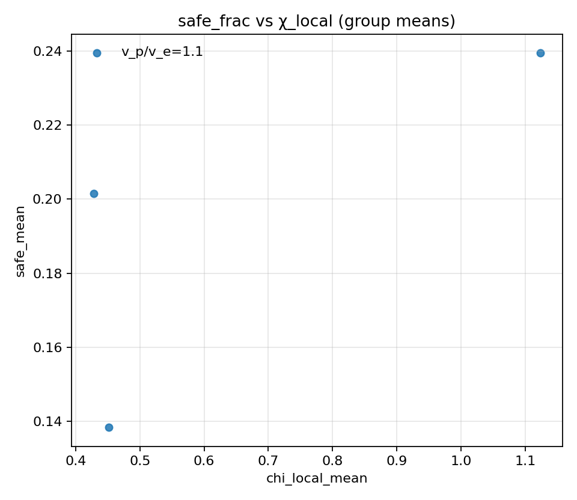

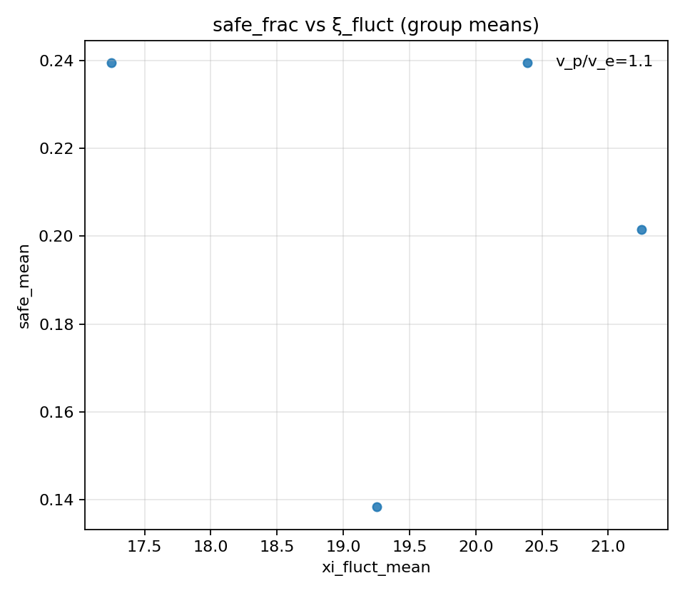

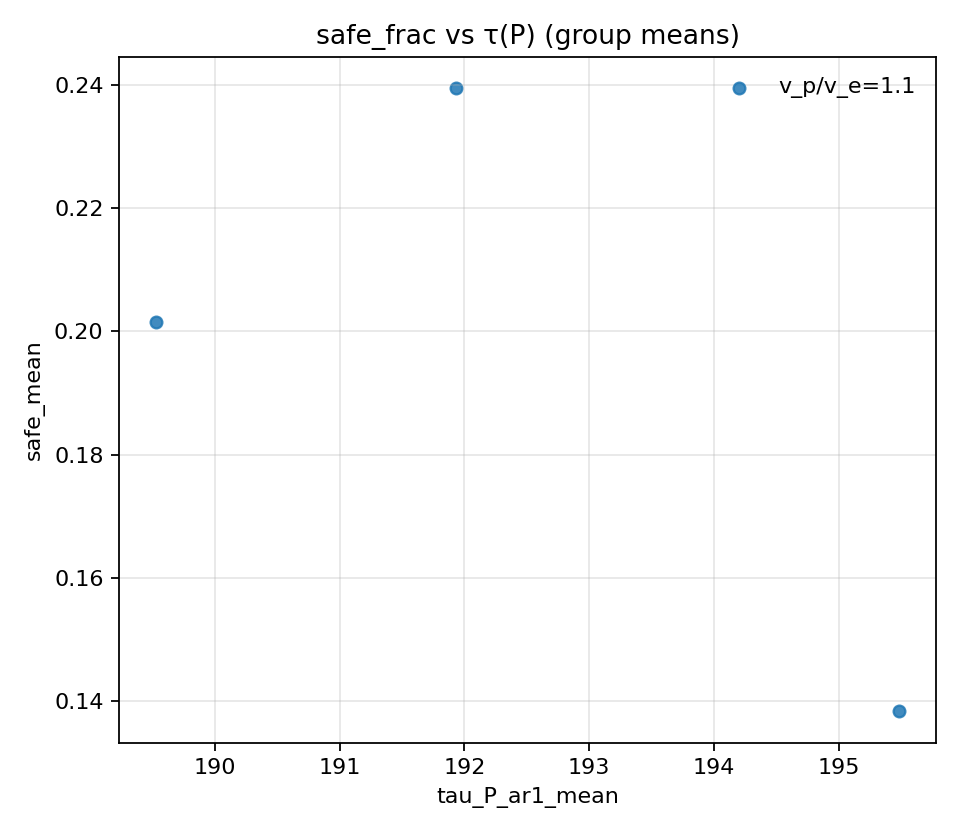

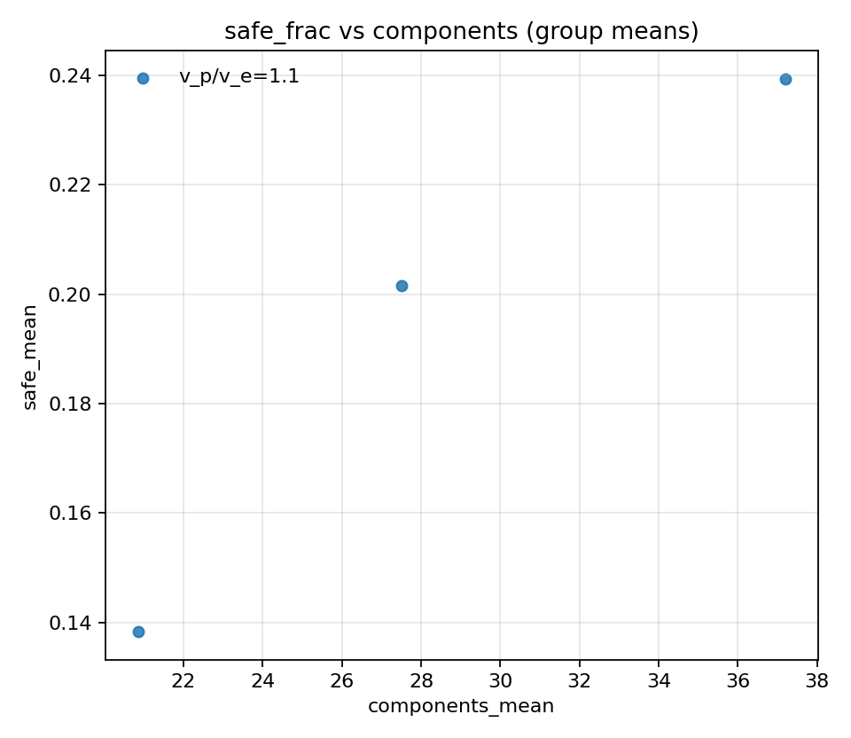
