# Share-mode low-w scan (noise=0, p0_nearest, seeds=120)

## Experiment setup

- Pursuer count is fixed by the base config.

- Aggregation: mean ± 95% CI across seeds for each (v_p/v_e, w_align).

## Artifacts

- Sweep directory: `runs/sweep_20260207_151352_grid`

- Base config: `runs/sweep_20260207_151352_grid/base_config.json`

- Group summary (aggregated): `doc/results_20260207_walign_share_noise0_p0nearest_sr09111314_120seeds_fine03/group_summary.csv`

- Figures: `doc/results_20260207_walign_share_noise0_p0nearest_sr09111314_120seeds_fine03/figs`

## Aggregated summary

| v_p/v_e | best w (safe) | safe | best w (χ) | χ | best w (χ_local) | χ_local | best w (τ) | τ | best w (ξ) | ξ |

|---:|---:|---:|---:|---:|---:|---:|---:|---:|---:|---:|

| 0.9 | 0.14 | 0.3846 | 0.28 | 4.3898 | 0 | 5.1914 | 0.26 | 198.7604 | 0.28 | 21.0417 |

| 1.1 | 0.18 | 0.3501 | 0.22 | 4.2176 | 0 | 4.5438 | 0.3 | 198.8550 | 0.3 | 20.8333 |

| 1.3 | 0.26 | 0.2992 | 0.3 | 4.6353 | 0 | 3.0862 | 0.16 | 198.7634 | 0.3 | 19.0833 |

| 1.4 | 0.14 | 0.2738 | 0.3 | 4.9002 | 0.02 | 2.6839 | 0.3 | 197.5237 | 0.28 | 19.9167 |

## Criticality–performance relationships (group means)

| v_p/v_e | corr(safe, χ) | |w_safe-w_χ| | corr(safe, χ_local) | |w_safe-w_χ_local| | corr(safe, τ) | |w_safe-w_τ| | corr(safe, ξ) | |w_safe-w_ξ| |

|---:|---:|---:|---:|---:|---:|---:|---:|---:|

| 0.9 | 0.369 | 0.140 | -0.462 | 0.140 | 0.347 | 0.120 | 0.414 | 0.140 |

| 1.1 | 0.855 | 0.040 | -0.858 | 0.180 | 0.835 | 0.120 | 0.831 | 0.120 |

| 1.3 | 0.408 | 0.040 | -0.475 | 0.260 | 0.533 | 0.100 | 0.470 | 0.040 |

| 1.4 | -0.224 | 0.160 | 0.228 | 0.120 | 0.027 | 0.160 | -0.128 | 0.140 |

## Plots

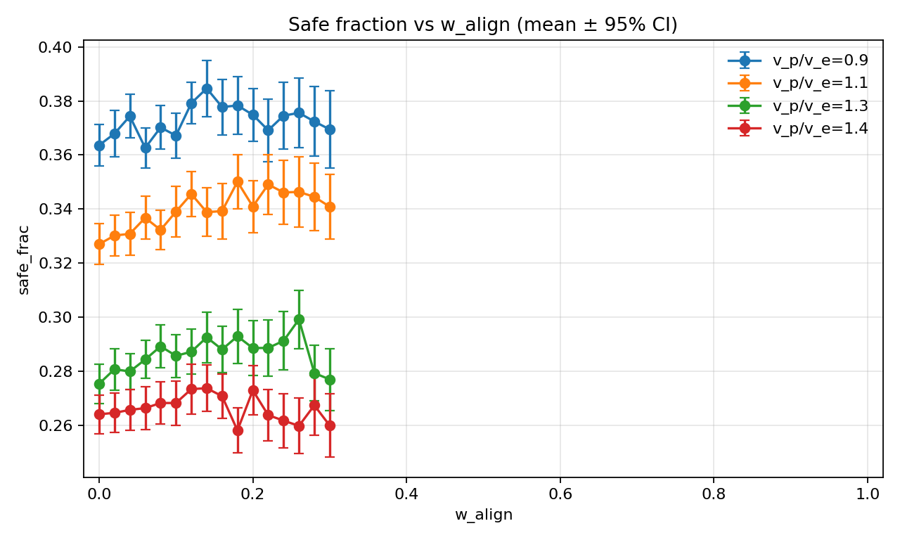

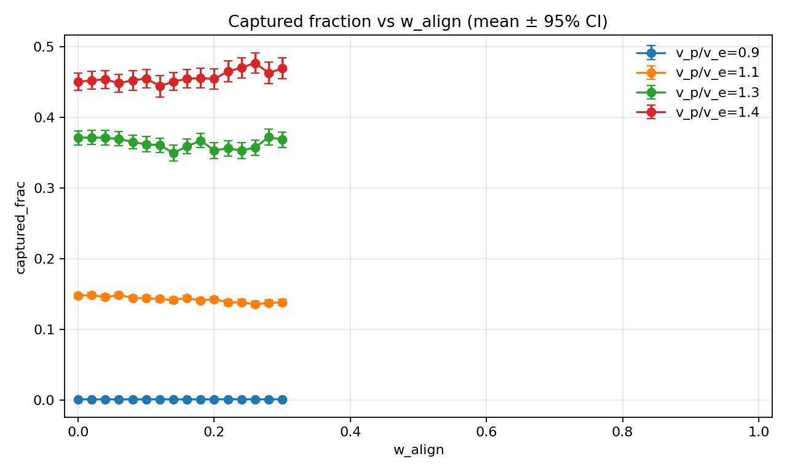

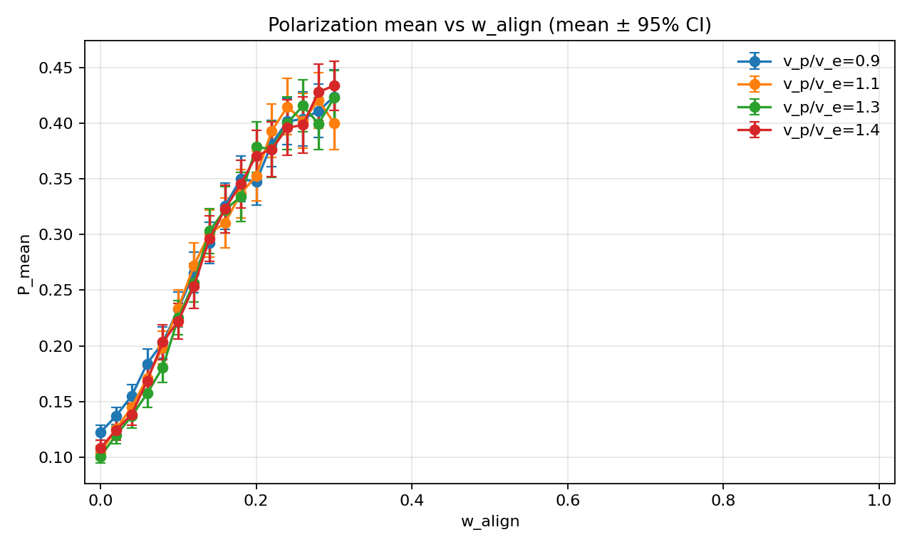

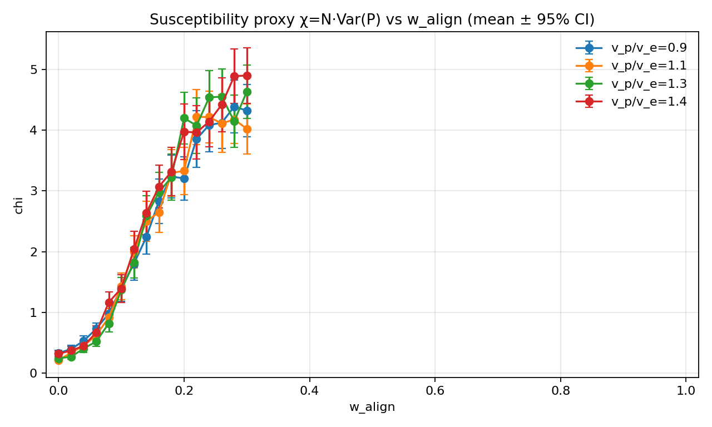

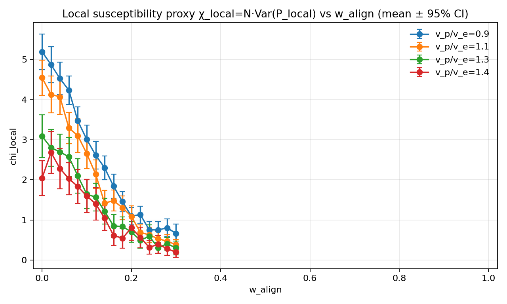

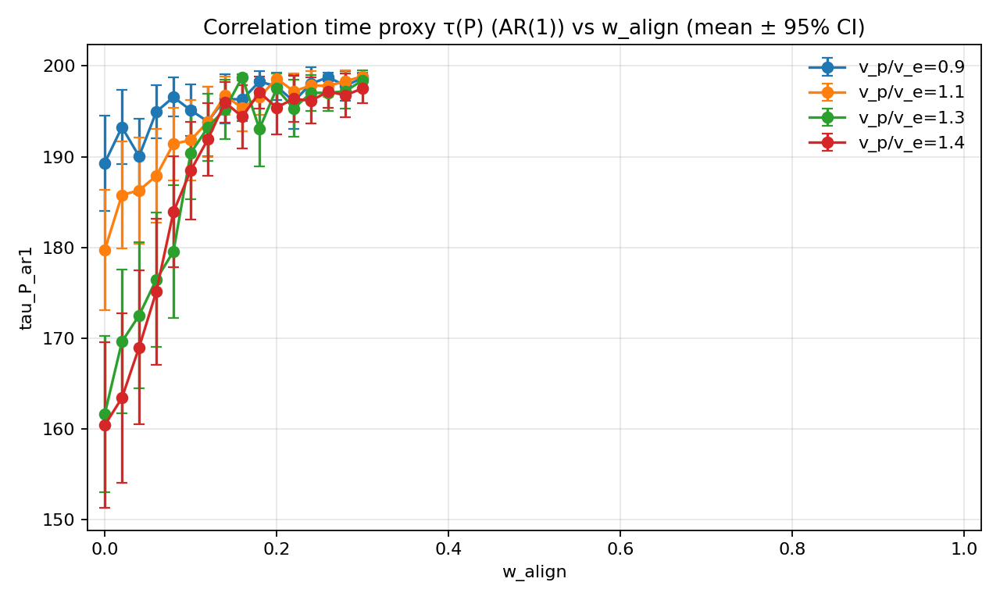

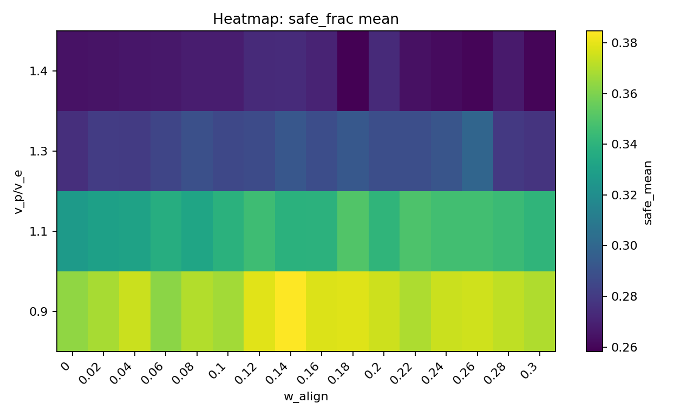

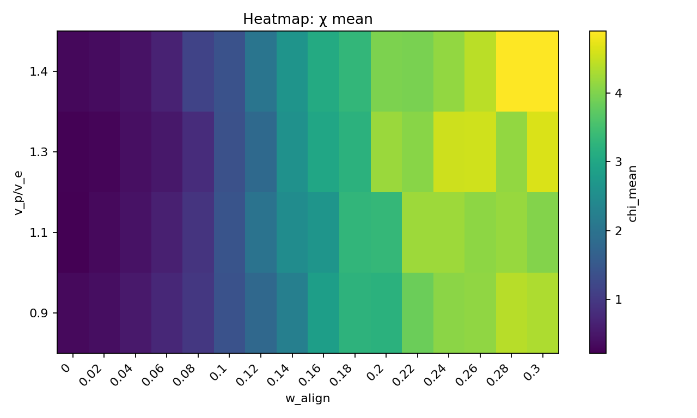

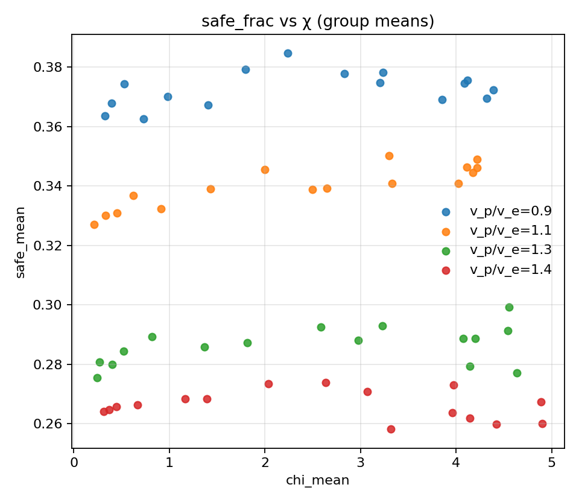

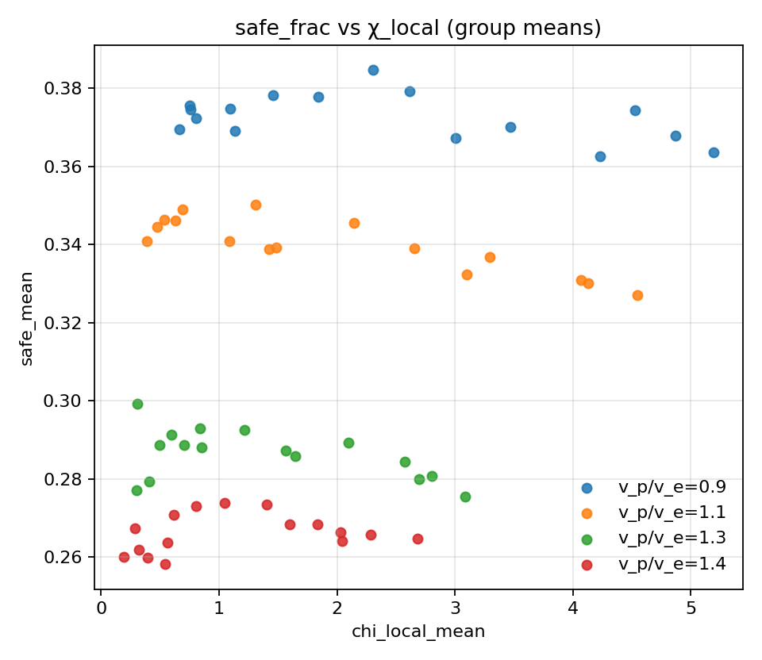

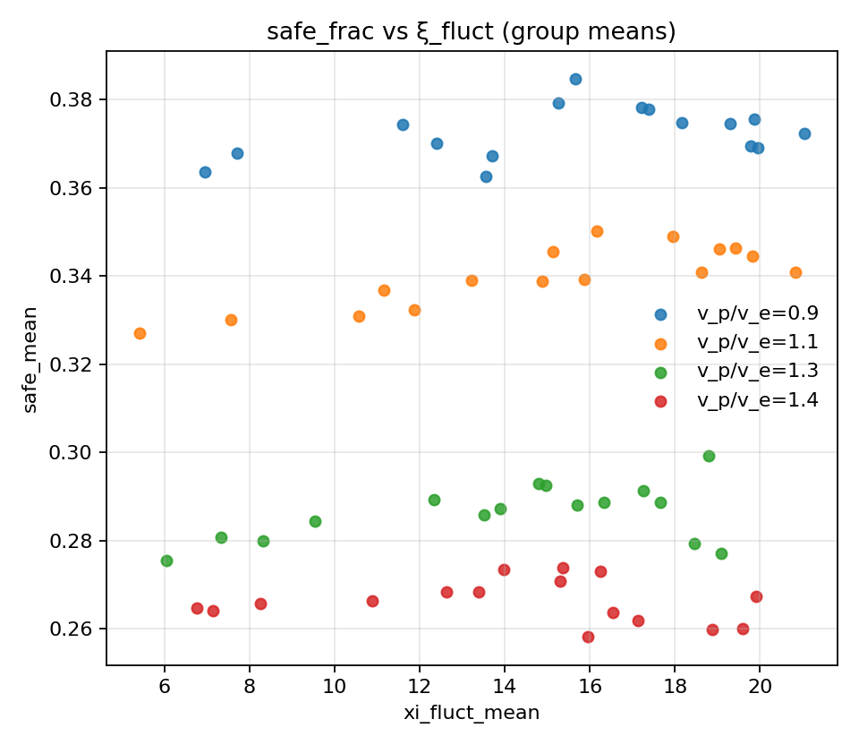

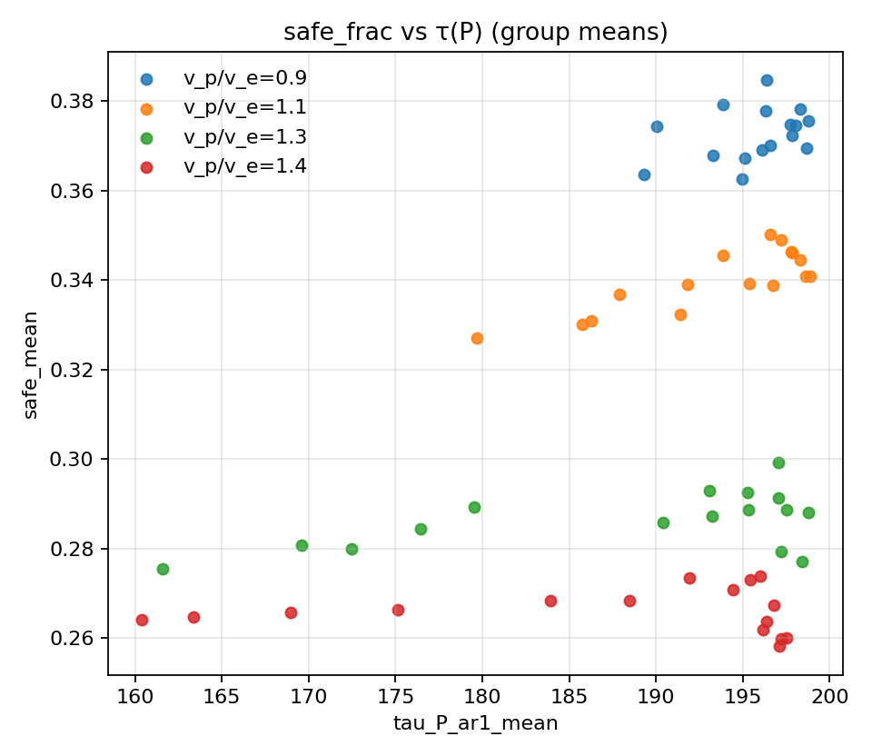

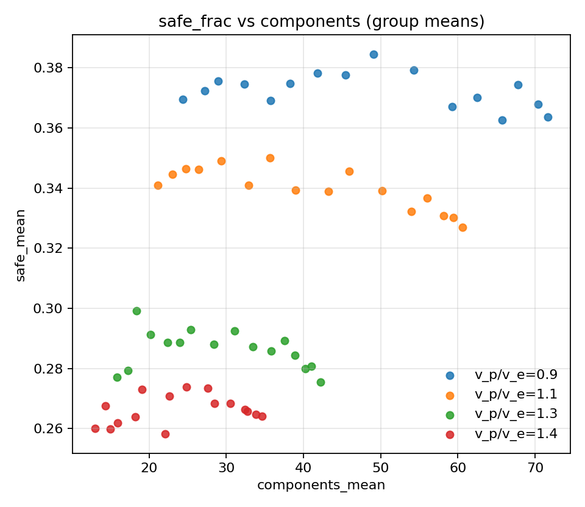
