# Share-mode full scan (noise=0, p0_nearest, seeds=120)

## Experiment setup

- Pursuer count is fixed by the base config.

- Aggregation: mean ± 95% CI across seeds for each (v_p/v_e, w_align).

## Artifacts

- Sweep directory: `runs/sweep_20260207_161229_grid`

- Base config: `runs/sweep_20260207_161229_grid/base_config.json`

- Group summary (aggregated): `doc/results_20260207_walign_share_noise0_p0nearest_sr09111314_120seeds_full/group_summary.csv`

- Figures: `doc/results_20260207_walign_share_noise0_p0nearest_sr09111314_120seeds_full/figs`

## Aggregated summary

| v_p/v_e | best w (safe) | safe | best w (χ) | χ | best w (χ_local) | χ_local | best w (τ) | τ | best w (ξ) | ξ |

|---:|---:|---:|---:|---:|---:|---:|---:|---:|---:|---:|

| 0.9 | 0.35 | 0.3827 | 0.85 | 5.4212 | 0 | 5.1914 | 0.25 | 198.9488 | 1 | 27.2917 |

| 1.1 | 0.25 | 0.3469 | 0.95 | 4.9718 | 1 | 8.6482 | 0.8 | 199.0000 | 1 | 28.8333 |

| 1.3 | 0.15 | 0.2965 | 1 | 7.3085 | 1 | 9.6486 | 0.3 | 198.4278 | 0.85 | 35.3333 |

| 1.4 | 0.2 | 0.2730 | 1 | 9.3661 | 1 | 8.0054 | 1 | 197.7446 | 0.75 | 34.3542 |

## Criticality–performance relationships (group means)

| v_p/v_e | corr(safe, χ) | |w_safe-w_χ| | corr(safe, χ_local) | |w_safe-w_χ_local| | corr(safe, τ) | |w_safe-w_τ| | corr(safe, ξ) | |w_safe-w_ξ| |

|---:|---:|---:|---:|---:|---:|---:|---:|---:|

| 0.9 | -0.607 | 0.500 | 0.351 | 0.350 | -0.136 | 0.100 | -0.658 | 0.650 |

| 1.1 | -0.585 | 0.700 | 0.020 | 0.750 | -0.276 | 0.550 | -0.681 | 0.750 |

| 1.3 | -0.743 | 0.850 | -0.135 | 0.850 | -0.233 | 0.150 | -0.852 | 0.700 |

| 1.4 | -0.801 | 0.800 | -0.113 | 0.800 | -0.293 | 0.800 | -0.782 | 0.550 |

## Plots

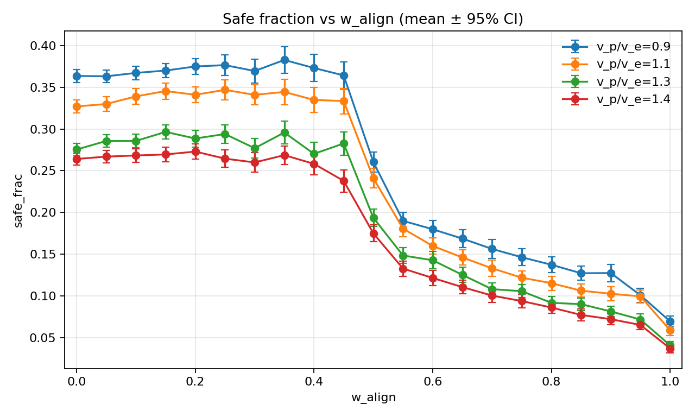

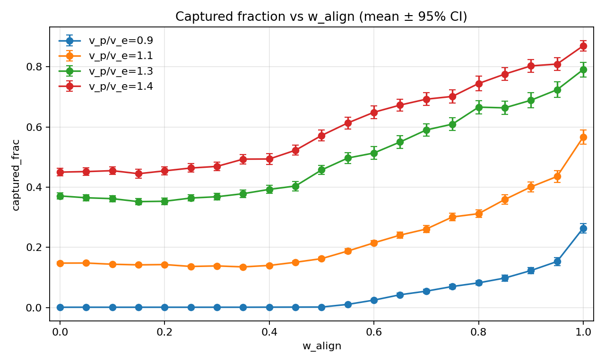

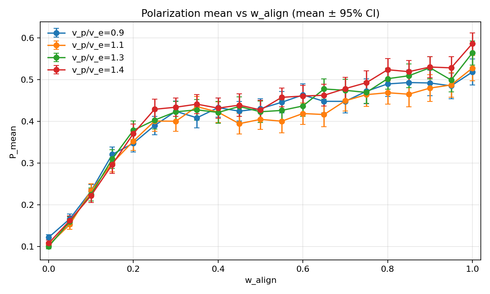

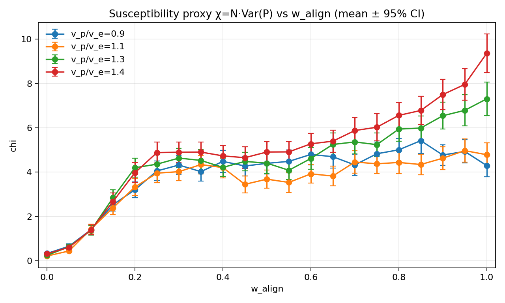

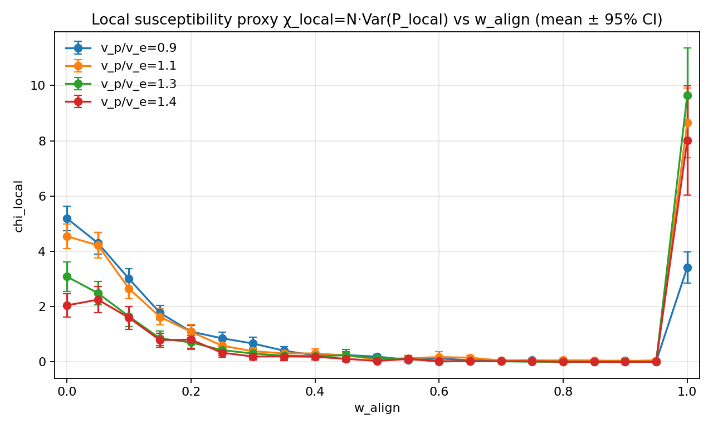

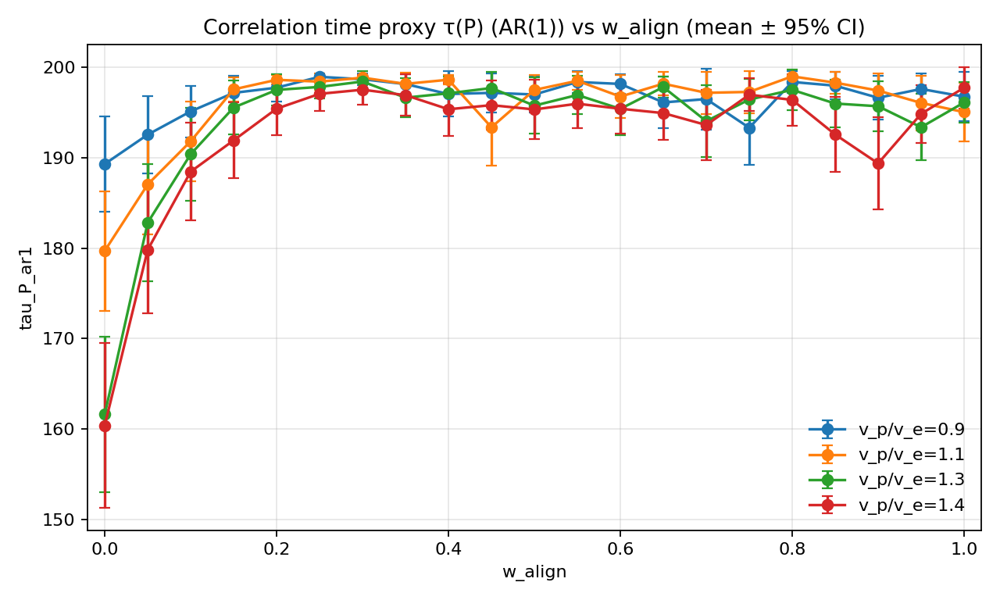

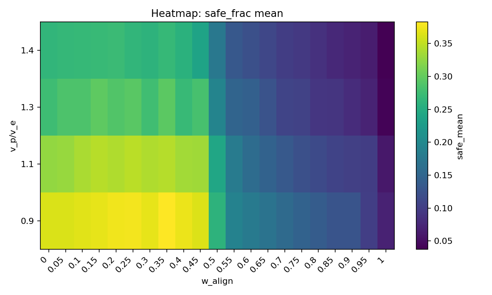

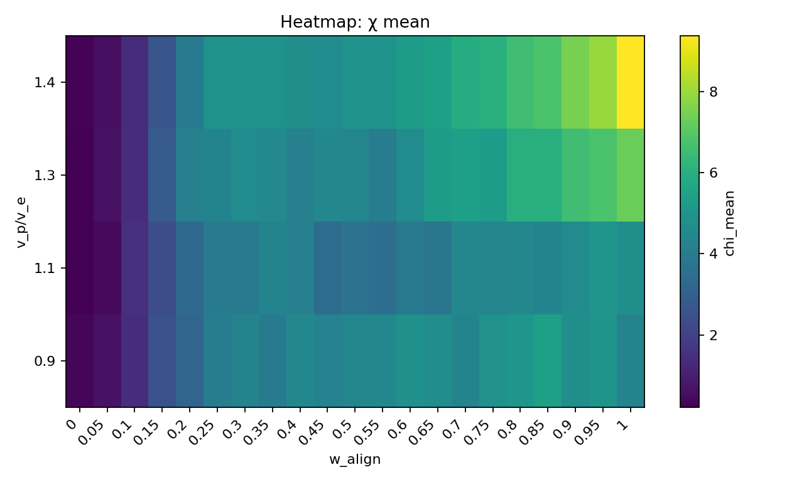

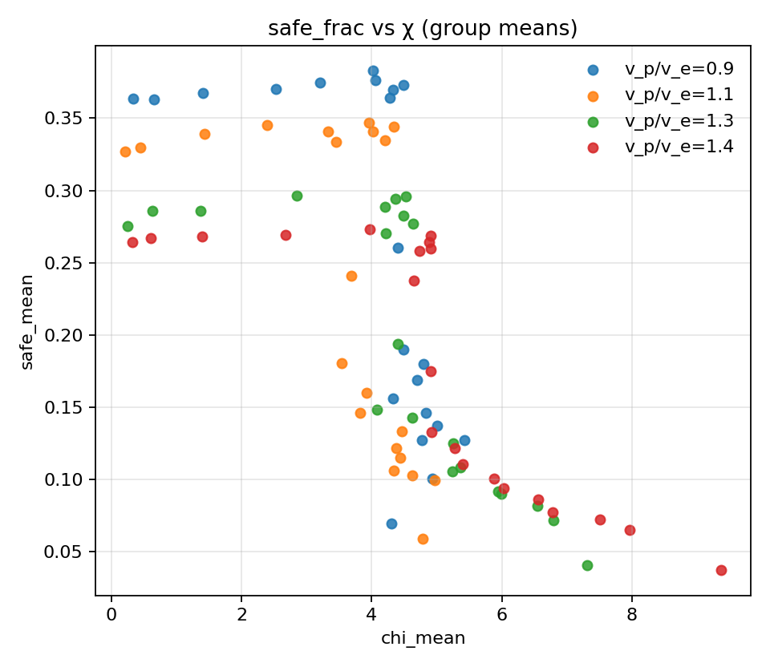

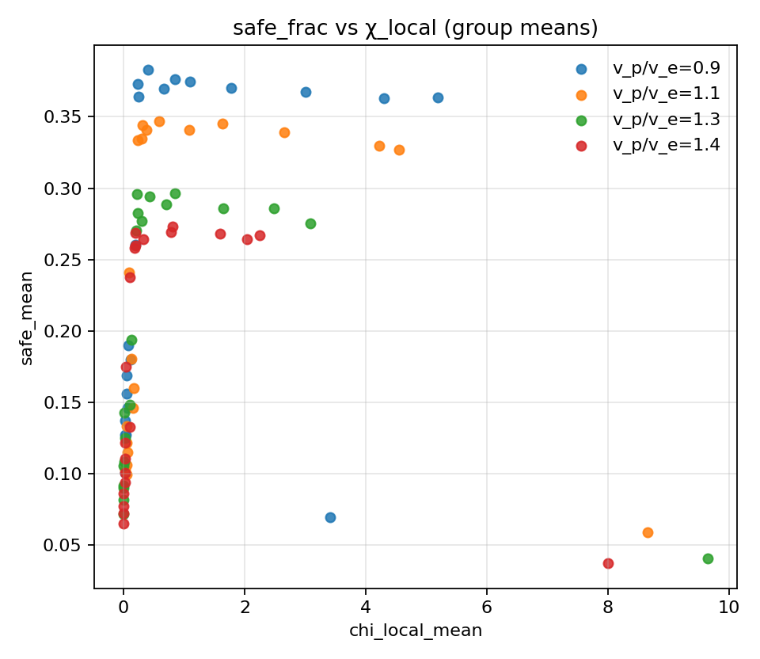

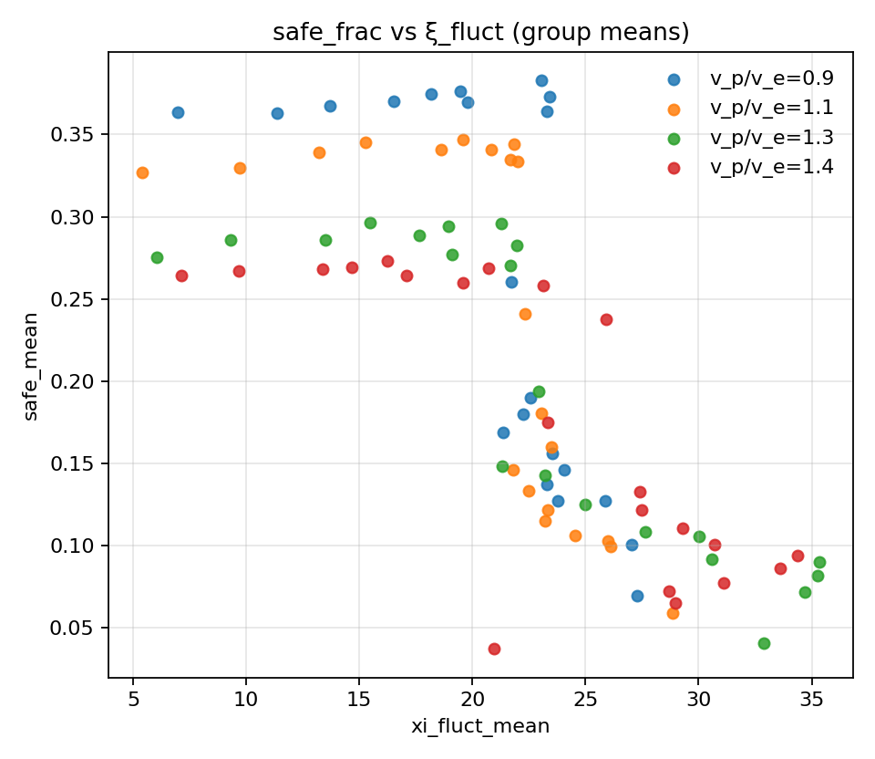

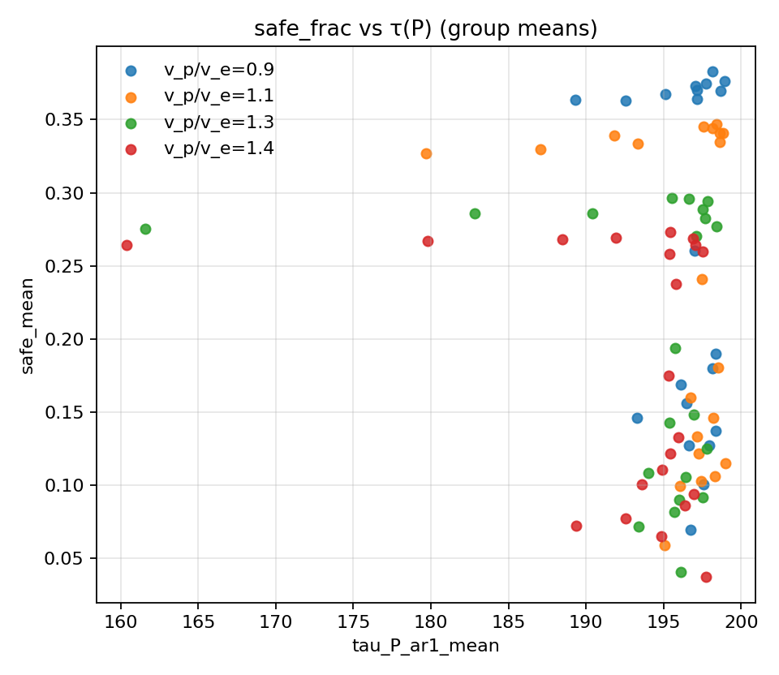

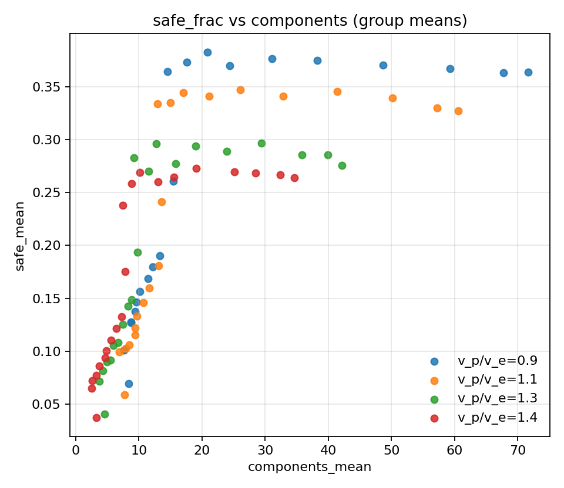
