# w_align share(noise=0) under p0_nearest (sr=1.1,1.3; 40 seeds, save-runs)

## Experiment setup

- Pursuer count is fixed by the base config.

- Aggregation: mean ± 95% CI across seeds for each (v_p/v_e, w_align).

## Artifacts

- Sweep directory: `runs/sweep_20260207_172412_grid`

- Base config: `runs/sweep_20260207_172412_grid/base_config.json`

- Group summary (aggregated): `doc/results_20260207_walign_share_noise0_p0nearest_sr1113_40seeds_save_runs/group_summary.csv`

- Figures: `doc/results_20260207_walign_share_noise0_p0nearest_sr1113_40seeds_save_runs/figs`

## Aggregated summary

| v_p/v_e | best w (safe) | safe | best w (χ) | χ | best w (χ_local) | χ_local | best w (τ) | τ | best w (ξ) | ξ |

|---:|---:|---:|---:|---:|---:|---:|---:|---:|---:|---:|

| 1.1 | 0.4 | 0.3412 | 1 | 5.3147 | 1 | 8.1482 | 0.3 | 199.0000 | 1 | 27.0000 |

| 1.3 | 0 | 0.2854 | 1 | 7.7746 | 1 | 9.9802 | 0.3 | 199.0000 | 0.8 | 32.2500 |

## Criticality–performance relationships (group means)

| v_p/v_e | corr(safe, χ) | |w_safe-w_χ| | corr(safe, χ_local) | |w_safe-w_χ_local| | corr(safe, τ) | |w_safe-w_τ| | corr(safe, ξ) | |w_safe-w_ξ| |

|---:|---:|---:|---:|---:|---:|---:|---:|---:|

| 1.1 | -0.555 | 0.600 | -0.199 | 0.600 | -0.203 | 0.100 | -0.640 | 0.600 |

| 1.3 | -0.807 | 1.000 | -0.331 | 1.000 | -0.371 | 0.300 | -0.897 | 0.800 |

## Plots

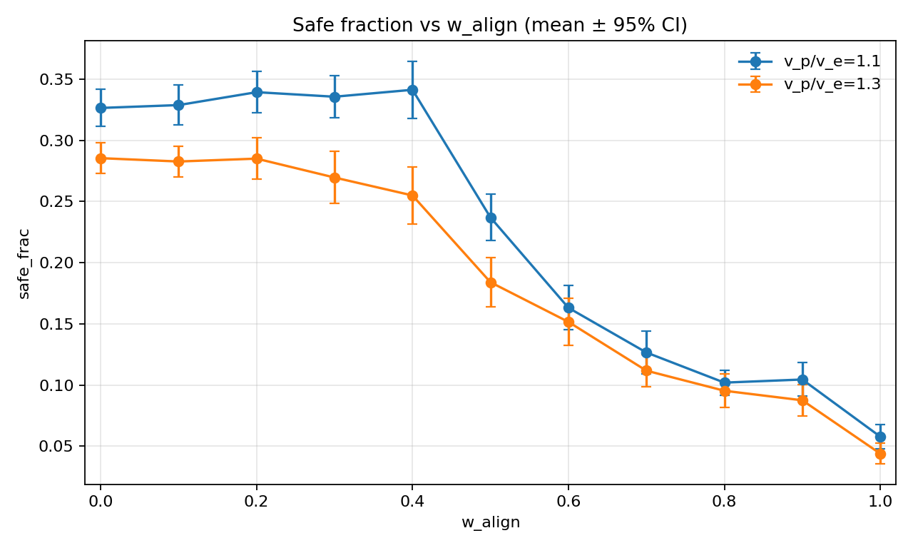

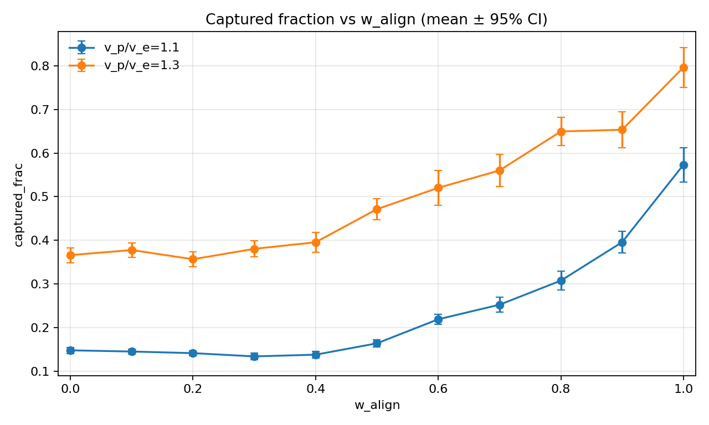

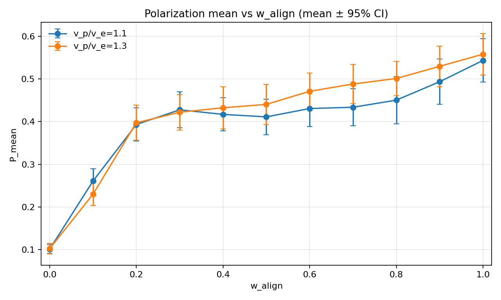

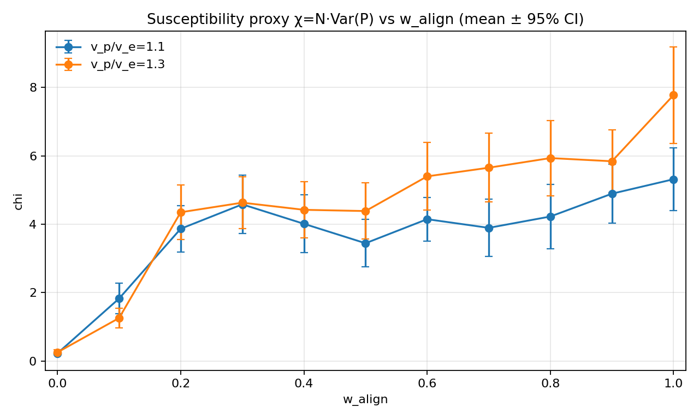

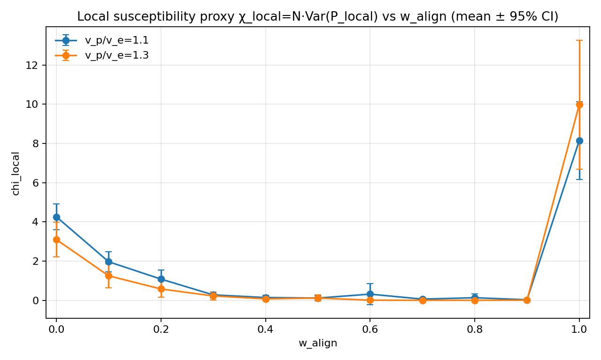

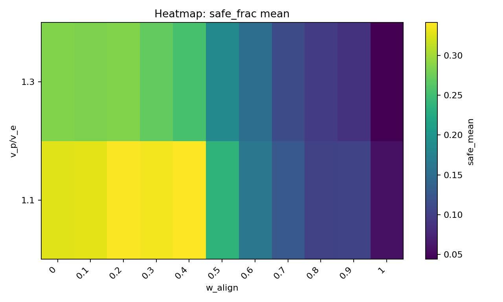

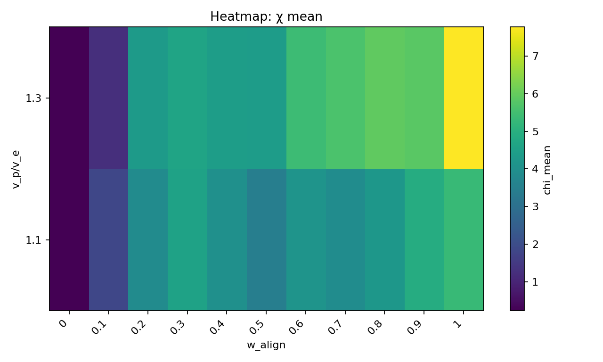

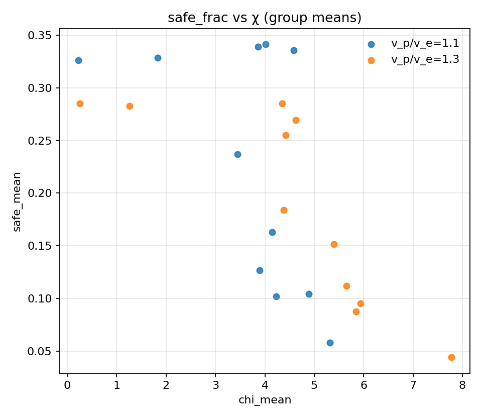

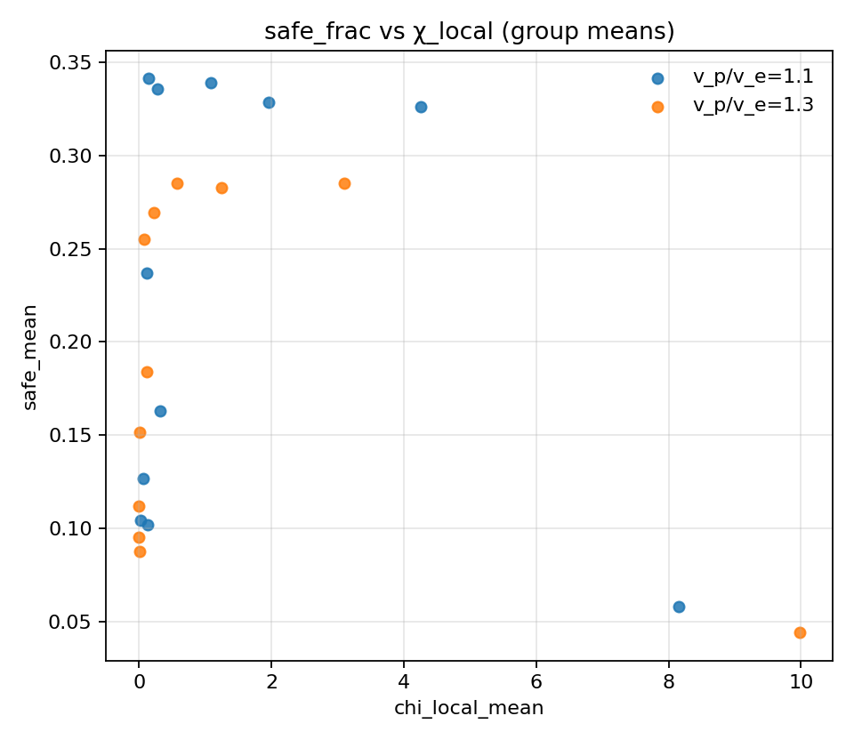

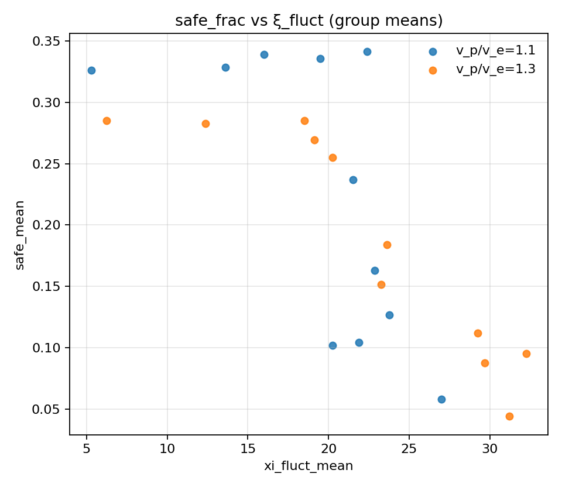

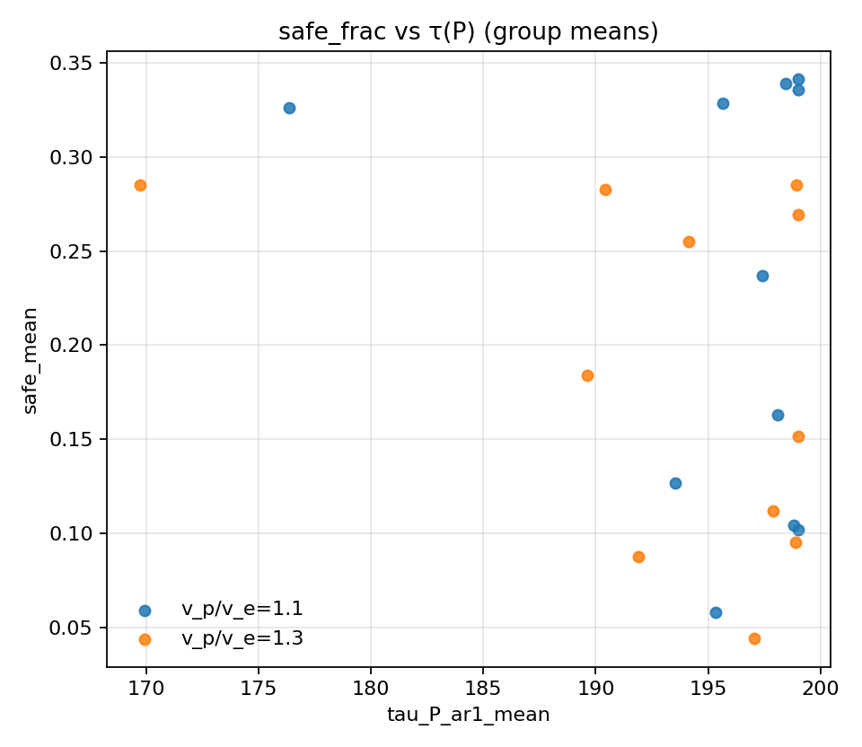

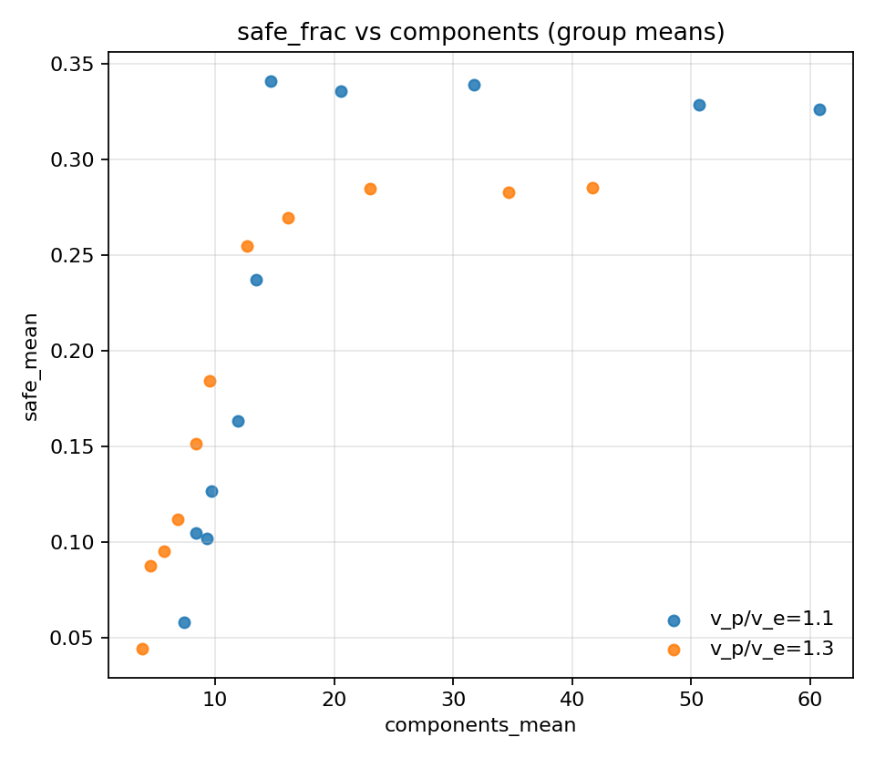
