# w_align share(noise=0) under p0_nearest (sr=1.1,1.3; 60 seeds)

## Experiment setup

- Pursuer count is fixed by the base config.

- Aggregation: mean ± 95% CI across seeds for each (v_p/v_e, w_align).

## Artifacts

- Sweep directory: `runs/sweep_20260207_171924_grid`

- Base config: `runs/sweep_20260207_171924_grid/base_config.json`

- Group summary (aggregated): `doc/results_20260207_walign_share_noise0_p0nearest_sr1113_60seeds_save_runs/group_summary.csv`

- Figures: `doc/results_20260207_walign_share_noise0_p0nearest_sr1113_60seeds_save_runs/figs`

## Aggregated summary

| v_p/v_e | best w (safe) | safe | best w (χ) | χ | best w (χ_local) | χ_local | best w (τ) | τ | best w (ξ) | ξ |

|---:|---:|---:|---:|---:|---:|---:|---:|---:|---:|---:|

| 1.1 | 0.2 | 0.3411 | 1 | 5.1286 | 1 | 9.0811 | 0.8 | 199.0000 | 1 | 28.4167 |

| 1.3 | 0.2 | 0.2885 | 1 | 8.0204 | 1 | 9.3423 | 0.8 | 198.9331 | 0.8 | 32.4167 |

## Criticality–performance relationships (group means)

| v_p/v_e | corr(safe, χ) | |w_safe-w_χ| | corr(safe, χ_local) | |w_safe-w_χ_local| | corr(safe, τ) | |w_safe-w_τ| | corr(safe, ξ) | |w_safe-w_ξ| |

|---:|---:|---:|---:|---:|---:|---:|---:|---:|

| 1.1 | -0.620 | 0.800 | -0.206 | 0.800 | -0.180 | 0.600 | -0.668 | 0.800 |

| 1.3 | -0.823 | 0.800 | -0.303 | 0.800 | -0.358 | 0.600 | -0.882 | 0.600 |

## Plots

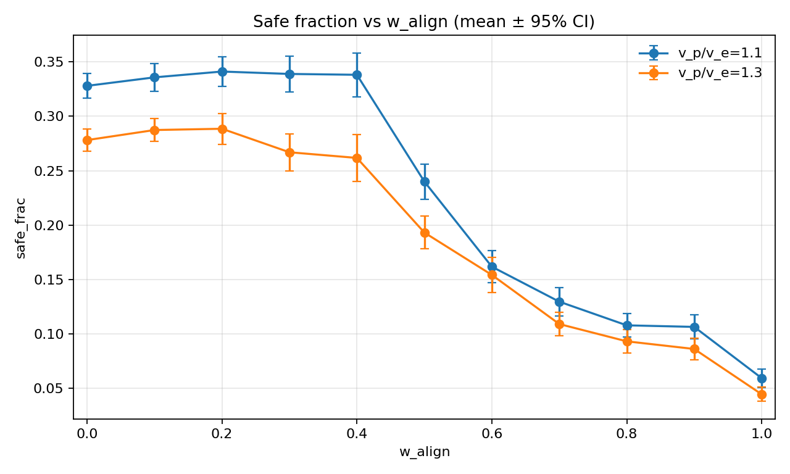

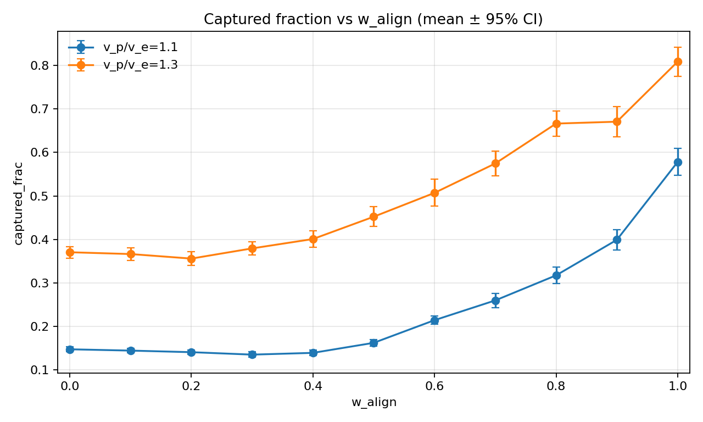

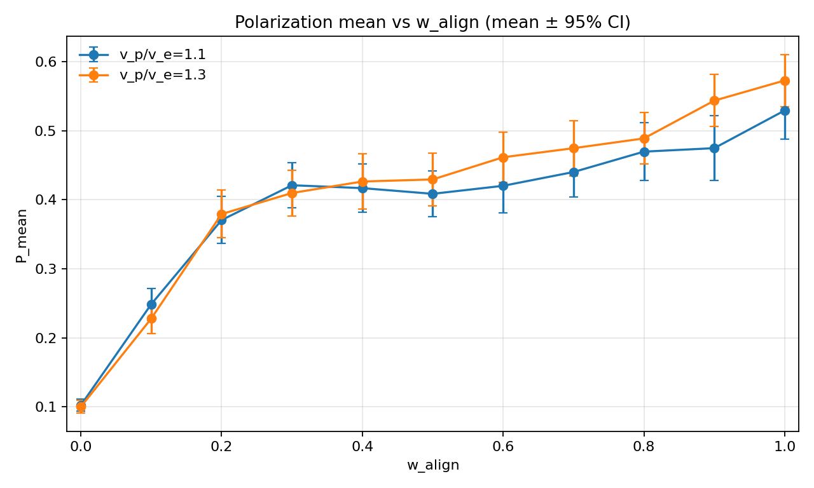

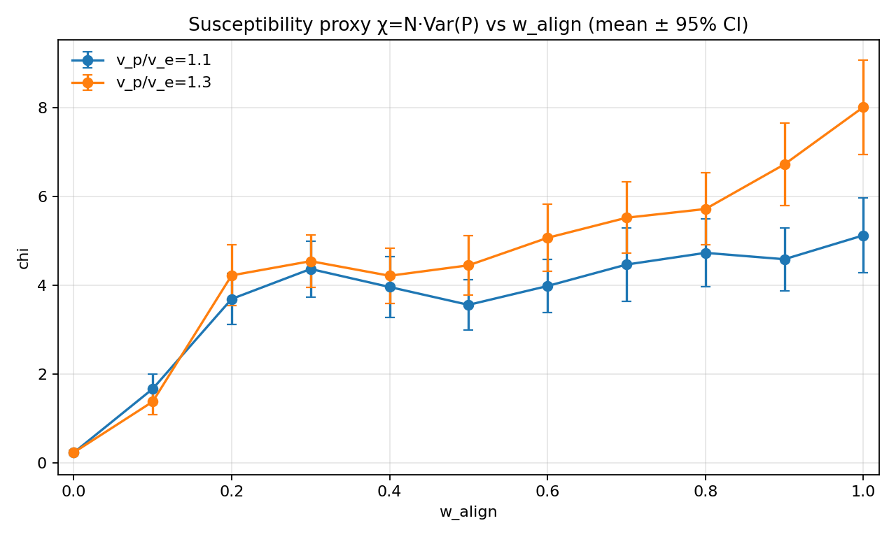

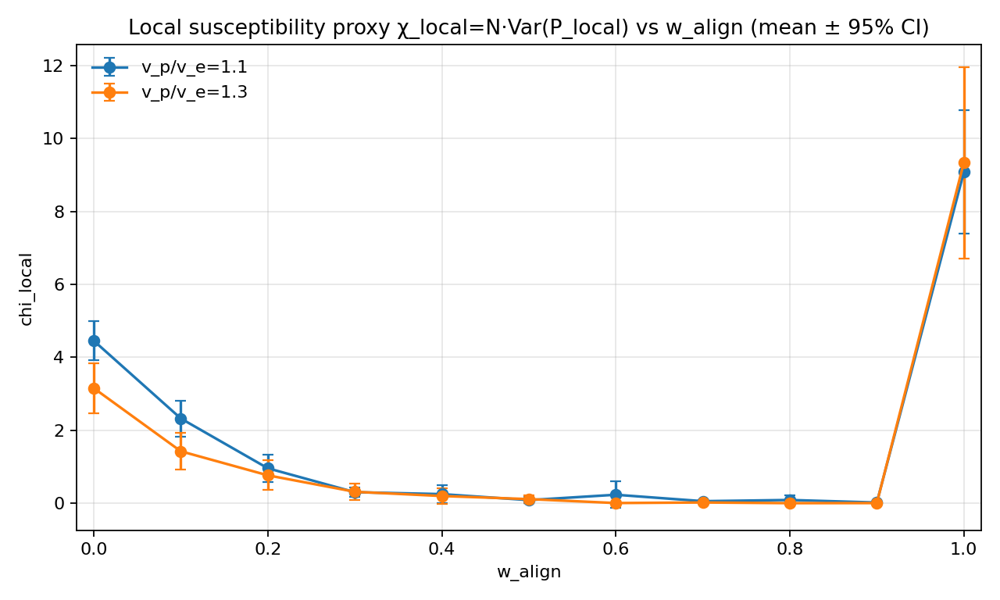

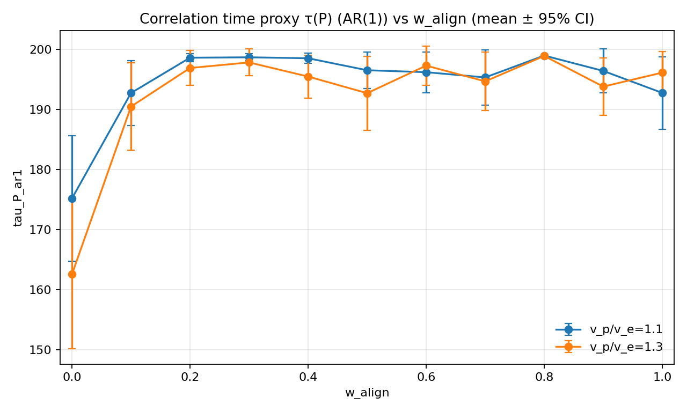

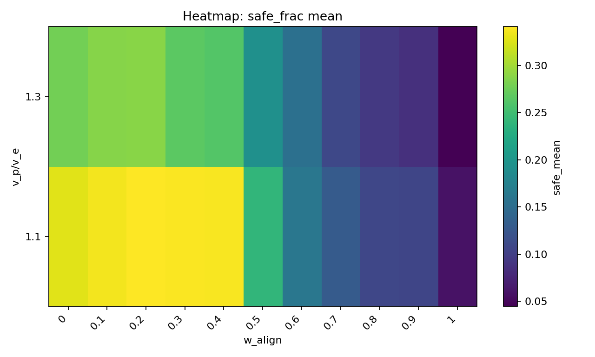

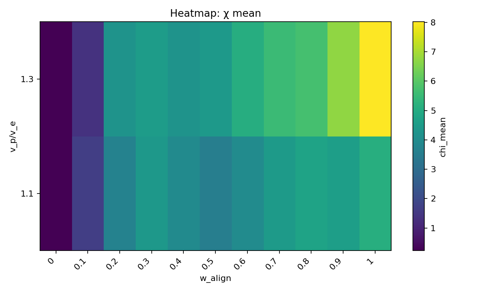

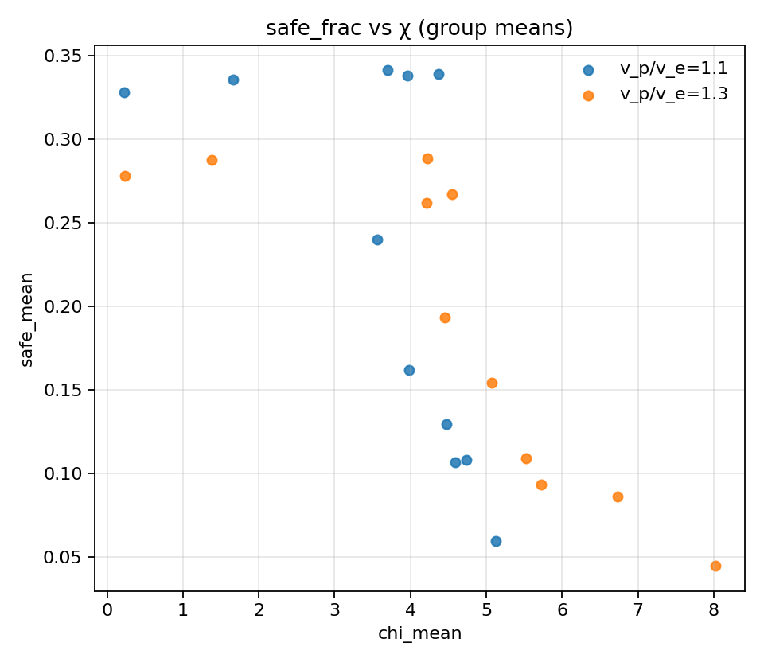

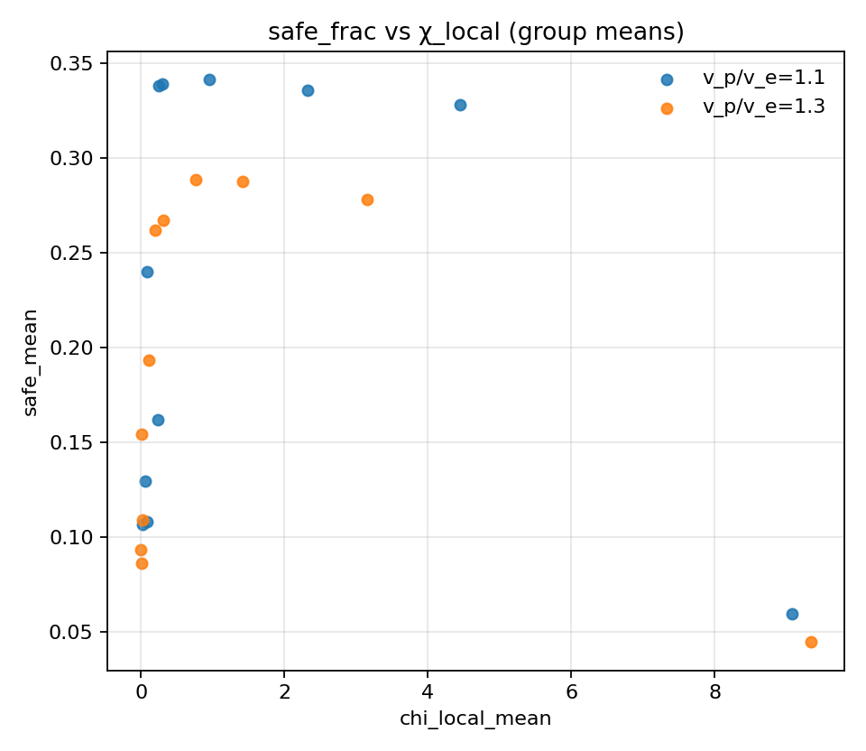

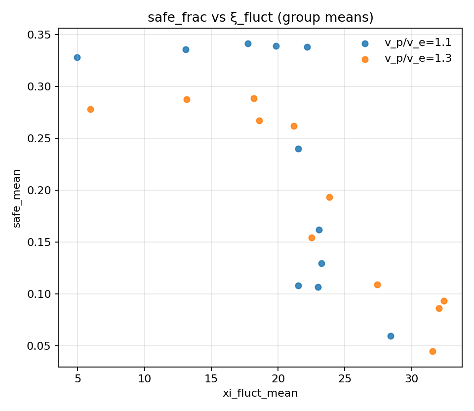

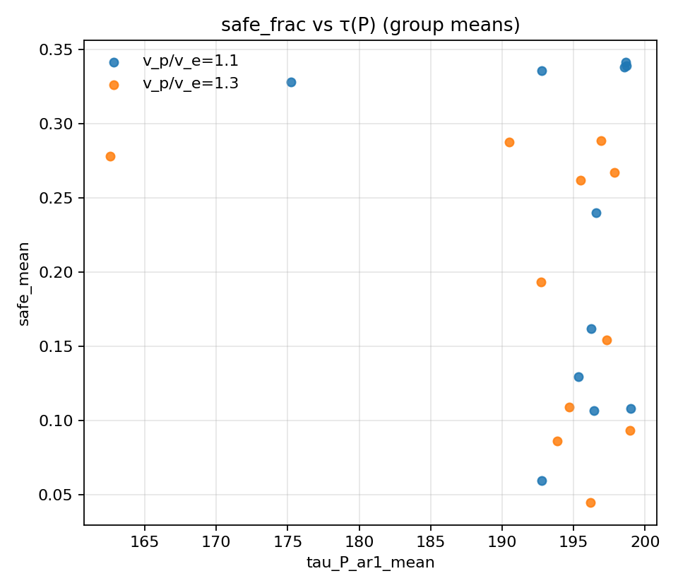

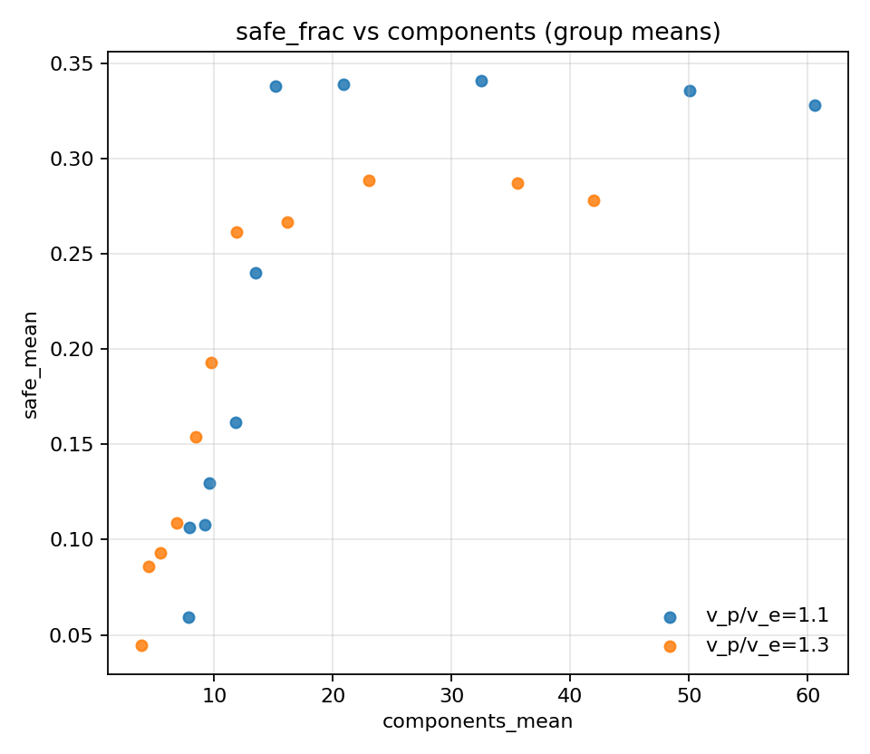
