# Share-mode low-w scan (noise=0, p1_intercept, seeds=120)

## Experiment setup

- Pursuer count is fixed by the base config.

- Aggregation: mean ± 95% CI across seeds for each (v_p/v_e, w_align).

## Artifacts

- Sweep directory: `runs/sweep_20260207_150007_grid`

- Base config: `runs/sweep_20260207_150007_grid/base_config.json`

- Group summary (aggregated): `doc/results_20260207_walign_share_noise0_p1intercept_sr09111314_120seeds_fine03/group_summary.csv`

- Figures: `doc/results_20260207_walign_share_noise0_p1intercept_sr09111314_120seeds_fine03/figs`

## Aggregated summary

| v_p/v_e | best w (safe) | safe | best w (χ) | χ | best w (χ_local) | χ_local | best w (τ) | τ | best w (ξ) | ξ |

|---:|---:|---:|---:|---:|---:|---:|---:|---:|---:|---:|

| 0.9 | 0.3 | 0.3845 | 0.3 | 2.6205 | 0 | 5.4265 | 0.22 | 198.0700 | 0.28 | 21.2917 |

| 1.1 | 0.26 | 0.3773 | 0.3 | 2.7341 | 0 | 5.4523 | 0.24 | 197.5960 | 0.28 | 21.5833 |

| 1.3 | 0.12 | 0.3355 | 0.3 | 3.0162 | 0.02 | 3.8874 | 0.26 | 197.4798 | 0.26 | 20.5417 |

| 1.4 | 0.12 | 0.2975 | 0.3 | 3.4529 | 0 | 3.3401 | 0.3 | 197.2274 | 0.3 | 20.7917 |

## Criticality–performance relationships (group means)

| v_p/v_e | corr(safe, χ) | |w_safe-w_χ| | corr(safe, χ_local) | |w_safe-w_χ_local| | corr(safe, τ) | |w_safe-w_τ| | corr(safe, ξ) | |w_safe-w_ξ| |

|---:|---:|---:|---:|---:|---:|---:|---:|---:|

| 0.9 | 0.723 | 0.000 | -0.790 | 0.300 | 0.712 | 0.080 | 0.743 | 0.020 |

| 1.1 | 0.228 | 0.040 | -0.314 | 0.260 | 0.365 | 0.020 | 0.298 | 0.020 |

| 1.3 | -0.571 | 0.180 | 0.450 | 0.100 | -0.267 | 0.140 | -0.484 | 0.140 |

| 1.4 | -0.375 | 0.180 | 0.200 | 0.120 | -0.214 | 0.180 | -0.214 | 0.180 |

## Plots

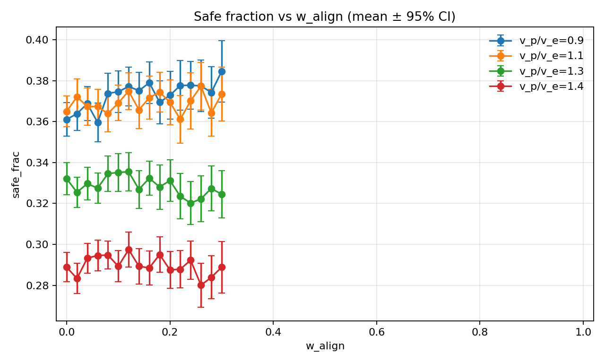

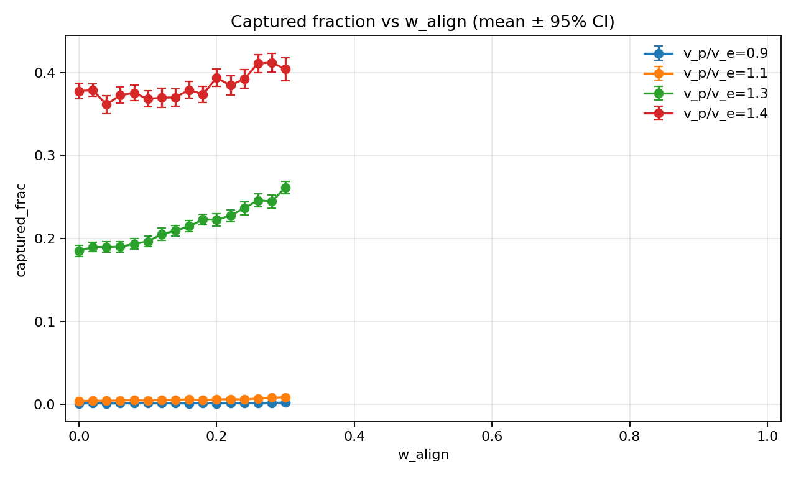

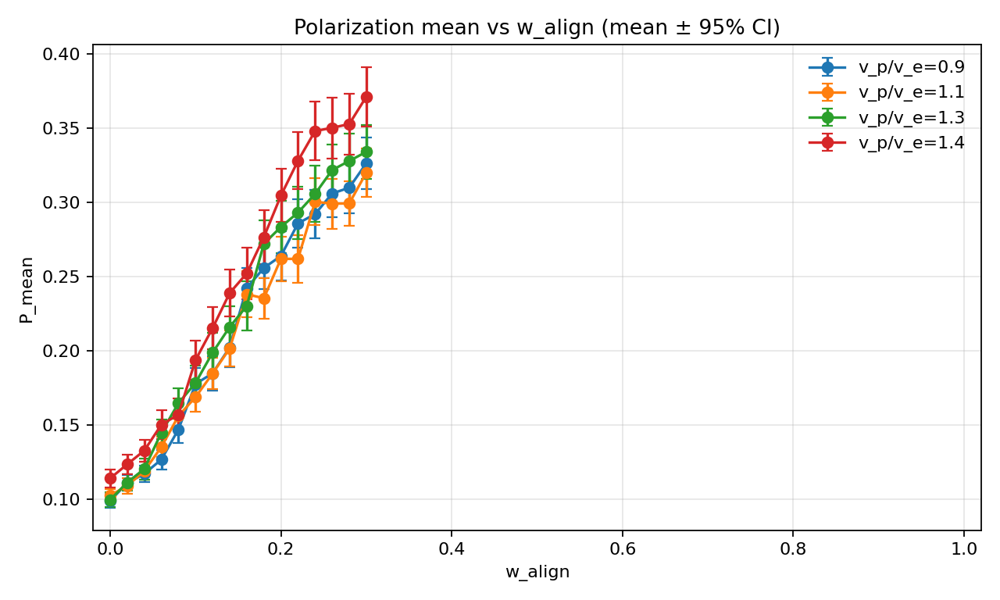

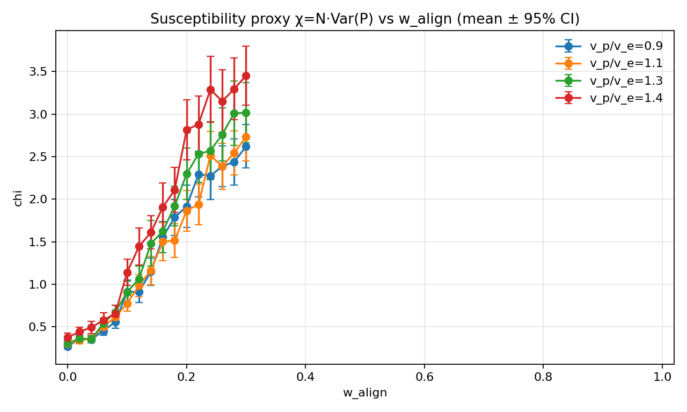

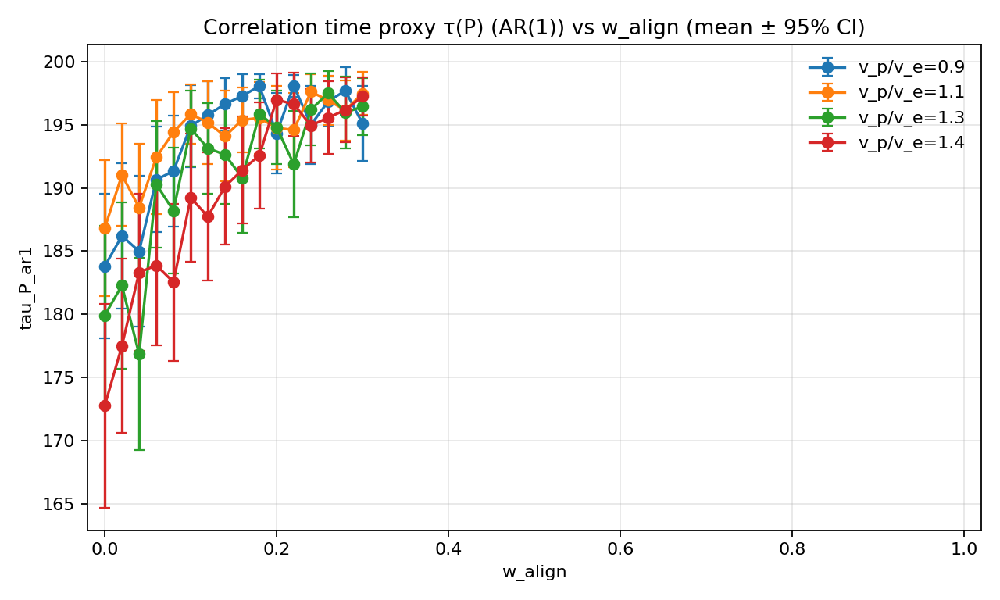

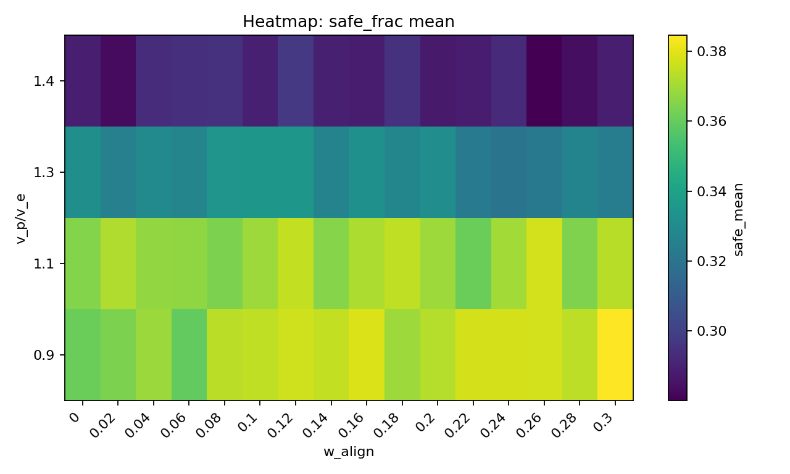

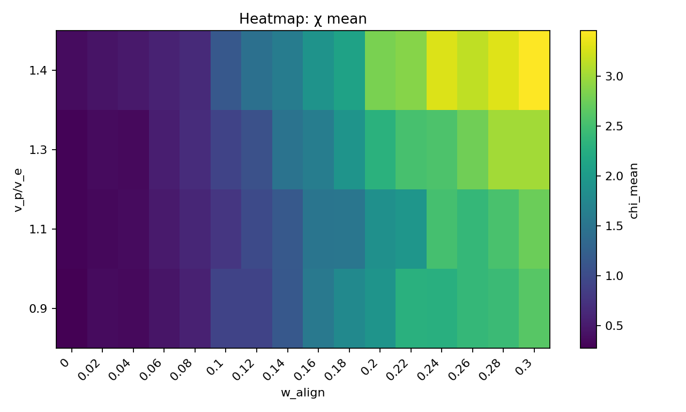

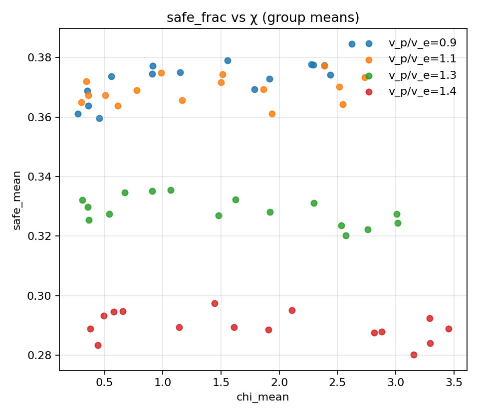

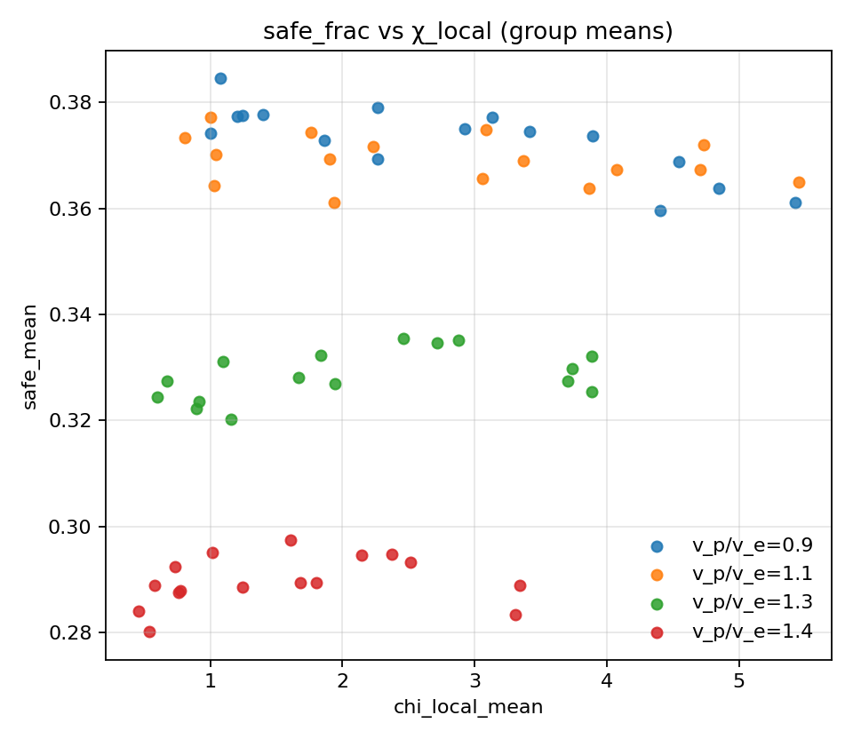

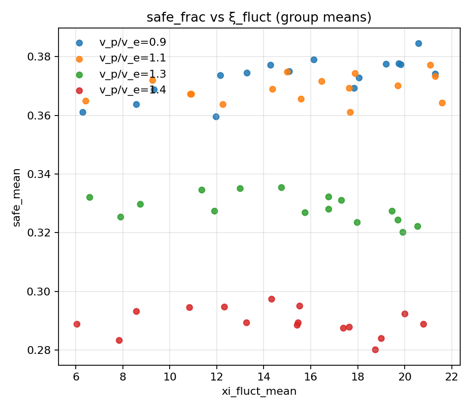

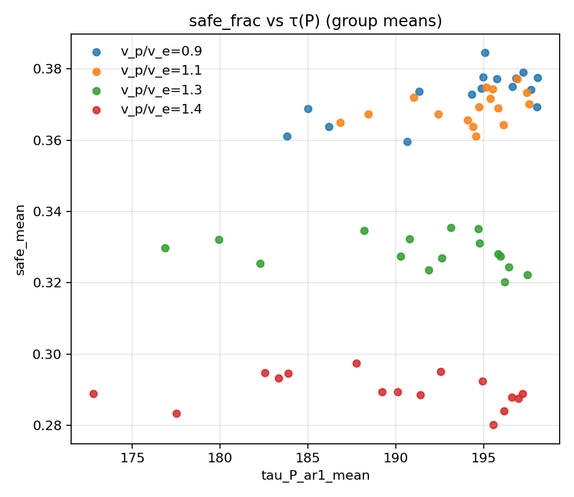

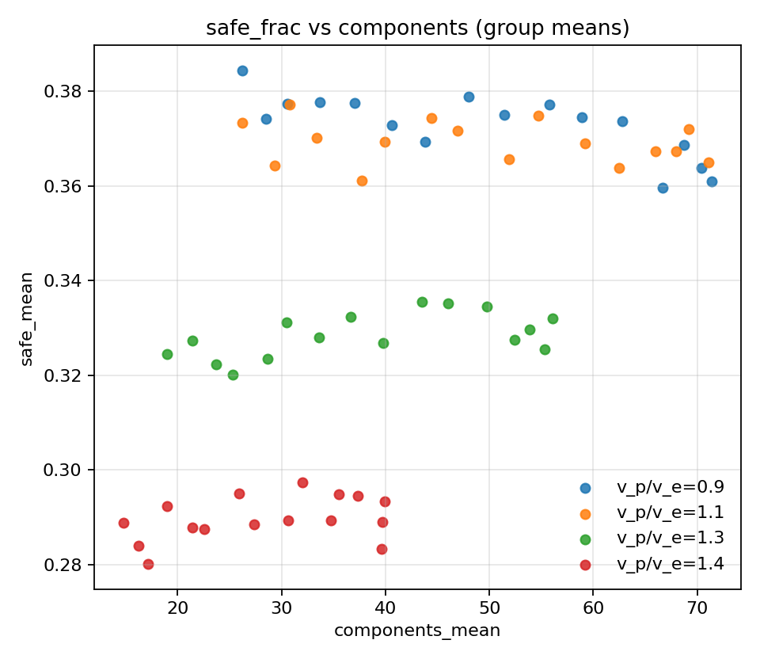
