# Share-mode full scan (noise=0, p1_intercept, seeds=120)

## Experiment setup

- Pursuer count is fixed by the base config.

- Aggregation: mean ± 95% CI across seeds for each (v_p/v_e, w_align).

## Artifacts

- Sweep directory: `runs/sweep_20260207_155527_grid`

- Base config: `runs/sweep_20260207_155527_grid/base_config.json`

- Group summary (aggregated): `doc/results_20260207_walign_share_noise0_p1intercept_sr09111314_120seeds_full/group_summary.csv`

- Figures: `doc/results_20260207_walign_share_noise0_p1intercept_sr09111314_120seeds_full/figs`

## Aggregated summary

| v_p/v_e | best w (safe) | safe | best w (χ) | χ | best w (χ_local) | χ_local | best w (τ) | τ | best w (ξ) | ξ |

|---:|---:|---:|---:|---:|---:|---:|---:|---:|---:|---:|

| 0.9 | 0.3 | 0.3845 | 0.9 | 5.0869 | 0 | 5.4265 | 0.6 | 198.6005 | 1 | 32.3750 |

| 1.1 | 0.15 | 0.3814 | 1 | 5.8436 | 0 | 5.4523 | 0.95 | 198.9526 | 1 | 34.3125 |

| 1.3 | 0.15 | 0.3359 | 0.95 | 7.8887 | 1 | 6.8087 | 0.6 | 197.5953 | 0.7 | 34.4583 |

| 1.4 | 0.15 | 0.2990 | 1 | 8.9287 | 1 | 6.0509 | 0.3 | 197.2274 | 0.7 | 31.6875 |

## Criticality–performance relationships (group means)

| v_p/v_e | corr(safe, χ) | |w_safe-w_χ| | corr(safe, χ_local) | |w_safe-w_χ_local| | corr(safe, τ) | |w_safe-w_τ| | corr(safe, ξ) | |w_safe-w_ξ| |

|---:|---:|---:|---:|---:|---:|---:|---:|---:|

| 0.9 | -0.842 | 0.600 | 0.433 | 0.300 | -0.537 | 0.300 | -0.693 | 0.700 |

| 1.1 | -0.861 | 0.850 | 0.325 | 0.150 | -0.191 | 0.800 | -0.713 | 0.850 |

| 1.3 | -0.910 | 0.800 | 0.187 | 0.850 | -0.203 | 0.450 | -0.809 | 0.550 |

| 1.4 | -0.927 | 0.850 | 0.135 | 0.850 | -0.058 | 0.150 | -0.627 | 0.550 |

## Plots

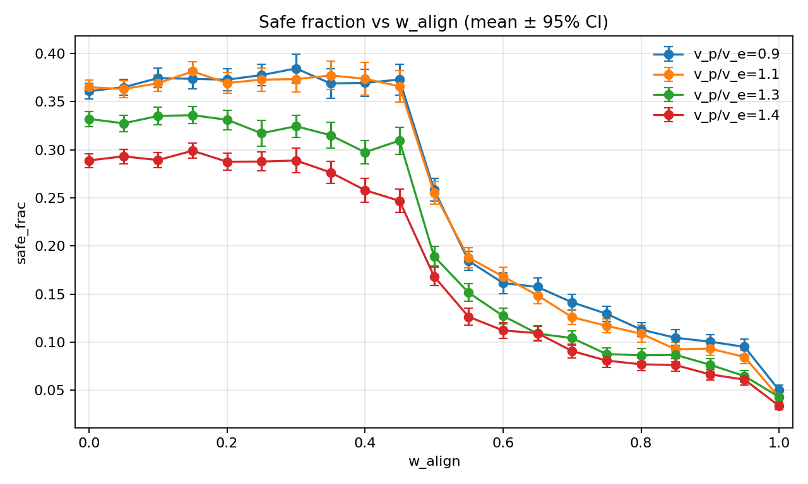

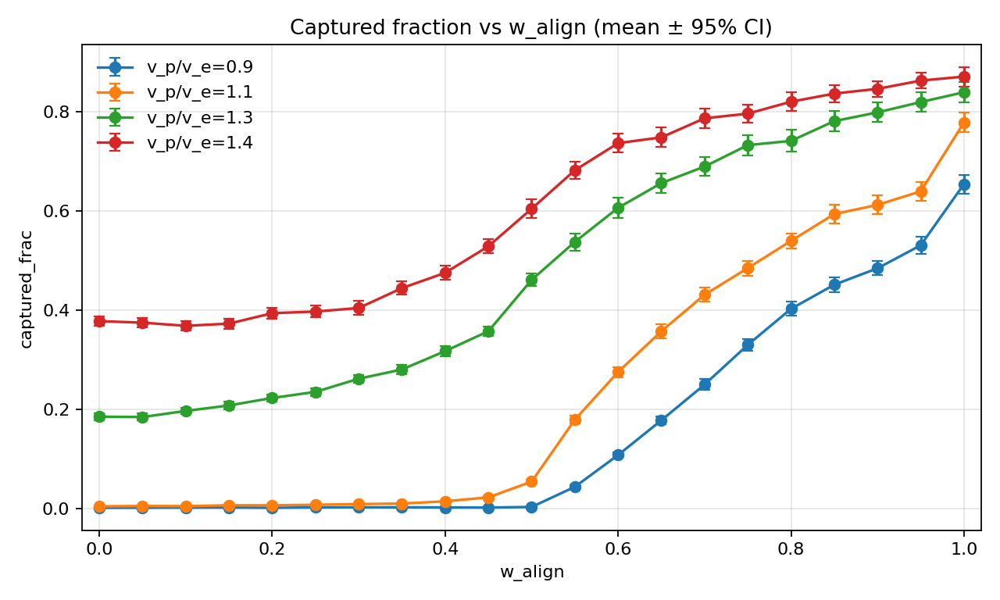

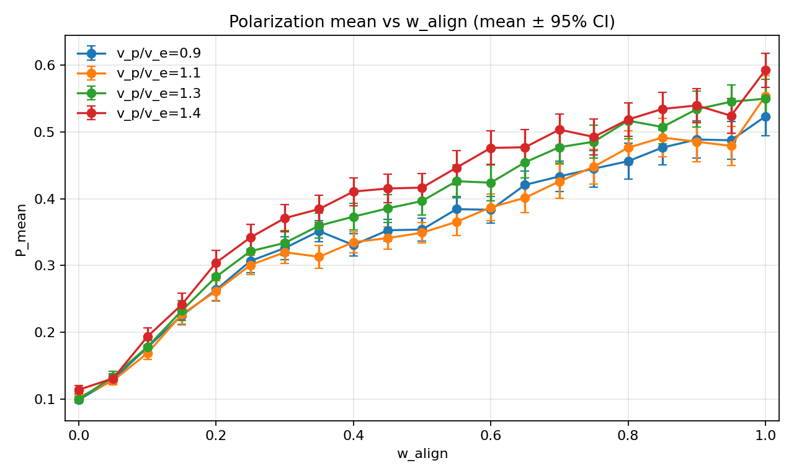

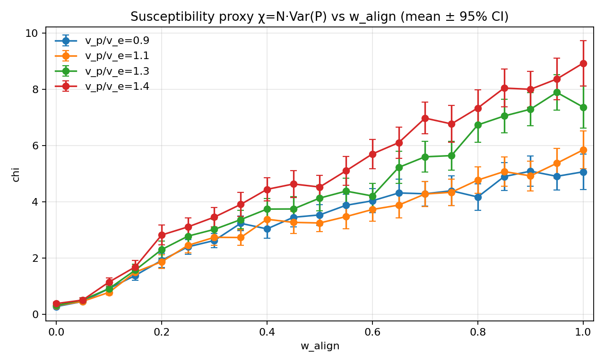

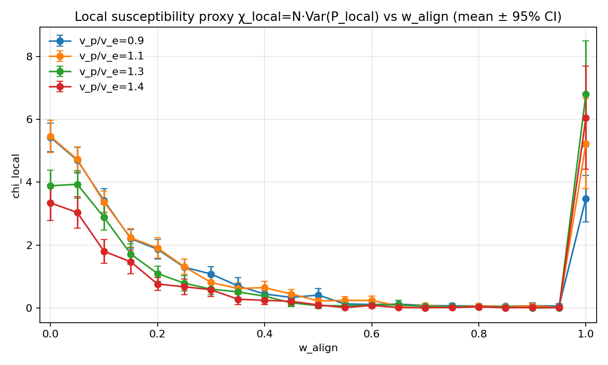

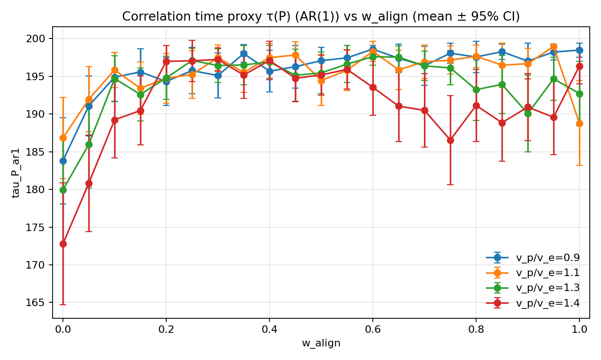

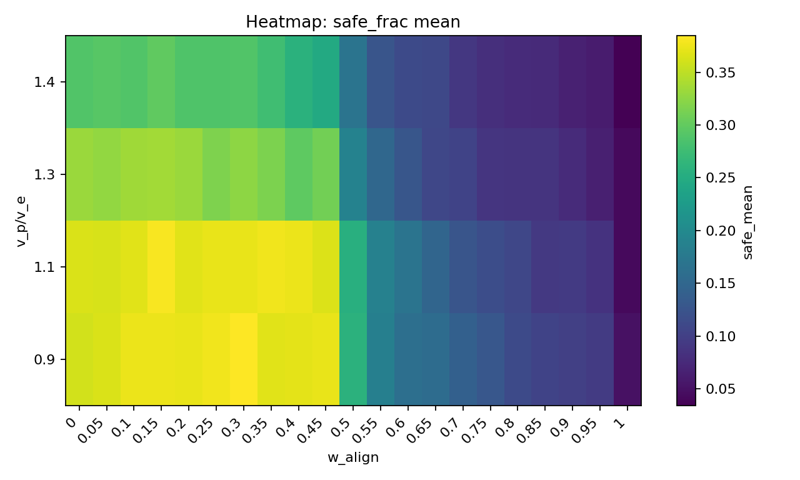

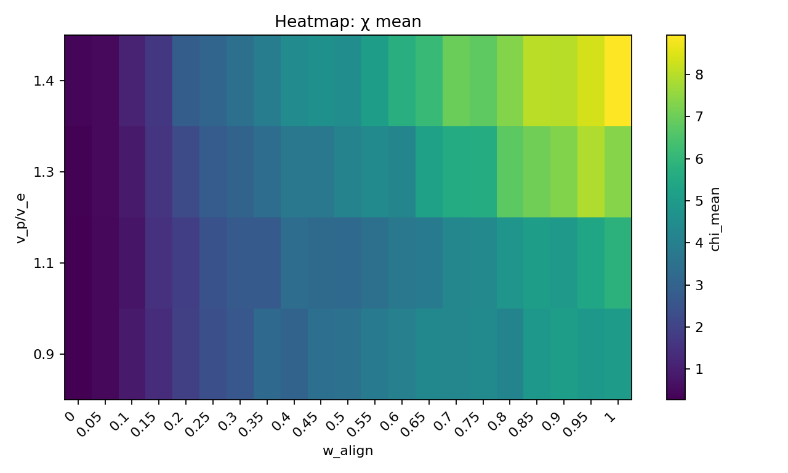

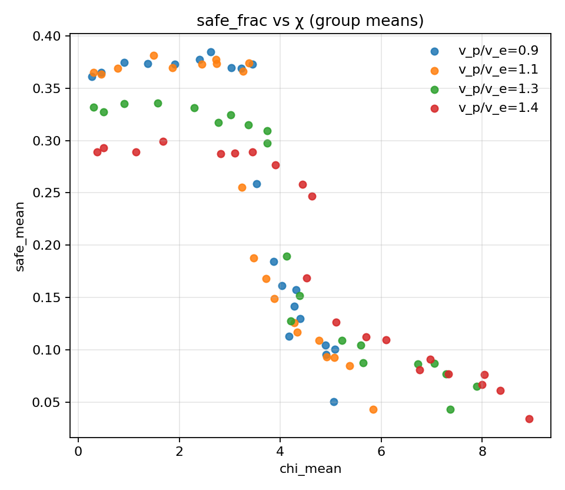

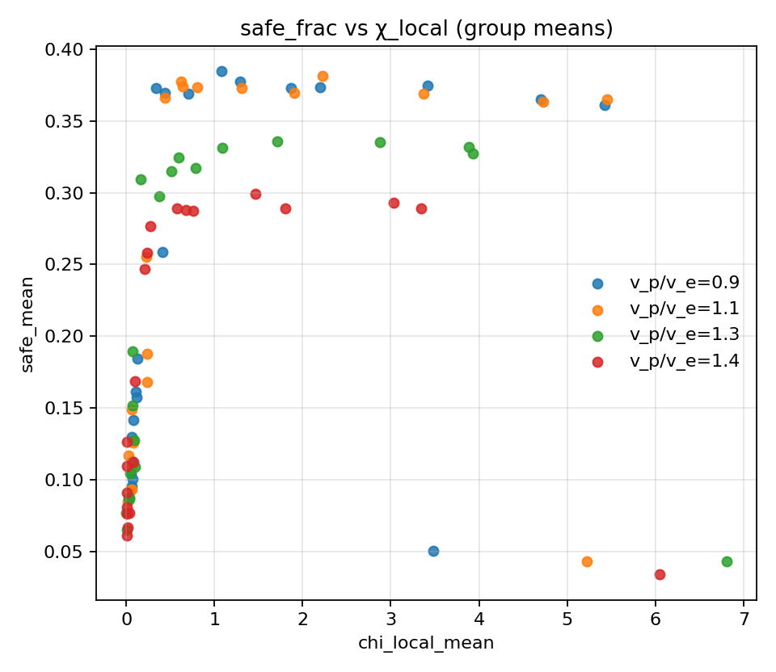

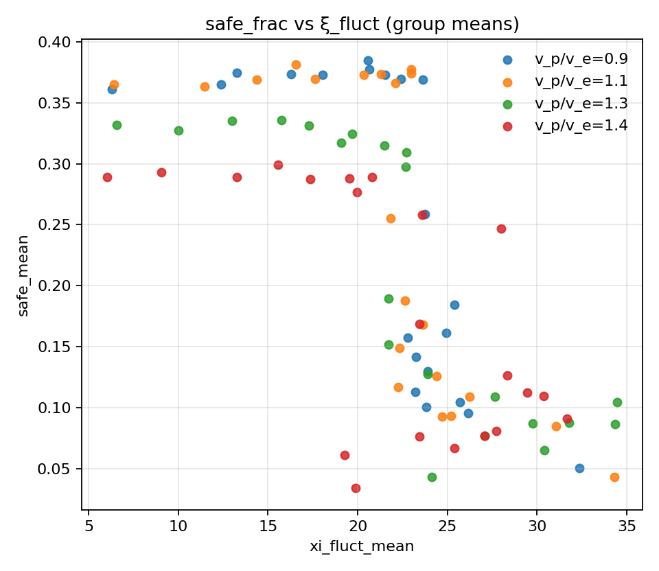

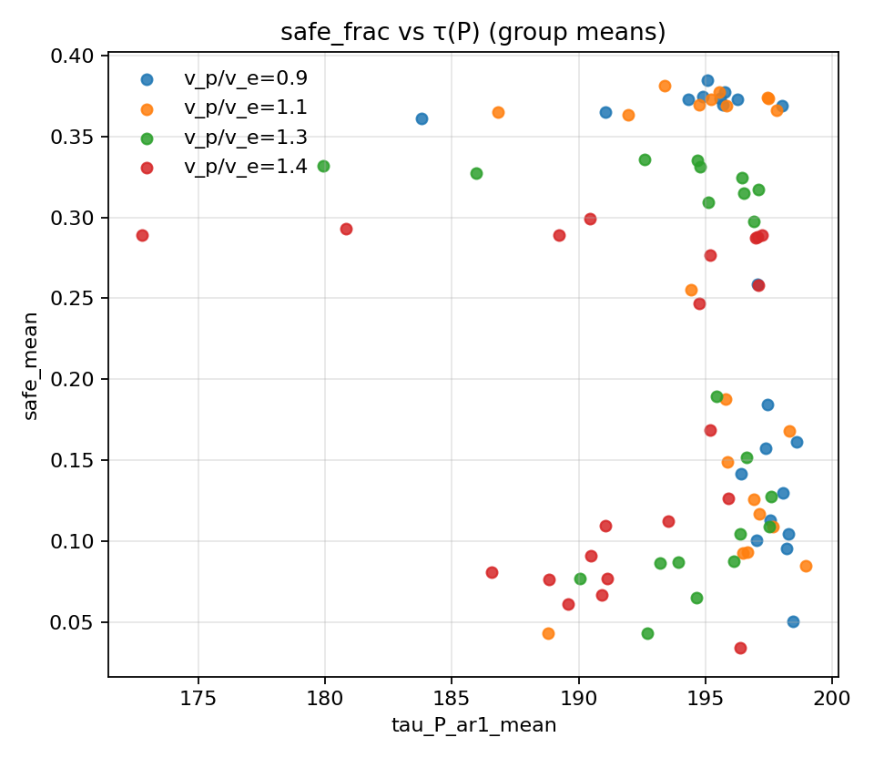

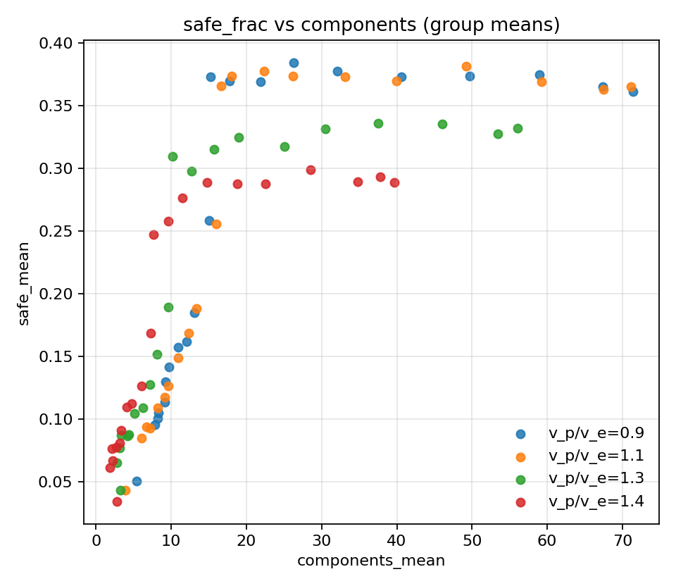
