# Share-mode scan to w=0.6 (noise=0, p1_intercept, seeds=60)

## Experiment setup

- Pursuer count is fixed by the base config.

- Aggregation: mean ± 95% CI across seeds for each (v_p/v_e, w_align).

## Artifacts

- Sweep directory: `runs/sweep_20260207_152551_grid`

- Base config: `runs/sweep_20260207_152551_grid/base_config.json`

- Group summary (aggregated): `doc/results_20260207_walign_share_noise0_p1intercept_sr09111314_60seeds_w06/group_summary.csv`

- Figures: `doc/results_20260207_walign_share_noise0_p1intercept_sr09111314_60seeds_w06/figs`

## Aggregated summary

| v_p/v_e | best w (safe) | safe | best w (χ) | χ | best w (χ_local) | χ_local | best w (τ) | τ | best w (ξ) | ξ |

|---:|---:|---:|---:|---:|---:|---:|---:|---:|---:|---:|

| 0.9 | 0.38 | 0.3917 | 0.6 | 3.7952 | 0 | 5.7157 | 0.16 | 199.0000 | 0.56 | 26.3333 |

| 1.1 | 0.38 | 0.3867 | 0.6 | 3.8234 | 0 | 5.4340 | 0.24 | 199.0000 | 0.6 | 24.7500 |

| 1.3 | 0.1 | 0.3448 | 0.52 | 4.4116 | 0.02 | 4.2065 | 0.56 | 198.9202 | 0.6 | 25.5417 |

| 1.4 | 0.12 | 0.2993 | 0.58 | 6.1914 | 0 | 3.8559 | 0.4 | 199.0000 | 0.56 | 32.5000 |

## Criticality–performance relationships (group means)

| v_p/v_e | corr(safe, χ) | |w_safe-w_χ| | corr(safe, χ_local) | |w_safe-w_χ_local| | corr(safe, τ) | |w_safe-w_τ| | corr(safe, ξ) | |w_safe-w_ξ| |

|---:|---:|---:|---:|---:|---:|---:|---:|---:|

| 0.9 | -0.461 | 0.220 | 0.391 | 0.380 | -0.136 | 0.220 | -0.468 | 0.180 |

| 1.1 | -0.450 | 0.220 | 0.420 | 0.380 | -0.145 | 0.140 | -0.391 | 0.220 |

| 1.3 | -0.667 | 0.420 | 0.550 | 0.080 | -0.403 | 0.460 | -0.616 | 0.500 |

| 1.4 | -0.711 | 0.460 | 0.526 | 0.120 | -0.347 | 0.280 | -0.769 | 0.440 |

## Plots

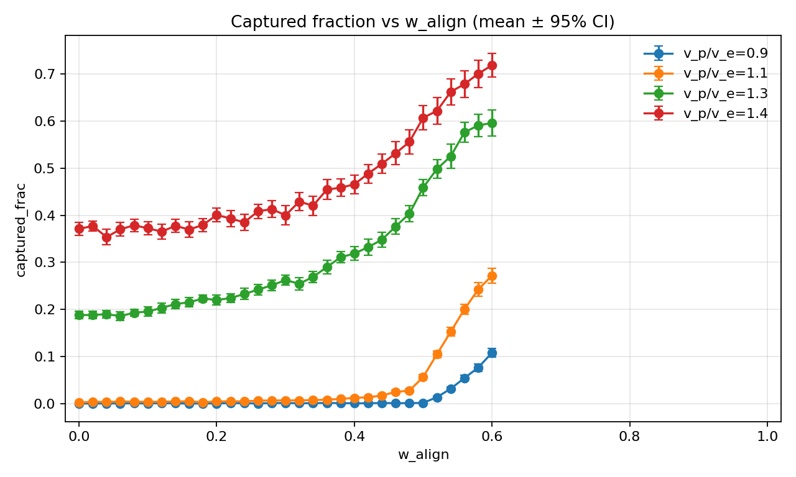

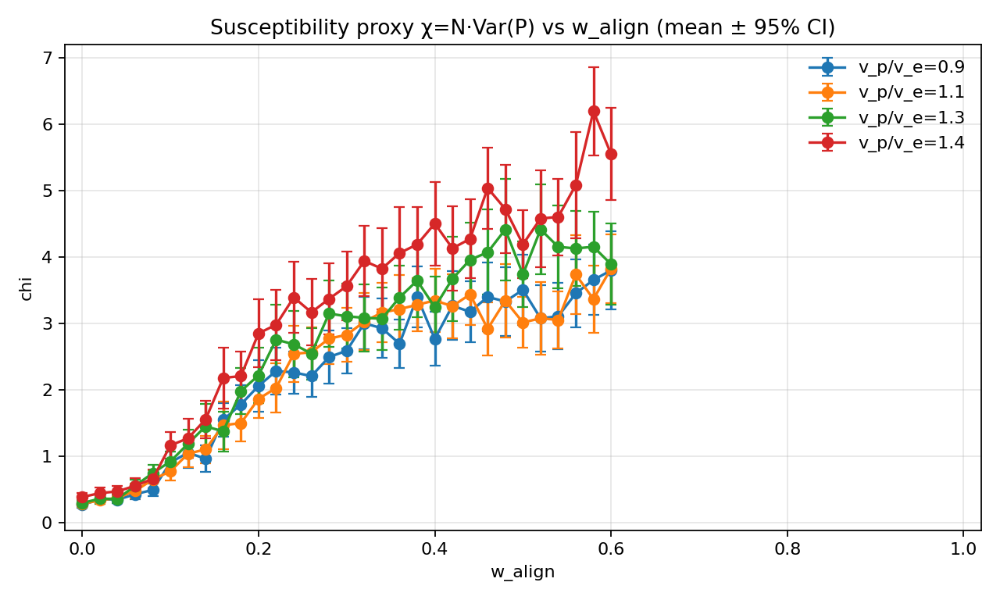

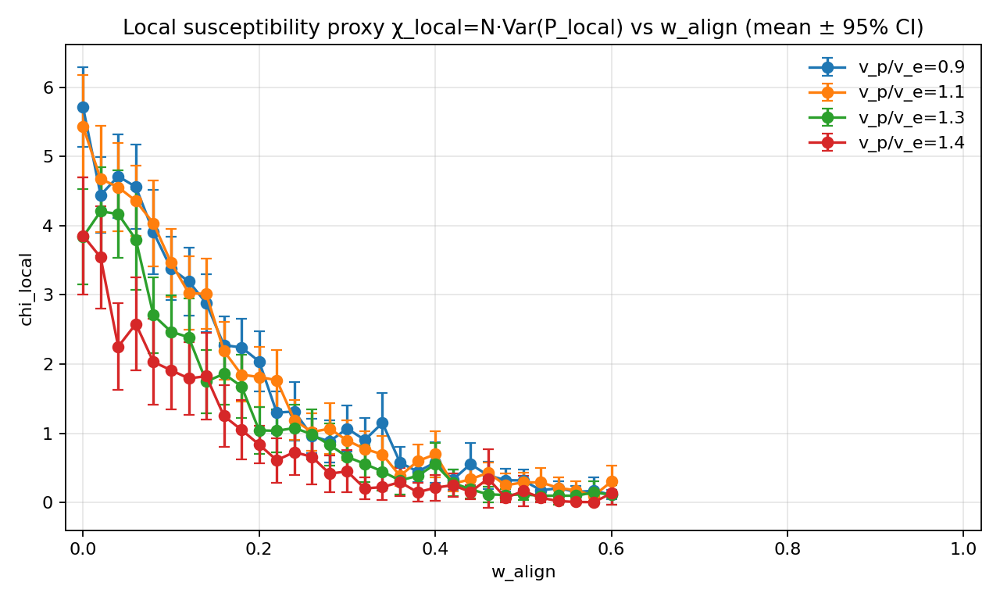

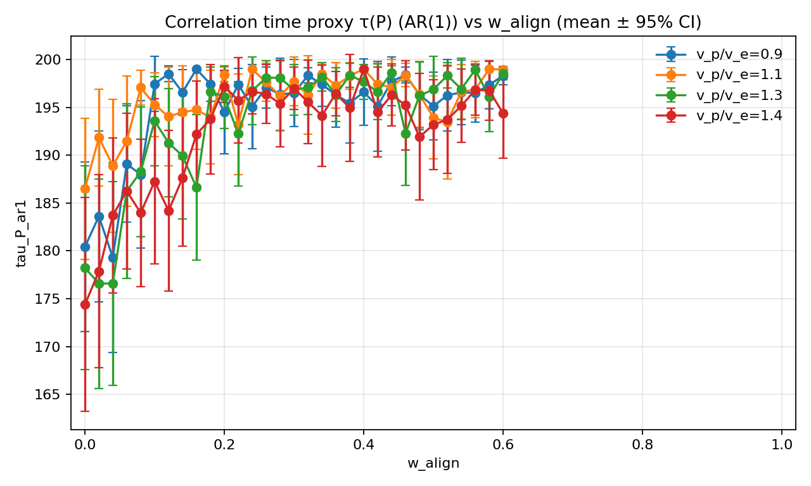

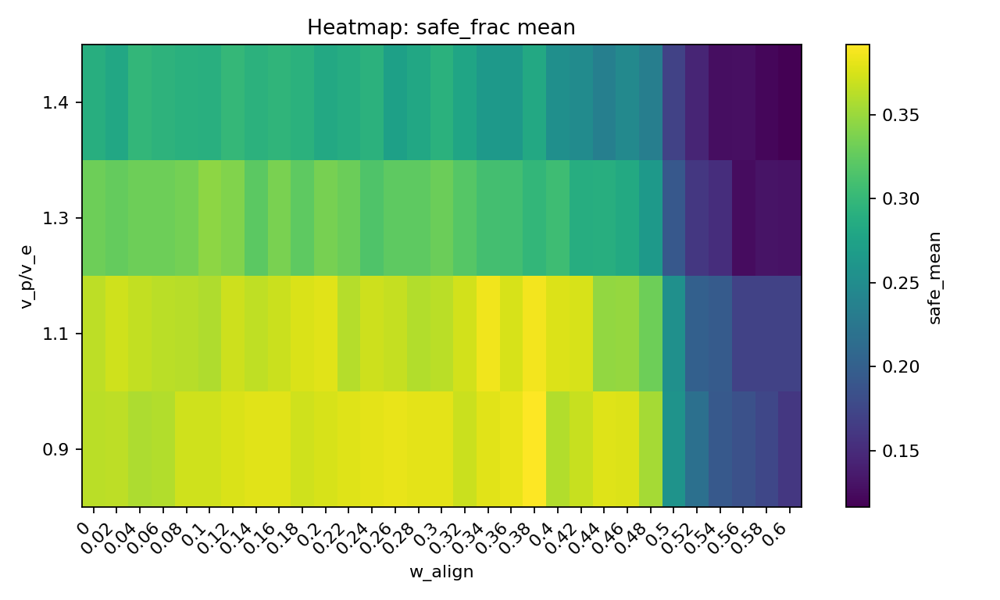

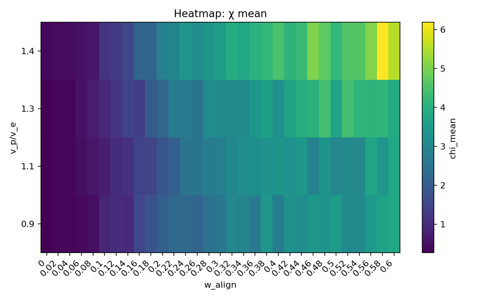

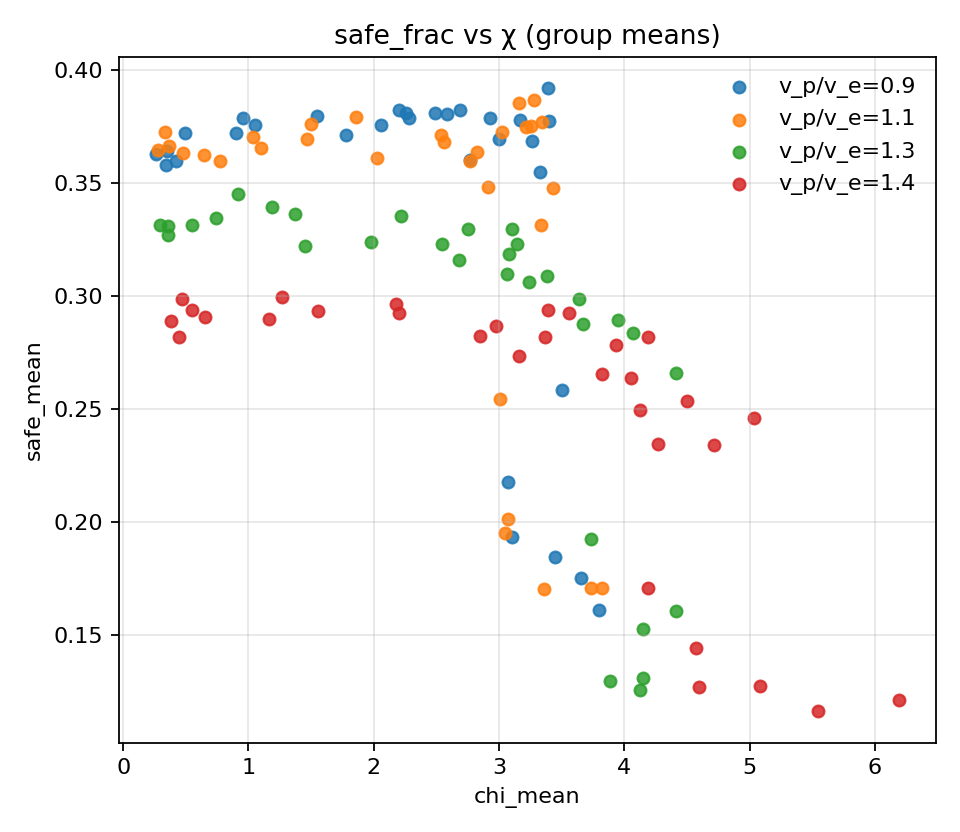

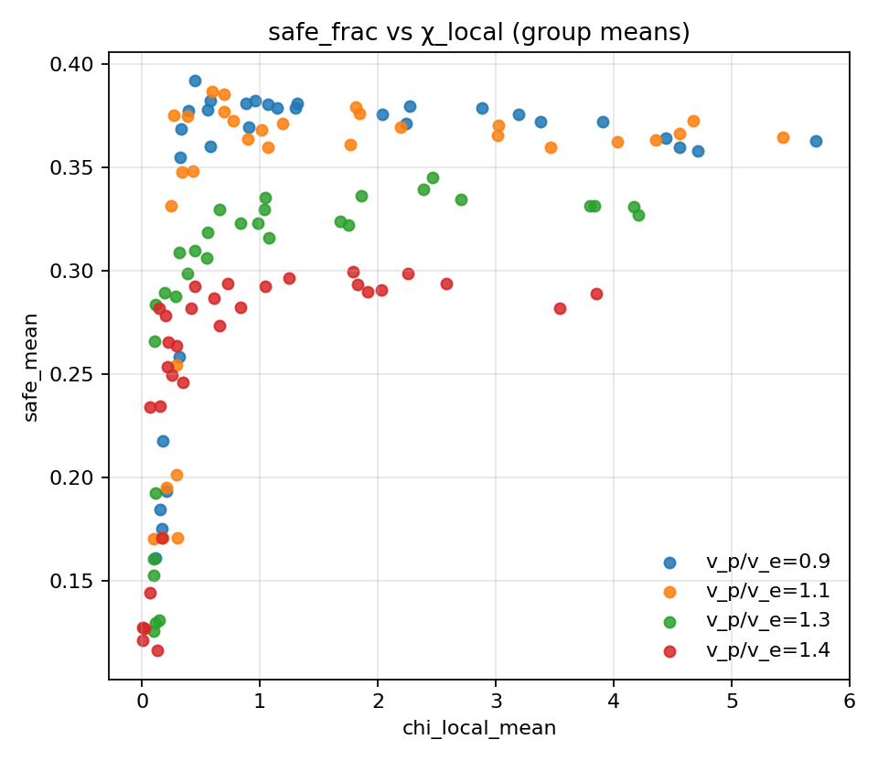

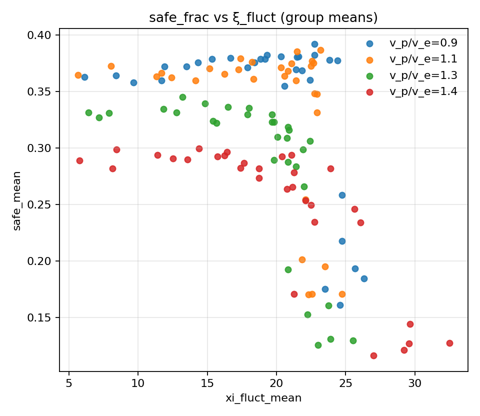

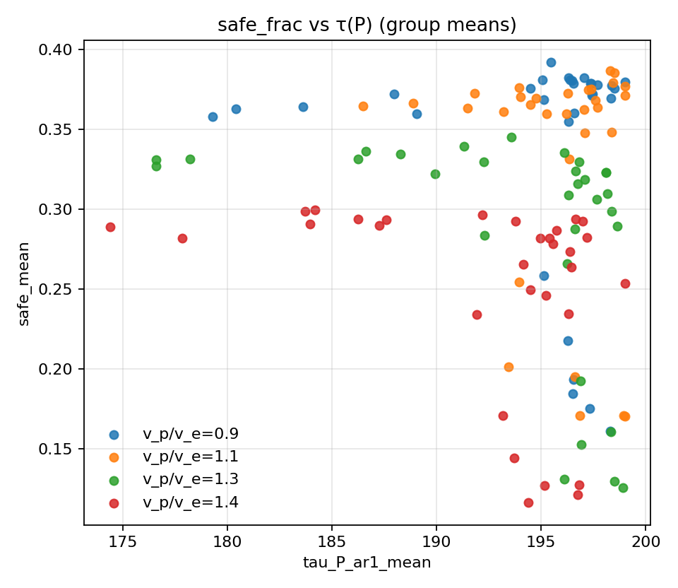

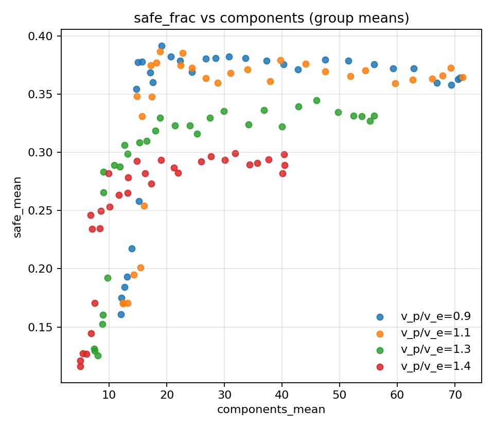
