# Share-mode w_align scan (noise=0, p1_intercept, seeds=80)

## Experiment setup

- Pursuer count is fixed by the base config.

- Aggregation: mean ± 95% CI across seeds for each (v_p/v_e, w_align).

## Artifacts

- Sweep directory: `runs/sweep_20260207_110454_grid`

- Base config: `runs/sweep_20260207_110454_grid/base_config.json`

- Group summary (aggregated): `doc/results_20260207_walign_share_noise0_p1intercept_sr09111314_80seeds/group_summary.csv`

- Figures: `doc/results_20260207_walign_share_noise0_p1intercept_sr09111314_80seeds/figs`

## Aggregated summary

| v_p/v_e | best w (safe) | safe | best w (χ) | χ | best w (χ_local) | χ_local | best w (τ) | τ | best w (ξ) | ξ |

|---:|---:|---:|---:|---:|---:|---:|---:|---:|---:|---:|

| 0.9 | 0.25 | 0.3858 | 0.95 | 4.9415 | 0 | 5.8749 | 0.75 | 198.5176 | 1 | 33.5000 |

| 1.1 | 0.15 | 0.3846 | 1 | 5.9247 | 1 | 5.5597 | 0.95 | 199.0000 | 1 | 31.5938 |

| 1.3 | 0.1 | 0.3398 | 0.95 | 7.7304 | 1 | 7.1158 | 0.6 | 198.1890 | 0.8 | 33.4375 |

| 1.4 | 0.15 | 0.3011 | 1 | 8.5578 | 1 | 6.3014 | 0.4 | 199.0000 | 0.65 | 33.1562 |

## Criticality–performance relationships (group means)

| v_p/v_e | corr(safe, χ) | |w_safe-w_χ| | corr(safe, χ_local) | |w_safe-w_χ_local| | corr(safe, τ) | |w_safe-w_τ| | corr(safe, ξ) | |w_safe-w_ξ| |

|---:|---:|---:|---:|---:|---:|---:|---:|---:|

| 0.9 | -0.823 | 0.700 | 0.437 | 0.250 | -0.404 | 0.500 | -0.662 | 0.750 |

| 1.1 | -0.860 | 0.850 | 0.301 | 0.850 | -0.256 | 0.800 | -0.718 | 0.850 |

| 1.3 | -0.915 | 0.850 | 0.175 | 0.900 | -0.232 | 0.500 | -0.818 | 0.700 |

| 1.4 | -0.925 | 0.850 | 0.115 | 0.850 | -0.184 | 0.250 | -0.561 | 0.500 |

## Plots

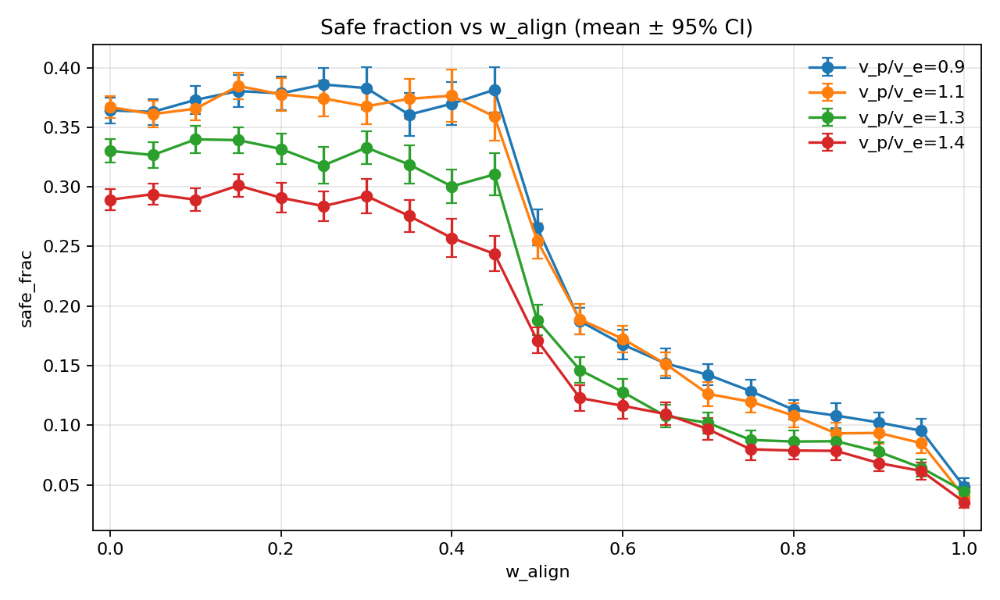

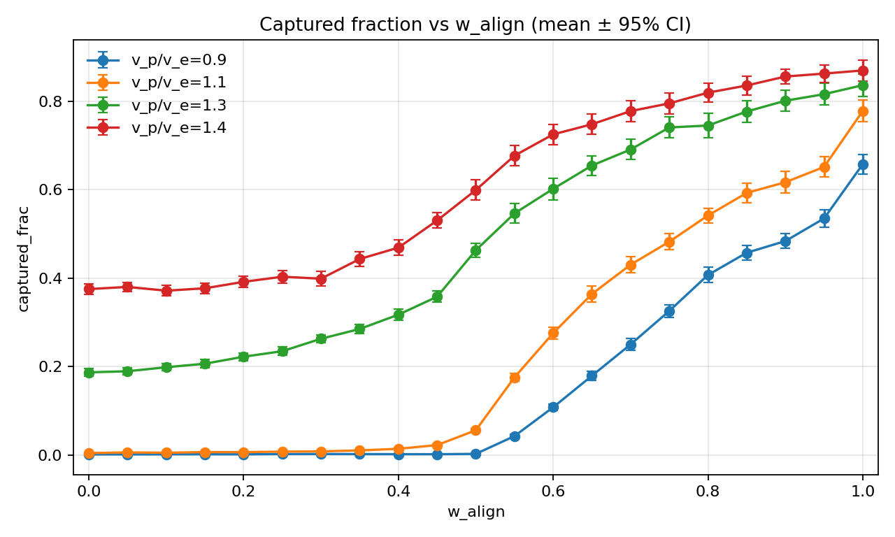

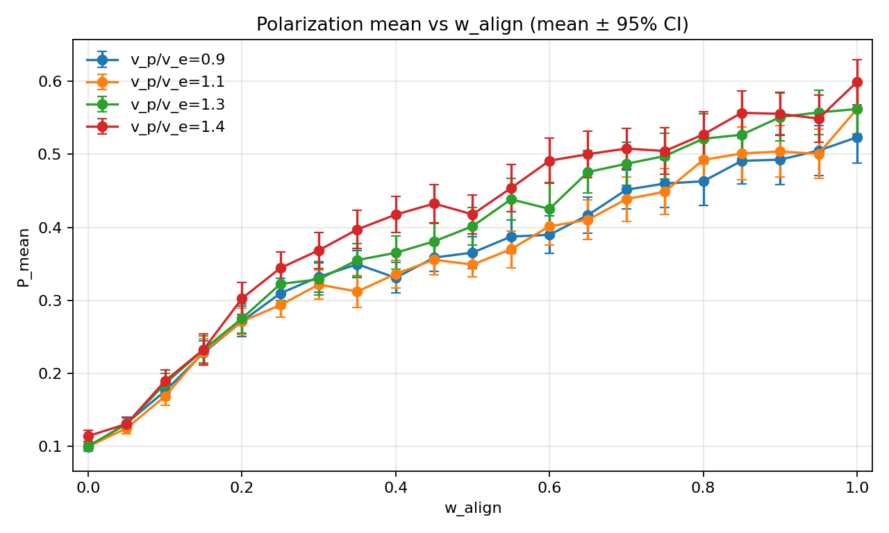

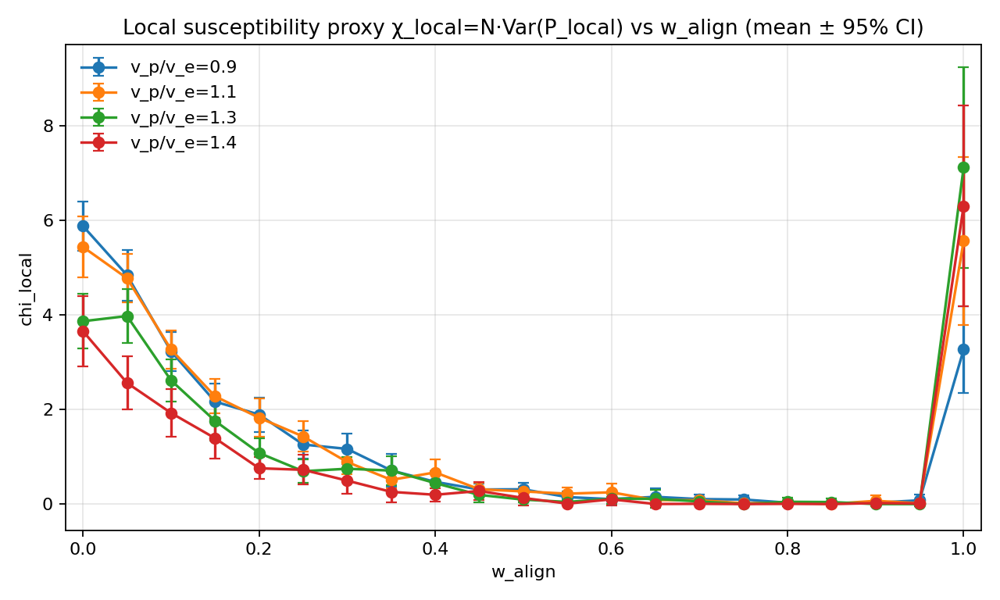

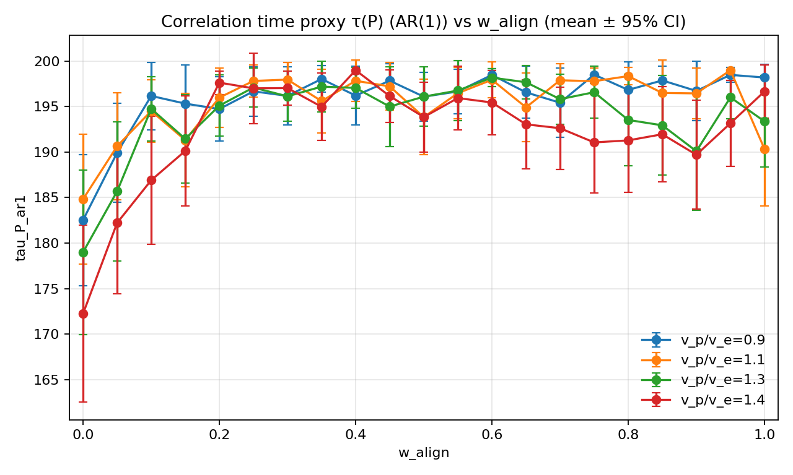

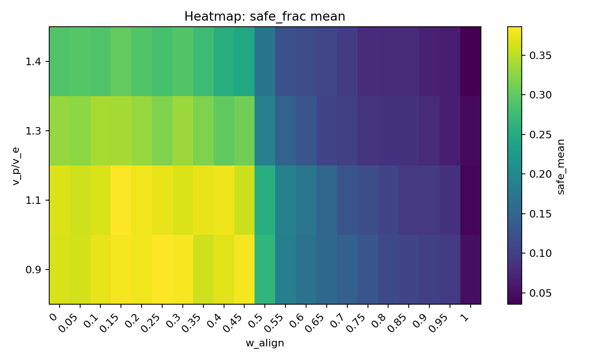

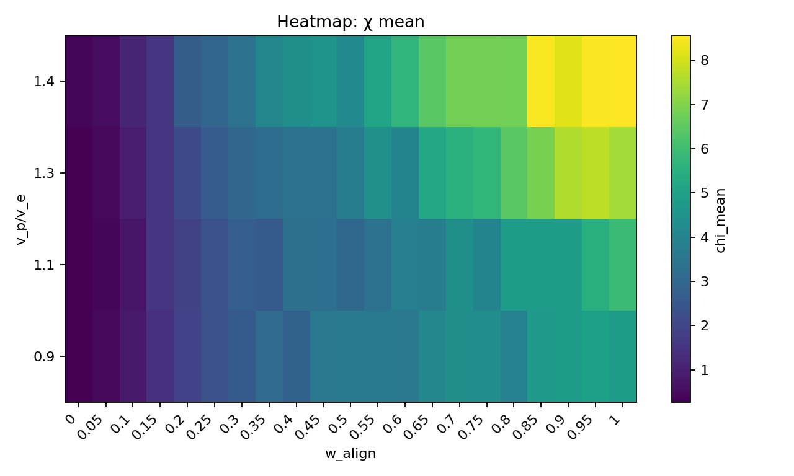

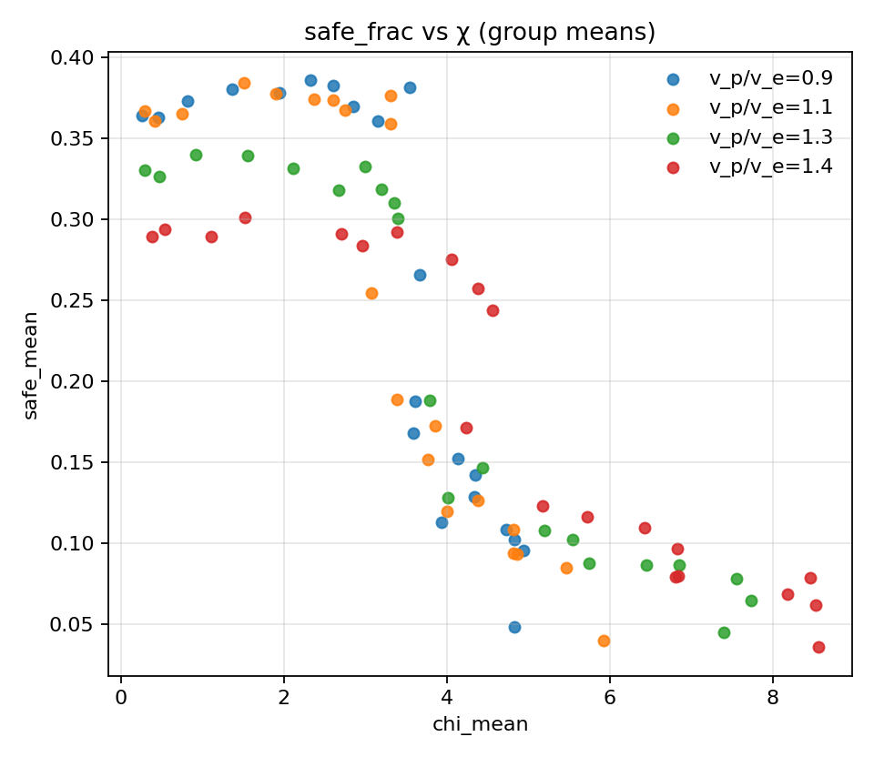

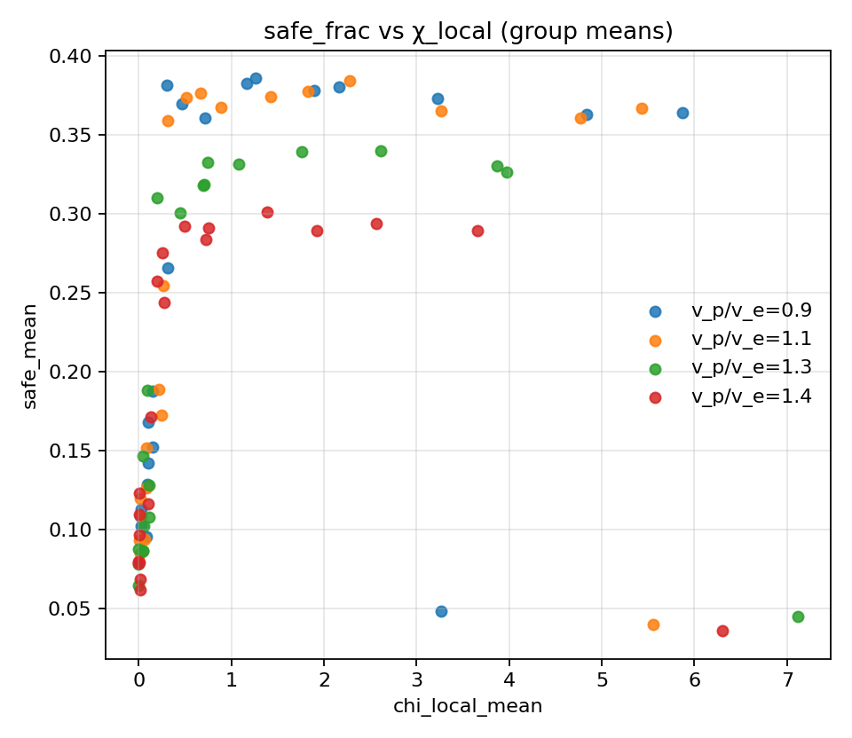

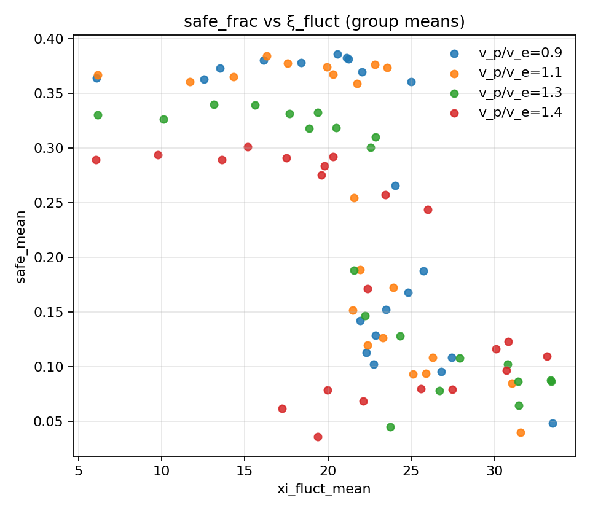

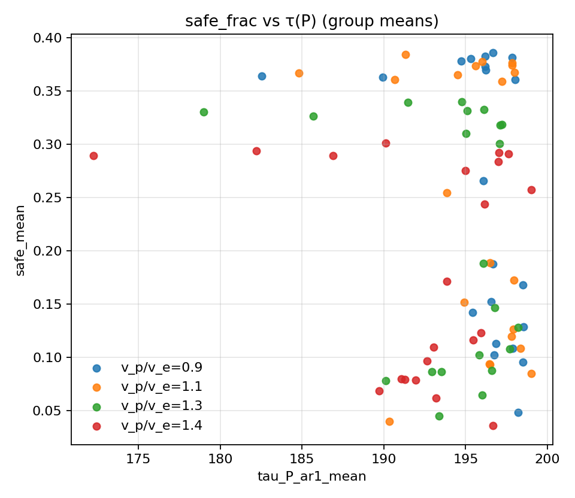

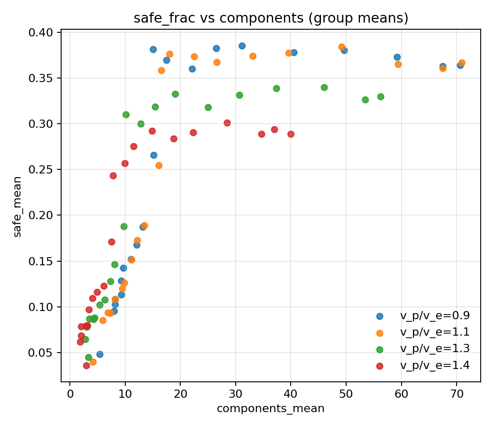
