# w_align share(noise=0) under p1_intercept (sr=1.1,1.3; 60 seeds)

## Experiment setup

- Pursuer count is fixed by the base config.

- Aggregation: mean ± 95% CI across seeds for each (v_p/v_e, w_align).

## Artifacts

- Sweep directory: `runs/sweep_20260207_172114_grid`

- Base config: `runs/sweep_20260207_172114_grid/base_config.json`

- Group summary (aggregated): `doc/results_20260207_walign_share_noise0_p1intercept_sr1113_60seeds_save_runs/group_summary.csv`

- Figures: `doc/results_20260207_walign_share_noise0_p1intercept_sr1113_60seeds_save_runs/figs`

## Aggregated summary

| v_p/v_e | best w (safe) | safe | best w (χ) | χ | best w (χ_local) | χ_local | best w (τ) | τ | best w (ξ) | ξ |

|---:|---:|---:|---:|---:|---:|---:|---:|---:|---:|---:|

| 1.1 | 0.2 | 0.3792 | 1 | 5.7646 | 0 | 5.4340 | 0.4 | 199.0000 | 1 | 31.7917 |

| 1.3 | 0.1 | 0.3448 | 0.9 | 7.6744 | 1 | 6.4362 | 0.6 | 198.5192 | 0.8 | 33.6250 |

## Criticality–performance relationships (group means)

| v_p/v_e | corr(safe, χ) | |w_safe-w_χ| | corr(safe, χ_local) | |w_safe-w_χ_local| | corr(safe, τ) | |w_safe-w_τ| | corr(safe, ξ) | |w_safe-w_ξ| |

|---:|---:|---:|---:|---:|---:|---:|---:|---:|

| 1.1 | -0.866 | 0.800 | 0.172 | 0.200 | 0.047 | 0.200 | -0.758 | 0.800 |

| 1.3 | -0.913 | 0.800 | 0.016 | 0.900 | -0.115 | 0.500 | -0.751 | 0.700 |

## Plots

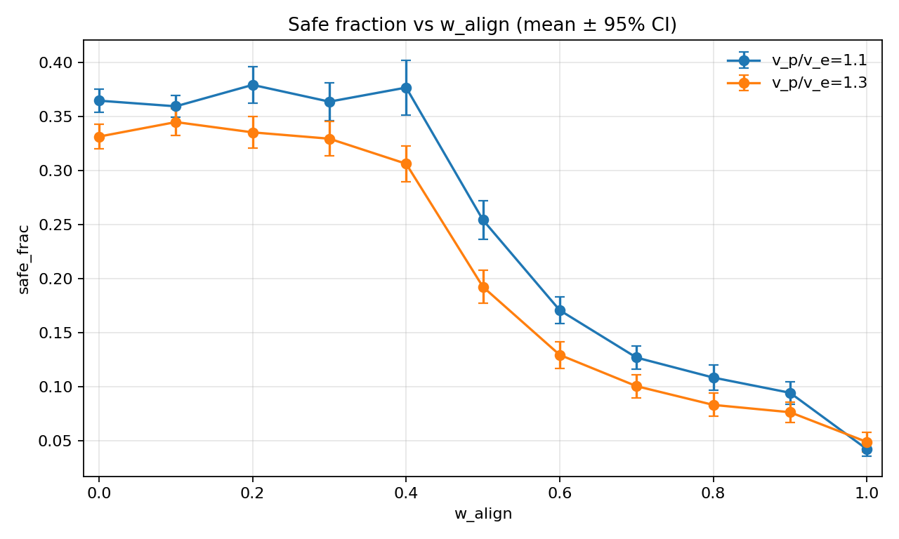

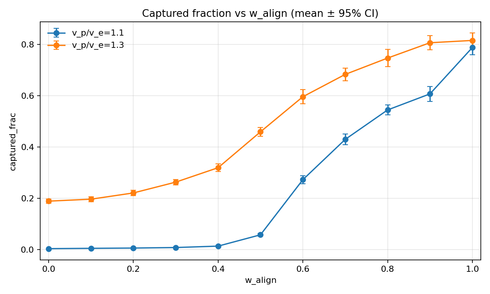

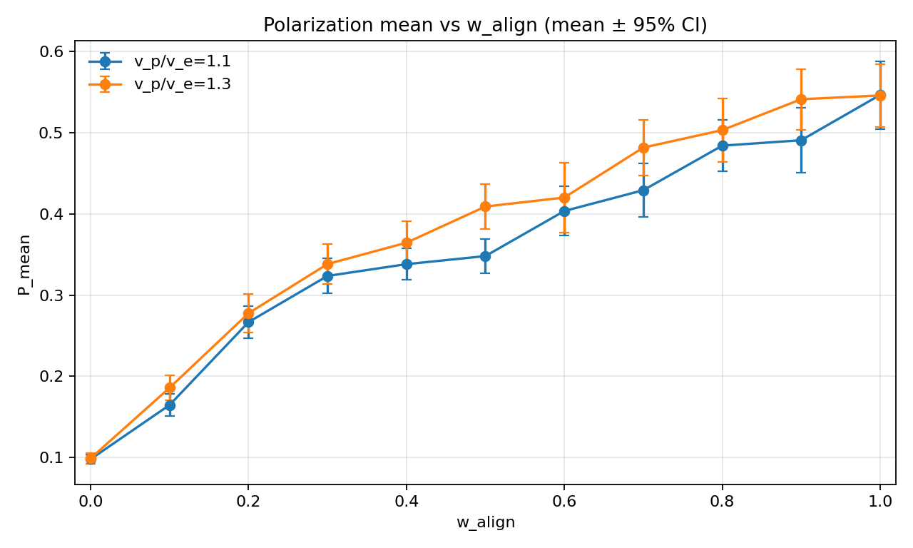

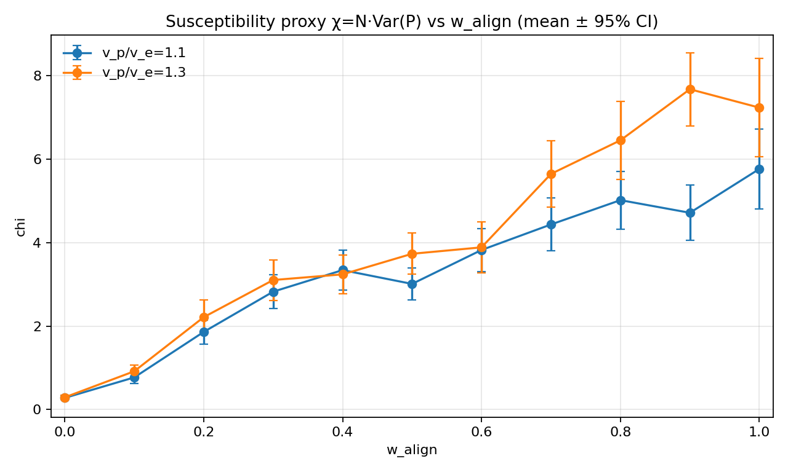

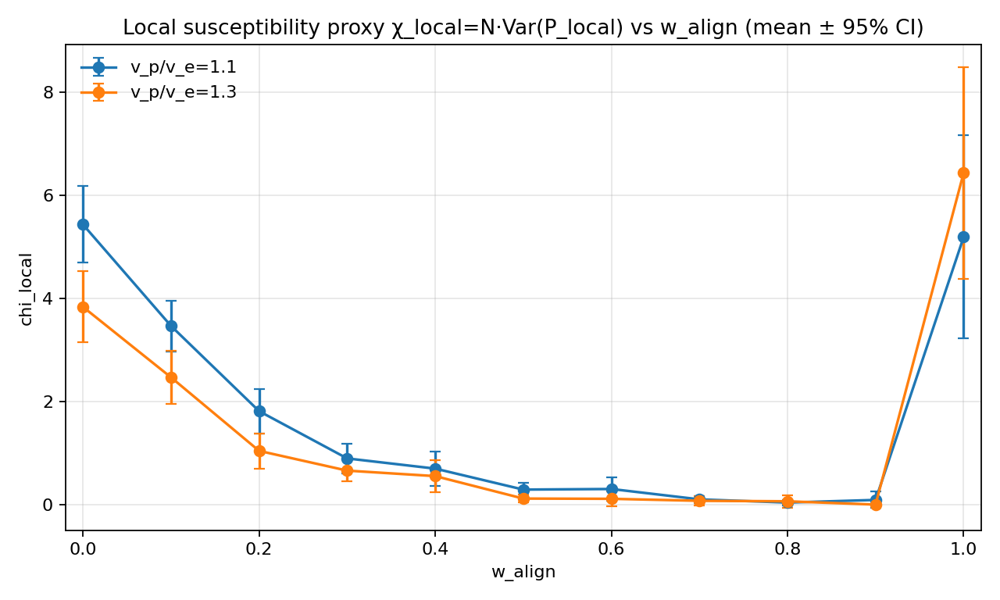

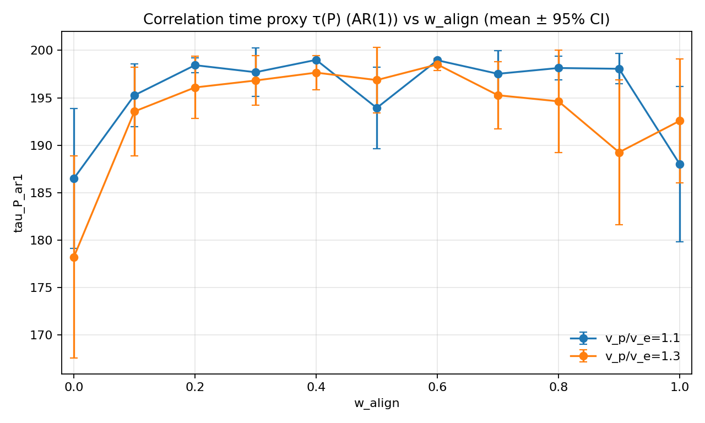

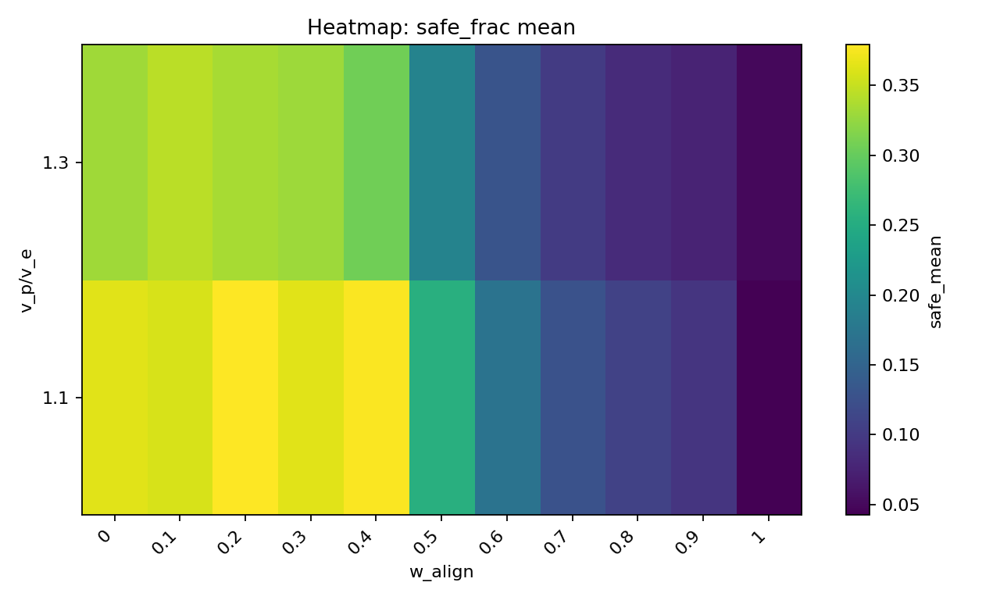

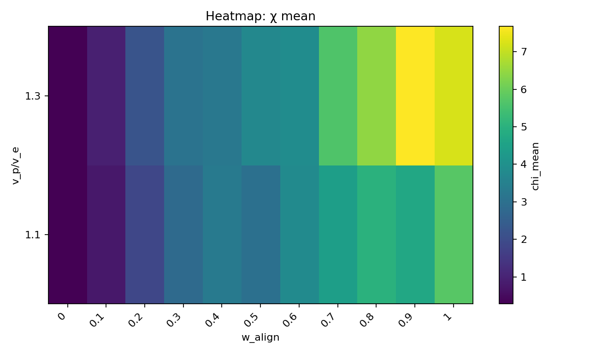

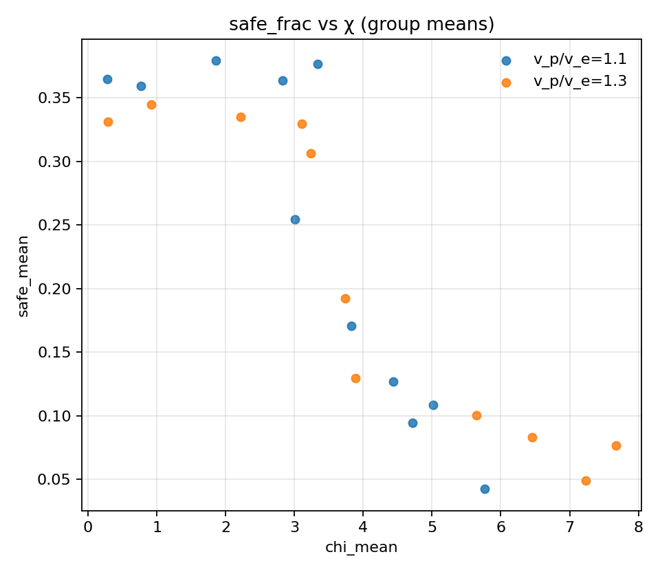

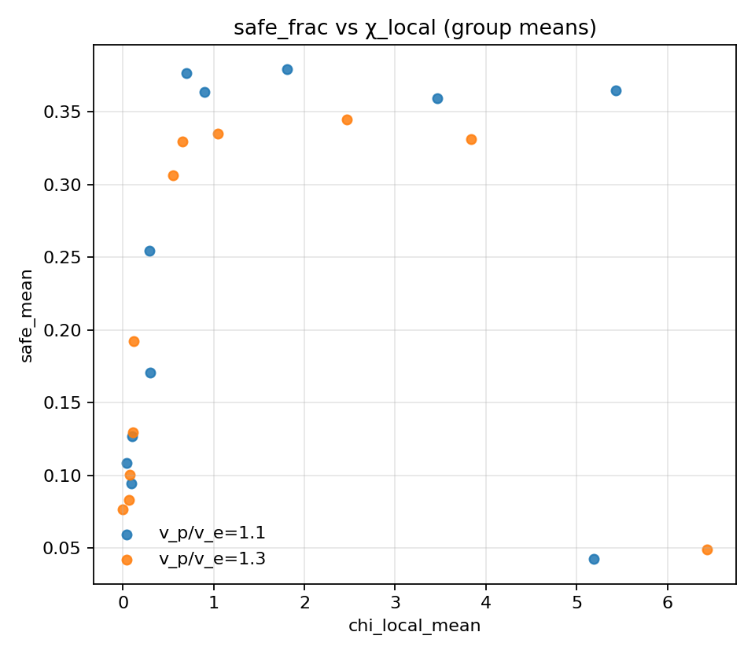

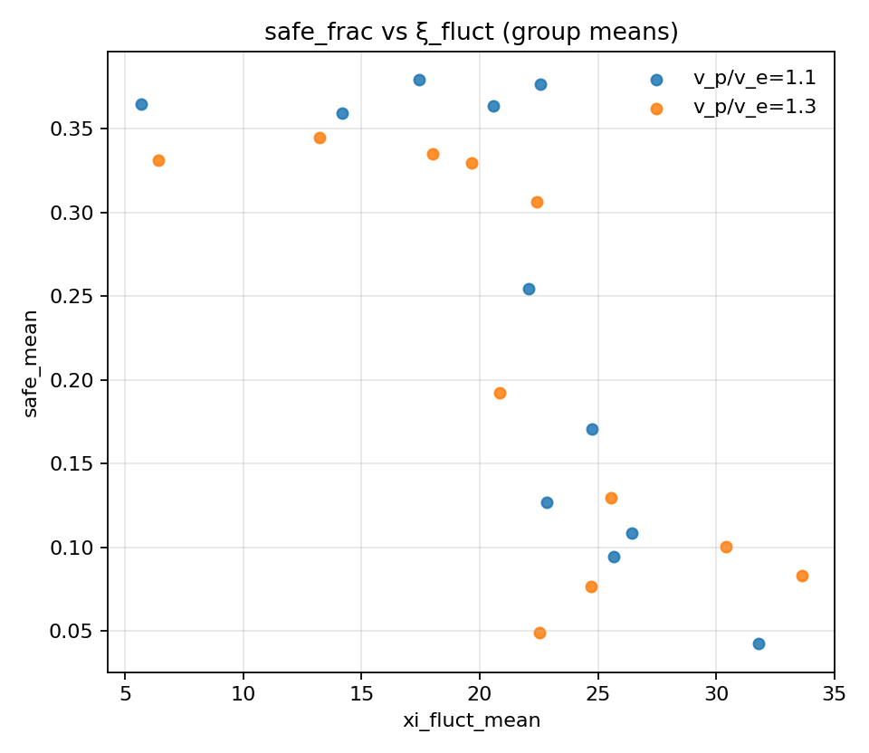

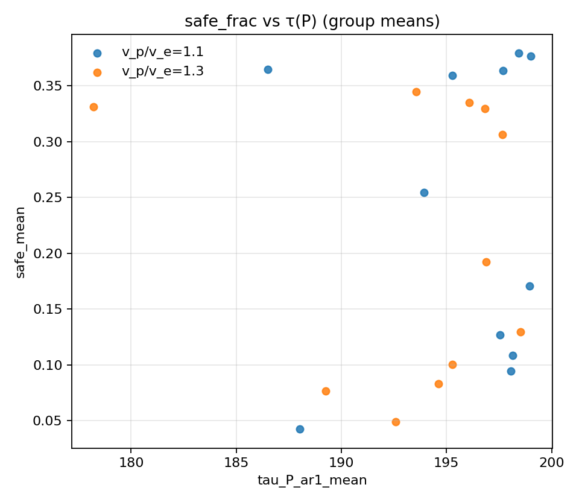

