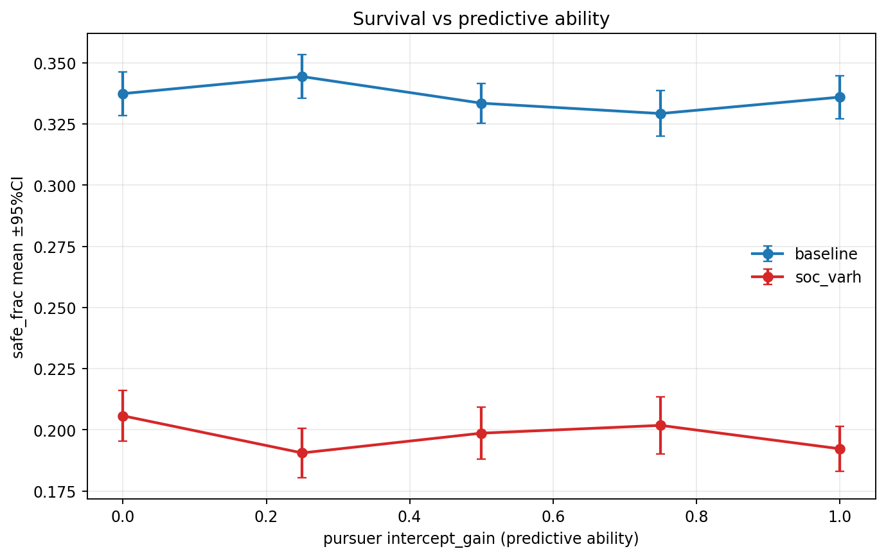
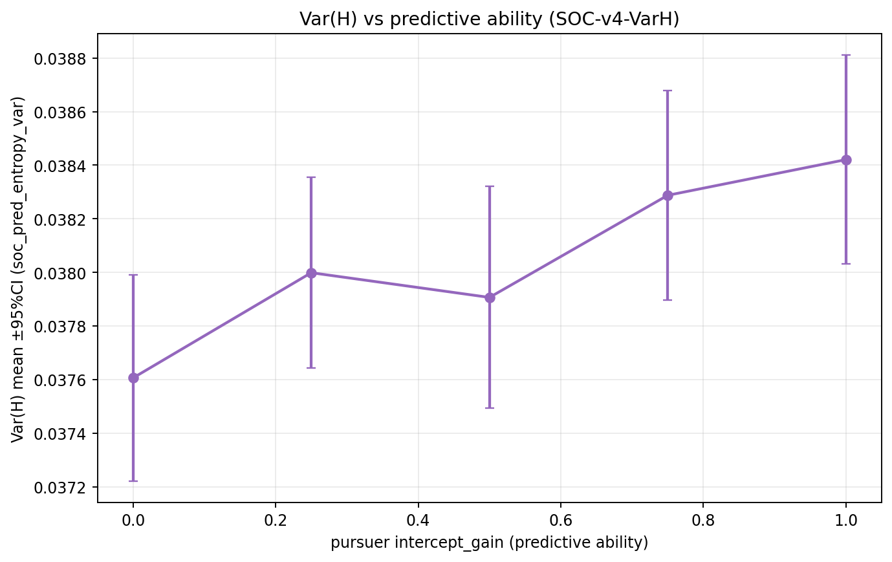
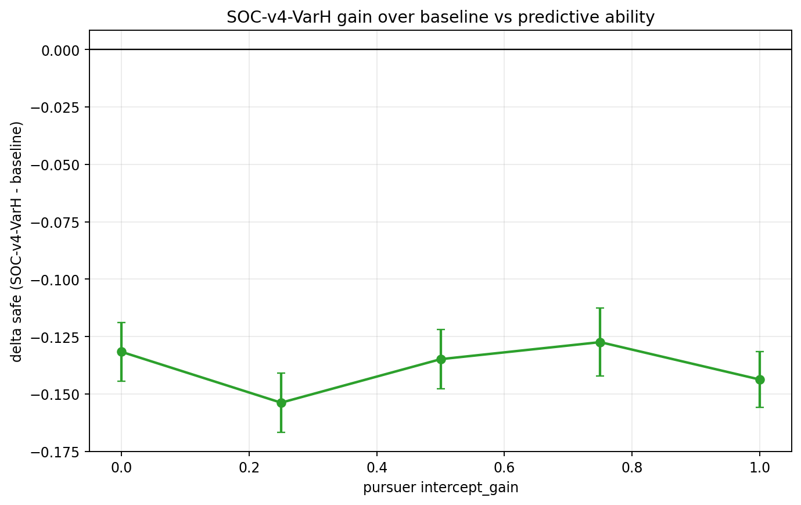
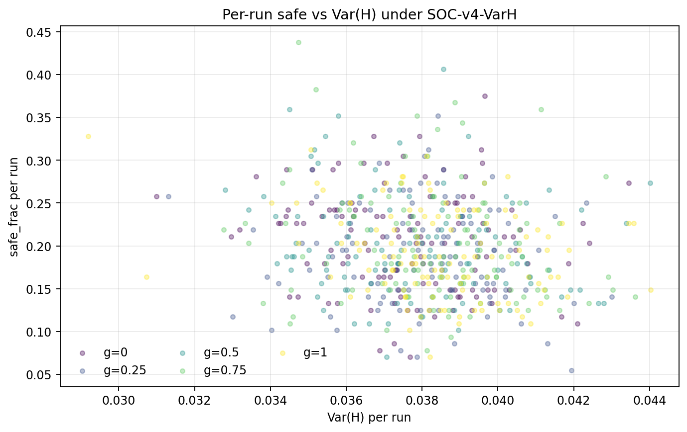

# 实验结果：基于 Var(H) 的自组织算法与预测追捕能力（2026-02-08）

## 1. 目标

研究 `SOC-v4-VarH` 在前瞻追捕下，随追捕者预测能力变化时，`Var(H)`、生存率（`safe_frac`）与预测能力三者关系。

## 2. 算法与设置

- 场景：2D 连续空间，多安全区，容量限制，局部可见。
- 追捕策略：`p1_intercept`，扫描 `intercept_gain ∈ {0,0.25,0.5,0.75,1.0}`，`intercept_tmax=0`（无限时域）。
- 速度层：固定 `speed_ratio=1.3`。
- 逃跑者基线：`align_control_mode="share"`，`angle_noise=0`，`w_align=0.15`。
- 对照组：`baseline`（SOC 关闭）。
- 实验组：`SOC-v4-VarH`（SOC 开启，`soc_mode="v4_varh"`，`soc_varh_target=0.04`，`soc_varh_gain=3.0`）。
- 采样：每配置 `120 seeds`，`600 steps`。总 runs=`1200`。

## 3. 图表

## 4. 关键统计（按 gain 汇总）

| gain | safe_base | safe_soc_varh | delta_safe | varh_soc | corr(safe,varh)_soc |
|---:|---:|---:|---:|---:|---:|
| 0 | 0.3374 | 0.2057 | -0.1316 | 0.0376 | -0.148 |
| 0.25 | 0.3443 | 0.1906 | -0.1538 | 0.0380 | -0.093 |
| 0.5 | 0.3335 | 0.1986 | -0.1348 | 0.0379 | -0.159 |
| 0.75 | 0.3292 | 0.2018 | -0.1274 | 0.0383 | -0.190 |
| 1 | 0.3359 | 0.1923 | -0.1437 | 0.0384 | -0.282 |

## 5. 关系结论

1. 在 `SOC-v4-VarH` 组内，pooled `corr(safe, Var(H)) = -0.178`，表现为弱到中等负相关。
2. `corr(Var(H), predictive_gain) = 0.125`，说明预测能力变化会显著改变 `Var(H)` 分布。
3. `corr(safe, predictive_gain) = -0.038`（SOC 组）显示预测能力提高整体压低逃逸率。
4. 与 baseline 的配对比较显示：`SOC-v4-VarH` 在该组参数下为稳定负增益（各 gain 的 `delta_safe` 95% CI 均在 0 以下）。

## 6. 产物

- `summary_by_variant_gain.csv`
- `paired_delta_safe_summary.csv`
- `paired_delta_safe.csv`
- `pooled_correlations_soc.csv`
