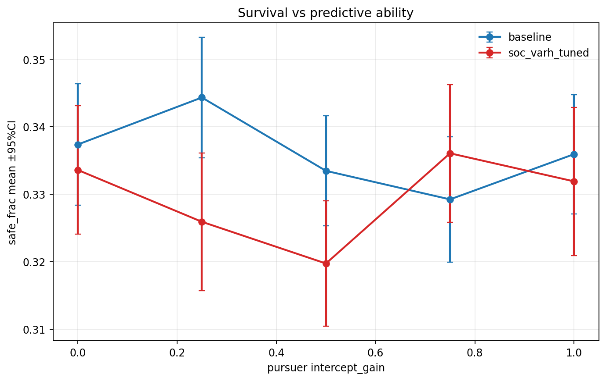
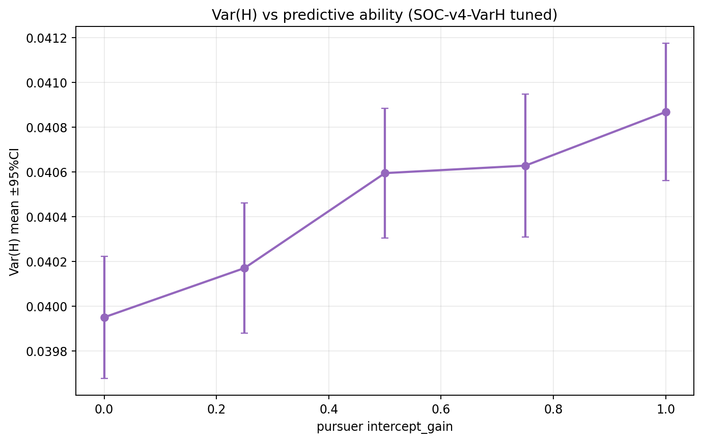
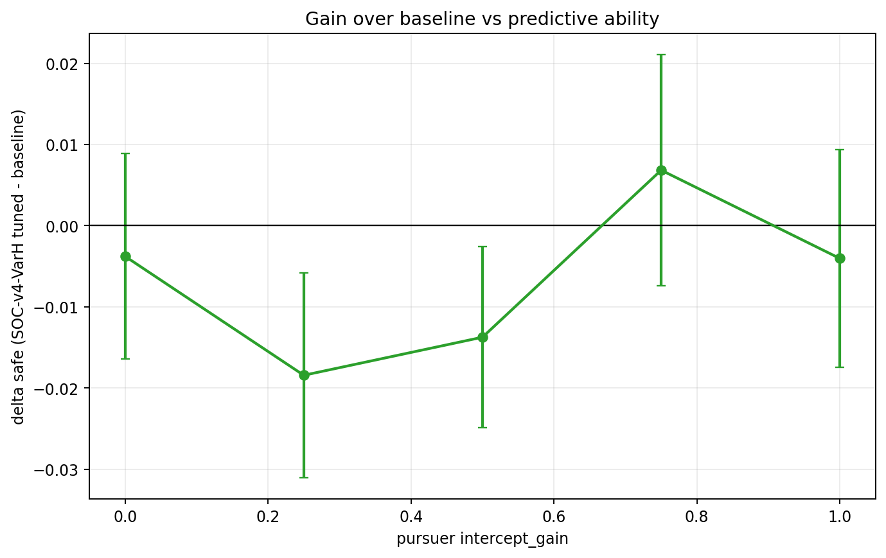
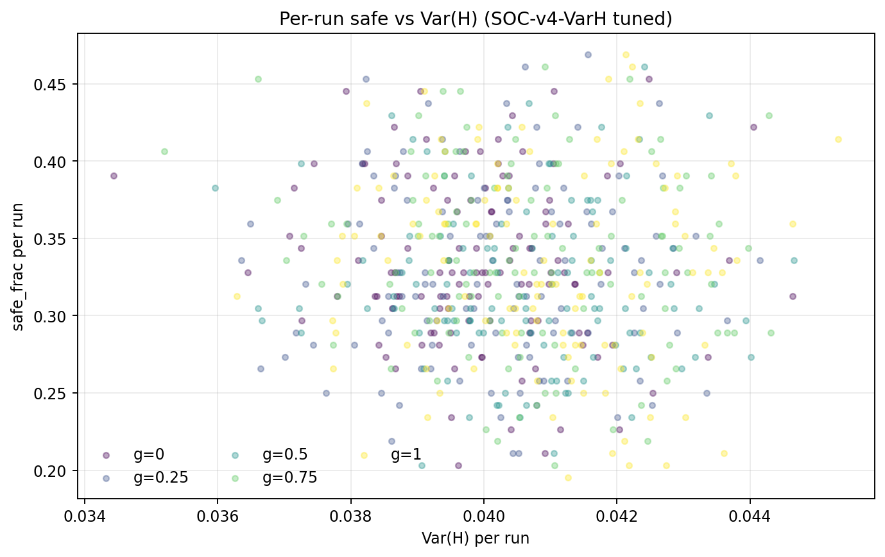

# 实验结果：基于 Var(H) 的自组织算法（调参后）与预测追捕能力（2026-02-08）

## 1. 目标

在前瞻追捕下，分析预测能力变化时 `Var(H)`、生存率与预测能力的关系，并评估调参后的 `SOC-v4-VarH` 是否优于 baseline。

## 2. 设置

- 追捕策略：`p1_intercept`，扫描 `intercept_gain ∈ {0,0.25,0.5,0.75,1.0}`，`intercept_tmax=0`。
- 固定：`speed_ratio=1.3`，`w_align=0.15`，`angle_noise=0`，每点 `120 seeds`，`600 steps`。
- 对照：`baseline`（SOC off）。
- 实验：`soc_mode="v4_varh"`，`soc_varh_target=0.04`，`soc_varh_gain=0.5`，其余 stress/topple 通道关闭，仅保留 Var(H) 反馈。

## 3. 图表

## 4. 关键统计（按 gain）

| gain | safe_base | safe_soc_varh_tuned | delta_safe | varh_soc | corr(safe,varh)_soc |
|---:|---:|---:|---:|---:|---:|
| 0 | 0.3374 | 0.3336 | -0.0038 | 0.0399 | -0.118 |
| 0.25 | 0.3443 | 0.3259 | -0.0184 | 0.0402 | 0.019 |
| 0.5 | 0.3335 | 0.3197 | -0.0137 | 0.0406 | -0.052 |
| 0.75 | 0.3292 | 0.3361 | 0.0068 | 0.0406 | -0.119 |
| 1 | 0.3359 | 0.3319 | -0.0040 | 0.0409 | -0.054 |

## 5. 关系结论

1. SOC组 pooled `corr(safe, Var(H)) = -0.063`。
2. SOC组 pooled `corr(Var(H), predictive_gain) = 0.193`。
3. SOC组 pooled `corr(safe, predictive_gain) = 0.017`。
4. 在当前调参下，`SOC-v4-VarH` 相对 baseline 的增益由 `paired_delta_safe_summary.csv` 给出，可直接检验各 gain 下是否显著正/负。

## 6. 产物

- `summary_by_variant_gain.csv`
- `paired_delta_safe_summary.csv`
- `paired_delta_safe.csv`
- `pooled_correlations_soc.csv`