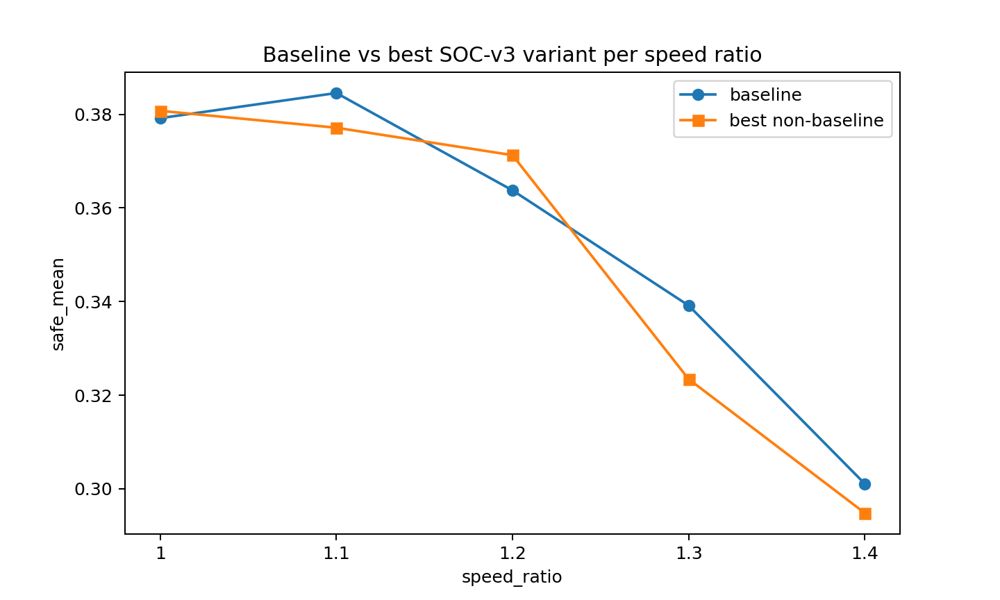
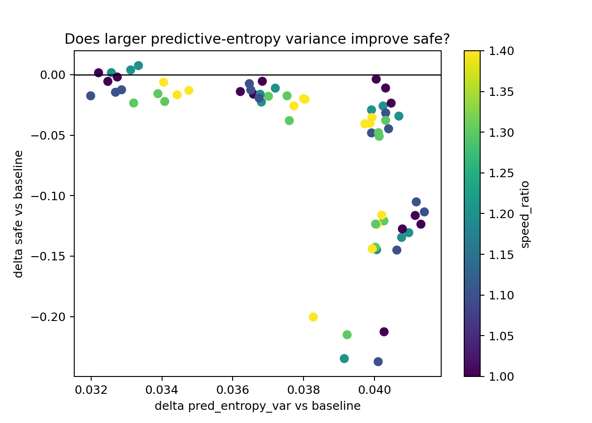
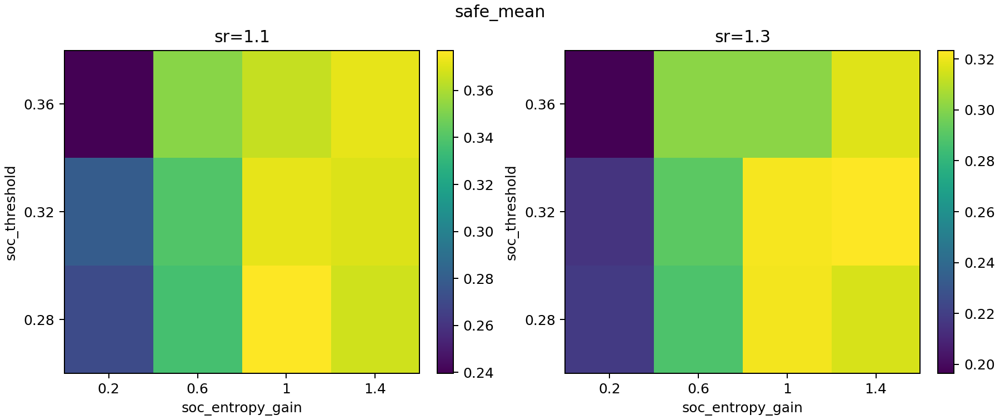
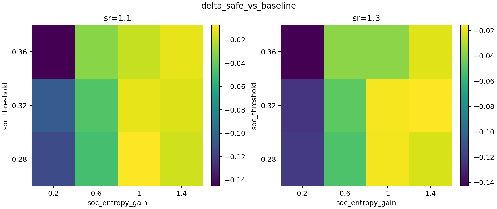
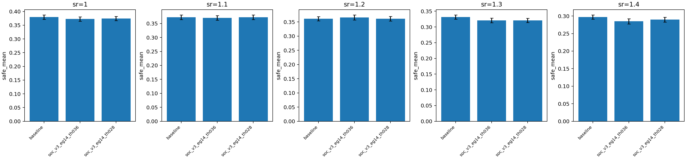

# 实验结果：SOC-v3 大规模扫描补充（2026-02-07）

## 1. 目的

针对“样本量不足”问题，本轮将 SOC-v3 扩展到更大规模扫描，并对最优候选进行 `200 seeds` 级别复核，以提高结论稳定性。

## 2. 扫描设置

- 控制模式：`p1_intercept`、`align_control_mode="share"`、`angle_noise=0`、`w_align=0.15`。
- 压力层：`speed_ratio={1.0,1.1,1.2,1.3,1.4}`。
- 主扫描（广扫）：
  - 变体数：`14`（baseline + no-entropy + 12 组 `(soc_entropy_gain, soc_threshold)`）
  - 参数网格：
    - `soc_entropy_gain ∈ {0.2,0.6,1.0,1.4}`
    - `soc_threshold ∈ {0.28,0.32,0.36}`
  - 样本量：每变体 `80 seeds × 5`。
  - 总 runs：`5600`。
- 复核扫描（重点变体补样本）：
  - 变体：`baseline`, `soc_v3_eg14_th036`, `soc_v3_eg14_th028`
  - 追加样本：`seeds=80..199`，与首批合并为 `200 seeds`。
  - 每压力层配对比较（同 seed）。

## 3. 主扫描结果（80 seeds）

- 变体排名显示：非 baseline 中最优组为高熵驱动 `eg=1.4`、较高阈值 `th=0.36/0.28`。
- 但其平均 `safe` 仍低于 baseline（跨层平均约 `-0.008 ~ -0.009`）。
- 同时这些变体的 `soc_pred_entropy_var` 系统性高于 baseline，且 `branch_ratio` 接近 1。

结论：在当前控制律下，提高预测熵波动并不自动带来任务收益，存在“复杂度增加但收益不增”的区间。

## 4. 重点变体复核（200 seeds）

对 `soc_v3_eg14_th036` 和 `soc_v3_eg14_th028` 与 baseline 做配对 seed 复核：

- `sr=1.3`：两候选均显著低于 baseline（95% CI 全负）。
- `sr=1.4`：`th=0.36` 显著低于 baseline；`th=0.28` 负向但 CI 跨 0。
- `sr=1.0~1.2`：差异整体较小，CI 多跨 0。

代表性结果（`delta_safe = candidate - baseline`）：

- `soc_v3_eg14_th036`：
  - `sr=1.3`: `-0.0107`，95% CI `[-0.0204,-0.0011]`
  - `sr=1.4`: `-0.0121`，95% CI `[-0.0215,-0.0027]`
- `soc_v3_eg14_th028`：
  - `sr=1.3`: `-0.0107`，95% CI `[-0.0203,-0.0010]`

同时，两候选在所有压力层上的 `delta_pred_entropy_var` 都稳定为正，说明其确实改变了预测熵波动结构，但该改变在中高压层未转化为逃逸优势。

## 5. 当前结论

1. 样本量扩大后，结论更稳定：SOC-v3 在当前参数族下未超过 baseline。  
2. 高熵驱动候选在低中压层（`sr<=1.2`）与 baseline 差距缩小，但在 `sr>=1.3` 出现显著负增益。  
3. `Var(H)` 相关指标可被显著抬升，但“更临界/更不可预测”不等于“任务更优”，收益仍受压力层强烈约束。

## 6. 产物索引

- 主扫描：`doc/results_20260207_soc_v3_large_scan/`
  - `soc_v3_large_summary_by_variant_sr.csv`
  - `soc_v3_large_variant_ranking.csv`
  - `soc_v3_large_best_by_speed_ratio.csv`
- 200-seed 复核：`doc/results_20260207_soc_v3_large_scan/focus_200seeds/`
  - `summary_200seeds.csv`
  - `paired_ci_200seeds.csv`
