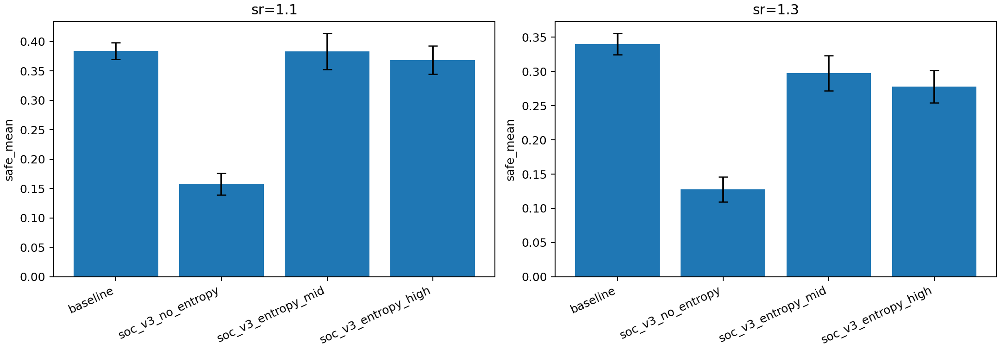
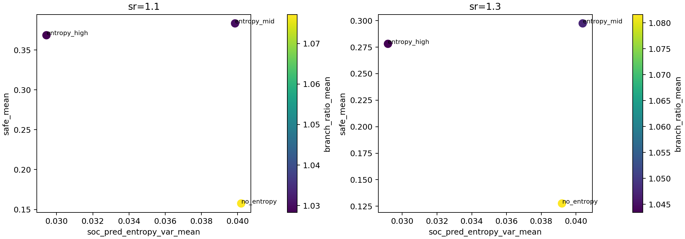
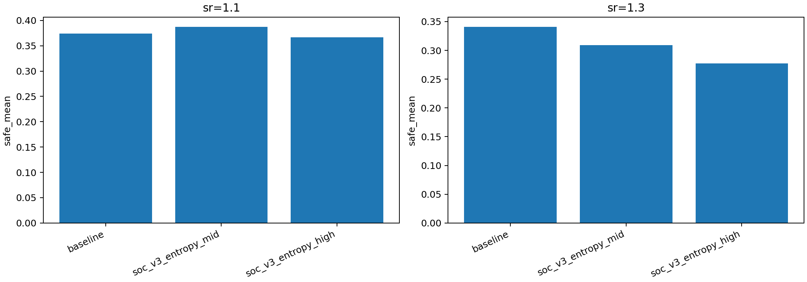
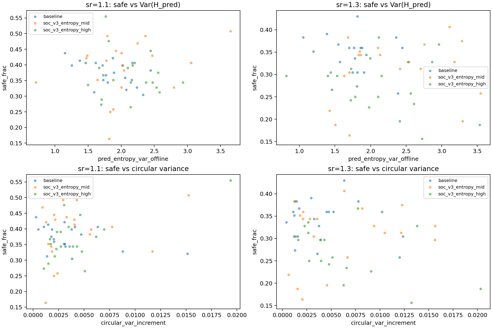

# 实验结果：SOC-v3 论文思路对齐尝试（2026-02-07）

## 1. 目标

本轮工作针对以下问题开展：现有 SOC 控制是否能够按 `doc/1-s2.0-S0378437125007290-main.pdf` 的主思路重构，并在追逃任务中同时体现

1. 单体轨迹可识别的临界性信号；
2. 任务性能收益（`safe_frac`）。

## 2. 与论文思路的对齐方式

论文核心是“单体轨迹 -> 序列预测 -> 预测熵方差 `Var(H)` -> 临界性判定”，并与简单统计基准比较。为对齐该思路，本轮做了两项改造：

1. 在 SOC 中新增 `v3` 控制模式：
   - 去除“向固定 `w_align` 回归”的主导机制；
   - 采用 `lambda_i = f(stress_i)`（应力映射）控制对齐占比；
   - 引入在线预测熵波动驱动项（`soc_entropy_gain * |H_i - EMA(H_i)|`）。
2. 在评估中将 `Var(H_pred)` 设为主判据，并显式加入“角增量 circular variance”作为基准。

实现位置：

- `src/chasecrit/policies.py`（SOC-v3 动力学与在线熵驱动）
- `src/chasecrit/config.py`（SOC-v3 新参数）
- `src/chasecrit/sim.py`（新增 SOC 熵相关统计输出）
- `tests/test_soc_mode.py`（新增 v3 行为测试）

## 3. 实验设置

### 3.1 广扫（无时序保存）

- 变体：`baseline`, `soc_v3_no_entropy`, `soc_v3_entropy_mid`, `soc_v3_entropy_high`
- 配置目录：`configs/soc_v3_20260207/`
- 场景：`p1_intercept`, `align_control_mode="share"`, `angle_noise=0`, `w_align=0.15`
- 压力层：`speed_ratio={1.1,1.3}`
- 样本量：每变体 `30 seeds × 2`。

产物：

- `doc/results_20260207_soc_v3_paper_aligned/soc_v3_summary.csv`
- `doc/results_20260207_soc_v3_paper_aligned/figs/safe_compare_soc_v3.png`
- `doc/results_20260207_soc_v3_paper_aligned/figs/safe_vs_pred_entropy_var_soc_v3.png`

### 3.2 深度对照（保存时序）

- 变体：`baseline`, `soc_v3_entropy_mid`, `soc_v3_entropy_high`
- 样本量：每变体 `20 seeds × 2`
- 对每个 run 计算：
  - 离线 `Var(H_pred)`（`report-pred-entropy`）；
  - 轨迹角增量 `circular variance`（基准）；
  - 与 `safe_frac` 的相关性。

产物：

- `doc/results_20260207_soc_v3_paper_aligned/soc_v3_deep_summary_with_benchmark.csv`
- `doc/results_20260207_soc_v3_paper_aligned/soc_v3_deep_paired_ci.csv`
- `doc/results_20260207_soc_v3_paper_aligned/figs/soc_v3_deep_safe_compare.png`
- `doc/results_20260207_soc_v3_paper_aligned/figs/soc_v3_deep_benchmark_scatter.png`

## 4. 结果

### 4.1 广扫结果

- 在 `sr=1.1` 与 `sr=1.3` 两层上，baseline 仍是平均 `safe` 最优。
- `soc_v3_no_entropy` 性能显著下降，说明“去回归但无熵驱动”会导致过强失稳。
- `soc_v3_entropy_mid/high` 明显抬升了 `Var(H_pred)`，但收益不稳定：
  - `sr=1.1`：`entropy_mid` 接近 baseline；
  - `sr=1.3`：两个熵驱动变体均低于 baseline。

### 4.2 深度论文式判据对照

在深度集上，SOC-v3 变体相对 baseline 的表现：

- `sr=1.1`：
  - `entropy_mid` 的 `delta_safe_mean = +0.0133`，但 95% CI 跨 0；
  - `entropy_high` 的 `delta_safe_mean = -0.0074`，95% CI 跨 0。
- `sr=1.3`：
  - `entropy_mid` 为负（CI 上界接近 0）；
  - `entropy_high` 为显著负增益（95% CI 全负）。

对应 `Var(H_pred)`：两种 SOC-v3 熵驱动变体均显著高于 baseline；而 circular variance 的变化幅度较小。

这说明：按论文思路引入的预测熵波动指标在本任务中确实更敏感地反映了行为复杂度变化，但“复杂度上升”尚未自动转化为稳健任务收益。

## 5. 当前结论

1. 本轮实现已在机制上更接近论文主线：`Var(H_pred)` 成为主判据，并对比了简单统计基准（circular variance）。
2. SOC-v3 熵驱动能显著改变预测熵结构，但在当前参数与场景下未形成跨压力层稳健收益。
3. 结论应表述为条件性：在 `sr=1.1` 可观察到弱正向迹象，在 `sr=1.3` 仍存在明显负效应。

## 6. 下一步

1. 用更接近论文设定的单体序列模型（更长上下文、更稳定训练）替换当前轻量在线近似，减少 `H` 估计噪声。  
2. 在 `sr=1.2~1.35` 做更细分层，定位“熵驱动有益窗口”。  
3. 将 SOC-v3 的 `stress->lambda` 映射与 toppling 参数解耦扫描，分别控制“波动放大”与“机动收益”。
