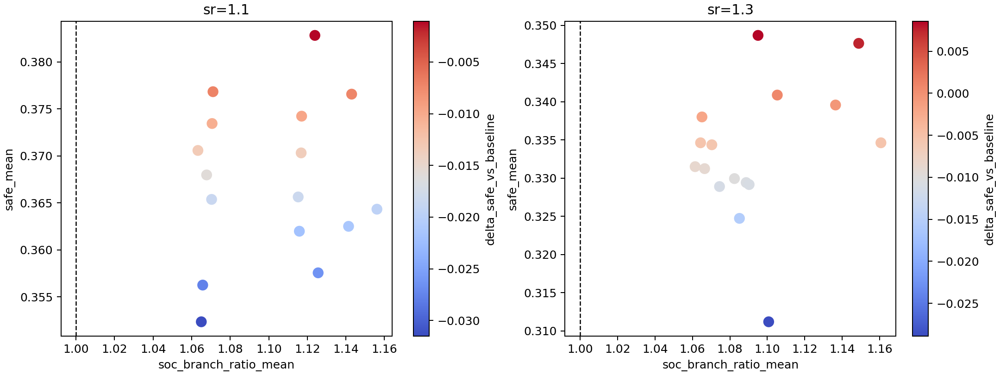
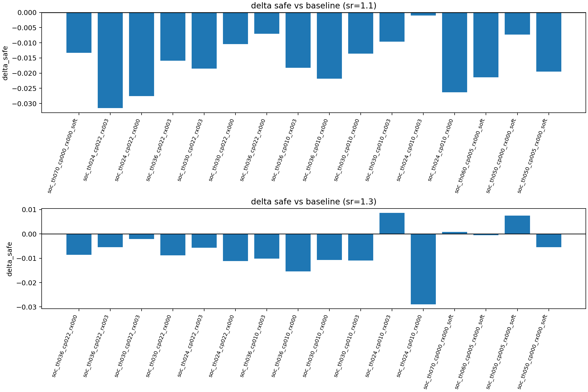
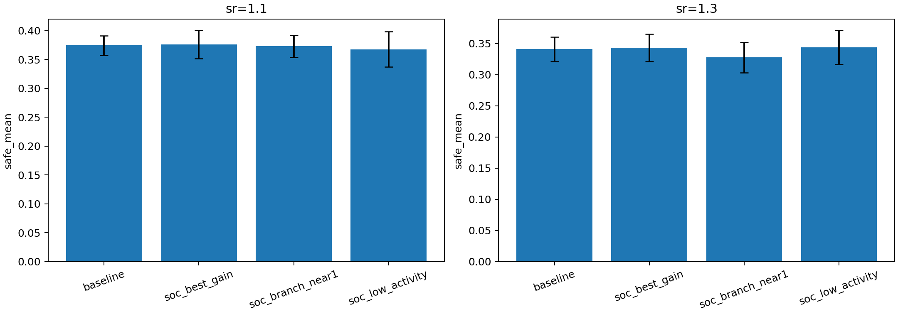
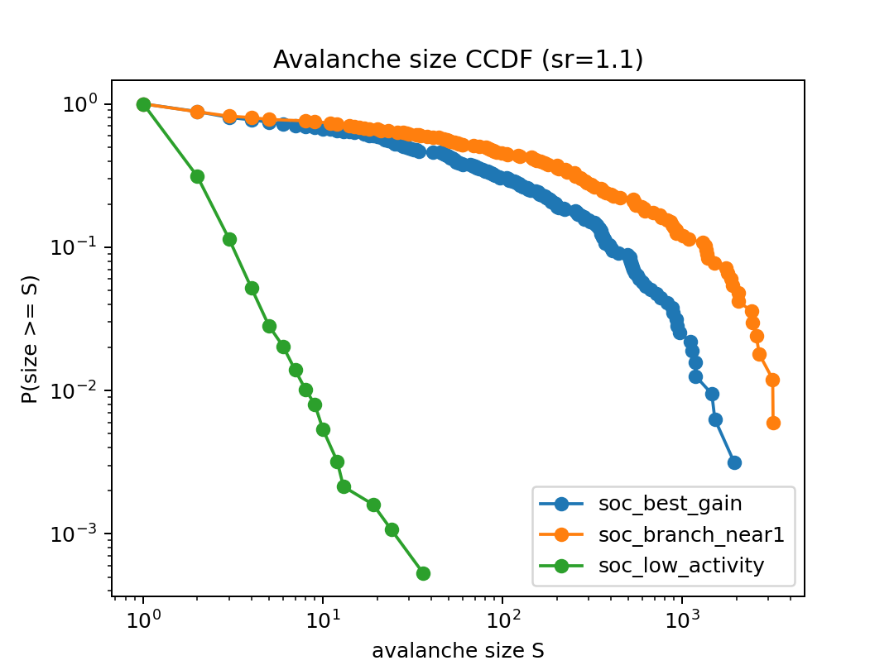
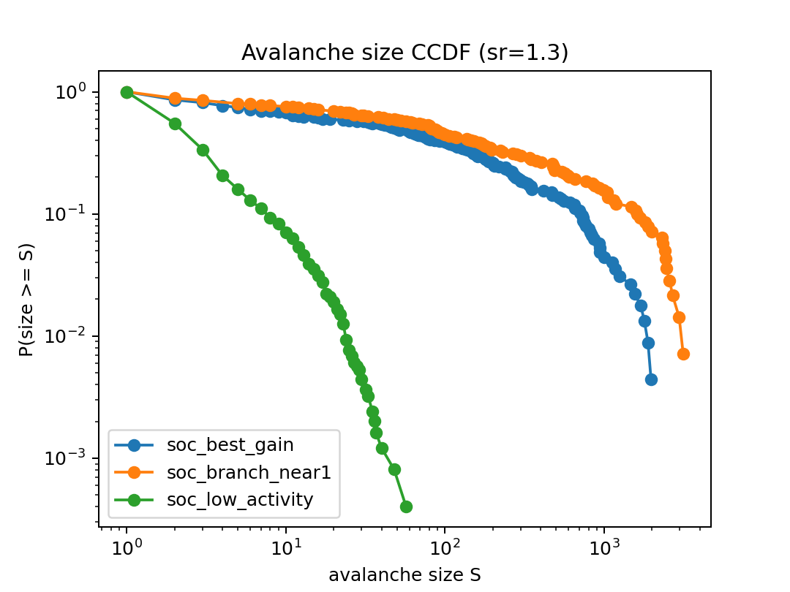
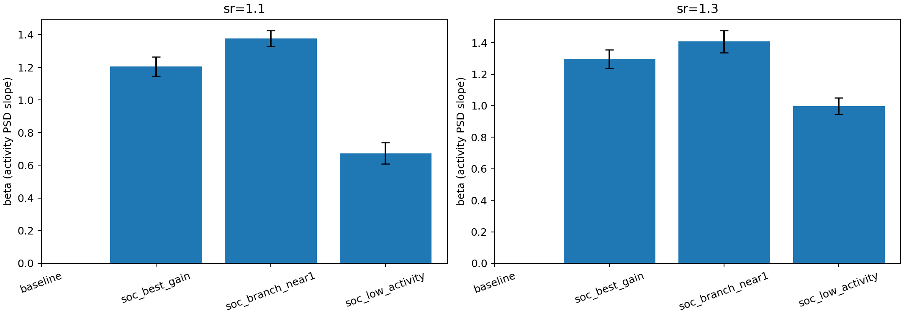
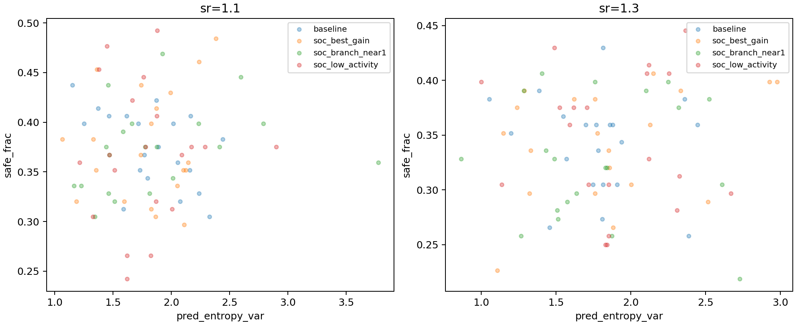

# 实验结果：SOC 进一步研究与机制判据（2026-02-07）

## 1. 研究目标

本轮工作聚焦两个问题：

1. 现有 SOC 控制是否在追逃任务内形成可辨识的“近临界机制信号”；
2. 在保持场景与追捕策略不变时，SOC 是否能稳定提升逃跑者进入安全区比例（`safe_frac`）。

## 2. 实验设计

### 2.1 统一任务设置

- 场景：2D 连续空间，多安全区、容量限制、局部可见；
- 逃跑者：`align_control_mode="share"`，`angle_noise=0`，`w_align=0.15`；
- 追捕者：`p1_intercept`；
- 压力层：`speed_ratio ∈ {1.1, 1.3}`；
- 单次 episode：`steps=600`。

### 2.2 阶段 A：SOC 参数筛选（广扫）

- 扫描 17 个配置（含 baseline）：
  - baseline：`soc_enabled=false`；
  - SOC 组：主要扫描 `soc_threshold`、`soc_neighbor_coupling`、`soc_align_relax`，并补充“弱驱动/高阈值”组。
- 每配置样本量：`30 seeds × 2 speed_ratio`。
- 产物：
  - `doc/results_20260207_soc_further_research/soc_scan_runs.csv`
  - `doc/results_20260207_soc_further_research/soc_scan_summary_with_baseline_delta.csv`
  - `doc/results_20260207_soc_further_research/soc_scan_candidate_ranking.csv`

### 2.3 阶段 B：机制深度验证（时序）

对 4 组代表配置进行 `--save-runs` 深度实验：

- `baseline`
- `soc_best_gain`（广扫中平均 `safe` 最优）
- `soc_branch_near1`（分支比更接近 1）
- `soc_low_activity`（低活动模式）

每组样本量：`20 seeds × 2 speed_ratio`。

从 `timeseries.csv` 的 `soc_topples` 序列提取：

- 雪崩规模/持续时间（连续正活动段定义）；
- 活动谱斜率 `beta`（对 periodogram 的 log-log 斜率拟合）；
- 并与 `safe_frac`、`soc_branch_ratio` 联合分析。

对应产物：

- `doc/results_20260207_soc_further_research/soc_deep_per_run_metrics.csv`
- `doc/results_20260207_soc_further_research/soc_deep_group_summary_with_delta.csv`
- `doc/results_20260207_soc_further_research/soc_deep_avalanche_summary.csv`
- `doc/results_20260207_soc_further_research/soc_deep_delta_safe_paired_ci.csv`

## 3. 结果

### 3.1 广扫：SOC 增益总体不稳定

在当前控制律下，绝大多数 SOC 变体的 `safe_mean` 低于 baseline；仅 `soc_th024_cp010_rx003` 出现微弱正增益（跨压力层平均 `+0.0038`）。

同时，SOC 组的 `soc_branch_ratio_mean` 基本均大于 1（约 `1.06~1.15`），显示系统整体偏高活跃；`safe` 与“分支比接近 1”之间未观察到清晰单调关系。

### 3.2 深度验证：机制信号存在，但收益未形成显著提升

4 组深度实验对比显示：

- `soc_best_gain` 在 `sr=1.1/1.3` 的 `safe` 相对 baseline 仅约 `+0.0016/+0.0020`；
- 配对 seed 差值 95% CI 均跨 0（未形成统计显著提升）；
- `soc_branch_near1` 在 `sr=1.3` 明显低于 baseline。

### 3.3 雪崩结构：不同 SOC 组处于不同活动形态

- `soc_best_gain` / `soc_branch_near1`：雪崩数量较少，但单次规模和持续时间较大；
- `soc_low_activity`：雪崩数量很多，但以小规模、短持续事件为主。

该结果表明当前 SOC 控制主要在“少量大级联”与“高频小级联”之间切换，而非稳定锁定于单一可迁移的最优近临界区。

### 3.4 活动谱与可预测性

活动谱斜率 `beta` 显示：

- `soc_best_gain` 约 `1.20~1.30`（更接近 1/f 型）；
- `soc_branch_near1` 更大（`~1.38~1.41`，低频占优更强）；
- `soc_low_activity` 更低（`~0.67~1.00`）。

在预测熵层面（`Var(H_pred)`）：SOC 组可改变不可预测性结构，但并未稳定转化为显著 `safe` 增益。

## 4. 结论

1. 现有 SOC 控制在任务内已产生明确活动机制信号（持续 toppling、雪崩分布差异、活动谱变化）。
2. 在本轮参数空间内，SOC 对 `safe_frac` 的提升不稳健；最佳组仅表现为微弱增益，且配对 CI 不支持显著优于 baseline。
3. 当前控制律更像“高活跃自适应控制”，尚未稳定达到“机制成立且任务收益同步提升”的区间。

## 5. 下一步（可检验）

1. 按 `doc/SOC-v2方案-基于预测熵波动的自组织临界控制.md` 实施 SOC-v2：移除向固定 `w_align` 回归，改为 \\(
\lambda_i=f(s_i)
\\) 映射。  
2. 在 SOC-v2 中引入在线局部 `Var(H_pred)` 驱动项，先验证“机制成立判据”（分支比、雪崩、谱、初值鲁棒性），再验证任务收益。  
3. 在 `speed_ratio=1.3` 附近做更细压力分层，检验“预测压力增强时，SOC 优势窗口是否出现/扩大”。
