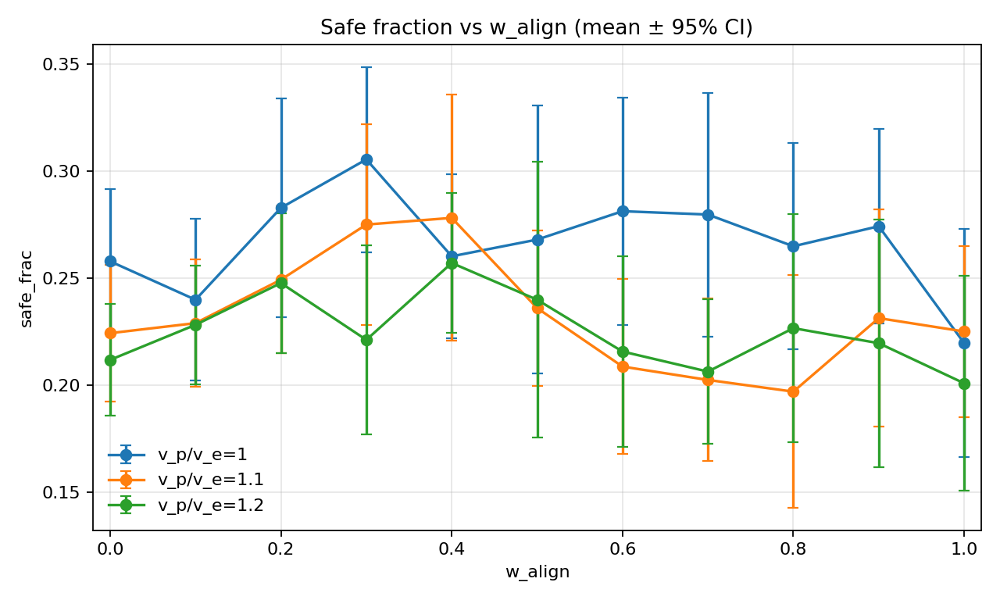
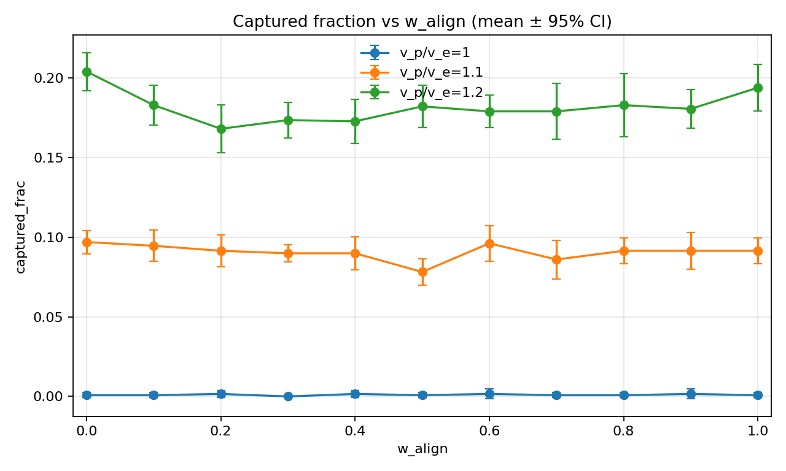
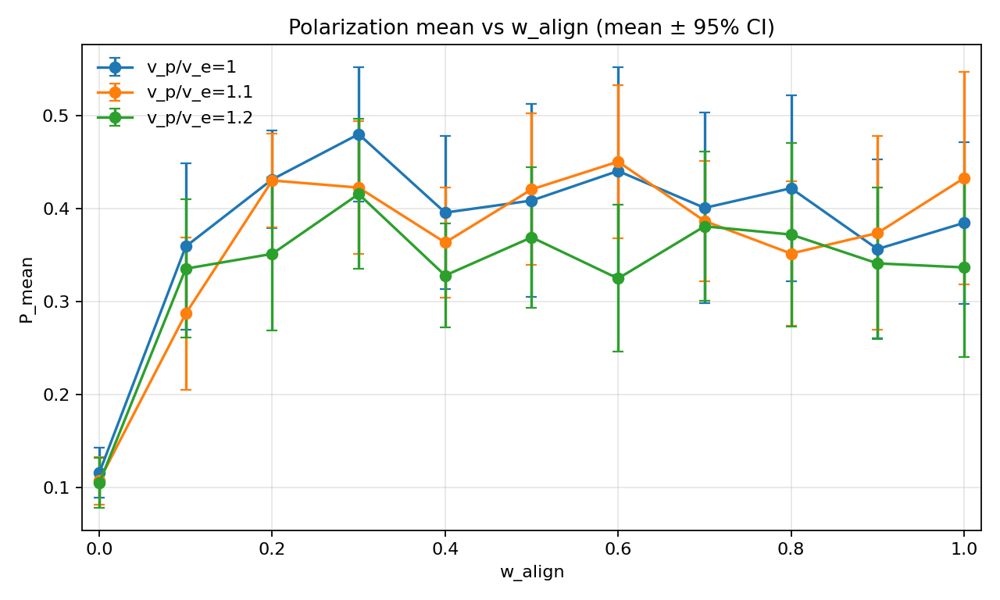
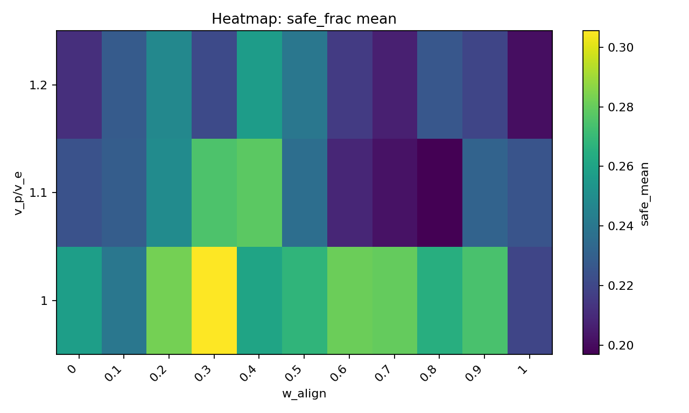

# 实验结果：固定追捕者数量扫描（`v_p/v_e × w_align`）

## 1. 实验目的

在固定追捕者数量 `N_p` 的条件下，扫描追捕者速度比 `v_p/v_e` 与逃跑者从众/对齐强度 `w_align`，观察任务性能指标（进入安全区比例、被捕比例）与群体有序性指标（极化度 `P`）随参数变化的趋势，并提取可复现的初步结论。

## 2. 产物与可复现信息

本文档包含两组实验：A（试跑）与 B（扩展网格）。原始扫描结果保存在 `runs/` 下（默认不纳入版本控制），聚合结果与图表保存在 `doc/` 下（纳入版本控制）。

### 实验 A（试跑）

- 原始扫描目录：`runs/sweep_20260205_135921_grid`
  - `runs/sweep_20260205_135921_grid/base_config.json`
  - `runs/sweep_20260205_135921_grid/results.csv`
- 聚合与图表目录：`doc/results_20260205_fixedNp_scan`
  - `doc/results_20260205_fixedNp_scan/group_summary.csv`
  - `doc/results_20260205_fixedNp_scan/figs`

### 实验 B（扩展网格，包含临界性代理指标 χ）

- 原始扫描目录：`runs/sweep_20260205_154643_grid`
  - `runs/sweep_20260205_154643_grid/base_config.json`
  - `runs/sweep_20260205_154643_grid/results.csv`
- 聚合与图表目录：`doc/results_20260205_fixedNp_scan_expanded`
  - `doc/results_20260205_fixedNp_scan_expanded/group_summary.csv`
  - `doc/results_20260205_fixedNp_scan_expanded/figs`
  - `doc/results_20260205_fixedNp_scan_expanded/report.md`（自动生成的汇总报告）

## 3. 实验设置（摘要）

### 3.1 固定项（来自 base config）

- 场景：2D 连续空间；边界 `periodic`；无障碍
- 逃跑者：`N_e=128`，速度上限 `v_e=1.0`；局部观测（邻居/追捕者/安全区）
- 安全区：最大有效数量 `K_active_max=4`；缓慢移动（G0）；局部可见；容量未知；容量耗尽失效即消失；随机刷新并保持不会长期无安全区
- 追捕者：数量固定 `N_p=2`，策略 `p0_nearest`；瞬时捕获半径 `r_cap=1.0`
- 时长：每个 episode `steps=400`

### 3.2 变量项（实验 A：扫描网格）

- `v_p/v_e ∈ {1.0, 1.1, 1.2}`
- `w_align ∈ {0.0, 0.1, ..., 1.0}`（步长 0.1）
- 随机种子：`seed ∈ {0,1,...,9}`（每个格点 10 次重复）
- 总 episode 数：`3 × 11 × 10 = 330`

### 3.3 指标

- `safe_frac`：进入安全区人数占比（`S_safe / N_e`）
- `captured_frac`：被捕人数占比（`S_captured / N_e`）
- `P_mean`：极化度 `P(t)` 的时间均值（episode 内）
- `χ`：临界性代理指标（susceptibility proxy），定义为 `χ = N_e · Var_t(P(t))`（episode 内按时间的方差；用于定位高涨落区）

聚合方式：对每个 `(v_p/v_e, w_align)`，对 seeds 取均值并给出 95% 置信区间（正态近似 `±1.96·SEM`）。

## 4. 结果与图表

本节以实验 B（扩展网格）为主，实验 A 图表用于对照与历史记录（见本节末尾“实验 A 图表”）。

### 4.1 `safe_frac` 随 `w_align` 的变化（实验 B）

### 4.2 `captured_frac` 随 `w_align` 的变化（实验 B）

### 4.3 有序性（`P_mean`）随 `w_align` 的变化（实验 B）

### 4.4 临界性代理指标（`χ`）随 `w_align` 的变化（实验 B）

### 4.5 热力图（实验 B）

### 4.6 `safe_frac` 与 `χ` 的关系（实验 B，按格点聚合均值）

## 5. 初步结论（阶段性）

在实验 B（扩展网格）的条件下：

1. `safe_frac` 的最优区域出现在 **中等偏高 `w_align`**（约 `0.5~0.7`）附近，而非 `w_align=0`（完全自主）或 `w_align=1`（完全从众）。
2. 随着 `v_p/v_e` 增大，`captured_frac` 上升、`safe_frac` 下降的趋势清晰；在本次扫描范围内，“最优 `w_align`”整体仍保持在 `0.5~0.7` 附近，但在不同 `v_p/v_e` 下会有小幅漂移。
3. `χ`（`N_e·Var_t(P)`）在若干强度下的峰值位置与 `safe_frac` 峰值位置**部分重合但并不一致**：多数 `v_p/v_e` 下两者的 `w_align` 差距在 `0.05~0.2`，但也出现个别强度下差距较大的情况。散点图与相关系数显示，按格点均值统计的 `χ` 与 `safe_frac` 的线性相关性在本轮扫描中整体偏弱（依赖于追捕强度）。
4. 现阶段结果更支持“任务最优来自一致性与多样性/探索的权衡”，而非“单一临界性代理指标最大化即可带来最优逃脱”。后续需要在更干净的条件下定位“临界区”（例如无追捕/无目标驱动的相变定位），并检验该临界区与任务最优区的关系是否更稳定。

> 详细聚合数值与各格点 95% CI 见：`doc/results_20260205_fixedNp_scan_expanded/group_summary.csv`。自动汇总报告见：`doc/results_20260205_fixedNp_scan_expanded/report.md`。

## 6. 下一步建议（用于收敛结论）

- 扩展追捕强度网格：增加 `v_p/v_e` 取值密度，并保持 `N_p` 固定，用于定位性能峰是否随强度平移。
- 稳健性：切换边界为 `reflecting`，并加入少量障碍，重复扫描以验证结论是否依赖于周期边界与无障碍几何。
- 追捕策略增强：在保持 `N_p` 固定的前提下，引入 `p1_intercept`，测试“中等 `w_align` 最优”是否在更强追捕下依然成立。

## 7. 实验 A 图表（历史对照）

