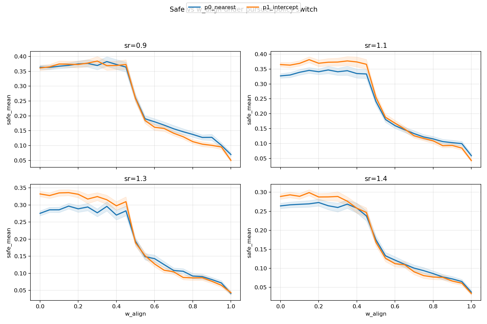
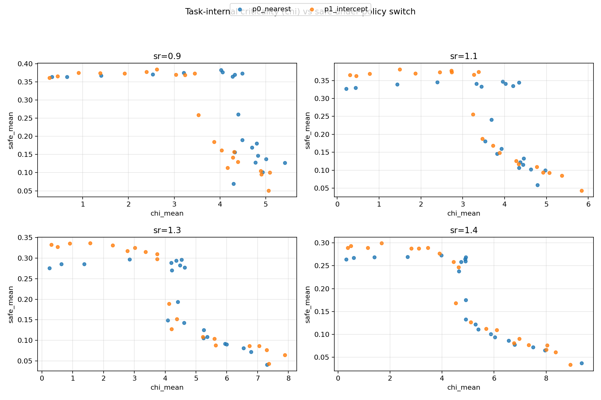
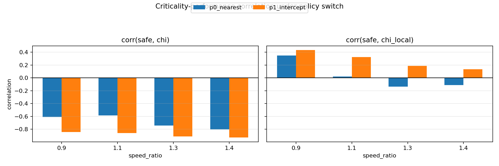
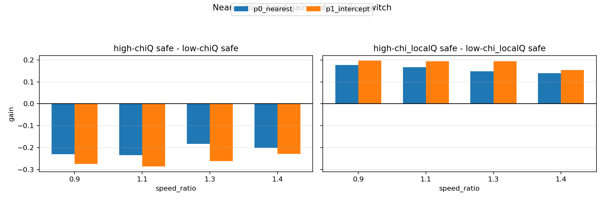
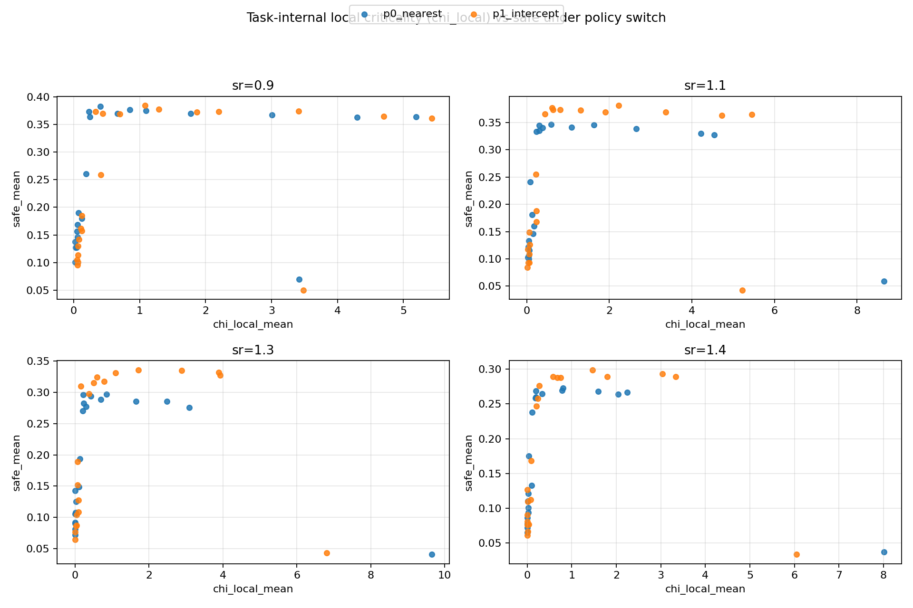

# 实验结果：追捕策略改变后临界态与逃跑收益关系（2026-02-07）

## 1. 研究问题

在将追捕者策略从 `p0_nearest` 升级为 `p1_intercept` 后，检验“更接近临界是否有利于逃跑者进入安全区”是否仍成立，并明确该关系是否依赖临界性指标定义。

## 2. 实验设计

### 2.1 共同设置

- 逃跑者：`align_control_mode="share"`，`angle_noise=0`
- 场景：2D 连续空间，多安全区、容量限制、局部可见
- 扫描：
  - `speed_ratio ∈ {0.9, 1.1, 1.3, 1.4}`
  - `w_align ∈ {0.00, 0.05, ..., 1.00}`
- 重复：`seeds=120`（`0..119`）
- 时长：`steps=600`

### 2.2 对照组

1. `p0_nearest`
2. `p1_intercept`

产物：

- `p0`：`doc/results_20260207_walign_share_noise0_p0nearest_sr09111314_120seeds_full/`
- `p1`：`doc/results_20260207_walign_share_noise0_p1intercept_sr09111314_120seeds_full/`
- 联合分析与对照图：`doc/results_20260207_criticality_under_policy_switch/`

## 3. 判定方法（任务内）

采用任务内统计判定“更接近临界”：

1. 全局涨落代理：`chi`
2. 局部涨落代理：`chi_local`

并计算两类量：

1. 相关性：`corr(safe_mean, metric_mean)`（在同一 `speed_ratio` 的 `w_align` 网格点上）
2. 近临界增益：  
   将网格点按指标值排序，取最高四分位与最低四分位，比较
   \[
   \Delta safe = \overline{safe}_{highQ} - \overline{safe}_{lowQ}
   \]

## 4. 结果

### 4.1 `chi` 与 `safe`：在两种追捕策略下均为负相关

`corr(safe, chi)`（`p0` / `p1`）：

- `sr=0.9`：`-0.607 / -0.842`
- `sr=1.1`：`-0.585 / -0.861`
- `sr=1.3`：`-0.743 / -0.910`
- `sr=1.4`：`-0.801 / -0.927`

对应近临界增益（按 `chi` 高四分位减低四分位）均为负值，且 `p1` 下负增益更大。

结论：以全局 `chi` 判定“更临界”时，追捕策略升级后并未体现逃跑收益，反而更不利。

### 4.2 `chi_local` 与 `safe`：在 `p1` 下保持正向

`corr(safe, chi_local)`（`p0` / `p1`）：

- `sr=0.9`：`0.351 / 0.433`
- `sr=1.1`：`0.020 / 0.325`
- `sr=1.3`：`-0.135 / 0.187`
- `sr=1.4`：`-0.113 / 0.135`

近临界增益（按 `chi_local` 四分位）在全部层均为正，且 `p1` 下约为：

- `sr=0.9`：`+0.196`
- `sr=1.1`：`+0.194`
- `sr=1.3`：`+0.194`
- `sr=1.4`：`+0.154`

结论：以局部 `chi_local` 判定时，追捕策略升级后仍观察到“更近临界-更高生存”的正向关系。

## 5. 图表（内嵌）

### 5.1 策略切换下 `safe-w_align` 曲线

### 5.2 策略切换下 `safe-chi` 散点

### 5.3 `chi` 与 `chi_local` 的相关性对比

### 5.4 `chi` 与 `chi_local` 的近临界增益对比

### 5.5 策略切换下 `safe-chi_local` 散点

## 6. 结论（阶段性）

1. 追捕策略改变后，“临界态是否有利”不是单一答案，而取决于临界性代理定义。
2. 全局 `chi` 路径下，升级为预测追捕后未见收益，反而负相关更强。
3. 局部 `chi_local` 路径下，升级后仍表现为正向增益，且在多个压力层稳定存在。
4. 因此后续应优先采用“多指标并列 + 分层报告”，避免用单一全局指标给出总括结论。
