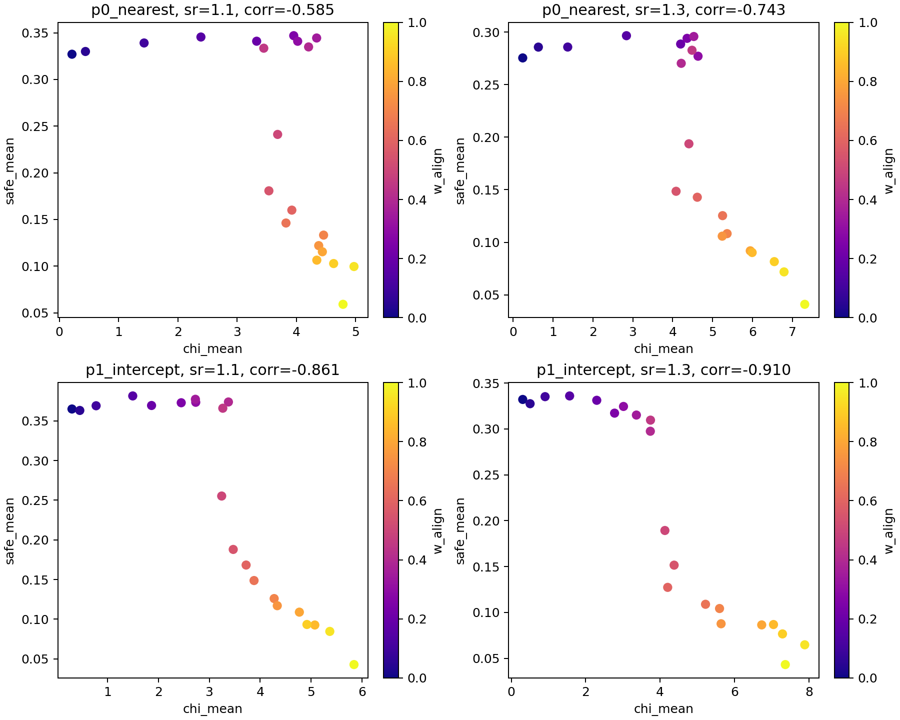
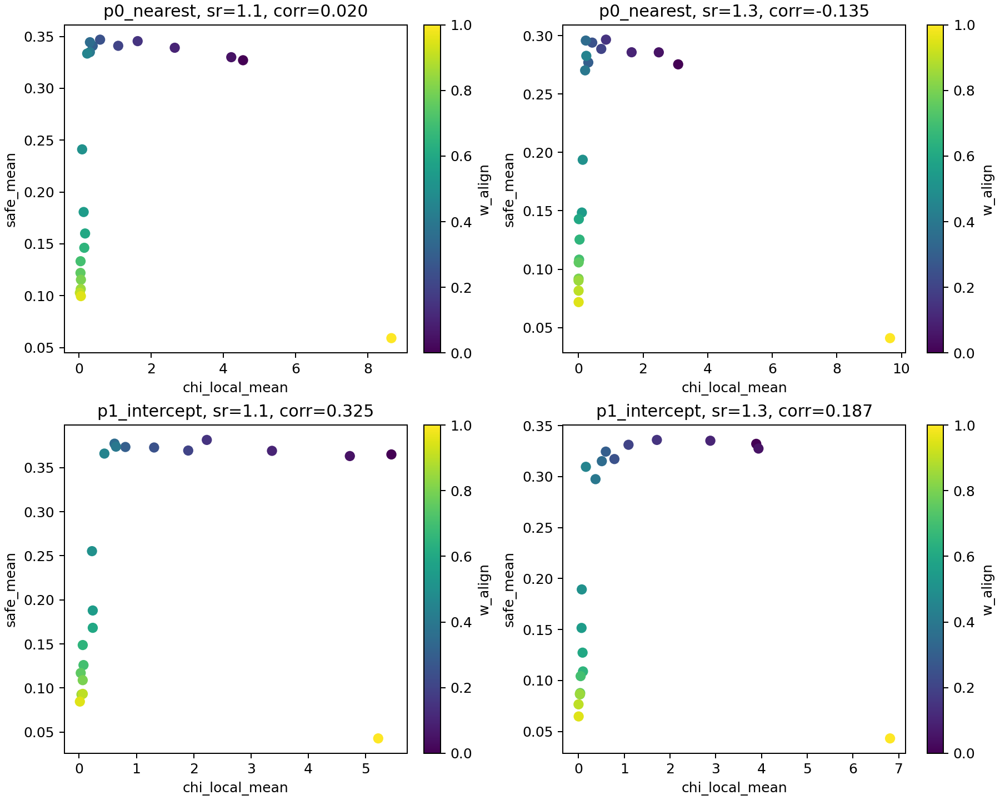
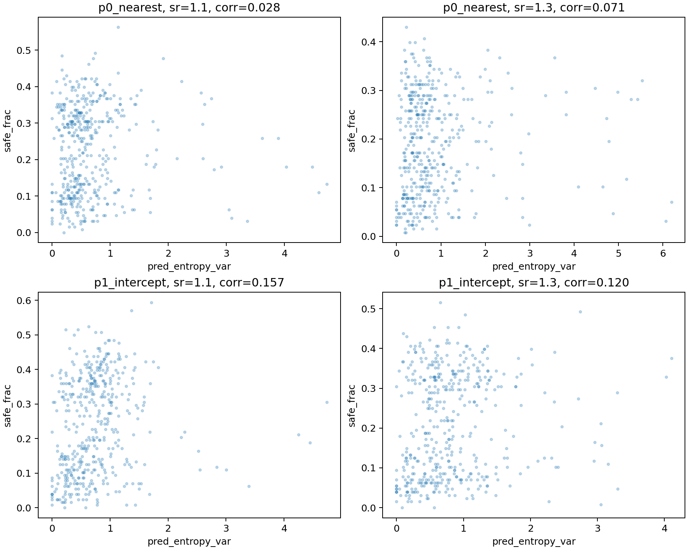
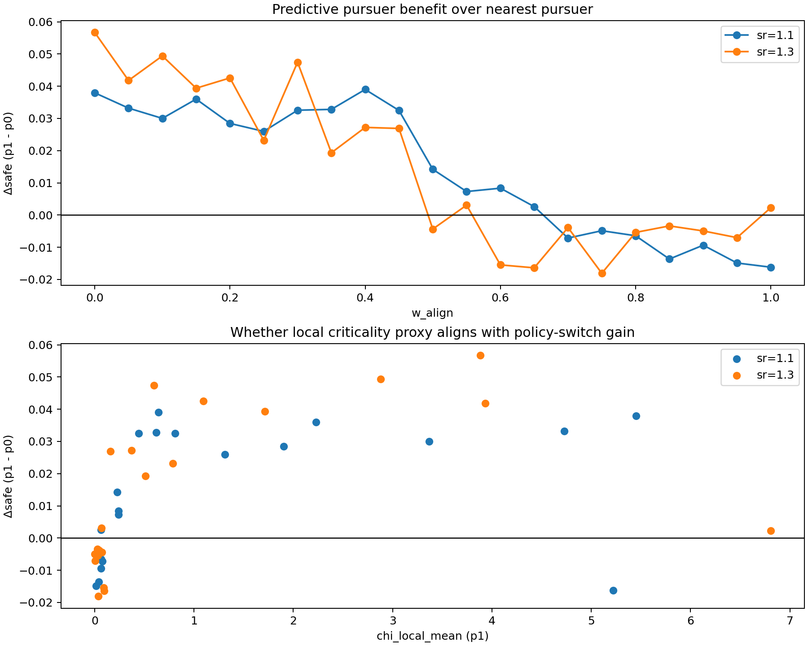

# 实验结果：追捕策略预测依赖与“近临界有益”判定（2026-02-07）

## 1. 研究问题

本批实验聚焦于以下判定问题：在追逃任务内，采用不同“临界性/近临界”判定标准时，是否能得到“更近临界更有利于逃跑者进入安全区”的结论；该结论是否依赖追捕者策略（尤其是是否使用预测拦截）。

## 2. 判定标准

在同一任务设置内，采用三类统计判定：

1. 全局涨落代理：`chi = N * Var(P)`。
2. 局部涨落代理：`chi_local = N * Var(P_local)`。
3. 可预测性相关代理：轨迹预测熵方差 `Var(H_pred)`（基于 `report-pred-entropy`）。

其中“近临界有益”操作化为：

- 相关性判定：`corr(safe, proxy) > 0`；
- 分位收益判定：高分位 proxy 组与低分位 proxy 组的 `safe` 差值为正（highQ - lowQ > 0）。

## 3. 实验设置

- 场景：2D 连续空间，多安全区、容量限制、缓慢移动、局部可见。
- 逃跑者：`align_control_mode="share"`，`angle_noise=0`，扫描 `w_align∈[0,1]`。
- 追捕策略：
  - `p0_nearest`（最近目标追踪）；
  - `p1_intercept`（预测拦截）。
- 速度层：主要关注 `speed_ratio ∈ {1.1, 1.3}`（并在既有 120-seed 全域结果中同时核对 `0.9, 1.4`）。

数据批次：

- 全域统计（用于 `chi/chi_local`）：`120 seeds` 网格（复用既有全量结果）。
- 可预测性统计（用于 `Var(H_pred)`）：`40 seeds`、`--save-runs` 新跑批次。

## 4. 结果

### 4.1 全局 `chi` 与任务收益

`chi` 与 `safe` 在两种追捕策略下均呈稳定负相关，且在 `p1_intercept` 下负相关更强。

该结果表明：在当前追逃任务内，以全局 `chi` 升高作为“更近临界”的单一判据，不能支持“更近临界更有利”的结论。

### 4.2 局部 `chi_local` 与任务收益

`chi_local` 与 `safe` 的关系显著依赖追捕策略：

- `p0_nearest`：相关性弱或在高压层转负；
- `p1_intercept`：在所有速度层保持正相关（但随压力增大而减弱）。

关键数值（120-seed 全域）：

| policy | speed_ratio | corr(safe, chi) | corr(safe, chi_local) | near-critical gain by chi_local |
|---|---:|---:|---:|---:|
| p0_nearest | 1.1 | -0.585 | 0.020 | 0.167 |
| p1_intercept | 1.1 | -0.861 | 0.325 | 0.194 |
| p0_nearest | 1.3 | -0.743 | -0.135 | 0.149 |
| p1_intercept | 1.3 | -0.910 | 0.187 | 0.194 |

解释：在预测拦截策略下，局部涨落增强（`chi_local` 高）对应更高的进入安全区比例，这与“局部机动/重构能力更强可削弱被预测性”的机制一致。

### 4.3 可预测性代理 `Var(H_pred)` 与任务收益

基于逐 run 预测熵方差统计（40-seed save-runs）：

关键数值：

| policy | speed_ratio | corr(safe, Var(H_pred)) | highQ-lowQ safe | 95% CI |
|---|---:|---:|---:|---:|
| p0_nearest | 1.1 | 0.028 | 0.031 | [0.016, 0.046] |
| p1_intercept | 1.1 | 0.157 | 0.095 | [0.075, 0.115] |
| p0_nearest | 1.3 | 0.071 | 0.030 | [0.015, 0.045] |
| p1_intercept | 1.3 | 0.120 | 0.052 | [0.033, 0.072] |

该结果支持：在预测型追捕者下，较高的行为不可预测性（由 `Var(H_pred)` 代理）带来的生存收益更明显。

### 4.4 策略切换增益

将 `p1_intercept` 与 `p0_nearest` 在同 `(sr, w_align)` 条件下直接相减，得到 `Δsafe = safe(p1)-safe(p0)`：

在 `sr=1.1/1.3` 条件下，`Δsafe` 平均为正；且 `Δsafe` 与 `chi_local(p1)` 呈正相关（约 `0.35~0.44`），说明“预测型追捕者引入后，局部临界样行为对逃逸收益的解释力提高”。

## 5. 结论（任务内判定）

1. 若判定标准采用全局 `chi`，当前追逃任务下得不到“更近临界更有益”的结论。  
2. 若判定标准采用局部涨落 `chi_local` 或可预测性代理 `Var(H_pred)`，在预测拦截策略 `p1_intercept` 下可得到稳定正向证据。  
3. 因此，“近临界是否有益”不是统一结论，而是**依赖判定标准与对抗机制**：当追捕者更依赖预测时，局部临界样波动/不可预测性更可能转化为逃逸优势。

## 6. 产物索引

- 汇总目录：`doc/results_20260207_policy_switch_criticality_clarified/`
- 关键表：
  - `criticality_summary_policy_switch_120seed.csv`
  - `predictability_summary_policy_switch_40seed.csv`
  - `delta_policy_vs_walign_120seed.csv`
- 关键图：见正文内嵌图。
